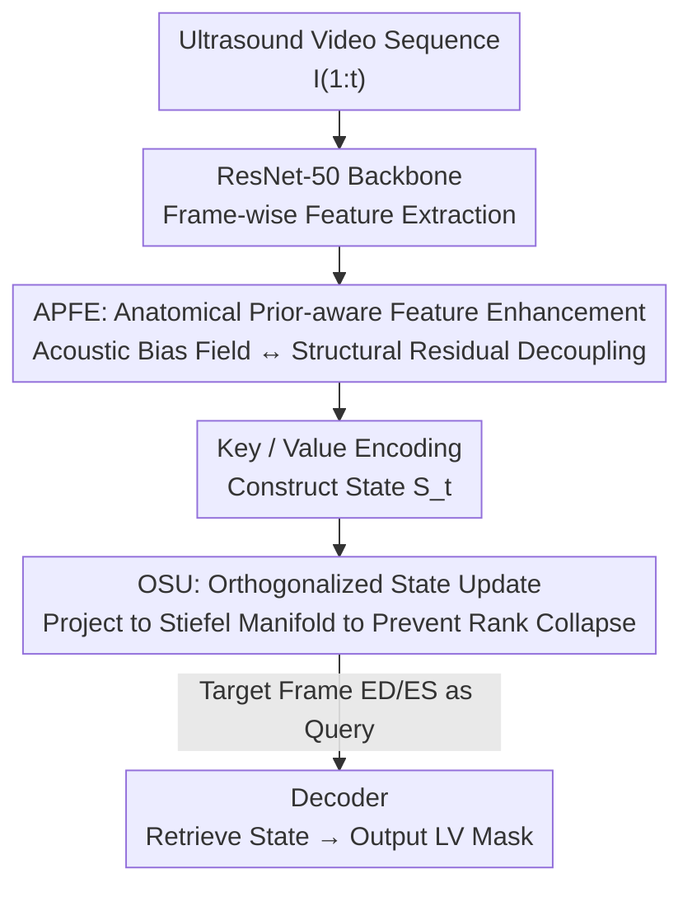

# OSA: Echocardiography Video Segmentation via Orthogonalized State Update and Anatomical Prior-aware Feature Enhancement

**Conference**: CVPR 2026  
**Paper**: [CVF Open Access](https://openaccess.thecvf.com/content/CVPR2026/html/Wang_OSA_Echocardiography_Video_Segmentation_via_Orthogonalized_State_Update_and_Anatomical_CVPR_2026_paper.html)  
**Code**: https://github.com/wangrui2025/OSA  
**Area**: Medical Imaging / Video Segmentation  
**Keywords**: Echocardiography, Left Ventricle Segmentation, Linear Recurrence, Stiefel Manifold, Rank Collapse

## TL;DR
OSA constrains the temporal memory updates of the left ventricle in echocardiography videos to the Stiefel manifold (Orthogonalized State Update) and incorporates a feature enhancement module that physically decouples anatomical structures from speckle noise. It achieves state-of-the-art segmentation accuracy and temporal stability at real-time speeds on CAMUS and EchoNet-Dynamic.

## Background & Motivation

**Background**: Accurate and temporally consistent segmentation of the left ventricle (LV) from echocardiography videos is fundamental for estimating the left ventricular ejection fraction (LVEF) and assessing cardiac function. Mainstream temporal modeling falls into two categories: memory-bank-based retrieval methods (e.g., XMem, Cutie, SAM 2, MemSAM), which maintain consistency via sparse keyframe retrieval, and Linear Recurrence Models (LRM, e.g., LiVOS, GDKVM), which compress the entire history into a fixed-size hidden state matrix $S_t$ for continuous tracking with constant complexity.

**Limitations of Prior Work**: Retrieval methods utilize discrete storage and fails to fully exploit continuous historical information. While efficient, LRMs update states in **unconstrained Euclidean space**. The gating mechanism $\alpha_t$ acts as an isotropic contraction on the state matrix, which, when combined with frame-wise rank-1 data updates $k_t k_t^\top$, causes dominant directions to be amplified and orthogonal directions to decay, leading to the gradual collapse of singular values in $S_t$.

**Key Challenge**: This phenomenon is known as **rank collapse**—the state matrix is compressed into a low-rank approximation, reducing associative memory capacity and severing the connection between current observations and historical priors, which destabilizes long-sequence tracking. Additionally, ultrasound suffers from severe speckle noise and depth-dependent acoustic attenuation, meaning anatomical boundaries and noise are conflated in spatial features, causing anatomical information to be overwhelmed by noise during long-range propagation.

**Goal**: To simultaneously address two issues: (1) maintaining stable, non-collapsing continuous temporal state evolution; and (2) spatially separating anatomical structures from speckle noise.

**Key Insight**: The authors reinterpret the state update as an optimization iteration. Since the gated update in LRM is essentially proximal gradient descent in Euclidean space, applying **geometric constraints** to keep the state on a manifold that preserves orthogonality can fundamentally prevent singular value decay.

**Core Idea**: Constrain state evolution to the Stiefel manifold (manifold of orthogonal matrices) using an Orthogonalized State Update (OSU) to prevent rank collapse, and employ a physics-driven Anatomical Prior-aware Feature Enhancement (APFE) to decouple acoustic bias fields from structural residuals, providing noise-resistant structural anchors for the temporal tracker.

## Method

### Overall Architecture
OSA is an end-to-end video segmentation pipeline. Using ResNet-50 as the visual backbone, features from each frame first pass through APFE for contrast decoupling to obtain noise-resistant structural Key/Value representations. These are used to recursively update a fixed-size state matrix $S_t \in \mathbb{R}^{C_v \times C_k}$. During the update, $S_t$ is projected back onto the Stiefel manifold via OSU to ensure numerical stability in temporal transitions. In the prediction stage, target frame features (e.g., ED/ES frames) act as a Query to interact with the maintained state $S_t$ to decode the segmentation mask. Unlike semi-supervised video segmentation, OSA **does not require a reference mask for the first frame** during inference; it is fully automatic and better suited for clinical workflows.

### Key Designs

**1. Orthogonalized State Update (OSU): Anchoring Memory Evolution to the Stiefel Manifold**

Gated updates in LRMs correspond to a proximal gradient descent step in Euclidean space. At each timestep, a linearized surrogate objective $\ell_t(S) = -\mathrm{Tr}(G_t^\top S)$ is introduced, where the gradient $G_t = \beta_t(v_t - \alpha_t S_{t-1} k_t)k_t^\top$. The unconstrained solution is $S_t^{\text{Euc}} = \arg\min_S\big(\ell_t(S) + \tfrac{1}{2}\|S - \alpha_t S_{t-1}\|_F^2\big)$. The issue lies in $\alpha_t$ being an isotropic contraction; combined with rank-1 updates, it distorts the spectral distribution, leading to rank collapse. OSU constrains the state to the Stiefel manifold $\mathcal{V}_{C_v,C_k} = \{S : S^\top S = I_{C_k}\}$ by projecting the unconstrained intermediate state back onto the manifold at each step: $S_t = \mathrm{Proj}_{\mathcal{V}}(S_t^{\text{Euc}}) = \arg\min_{S \in \mathcal{V}} \tfrac{1}{2}\|S - S_t^{\text{Euc}}\|_F^2$, which is equivalent to $\arg\max_S \mathrm{Tr}(S^\top S_t^{\text{Euc}})$, i.e., finding the nearest orthogonal matrix to $S_t^{\text{Euc}}$. Enforcing orthogonality keeps the Frobenius norm constant ($\|S_t\|_F^2 = C_k$), effectively imposing a constant spectral norm constraint. This keeps singular values from decaying and ensures a bounded condition number, preventing rank collapse and preserving fine-grained structural details like valve motion and myocardial deformation across the cardiac cycle.

**2. High-order Newton-Schulz Iteration: Making Manifold Projection Computationally Cheap**

Computing the exact orthogonal polar factor requires SVD, which costs $O(C_v C_k^2)$ and is too expensive for frame-wise updates. OSU utilizes a parameterized high-order Newton-Schulz iteration to approximate the projection. Since Newton-Schulz only converges when initial singular values are strictly limited, the authors use the Frobenius norm to provide a sufficient upper bound: $X^{(0)} = S_t^{\text{Euc}} / (\|S_t^{\text{Euc}}\|_F + \epsilon)$, ensuring all singular values fall within the convergence domain. A 5th-order polynomial expansion is then used for iteration: $X^{(j+1)} = aX^{(j)} + bX^{(j)}{X^{(j)}}^\top X^{(j)} + cX^{(j)}({X^{(j)}}^\top X^{(j)})^2$, where coefficients $a,b,c$ are tuned to optimize the spectral mapping function and maximize convergence speed. This reaches orthogonality in a fixed number of steps, bypassing SVD and making the manifold constraint feasible within a real-time budget of 35 fps.

**3. Anatomical Prior-aware Feature Enhancement (APFE): Extracting Anatomical Boundaries from Speckle using Physical Priors**

Even with a stable temporal model, if the spatial features conflate speckle and anatomical boundaries, long-range propagation will still drift. Ultrasound signals are contaminated by random speckle and depth-dependent acoustic attenuation, which creates a spatially varying acoustic bias field that obscures true tissue contrast. APFE decouples intermediate features $X_t$ into a low-frequency ambient acoustic field and high-frequency structural residuals. It uses large-kernel average pooling to estimate the bias field $M_t = \mathrm{AvgPool}_{K\times K}(X_t)$, followed by polarity-aware decomposition $X_t^{+} = \mathrm{ReLU}(X_t - M_t)$ and $X_t^{-} = \mathrm{ReLU}(M_t - X_t)$. The former isolates high-frequency structural edges (e.g., myocardial boundaries), while the latter captures low-response homogeneous regions (e.g., blood pool), satisfying the lossless residual decomposition $X_t = X_t^{+} - X_t^{-} + M_t$. Two non-shared $3\times3$ Conv-BN-ReLU branches process structure and semantics: $H_t^{+} = \phi^{+}(X_t^{+})$ and $H_t^{-} = \phi^{-}(X_t^{-})$, fused via adaptive gating $\lambda_t = \sigma(W_g[H_t^{+}; H_t^{-}])$ and $Z_t = \lambda_t \odot H_t^{+} + (1-\lambda_t)\odot H_t^{-}$, yielding noise-resistant structural features $Z_t$ for sequence modeling.

### Loss & Training
During inference, target frame features act as a Query to retrieve masks from the state $S_t$. Training follows the point-supervision setting of LiVOS/GDKVM, using point-supervised cross-entropy + Dice loss. The AdamW optimizer is used (LR $1\times10^{-4}$, batch size 6), with an additional 0.02 weight decay on state transitions for regularization. CAMUS videos are resized to $256\times256$ (15 frames); EchoNet-Dynamic to $128\times128$ (10 frames). Training converges in 3000 iterations on two RTX 2080 GPUs.

## Key Experimental Results

### Main Results
Evaluation was conducted on CAMUS and EchoNet-Dynamic datasets, using mDice↑/mHD95↓ and LVEF correlation (corr↑, bias±std). OSA achieved the best mDice on both datasets:

| Dataset | Metric | OSA | Second Best (Method) | Notes |
|---------|--------|-----|----------------------|-------|
| CAMUS | mDice ↑ | 94.82 | 94.18 (GDKVM) | New SOTA |
| CAMUS | mHD95 ↓ | 3.25 | 3.21 (EchoVim) | Competitive |
| EchoNet-Dynamic | mDice ↑ | 93.90 | 93.33 (GDKVM) | New SOTA |
| EchoNet-Dynamic | corr ↑ | 0.816 | 0.835 (GDKVM, CAMUS) | LVEF Correlation |

Efficiency: With the manifold projection paradigm, OSA has 38.3M parameters, 7.6 GB training VRAM, and reaches optimal mDice in ~3.0 hours, deploying at **35 fps**. In contrast, EchoVim (SSM) requires 34.9 GB VRAM and 9 hours; SAMed-2 (retrieval) has 110M parameters and 27.5 GB VRAM. OSA strikes the best balance between accuracy and computational overhead.

### Ablation Study
Ablation on CAMUS (Baseline = linear KV associative model without APFE + OSU):

| Configuration | mDice ↑ | mHD95 ↓ | Notes |
|---------------|---------|---------|-------|
| Baseline | 92.94 | 3.56 | No constraints + No anatomical prior |
| w/o OSU | 93.61 | 3.29 | APFE only, +0.67 |
| w/o APFE | 94.12 | 3.21 | OSU only, +1.18 |
| Full | 94.82 | 3.25 | Full model, +1.88 over Baseline |

Specialized stability metrics were provided (ColR = percentage of steps where $\sigma_{\min} < 10^{-3}$, measuring collapse): Baseline ColR was 91.40% with Orthogonal Error (OrthE) of 21.30. The Full model reduced SVVar to 0.00 and OrthE to 8.48, indicating significantly more stable spectral behavior.

### Key Findings
- OSU contributes the most (+1.18 mDice), confirming that rank collapse is the primary cause of instability in long-sequence tracking. APFE contributes +0.67, mainly sharpening boundaries at the endocardium.
- VRAM overhead for both modules is negligible (7.5 → 7.6 GB), showing that geometric constraints and physical decoupling provide lightweight gains.
- OSA is more robust on real-world samples with poor image quality, acoustic shadows, or blurred boundaries, showing much higher overlap with Ground Truth.

## Highlights & Insights
- **Reinterpreting "state update" as "optimization iteration on a manifold"**: This is a powerful perspective shift. Since gated updates are equivalent to proximal gradient descent in Euclidean space, rank collapse is an inevitable consequence of lacking geometric constraints. Applying Stiefel projection is a clean, transferable solution for any linear recurrence model.
- **Using Newton-Schulz instead of SVD for real-time manifold constraints**: The consensus that orthogonal constraints prevent rank collapse in RNNs is well-established, but exact SVD for matrix-valued states has been too expensive. Frobenius scaling + 5th-order polynomial iteration makes the theory practical within a 35 fps budget.
- **Physics-driven motivation for APFE**: Rather than generic "feature enhancement," it specifically models the bias field for depth-dependent attenuation in ultrasound. This approach of embedding imaging physics into the network has reuse value for other ultrasound or medical modalities.

## Limitations & Future Work
- The method is specifically designed for LV segmentation and ultrasound speckle physics. Whether the acoustic bias assumption in APFE transfers to other modalities like MRI/CT remains to be seen.
- Evaluation is limited to two LV datasets; multi-chamber or multi-pathology scenarios have not been validated. It is not the absolute best on mHD95 (CAMUS 3.25 vs 3.21 for EchoVim), suggesting room for improvement in extreme boundary cases.
- Sufficient sensitivity analysis regarding the choice of Newton-Schulz coefficients $a,b,c$ and the number of iterations relative to sequence length is missing.

## Related Work & Insights
- **vs. Retrieval Memory (XMem / Cutie / SAM 2 / MemSAM)**: These rely on discrete keyframe retrieval. OSA uses a continuous, compressed fixed-size state that exploits the full history with constant complexity.
- **vs. Unconstrained LRM (LiVOS / GDKVM)**: Both compress history into $S_t$, but OSA uses orthogonalized updates on the Stiefel manifold to fundamentally avoid Euclidean rank collapse.
- **vs. Muon Optimizer**: While Muon uses Newton-Schulz to orthogonalize parameter gradients/momentum during training, OSA brings the same geometric rigor to inference-time state evolution.

## Rating
- Novelty: ⭐⭐⭐⭐⭐ Solves rank collapse definitively via Stiefel manifold projection + Newton-Schulz; excellent perspective shift.
- Experimental Thoroughness: ⭐⭐⭐⭐ Two major datasets + specific stability metrics, though modality/task coverage is narrow.
- Writing Quality: ⭐⭐⭐⭐ Clear derivation from motivation to the optimization perspective, though stability metric definitions are brief.
- Value: ⭐⭐⭐⭐ Real-time + SOTA; the geometric constraint approach for linear recurrence models is broadly applicable.

<!-- RELATED:START -->

## Related Papers

- [\[CVPR 2026\] EchoVDiff: Cardiac-Cycle Echocardiography Video Generation from Arbitrary Single Frame](echovdiff_cardiac-cycle_echocardiography_video_generation_from_arbitrary_single_.md)
- [\[CVPR 2026\] Semi-supervised Echocardiography Video Segmentation via Anchor Semantic Awareness and Continuous Pseudo-label Reforging](semi-supervised_echocardiography_video_segmentation_via_anchor_semantic_awarenes.md)
- [\[CVPR 2026\] R2-Seg: Training-Free OOD Medical Tumor Segmentation via Anatomical Reasoning and Statistical Rejection](r2-seg_training-free_ood_medical_tumor_segmentation_via_anatomical_reasoning_and.md)
- [\[CVPR 2026\] CoFiDA-M: Concept-Aware Feature Modulation for Cross-Domain Adaptation with Image-Only Inference](cofida-m_concept-aware_feature_modulation_for_cross-domain_adaptation_with_image.md)
- [\[CVPR 2026\] PGR-Net: Prior-Guided ROI Reasoning Network for Brain Tumor MRI Segmentation](pgr-net_prior-guided_roi_reasoning_network_for_brain_tumor_mri_segmentation.md)

<!-- RELATED:END -->
