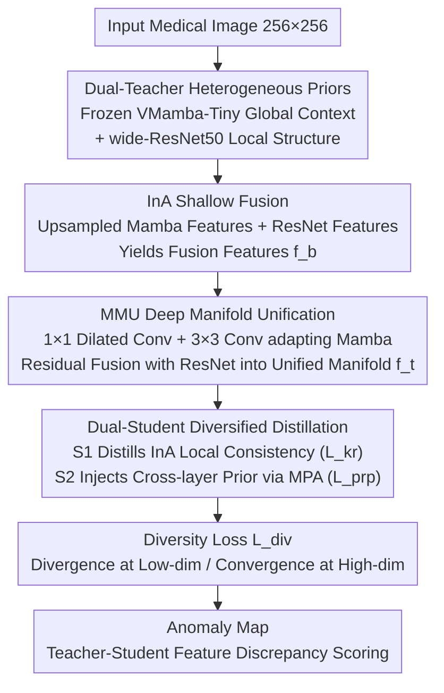

# PDD: Manifold-Prior Diverse Distillation for Medical Anomaly Detection

**Conference**: CVPR 2026  
**Paper**: [CVF Open Access](https://openaccess.thecvf.com/content/CVPR2026/html/Lu_PDD_Manifold_Prior_Diverse_Distillation_for_Medical_Anomaly_Detection_CVPR_2026_paper.html)  
**Code**: https://github.com/OxygenLu/PDD (Authors state it will be open-sourced)  
**Area**: Medical Image  
**Keywords**: Medical Anomaly Detection, Reverse Distillation, Dual-Teacher Dual-Student, Manifold Unification, Representation Diversity

## TL;DR
This paper uses Grad-CAM analysis to reveal that discriminative activation maps, which are effective in industrial anomaly detection, fail in medical images. Consequently, PDD is proposed: features from two heterogeneous frozen teachers—VMamba-Tiny (global context prior) and wide-ResNet50 (local structural prior)—are unified into a single high-dimensional manifold and distilled into two behaviorally complementary students. A diversity loss prevents representation collapse. In HeadCT, BrainMRI, and ZhangLab datasets, the AUROC is higher than the best baselines by 11.8, 8.5, and 2.9 percentage points, respectively.

## Background & Motivation
**Background**: Unsupervised Anomaly Detection (UAD) utilizes only healthy samples to learn a compact manifold of "normal anatomical structures," identifying samples that deviate from this manifold as anomalies during inference. Recently, Teacher-Student (KD) frameworks have been successful in industrial defect detection (e.g., MVTec), with representative works including RD4AD and Skip-TS.

**Limitations of Prior Work**: The authors conducted a crucial diagnostic experiment—comparing Grad-CAM activation maps of frozen VMamba and ResNet on industrial versus medical images. For industrial defects, heatmaps are clean and highly localized; however, on medical images like BrainMRI/HeadCT, heatmaps become diffuse, noisy, and inconsistent with anatomical structures. The reason is that industrial defects are texture-driven and spatially local, while medical anomalies are **structural deviations** distributed across anatomical hierarchies, characterized by weak boundaries and context dependence.

**Key Challenge**: Single-stream feature extractors cannot learn a complete and anatomically consistent normal manifold. CNNs excel at fine-grained local textures, while sequence models like Mamba excel at long-range dependencies and global structures. However, their manifolds are heterogeneous—direct feature concatenation guarantees neither manifold alignment nor the preservation of "representation diversity" in downstream student networks (which is essential for reliably detecting subtle anomalies).

**Goal**: To fuse multiple complementary priors into a robust, unified normal manifold, while ensuring that distilled student networks reach consensus on normal structures but maintain diverse responses to potential anomalies.

**Key Insight**: Since the shallow/deep activations of two heterogeneous backbones are naturally complementary (one aggregated, one dispersed), they should be **explicitly unified into a common manifold**. Subsequently, dual students are used to learn "local consistency" and "cross-layer dependence," with diversity constraints to prevent collapse.

**Core Idea**: Replace "single-teacher single-student isomorphic distillation" with "dual-teacher unified manifold + dual-student diversified reverse distillation" to solve the problem of incomplete normal manifolds and lack of representation diversity in medical anomaly detection.

## Method

### Overall Architecture
PDD is a "manifold-unified reverse distillation" framework where the entire pipeline is trained only on normal samples. The input is a single medical image (resized to 256×256), and the output is an anomaly map. The process involves: multi-scale features extracted in parallel by two **frozen** heterogeneous teachers (VMamba-Tiny + wide-ResNet50) → shallow features fused via the InA module to obtain $f_b^i$ → deep features geometrically aligned and unified into a common manifold feature $f_t^i$ via the MMU module → the unified manifold is distilled into two structurally identical but behaviorally complementary students: Student 1 directly distills InA fusion features for "local consistency," while Student 2 injects unified manifold priors via skip connections through the MPA module to capture "cross-layer dependence" → a diversity loss constrains the two students to promote divergence at low dimensions and convergence at high dimensions. During inference, anomaly scores are calculated based on the teacher-student feature discrepancy.

The total objective is a weighted sum of three losses:
$$\mathcal{L}_{\text{total}} = \lambda_{\text{kr}}\,\mathcal{L}_{\text{kr}} + \lambda_{\text{prp}}\,\mathcal{L}_{\text{prp}} + \lambda_{\text{div}}\,\mathcal{L}_{\text{div}}$$

### Key Designs

**1. Dual-Teacher Heterogeneous Priors: Filling Blinds Spots of Single-Stream Extractors**

Addressing the pain point that "single-stream extractors cannot learn a complete normal manifold," PDD avoids isomorphic teachers. Instead, it parallels two backbones pre-trained on ImageNet-1K and **frozen** during inference: VMamba-Tiny (Teacher 2) learns serialized global context manifolds $\mathcal{M}_m\subset\mathbb{R}^{d_m}$ via state space modeling, and wide-ResNet50 (Teacher 1) learns spatially local structural manifolds $\mathcal{M}_c\subset\mathbb{R}^{d_c}$ via convolutions. Grad-CAM shows that in the same feature dimension, one is more aggregated and the other more dispersed, forming complementary priors.

**2. InA + MMU: Unifying Heterogeneous Manifolds into a Common Space**

To address the issue that "direct concatenation does not guarantee manifold alignment," PDD uses two modules. For shallow layers, **InA (Inter-Level Feature Adaption)**: Mamba features are bilinearly upsampled to the same scale as convolutional features and added element-wise, $f_b^i=\mathcal{U}(f_m^i,S)+f_c^i$ (where $S$ is the scaling factor). For deep layers, **MMU (Manifold Matching and Unification)**: Mamba features undergo channel and spatial adaptation using "1×1 dilated conv + 3×3 conv + GeLU + residual" as $f_{m^c}^i=\mathrm{Res}([C^3\circ\mathcal{G}(\mathrm{BN}(C^1(f_m^i)))],\,C^1(f_m^i))$, then are added to ResNet features to yield unified manifold features $f_t^i=\tilde f_{m^c}^i+f_c^i$.

**3. Dual-Student Diversified Distillation: Local Consistency vs. Cross-layer Dependence**

Addressing the "lack of diverse representation in isomorphic students," PDD distills the unified manifold $f_t^i$ into two identical students with different functions. Student 1 reconstructs InA fusion features using layer-wise MSE: $\mathcal{L}_{\text{kr}}=\sum_i\lVert f_b^i-\mathcal{F}_{E_u}^i\rVert_2^2$. Student 2 utilizes the **MPA (Manifold Prior Affine)** module: performing an MLP affine transformation on the unified manifold $z_p^i=W_p^i f_t^i+b_p^i$, then injecting this prior into each layer via skip connections. Its loss uses both MSE and cosine similarity: $\mathcal{L}_{\text{prp}}=\sum_i[\alpha\lVert f_b^i-\mathcal{F}_{E_p}^i\rVert_2^2+\beta(1-\cos(f_b^i,\mathcal{F}_{E_p}^i))]$.

**4. Diversity Loss: Divergence at Low-dim, Convergence at High-dim**

To prevent the two students from collapsing into the same representation, $\mathcal{L}_{\text{div}}$ utilizes a "segmented reverse cosine" constraint: it penalizes high cosine similarity in low-dimensional shallow layers (using $\max(0,\cos-\tau_{\text{low}})$ to encourage **difference**) and penalizes low cosine similarity in high-dimensional deep layers (using $-\min(0,\cos-\tau_{\text{high}})$ to encourage **similarity**). Ablations show that forcing consistency between the two students (cos(s1,s2)) causes the AUROC on BrainMRI to crash from 96.7 to 32.5.

### Loss & Training
All images are resized to 256×256. The Adam optimizer is used with an initial learning rate of $2\times10^{-3}$ and cosine annealing on a single RTX A6000. Training uses only normal samples, optimizing three losses ($\mathcal{L}_{\text{kr}}$, $\mathcal{L}_{\text{prp}}$, $\mathcal{L}_{\text{div}}$) jointly. Thresholds $\tau_{\text{low}}, \tau_{\text{high}}$ are tuned per dataset.

## Key Experimental Results

**Metrics**: Image-level AUROC, AP (Average Precision), and F1 max. Datasets include ZhangLab, CheXpert, HeadCT, BrainMRI, and the multi-modal Uni-Medical.

### Main Results (Four Medical Datasets, AUROC %)

| Method | HeadCT | ZhangLab | BrainMRI | CheXpert |
|------|--------|----------|----------|----------|
| f-AnoGAN (MIA'19) | 82.6 | 75.5 | 77.1 | 65.8 |
| RD4AD (CVPR'22) | 74.3 | 87.5 | 80.9 | 71.9 |
| SQUID (CVPR'23) | 75.4 | 87.6 | 74.7 | 78.1 |
| SimSID (TPAMI'24) | 74.9 | **91.1** | 81.5 | **79.7** |
| Skip-TS (TIM'24) | 85.7 | 79.2 | 88.2 | 68.7 |
| **Ours (PDD)** | **97.5** | **94.0** | **96.7** | 79.1 |

PDD achieves SOTA on 3 out of 4 datasets, surpassing the best baselines by 11.8 (HeadCT), 2.9 (ZhangLab), and 8.5 (BrainMRI) points. Performance on CheXpert (79.1%) is slightly lower than SimSID (79.7%).

### Uni-Medical Multi-class (AUROC / AP / F1 max, Mean %)

| Method | Mean AUROC | Mean AP | Mean F1 max |
|------|-----------|---------|-------------|
| DiAD (AAAI'24) | 80.4 | 80.1 | 77.8 |
| MambaAD (NeurIPS'24) | **83.7** | **80.1** | 82.0 |
| **Ours (PDD)** | 81.4 | 80.0 | **85.4** |

PDD achieves the best F1 max across all categories (Mean 85.4), though its Mean AUROC (81.4) is slightly lower than MambaAD (83.7).

### Ablation Study

**I. Distillation Paradigm and Modules (ZhangLab, %)**

| Configuration | AUROC | AUPR | F1 max |
|------|-------|------|--------|
| M1: Standard RD (1t1s) | 81.5 | 85.5 | 84.8 |
| M3: Dual Teacher + InA + MMU (2t1s) | 90.8 | 95.7 | 89.7 |
| M4: + MPA | 92.9 | 96.6 | 90.3 |
| Ours: Dual Student (2t2s) | **94.0** | **99.0** | **96.6** |

**II. Student Consistency Supervision (BrainMRI, %)**

| Configuration | $\mathcal{L}_{\text{div}}$ | cos(t1,s1)+cos(t2,s2) | cos(s1,s2) | AUROC | F1 max |
|------|------|------|------|------|------|
| M1 | ✓ | ✗ | ✓ | 32.50 | 93.02 |
| M3 | ✗ | ✓ | ✗ | 93.41 | 95.93 |
| Ours | ✓ | ✓ | ✗ | **96.67** | **97.56** |

### Key Findings
- **Dual-teacher complementary priors provide the Gain**: Moving from single-teacher RD (81.5) to dual-teacher InA+MMU (90.8) yields a +9.3 AUROC jump.
- **Students must not be forced to converge**: Using cos(s1,s2) to force student representations to be identical leads to failure (AUROC 32.50).
- **MPA cross-layer priors are effective**: Adding MPA (M3→M4) increases AUROC by +2.1.
- **Sensitivity to $\tau_{\text{low}}/\tau_{\text{high}}$**: Optimal thresholds vary by dataset, indicating the intensity of diversity constraints is data-dependent.

## Highlights & Insights
- **Diagnostic use of Grad-CAM**: Directly visualizes why industrial methods fail in the medical domain, motivating manifold-level modeling.
- **Clean division of labor**: Shallow InA handles scale alignment while deep MMU handles geometric alignment, avoiding excessive fusion across all layers.
- **Transferable Diversity Loss**: The segmented reverse cosine approach is applicable to any ensemble/distillation task requiring both diversity and semantic consistency.
- **Diverse Reconstruction**: Students learn complementary normal patterns from the unified manifold, making them more sensitive to anomalies.

## Limitations & Future Work
- Lower AUROC than MambaAD on Uni-Medical and slightly lower than SimSID on CheXpert.
- Significant computational and memory overhead due to dual large teacher backbones and dual students.
- Thresholds $\tau_{\text{low}}, \tau_{\text{high}}$ require manual tuning per dataset.
- Evaluation is primarily image-level; pixel-level quantitative results are missing.

## Related Work & Insights
- **vs. RD4AD**: RD4AD uses a single-teacher single-student setup; PDD upgrades to dual-teacher unified manifolds and dual students.
- **vs. Skip-TS**: Skip-TS uses skip connections; PDD incorporates them (via MPA) but focuses on heterogeneous manifold unification.
- **vs. SQUID / SimSID**: These rely on memory modules and are suited for fixed structures (X-rays), whereas PDD is more robust across CT/MRI.
- **vs. MambaAD**: MambaAD is a single-backbone unified model; PDD treats Mamba as a global prior fused with ResNet's local prior.

## Rating
- Novelty: ⭐⭐⭐⭐
- Experimental Thoroughness: ⭐⭐⭐⭐
- Writing Quality: ⭐⭐⭐⭐
- Value: ⭐⭐⭐⭐

<!-- RELATED:START -->

## Related Papers

- [\[CVPR 2026\] From Infusion to Assimilation Distillation for Medical Image Segmentation](from_infusion_to_assimilation_distillation_for_medical_image_segmentation.md)
- [\[CVPR 2026\] Momentum Memory for Knowledge Distillation in Computational Pathology](momentum_memory_for_knowledge_distillation_in_computational_pathology.md)
- [\[CVPR 2026\] TANGO: Learning Distribution-wise Foundation Prior Consistency and Instance-wise Style Calibration for Medical Image Generalization](tango_learning_distribution-wise_foundation_prior_consistency_and_instance-wise_.md)
- [\[CVPR 2026\] MultiModalPFN: Extending Prior-Data Fitted Networks for Multimodal Tabular Learning](multimodalpfn_extending_prior-data_fitted_networks_for_multimodal_tabular_learni.md)
- [\[CVPR 2026\] The Invisible Gorilla Effect in Out-of-distribution Detection](the_invisible_gorilla_effect_in_out-of-distribution_detection.md)

<!-- RELATED:END -->
