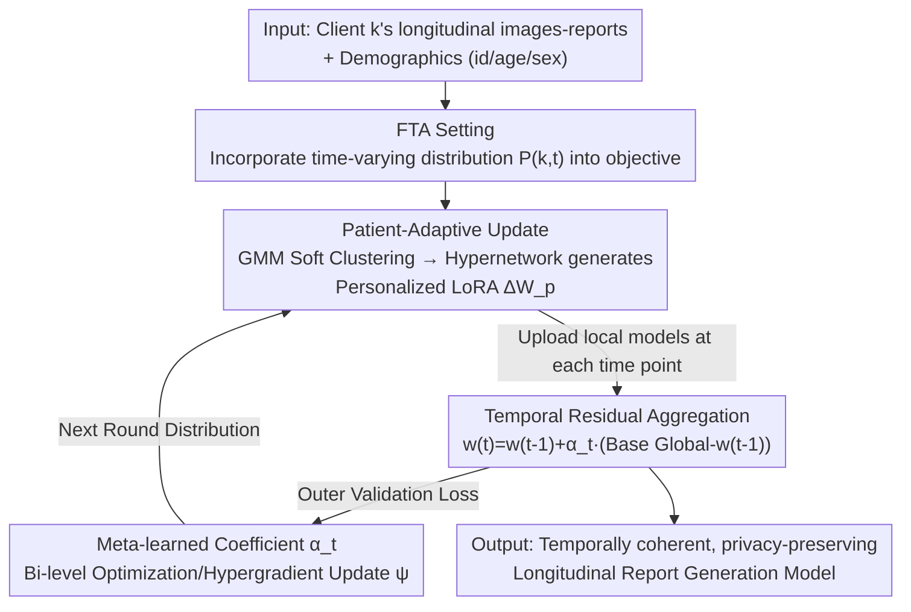

# Personalized Longitudinal Medical Report Generation via Temporally-Aware Federated Adaptation

**Conference**: CVPR 2026  
**Paper**: [CVF Open Access](https://openaccess.thecvf.com/content/CVPR2026/html/Zhu_Personalized_Longitudinal_Medical_Report_Generation_via_Temporally-Aware_Federated_Adaptation_CVPR_2026_paper.html)  
**Code**: https://github.com/zhuhe98/FedTAR-MedicalReport-Generation  
**Area**: Medical Imaging / Federated Learning  
**Keywords**: Longitudinal Medical Report Generation, Federated Learning, Temporal Drift, Personalized LoRA, Meta-Learning Aggregation

## TL;DR
This paper proposes "Federated Temporal Adaptation" (FTA), a federated learning setting that treats temporal evolution as a first-class citizen. Using the FedTAR framework—featuring demographic-driven personalized LoRA and meta-learned temporal residual aggregation—it models longitudinal changes in patient follow-ups under privacy constraints. It improves linguistic accuracy, temporal coherence, and cross-institutional generalization on J-MID (~1 million examinations) and MIMIC-CXR.

## Background & Motivation
**Background**: Automated report generation from longitudinal follow-up imaging (e.g., chest CT) is critical for tracking disease progression and reducing clinician workload. Due to privacy regulations, hospital data cannot be centralized, making Federated Learning (FL) the mainstream paradigm for multi-institution collaborative training, extending from classification to report generation (e.g., FedMRG, FedMME).

**Limitations of Prior Work**: Mainstream FL treats each client (hospital) as a **fixed data distribution**, assuming all examinations from the same patient or institution across different years are i.i.d. samples from a single static distribution. However, the authors observed on a longitudinal CT cohort (Fig. 1) that semantic distributions of reports within the same institution drift significantly from 2018 to 2024, and report embeddings from different institutions form distinct clusters. Thus, real-world data contains both "temporal drift" and "client drift."

**Key Challenge**: Existing FL is "client-distribution aware but essentially time-invariant." Aggregating follow-up updates containing progression signals using static parameter averaging (like FedAvg) "averages out" the progression-related signals critical for clinical judgment, leading to unstable optimization and suboptimal report quality.

**Goal**: Decompose the problem into two sub-problems: ① "who varies" (modeling individual patient heterogeneity like age and sex); ② "when change occurs" (modeling temporal non-stationarity in follow-up sequences).

**Key Insight**: Since temporal drift is real and critical for diagnosis, it should not be assumed stationary. Temporal evolution should be elevated to a first-class component in the federated optimization objective, with parameter-efficient mechanisms designed with convergence and stability guarantees.

**Core Idea**: Use "demographic-conditioned personalized LoRA" to answer "who varies" and "meta-learned weighted temporal residual aggregation" to answer "when change occurs." Together, these form FedTAR, the first concrete instance of the FTA setting.

## Method

### Overall Architecture
FedTAR is a multi-modal federated framework with two sequentially coupled modules: on the client side, **patient-adaptive updates** are performed (encoding low-dimensional demographic data via GMM, then dynamically generating personalized LoRA weights using a hypernetwork for local fine-tuning). On the server side, **temporal residual aggregation** is conducted (calculating residuals at each time step and adaptively weighting updates across time steps using hypergradient-based meta-learning). In a complete communication round, client models from each time point are uploaded, averaged to form a base global model for that time step, integrated into history via residuals, and finally, meta-parameters are updated using validation set gradients.

### Key Designs

**1. FTA (Federated Temporal Adaptation) Setting: Embedding Temporal Drift into the Objective**

To address the root cause—that existing FL assumes static client distributions and erases progression signals—the authors reformulate the problem. Standard FL assumes client $k$ samples i.i.d. from a static $P_k$; online FL associates time indices with the optimization process (round $\tau$) rather than the data distribution. FTA explicitly models each client as a set of time-varying distributions $\{P_{k,t}\}_{t=1}^{T}$, where each sequence $p_n=\{x_{k,t},y_{k,t}\}_{t=1}^{T}$ corresponds to follow-ups. The objective is $\min_{w}\sum_{k}\sum_{t}\mathcal{L}(f(w;x_{k,t}),y_{k,t})$. This makes "temporal drift" a first-class component of the objective function.

**2. Patient-Adaptive LoRA: Answering "Who Varies" via Demographic Soft Clustering**

To handle patient heterogeneity without exchanging raw demographic data, a normalized profile vector $v_p=[\mathrm{Norm}(\mathrm{hash}(\mathrm{id}_p)),\mathrm{Norm}(\mathrm{age}_p),\mathrm{enc}(\mathrm{sex}_p)]^\top\in\mathbb{R}^3$ is calculated for each patient $p$. A Gaussian Mixture Model (GMM) provides soft clustering assignments $q_p=\mathrm{GMM}(v_p)$, capturing probabilistic membership across latent subgroups. These are projected into patient embeddings $\phi_p=W_{proj}q_p+b_{proj}$. A lightweight hypernetwork $h^l$ then maps $\phi_p$ to **patient-specific low-rank adapters** $[A_p^l,B_p^l]=h^l(\phi_p)$. The effective weight for layer $l$ is $W_p^l=W_{client}^l+A^lB^{l\top}+A_p^l(\phi_p)B_p^l(\phi_p)^\top$, combining shared and personalized LoRA terms.

**3. Temporal Residual Aggregation: Answering "When Change Occurs" without Losing History**

Recognizing that static parameter averaging cannot align with future temporal drift, the server uses residual aggregation. At communication round $r$ and time step $t$, a base global model $\bar{w}_g^{(t,r)}=\sum_k\frac{1}{n_k}w_c^{t,k,r}$ is first averaged. Then, a residual correction is applied: $w_g^{(t,r)}=w_g^{(t-1,r)}+\alpha_t(\bar{w}_g^{(t,r)}-w_g^{(t-1,r)})$. Theorem 1 proves this iteration is a **convex combination** of snapshots across time steps, ensuring $w_g^{(t,r)}$ stays within the convex hull of $\{\bar{w}_g^{(1,r)},\dots,\bar{w}_g^{(t,r)}\}$, preserving "smooth memory" of history. Theorem 2 proves the update magnitude is bounded by $\alpha_t G$, where $\alpha_t$ controls the trade-off between responsiveness to new data and noise suppression.

**4. Meta-learning Coefficients: Automated Temporal Weighting via Bi-level Optimization**

To avoid manual scheduling and overfitting to temporal fluctuations, coefficients are parameterized as $u_t=g(e(t);\psi)$ with $[\alpha_1,\dots,\alpha_T]=\mathrm{Softmax}([u_1,\dots,u_T])$. A bi-level optimization is used where the inner loop aggregates $w_g^{(T,r)}(\psi)$ across $t$, and the outer loop updates meta-parameters $\psi$ using a held-out validation loss: $\psi\leftarrow\psi-\eta\nabla_\psi\mathcal{L}_{val}$ (via first-order MAML/hypergradients). This automatically assigns larger coefficients to time points with significant distribution shifts while attenuating noise.

### Loss & Training
Clients use a standard clinical report loss $\mathcal{L}=\sum_{(I,R)\in\mathcal{D}_k}\ell(f(I;W_p),R)$. The architecture uses a Convolutional vision Transformer (CvT) pre-trained on ImageNet-21K as the image encoder and a DistilGPT2 pre-trained on clinical corpora as the text decoder. LoRA rank $r=4$ and $\alpha=128$ are applied to each transformer layer. The learning rate is $10^{-5}$ for the model/adapters and $10^{-4}$ for the meta-learning coefficients, using AdamW.

## Key Experimental Results

### Main Results
On a longitudinal chest CT dataset from five institutions (each patient having exactly 5 consecutive CTs), FedTAR was compared against six FL baselines:

| Method | BLEU-1 | BLEU-4 | ROUGE-L | CIDEr |
|------|--------|--------|---------|-------|
| FedAvg | 38.40 | 10.98 | 28.54 | 31.70 |
| FedProx | 38.32 | 11.00 | 28.58 | 31.62 |
| SCAFFOLD | 35.40 | 10.10 | 27.12 | 24.82 |
| FedAdam | 38.26 | 10.93 | 28.61 | 30.62 |
| DRFA | 36.80 | 11.60 | 28.75 | 29.51 |
| **FedTAR (Ours)** | **40.08** | **12.40** | **29.54** | **42.80** |

CIDEr improved from 31.70 (best baseline) to 42.80, showing that temporal and demographic-aware adaptation significantly improves content relevance. On the public MIMIC-CXR dataset, FedTAR achieved a CE-F1 of 33.21 and CIDEr of 120.58, outperforming most baselines.

### Ablation Study
| Configuration | BLEU-4 | ROUGE-L | CIDEr | Description |
|------|--------|---------|-------|------|
| FedTAR w/o GMM | 12.07 | 28.65 | 41.56 | No demographic soft clustering |
| FedTAR w/o temporal | 11.21 | 29.50 | 41.88 | No meta-learned temporal aggregation |
| **FedTAR (Full)** | **12.40** | **29.54** | **42.80** | Both modules equipped |

### Key Findings
- Removing GMM demographic embeddings leads to a clear drop in BLEU/CIDEr, indicating conditioned embeddings are essential for capturing individual heterogeneity.
- Without the temporal hypernetwork, ROUGE-L and recall-based metrics decrease, proving adaptive weighting is critical for modeling longitudinal progression.
- The two modules are complementary, focusing on "who varies" and "when change occurs" respectively.
- FedTAR exhibits empirical and theoretical convergence stable with the bounded residual aggregation.

## Highlights & Insights
- **Elevating "Time" to a First-Class Citizen**: The FTA setting distinguishes itself from standard FL (time is external) and online FL (time is tied to rounds) by embedding temporal evolution directly into the client data distribution.
- **Theory-Driven Design**: Residual aggregation is backed by convex hull and boundedness theorems, providing a rigorous foundation for how history is preserved and updates are constrained.
- **Privacy-Preserving Personalization**: Using hashed/normalized demographics and GMM soft clustering allows for fine-grained personalization via sub-group profiles without leaking raw patient data.
- **Generalizability**: The framework of demographic-conditioned hypernetworks and meta-learned temporal residuals can be transferred to other longitudinal/streaming FL scenarios.

## Limitations & Future Work
- The main dataset is a private five-institution CT cohort, which limits external reproducibility; validation relies heavily on MIMIC-CXR.
- Each patient is assumed to have exactly 5 follow-ups; robustness to irregular intervals or varying sequence lengths is not fully explored.
- Bi-level optimization is computationally intensive and sensitive to the meta-learning rate.
- There is still a gap compared to centralized models on certain n-gram metrics, suggesting further room for improvement in privacy-constrained longitudinal modeling.

## Related Work & Insights
- **vs FedMRG / FedMME**: These mitigate inter-client heterogeneity but assume static data; FedTAR adds the "when change occurs" dimension.
- **vs PerAda / pFedLoRA**: While these use parameter-efficient adapters for personalization, they are time-invariant; FedTAR's adapters are demographic-driven and coupled with temporal aggregation.
- **vs CT2RepLong**: These use memory decoders for longitudinal coherence but are centralized; FedTAR brings longitudinal modeling into a privacy-preserving federated setting.
- **vs FedAvg/FedProx/DRFA**: These perform static parameter averaging, which erases progression signals; FedTAR uses residuals and meta-learning to preserve and adaptively utilize temporal information.

## Rating
- Novelty: ⭐⭐⭐⭐⭐ (Introduces FTA setting with theoretical grounding)
- Experimental Thoroughness: ⭐⭐⭐⭐ (Extensive CT + MIMIC-CXR, though main data is private)
- Writing Quality: ⭐⭐⭐⭐ (Clear motivation and module decomposition)
- Value: ⭐⭐⭐⭐ (Directly applicable to privacy-sensitive clinical longitudinal modeling)

<!-- RELATED:START -->

## Related Papers

- [\[CVPR 2026\] TIM: Temporal Decoupling with Iterative Mutual-Refinement Model for Longitudinal Radiology Report Generation](tim_temporal_decoupling_with_iterative_mutual-refinement_model_for_longitudinal_.md)
- [\[CVPR 2026\] BiOTPrompt: Bidirectional Optimal Transport Guided Prompting for Disease Evolution-aware Radiology Report Generation](biotprompt_bidirectional_optimal_transport_guided_prompting_for_disease_evolutio.md)
- [\[CVPR 2026\] OmniFM: Toward Modality-Robust and Task-Agnostic Federated Learning for Heterogeneous Medical Imaging](omnifm_toward_modality-robust_and_task-agnostic_federated_learning_for_heterogen.md)
- [\[CVPR 2026\] Sketch2CT: Multimodal Diffusion for Structure-Aware 3D Medical Volume Generation](sketch2ct_multimodal_diffusion_for_structure-aware_3d_medical_volume_generation.md)
- [\[CVPR 2026\] SHAPE: Structure-aware Hierarchical Unsupervised Domain Adaptation with Plausibility Evaluation for Medical Image Segmentation](shape_structure-aware_hierarchical_unsupervised_domain_adaptation_with_plausibil.md)

<!-- RELATED:END -->
