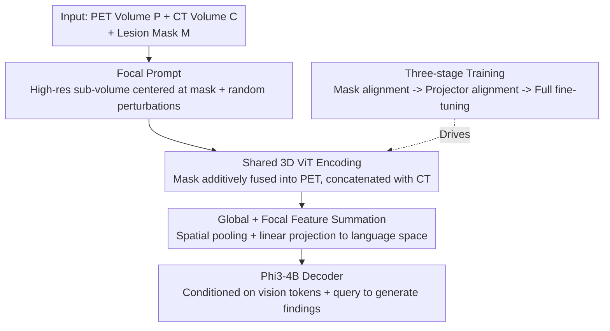

# PETAR: Localized Findings Generation with Mask-Aware Vision-Language Modeling for PET Automated Reporting

**Conference**: CVPR 2026  
**Paper**: [CVF Open Access](https://openaccess.thecvf.com/content/CVPR2026/html/Maqbool_PETAR_Localized_Findings_Generation_with_Mask-Aware_Vision-Language_Modeling_for_PET_CVPR_2026_paper.html)  
**Code**: https://github.com/DanyalMaq/petar-release/  
**Area**: Medical Imaging / Multimodal VLM / Report Generation  
**Keywords**: PET/CT report generation, lesion-level localization, mask-aware, 3D vision-language models, focal prompts  

## TL;DR
Addressing three major challenges in 3D whole-body PET/CT report generation—extremely small lesions (<0.1% volume), scattered regions of interest, and the lack of mask-text aligned datasets—this paper introduces PETARSeg-11K, the first publicly available lesion-level aligned dataset, and PETAR-4B, a mask-aware 3D vision-language model. By utilizing "mask conditioning + focal prompts" to resolve fine-grained details in small lesions, the model significantly outperforms 2D/3D baselines across all automated metrics. Clinical utility was validated through the first human evaluation study for PET reports involving five nuclear medicine physicians.

## Background & Motivation

**Background**: Vision-Language Models (VLMs) show great potential for automated radiology report generation, yet existing research focus is overwhelmingly concentrated on 2D modalities (chest X-rays, single CT slices). While 3D modalities are intrinsically more challenging, PET (Positron Emission Tomography)—despite its critical role in cancer diagnosis, staging, and treatment evaluation—remains severely under-researched.

**Limitations of Prior Work**: PET reporting has several unique difficulties that existing VLMs struggle to handle. First, clinical PET reports require **lesion-level** fine-grained descriptions (detailing anatomical location, sub-location, laterality, morphology, and metabolic activity) rather than global summaries. This resulting combinatorial space makes PET reports among the longest in radiology (sometimes 3x longer than CT reports). Second, clinically relevant lesions can be numerous, tiny (averaging <0.1% of total volume), and spatially scattered; standard vision encoders easily lose these details through global feature extraction and downsampling. Third, existing 3D medical VLMs (e.g., CT2Rep, M3D, Merlin) are mostly trained on CT (anatomical imaging) and are not designed for PET (metabolic/molecular imaging) or joint PET/CT processing.

**Key Challenge**: The fundamental bottleneck is the **lack of any large-scale public dataset** aligning 3D lesion-level segmentation masks with free-text radiology findings. Without this direct "spatial localization $\leftrightarrow$ natural language description" connection, models cannot learn lesion-specific descriptions, rendering usability and reliability unattainable.

**Goal**: (1) Create a dataset aligning lesion masks, 3D images, and text findings; (2) Design a 3D mask-aware VLM capable of jointly encoding PET, CT, and lesion masks while resolving details in small lesions; (3) Establish an evaluation framework including human study to identify which automated metrics best align with physician judgment.

**Key Insight**: Since lesions are small enough to be lost in global processing, localization information is explicitly fed into the model. Lesion masks are used to guide a high-resolution local view (focal prompt), allowing language generation to be conditioned on both the global disease context and fine-grained lesion attributes.

**Core Idea**: Perform lesion-level, spatially anchored PET/CT report generation using "mask-guided focal prompts + PET/CT/mask joint encoding," supported by the first lesion-level mask-text alignment dataset.

## Method

### Overall Architecture
PETAR consists of two parts: the PETARSeg-11K dataset and the PETAR-4B model. For the data, an LLM ensemble extracts lesion attributes (SUVmax, slice numbers, etc.) from clinical reports to drive an iterative thresholding/region-growing algorithm to localize lesions in PET volumes, producing 11,356 aligned data pairs of lesion descriptions and 3D segmentations. For the model, inputs are PET volume $P$, CT volume $C$, and a binary lesion mask $M$. The goal is to generate diagnosis findings $y = f_\theta(P, C, M)$ focused on the masked region. The pipeline involves: cropping a high-resolution focal sub-volume (focal prompt) centered on the mask $\rightarrow$ a shared 3D ViT encodes PET/CT/mask with the mask additively fused into the PET stream $\rightarrow$ global and focal features are element-wise summed, spatially pooled, and projected into the language space $\rightarrow$ a Phi3-4B decoder generates lesion findings conditioned on vision tokens and queries, optimized via a three-stage training strategy.

### Key Designs

**1. PETARSeg-11K: The first lesion-level mask-text aligned whole-body PET/CT dataset**

This serves as the data foundation, filling the gap for aligned "3D lesion mask $\leftrightarrow$ free-text findings" resources. The construction pipeline (following Huemann et al.) employs an LLM ensemble (Mistral-7B-Instruct + Mixtral-8x7B-Instruct) to filter irrelevant sentences, resolve references to prior exams, and precisely extract SUVmax and the corresponding axial slice number for each lesion. An iterative thresholding algorithm then generates masks on the PET volume: thresholds are set based on reported SUVmax to find candidate connected components; candidates matching the reported SUVmax ($\pm 0.1$) and intersecting the reported slice are selected, with contours grown iteratively from the peak pixel until stable. The final dataset contains 11,356 lesion descriptions from 5,126 unique examinations (including FDG, DOTATATE, fluciclovine, and DCFPyL tracers), with 3mm resampling and dimensions of $192 \times 192 \times 352$. Precision for contour localization was 98% in physician spot checks. Descriptions were formatted into a structured schema using Qwen3-30B-A3B. Additionally, $\sim 100,000$ annotations covering 117 anatomical classes were automatically segmented via TotalSegmentator on CT for pre-training anatomical understanding.

**2. Focal Prompt: "Zooming in" on tiny lesions (< 0.1% volume)**

This design has the highest performance impact, addressing the issue where global scaling/downsampling erases small lesions. The authors extended the "Describe Anything Model" concept to 3D: a cubic sub-volume covering the region of interest is cropped centered on mask $M$, providing a high-resolution local view. To improve robustness and prevent overfitting to fixed spatial locations, small random perturbations are applied to the crop center $c$ and side length $r$: $\tilde c = c + \triangle c,\ \tilde r = r + \triangle r$, where $\triangle c, \triangle r \stackrel{i.i.d.}{\sim} U(-0.2r, 0.2r)$, ensuring the mask remains fully within the crop. This results in three-way focal crops for PET, CT, and mask: $F_P, F_C, F_M = \text{Crop}(P, C, M; \tilde c, \tilde r)$. Ablations show that focal prompts consolidate the model's attention on fine-grained details.

**3. Shared 3D Encoding + Additive Mask Conditioning + Global-Focal Fusion**

To integrate metabolic, anatomical, and spatial cues, a shared 3D ViT encodes both PET and CT (PET provides metabolic data while CT provides anatomical context). The lesion mask is injected into the PET branch via **element-wise additive conditioning**: PET and CT are partitioned into non-overlapping 3D patches and projected into tokens $Z_P, Z_C$. The mask uses separate parameters to yield $Z_M$, formulated as $X_{\text{PET}} = T(Z_P + Z_M),\ X_{\text{CT}} = T(Z_C)$, which are then concatenated. The same process is applied to focal crops to obtain $\tilde X$. Global and focal features are summed $T = X + \tilde X$, spatially pooled, and projected into the language space $V = \text{Proj}(\text{SpatialPooler}(T))$. Finally, vision tokens $V$ and the lesion description query $q$ are fed into the Phi3-4B decoder.

### Loss & Training
The objective is standard auto-regressive negative log-likelihood: $L(D, \theta) = -\sum_{(V,q,y)\sim D} \sum_{i=1}^{N} \log p_\theta(y_i \mid V, q, y_{<i})$. **Stage 1 Mask Alignment**: Only the projection head mapping vision features to language space is trained; mask weights are zero-initialized, and other modules are frozen. **Stage 2 Projector Alignment**: Only the mask embedding module is trained to learn binary mask representations aligned with 3D signals. **Stage 3 Full Fine-tuning**: The entire architecture is optimized end-to-end. This strategy is first run on TotalSegmentator data and then repeated on PETARSeg-11K. Training used 2x L40S GPUs over ~20 hours.

## Key Experimental Results

### Main Results
On the PETARSeg-11K hold-out test set (1,175 samples), PETAR-4B outperformed all 2D/3D baselines across N-gram, semantic, and LLM-based clinical metrics:

| Model | BLEU | ROUGE-L | METEOR | CIDEr | BERTScore | RaTEScore | GREEN |
|------|------|---------|--------|-------|-----------|-----------|-------|
| MedGemma-4B (finetuned, best 2D) | 0.495 | 0.454 | 0.510 | 0.119 | 0.754 | 0.613 | 0.086 |
| M3D-RAD (finetuned, best 3D) | 0.485 | 0.446 | 0.501 | 0.132 | 0.750 | 0.627 | 0.071 |
| Reg2RG (finetuned, mask-aware 3D) | 0.478 | 0.416 | 0.487 | 0.055 | 0.732 | 0.532 | 0.031 |
| **PETAR-4B (Ours)** | **0.535** | **0.524** | **0.560** | **0.457** | **0.795** | **0.713** | **0.257** |

The gaps in CIDEr (0.457 vs 0.132) and GREEN (0.257 vs 0.071) are particularly significant, suggesting PETAR produces clinically meaningful descriptions rather than just surface-level word matches.

### Ablation Study
Ablation of the four components (Mask / CT / Focal / TS Pre-training) showed:

| Mask | CT | Focal | TS | BLEU | CIDEr | GREEN |
|------|----|-------|----|------|-------|-------|
| × | × | × | × | 0.485 | 0.132 | 0.071 |
| × | × | ✓ | × | 0.528 | 0.397 | 0.226 |
| ✓ | ✓ | ✓ | × | 0.521 | 0.439 | 0.239 |
| ✓ | ✓ | ✓ | ✓ | **0.535** | **0.457** | **0.257** |

Removing any module decreases performance; **focal prompts have the strongest impact**, increasing CIDEr from 0.132 to 0.397.

### Key Findings
- **GREEN is the best automated metric for physician judgment**: Analysis of 116 pairs of ground-truth/PETAR descriptions by 5 nuclear medicine physicians showed that semantic metrics like GREEN ($\rho=0.59$) and RaTEScore ($0.55$) correlate much better with humans than n-gram metrics like BLEU ($0.21$).
- **Clinical utility backed by human study**: PETAR-4B received scores of 3.7–3.9 (physicians scored 4.3–4.4) in anatomy, interpretation, and utility. Physicians favored the model's description or found it equal to ground truth in ~60% of cases.
- **Qualitative Advantage of Masks**: While M3D-RAD often hallucinates irrelevant anatomy or misidentifies locations (e.g., mislabeling an inguinal node as "proximal femur"), PETAR consistently aligns descriptions with visual features and anatomical context.

## Highlights & Insights
- **Data-Model Contribution Loop**: Using an LLM ensemble to convert clinical report values into localizable masks created the first lesion-level aligned dataset, which then informed the mask-aware architecture. This paradigm is transferable to other label-scarce 3D medical tasks.
- **Focal Prompt as a Practical Solution**: Extending 2D focal crops to 3D with random perturbations is a robust general solution for "tiny targets" (target <0.1%) where global downsampling is catastrophic.
- **First PET Report Human Evaluation**: The work identifies which automated metrics are trustworthy, providing methodological value for medical report generation.

## Limitations & Future Work
- **Dependency on Masks**: Optimal performance requires lesion masks, currently necessitating manual physician input (though it can be integrated into clinical workflows via segmentation tools). Future work could integrate automated detection.
- **Quantitative Hallucinations**: The model still hallucinates numerical values like lesion size or SUVmax; these should be directly measured from masks rather than generated.
- **Generalization**: Training is focused on a specific institution. While performance holds on the AutoPET dataset, robustness across institutional protocols and rare lesion types requires larger-scale validation.

## Related Work & Insights
- **vs. M3D / Merlin / CT2Rep**: These models rely on global feature extraction and are **mask-agnostic**, making it difficult to describe fine-grained lesions. They are also primarily trained on CT.
- **vs. Reg2RG**: Reg2RG uses organ-level masks for region-level descriptions in single-modality chest CT. PETAR uses lesion-level masks and dual-modality PET/CT.
- **vs. MAIRA / LLaVA-Med**: These are limited to 2D planes and discard critical 3D spatial information.

## Rating
- **Novelty**: ⭐⭐⭐⭐ First lesion-level PET/CT mask-text dataset + 3D focal prompt mask-aware architecture.
- **Experimental Thoroughness**: ⭐⭐⭐⭐⭐ Comprehensive baselines, ablation studies, human evaluation, and indicator reliability analysis.
- **Writing Quality**: ⭐⭐⭐⭐ Clear progression from data to model to evaluation.
- **Value**: ⭐⭐⭐⭐⭐ High potential for clinical impact and follow-up research in 3D medical VLMs.

<!-- RELATED:START -->

## Related Papers

- [\[CVPR 2026\] IVAAN: Instance-level Vision-Language Alignment via Attribute-Guided Text Prompts Generation for Nuclei Analysis](ivaan_instance-level_vision-language_alignment_via_attribute-guided_text_prompts.md)
- [\[CVPR 2026\] D2T2 - Multimodal Automated Planning for Brachytherapy](d2t2_-_multimodal_automated_planning_for_brachytherapy.md)
- [\[CVPR 2026\] Modeling the Brain's Grammar: ROI-Guided fMRI Pretraining for Transferable and Interpretable Vision Decoding](modeling_the_brains_grammar_roi-guided_fmri_pretraining_for_transferable_and_int.md)
- [\[NeurIPS 2025\] Toward a Vision-Language Foundation Model for Medical Data: Multimodal Dataset and Benchmarks for Vietnamese PET/CT Report Generation](../../NeurIPS2025/medical_imaging/toward_a_vision-language_foundation_model_for_medical_data_multimodal_dataset_an.md)
- [\[CVPR 2026\] Unleashing Video Language Models for Fine-grained HRCT Report Generation](unleashing_video_language_models_for_fine-grained_hrct_report_generation.md)

<!-- RELATED:END -->
