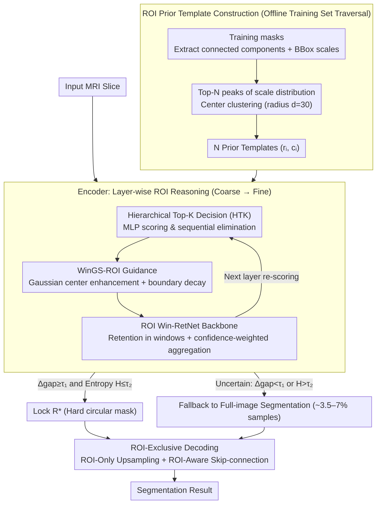

# PGR-Net: Prior-Guided ROI Reasoning Network for Brain Tumor MRI Segmentation

**Conference**: CVPR 2026  
**arXiv**: [2603.21626](https://arxiv.org/abs/2603.21626)  
**Code**: [https://github.com/CNU-MedAI-Lab/PGR-Net](https://github.com/CNU-MedAI-Lab/PGR-Net)  
**Area**: Medical Image Segmentation  
**Keywords**: Brain Tumor Segmentation, ROI Priors, Spatial Guidance, RetNet, MRI

## TL;DR

PGR-Net proposes an explicit ROI-aware brain tumor MRI segmentation network. By constructing a data-driven spatial prior template set from the training data, a hierarchical Top-K ROI selection mechanism, and a Windowed Gaussian-Spatial decay guidance module (WinGS-ROI), it concentrates computational resources on lesion areas. It achieves SOTA performance on BraTS-2019/2023 and MSD Task01 with only 8.64M parameters.

## Background & Motivation

**Background**: Brain tumor MRI segmentation is a fundamental task for clinical diagnosis and radiotherapy target delineation. Segmentation accuracy has continuously improved from UNet to TransUNet, Swin UNETR, and recent SSM methods like Mamba-UNet.

**Limitations of Prior Work**: Brain tumors exhibit severe **spatial sparsity** in MRI—on average, tumor regions occupy only about 10.7% of the entire image in BraTS2023 (approx. 2740 pixels out of 160×160). This causes models to be dominated by background features in early training stages and waste significant computation on healthy tissues later, even after localizing the tumor. Existing models generally assume lesions are uniformly distributed, ignoring clinically known spatial patterns of tumor distribution.

**Key Challenge**: Tumors have definite spatial distribution patterns in the brain—highly concentrated at the frontal-temporal junction and rarely occurring in the occipital lobe. Existing segmentation networks ignore these priors, resulting in equal computational expenditure across the entire image. A few methods that introduce hard ROI guidance suffer from poor generalization because they fail to capture distribution patterns.

**Goal**: (1) Model tumor location and scale priors from statistical data; (2) Utilize priors for progressive hierarchical ROI selection; (3) Embed learnable spatial guidance in each network layer to focus on lesions and suppress background.

**Key Insight**: The authors observed that the spatial distribution of brain tumors possesses statistical regularity (verified by analyzing lesion center and scale distributions in the training set). Therefore, data-driven ROI prior templates $\{(r_i, c_i)\}$ can be extracted to explicitly inject prior knowledge, ensuring computational resources are "spent where they matter."

**Core Idea**: Construct data-driven tumor spatial prior templates. Implement ROI-aware segmentation from global to local via hierarchical Top-K ROI selection and windowed Gaussian-spatial decay guidance within a RetNet backbone.

## Method

### Overall Architecture

The core problem PGR-Net addresses is that while brain tumors occupy only ~11% of MRI images, conventional networks perform uniform computation across the whole image, wasting capacity on healthy tissue. The strategy is to first "learn" where tumors typically appear and how large they are from the training set, then guide the network to contract its attention onto lesions during inference based on these priors.

The network is an encoder-decoder using Windowed RetNet (Win-RetNet) as the backbone. In the offline phase, all training masks are scanned to statistically derive a set of ROI prior templates $\{(r_i, c_i)\}_{i=1}^N$, where each template records a representative lesion scale ratio $r_i$ and center coordinates $c_i$. During online inference, these $N$ candidate ROIs are fed into the encoder: a Hierarchical Top-K decision (HTK) module scores and eliminates candidates layer-by-layer starting from the coarsest level until the most confident one is locked. Simultaneously, the WinGS-ROI module converts the surviving candidates into a "strong center, soft boundary" Gaussian guidance map, which is multiplied into features to guide Win-RetNet for efficient modeling within ROI windows. In the decoding phase, upsampling and skip-connection fusion are restricted to the locked ROI (ROI-Only / ROI-Aware), completely bypassing background computation.

### Key Designs

**1. ROI Prior Template Construction: Turning "Typical Tumor Locations" into Queryable Templates**

The waste in uniform computation stems from the network's ignorance of potential lesion locations. PGR-Net extracts this knowledge offline before training: connected components are extracted from each mask in the training set to measure the maximum side length $s$ (scale) and center coordinates of the minimal bounding box. After filtering noise, a scale distribution is formed to detect local maxima (peaks), taking the Top-N peaks as representative scales. For samples near each scale peak, center coordinates are clustered to obtain $N$ prior templates $(r_i, c_i)$. Clustering uses a radius constraint $d=30$ to prevent merging distant regions of the same scale. Unlike fixed hard-coded boxes, these data-driven templates adapt to dataset distributions and cover multiple scales, providing a rich search space for subsequent selection.

**2. Hierarchical Top-K ROI Decision (HTK): Progressive Candidate Elimination**

Given $N$ candidate templates, the network must identify the ROI corresponding to the current image during inference. A single-layer decision is prone to error—coarse layers have large receptive fields but low resolution, while fine layers have high resolution but narrow fields. HTK distributes the decision across multiple layers: at the coarsest layer $l=L$, a lightweight MLP scores all $N$ candidates, retaining only Top-$K^{(L)}$; at finer layers $l<L$, only the survivors are re-scored. Scores are normalized via softmax and aggregated into a cross-layer confidence matrix:

$$S = \sum_l \alpha_l \hat{s}^{(l)}, \qquad R^* = \arg\max_i S_i$$

The most confident $R^*$ is selected. Coarse layers provide "rough localization" while fine layers provide "precise localization." To handle atypical samples, HTK includes a stability gate: if the gap between the top two scores $\Delta_{gap} < \tau_1$ or the entropy $H > \tau_2$, the model falls back to full-image mode. This fallback triggers in only ~3.5–7% of samples, proving the reliability of the priors.

**3. WinGS-ROI Windowed Gaussian-Spatial Decay Guidance: Soft Guidance vs. Hard Cropping**

How is the selected ROI communicated to the network? Direct hard-box cropping creates boundary artifacts and disrupts gradients. WinGS-ROI uses a soft guidance map where each surviving candidate is modeled as a circular Gaussian:

$$G_i^{(l)}(u,v) = \rho_i \exp\!\left(-\frac{(u-x_i)^2+(v-y_i)^2}{2\sigma_i^2}\right)$$

Weighted by confidence $\rho_i$ from HTK—more certain candidates provide stronger guidance. Outside the ROI, signals do not drop immediately to zero but follow a smooth radial decay $\exp(-\frac{(d_i-R_i)^2}{2\tau^2})$. This is injected via multiplicative modulation:

$$\tilde{F}^{(l)} = (1 + \lambda M^{(l)}) \odot F^{(l)}$$

The term $1+\lambda M^{(l)}$ is crucial—it applies gain to lesion regions while background regions remain near 1 (no gain) rather than zero, preserving gradient flow and background information unless a high-confidence lock is achieved. This guidance is embedded across the encoder, skip-connections (ROI-Aware), and upsampling (ROI-Only).

**4. ROI Win-RetNet Backbone and ROI-Exclusive Decoding: Efficient Computation**

The computational savings (8.64M params / 39G FLOPs) come from the "ROI-only" backbone and decoding. The backbone uses RetNet's retention mechanism instead of self-attention, which models long-range dependencies using dual recurrent/parallel forms with a decay factor $\gamma$. Its complexity is lower than $O(n^2)$. Win-RetNet crops windows based on the WinGS-ROI map, flattens them into sequences, and aggregates outputs weighted by HTK confidence:

$$Y^{(l)} = \sum_{k=1}^{K_l} \omega_k^{(l)} \cdot \mathrm{Fusion}(h_k^{(l)}), \qquad \omega_k^{(l)} = \frac{\exp(\gamma \rho_k^{(l)})}{\sum_j \exp(\gamma \rho_j^{(l)})}$$

The decoder implements "ROI-only" logic: ROI-Only upsampling reconstructs only within the locked region, and ROI-Aware skip-connections transfer only ROI-internal encoder features. This combination allows the network to outperform deeper models while using significantly fewer resources.

### Loss & Training

The loss is a weighted combination of Dice loss and BCE loss (2:8 ratio). Adam optimizer is used with an initial learning rate of 1e-3, training for 300 epochs with 50-epoch early stopping. All experiments are averaged over 3 independent runs. HTK is trained end-to-end with the segmentation loss without additional ROI labels.

## Key Experimental Results

### Main Results

BraTS-2023 Dice (%) Comparison:

| Method | Params | Dice_WT | Dice_TC | Dice_ET | HD95_WT |
|------|--------|---------|---------|---------|---------|
| UNet | 39.40M | 90.71 | 93.05 | 93.36 | 1.1863 |
| Swin UNETR | 25.11M | 91.11 | 93.20 | 93.42 | 1.1629 |
| Mamba-UNet | 35.86M | 91.03 | 93.32 | 93.31 | 1.1734 |
| M-Net | 81.59M | 91.33 | 93.55 | 93.42 | 1.1534 |
| VM-UNet | 44.28M | 90.52 | 93.40 | 93.50 | 1.1806 |
| **PGR-Net** | **8.64M** | **91.82** | **94.07** | **93.88** | **1.1334** |

Computational Efficiency:

| Method | Params(M) | FLOPs(G) | Inference Time |
|------|-----------|----------|----------|
| UNet | 39.40 | 321.19 | 12:32 |
| Swin UNETR | 25.11 | 106.80 | 21:33 |
| M-Net | 81.59 | 91.29 | 15:33 |
| **PGR-Net** | **8.64** | **39.05** | **9:41** |

### Ablation Study

BraTS-2019 / BraTS-2023 Dice (%) Ablation:

| Configuration | Dice_WT | Dice_TC | Dice_ET |
|------|---------|---------|---------|
| Baseline (None) | 87.82 / 91.06 | 88.91 / 92.97 | 91.05 / 93.13 |
| + ROI Win-RetNet | 87.85 / 91.10 | 88.89 / 93.02 | 91.15 / 93.08 |
| + HTK | 88.55 / 91.66 | 89.64 / 93.42 | 91.99 / 93.35 |
| + WinGS-ROI (Encoder) | 88.63 / 91.76 | 90.33 / 93.75 | 92.72 / 93.57 |
| + WinGS-ROI (Skip) | 88.85 / 91.80 | 90.32 / 93.79 | 92.88 / 93.74 |
| + WinGS-ROI (Full) | **89.02 / 91.82** | **90.69 / 94.07** | **93.61 / 93.88** |

### Key Findings

- **HTK contributes the largest single-step improvement**: Adding HTK increased WT Dice by 0.7/0.56 and TC by 0.75/0.40, validating the effectiveness of hierarchical ROI selection.
- WinGS-ROI has the highest impact in the encoder (especially ET improving from 91.99 to 92.72).
- PGR-Net parameters are only 8.64M (4.6x less than UNet, 9.4x less than M-Net) with significantly lower FLOPs and fastest inference.
- The full-image fallback only triggers for 3.52% of samples in BraTS-2023, indicating the reliability of the prior guidance.
- Consistently outperforms all competitors across three datasets, especially in the WT region (the primary source of prior construction).

## Highlights & Insights

- **"Invest where it matters"**: Since tumors occupy <11% of the image, PGR-Net's ROI prior guidance focuses computation on this 11%, achieving SOTA with minimal parameters. This philosophy is applicable to all spatially sparse tasks (e.g., lung nodules, retinal lesions).
- **Data-driven Priors + Hierarchical Decision**: Priors provide search space constraints, while HTK dynamically refines them during inference—balancing stability and flexibility.
- **WinGS-ROI Soft Design**: Superior to hard masks. Gaussian enhancement ensures strong feature modulation at the lesion center, while decay prevents artifacts from hard truncation.

## Limitations & Future Work

- ROI priors are constructed only from the WT (Whole Tumor) region; independent priors for TC and ET might further improve small region segmentation.
- All experiments are conducted on 2D slices; a 3D version utilizing volumetric context could yield better results.
- Priors are training-set dependent; robustness against distribution shifts (different hospitals/scanners) remains to be verified.
- The one-way sequence modeling of the RetNet backbone might be limited in regions requiring bilateral context (e.g., symmetric structures).

## Related Work & Insights

- **vs nnUNet**: PGR-Net improves WT Dice from 90.34 to 91.82 on BraTS-2023 and reduces inference time from 86:52 to 9:41.
- **vs Swin UNETR**: Ours has 2.9x fewer parameters (8.64M vs 25.11M) and 0.71 higher WT Dice.
- **vs Mamba-UNet**: SSM-based Mamba methods are efficient but less accurate than PGR-Net.
- **vs MedSAM**: Even foundation models like MedSAM (240M parameters) are outperformed by PGR-Net, suggesting domain-specific priors are more critical than general model scale.

## Rating

- Novelty: ⭐⭐⭐⭐ Combination of data-driven priors, hierarchical Top-K ROI, and WinGS-ROI is innovative.
- Experimental Thoroughness: ⭐⭐⭐⭐⭐ Comprehensive evaluation across three datasets with thorough ablations and efficiency metrics.
- Writing Quality: ⭐⭐⭐⭐ Clear logic from clinical observation to architectural design.
- Value: ⭐⭐⭐⭐ Highly practical for medical imaging communities looking for high-performance, low-resource models.

<!-- RELATED:START -->

## Related Papers

- [\[CVPR 2026\] Virtual Nodes Guided Dynamic Graph Neural Network for Brain Tumor Segmentation with Missing Modalities](virtual_nodes_guided_dynamic_graph_neural_network_for_brain_tumor_segmentation_w.md)
- [\[ICCV 2025\] M-Net: MRI Brain Tumor Sequential Segmentation Network via Mesh-Cast](../../ICCV2025/medical_imaging/m-net_mri_brain_tumor_sequential_segmentation_network_via_mesh-cast.md)
- [\[CVPR 2026\] Uni-Encoder Meets Multi-Encoders: Representation Before Fusion for Brain Tumor Segmentation with Missing Modalities](uni-encoder_meets_multi-encoders_representation_before_fusion_for_brain_tumor_se.md)
- [\[CVPR 2026\] Modeling the Brain's Grammar: ROI-Guided fMRI Pretraining for Transferable and Interpretable Vision Decoding](modeling_the_brains_grammar_roi-guided_fmri_pretraining_for_transferable_and_int.md)
- [\[CVPR 2026\] R2-Seg: Training-Free OOD Medical Tumor Segmentation via Anatomical Reasoning and Statistical Rejection](r2-seg_training-free_ood_medical_tumor_segmentation_via_anatomical_reasoning_and.md)

<!-- RELATED:END -->
