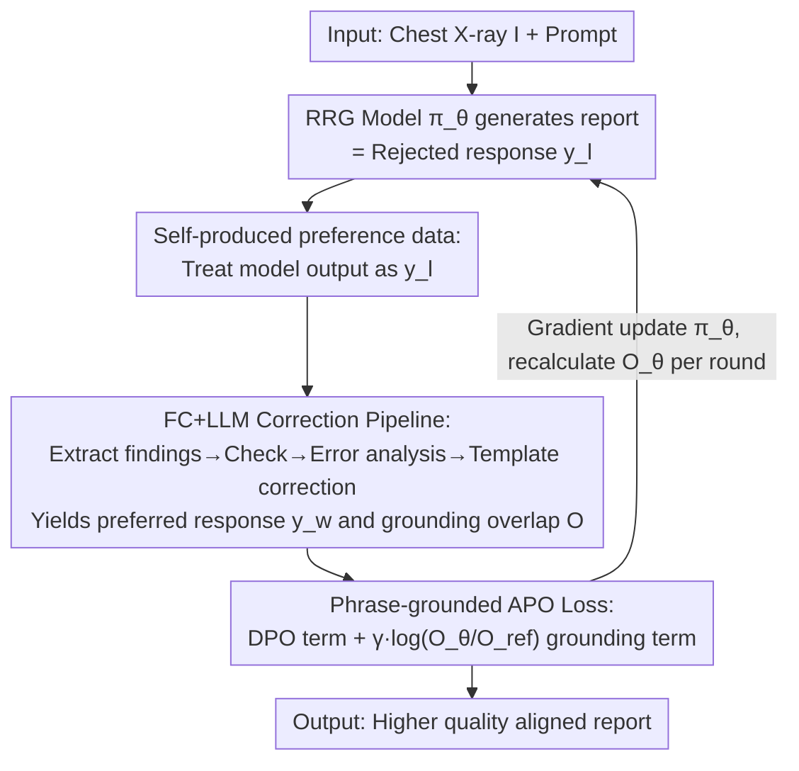

# Phrase-grounded APO for Improving Chest X-ray Report Generation

**Conference**: CVPR 2026  
**Paper**: [CVF Open Access](https://openaccess.thecvf.com/content/CVPR2026/html/Mahmood_Phrase-grounded_APO_for_Improving_Chest_X-ray_Report_Generation_CVPR_2026_paper.html)  
**Code**: To be confirmed  
**Area**: Medical Imaging / Radiology Report Generation  
**Keywords**: Chest X-ray report generation, test-time alignment, automatic preference optimization, phrase-level grounding, fact-checking

## TL;DR
This paper proposes "Phrase-grounded Automatic Preference Optimization (APO)": during the inference phase and without any additional ground truth, a fact-checking model + LLM correction converts the radiology report generator's own output into "preferred/rejected" pairs. A new APO loss, combining preference alignment and phrase-grounding terms, is used for lightweight weight updates. This improves report quality by an average of 30–40% across 7 SOTA report generators on multi-institutional chest X-ray datasets.

## Background & Motivation
**Background**: Automated Radiology Report Generation (RRG) has progressed rapidly on chest X-rays (leveraging VLMs trained on large-scale paired data like MIMIC and CheXpert). However, clinical pilots reveal significant hallucinations and factual errors—both in "finding presence/absence" identification and "finding localization" errors, which severely hinder deployment.

**Limitations of Prior Work**: Conventional approaches to improve RRG involve alignment during training—DPO, PPO, GRPO, etc. However, these methods **all require paired "preferred $y_w$ / rejected $y_l$" ground truth datasets**, which are unavailable during clinical deployment. Another category of inference-time methods only adjusts prompts, sampling, or decoding rules without updating weights, which are not yet clinically ready or "out-of-the-box." Recent Fact-Checking (FC) models can perform phrase-level error correction on reports from frozen RRGs at inference time, but they only "report errors" and do not improve the generator itself.

**Key Challenge**: There is a contradiction in clinical deployment between the "desire to truly improve the generator (requiring parameter updates and preference ground truth)" and the "lack of ground truth and inability to centralize data." Existing alignment methods either rely on manually constructed preference truth or only modify reports post-hoc without touching the model.

**Goal**: ① Automatically generate preference/rejected data at inference time without extra ground truth; ② Design a loss that aligns not only text but also the "image location" of findings; ③ Ensure the method is RRG model-agnostic and plug-and-play.

**Key Insight**: The authors noticed that an FC model + templated LLM correction can transform an erroneous report into a "more correct" one. Thus, the "RRG raw output" can be treated as a **rejected response**, and the "FC+LLM corrected report" as a **preferred response**, "self-producing" preference pairs from the model's own output. Furthermore, the spatial localization of findings is incorporated into the alignment target.

**Core Idea**: DPO is transformed into a zero-ground-truth inference-time APO (Automatic Preference Optimization) by using "self-produced preference data + phrase-grounding terms."

## Method

### Overall Architecture
APO treats the raw output of the RRG model to be aligned (policy $\pi_\theta$) as the **rejected response** $y_l$. This output is sent through preprocessing (extracting findings and anatomical localization) $\rightarrow$ FC model verification (predicting authenticity labels $E$ and predicted locations $l_w$ for each finding) $\rightarrow$ error analysis (quantifying into 16 combinations based on authenticity and IoU, where 6 are consistent) $\rightarrow$ LLM templated correction, yielding the **preferred response** $y_w$ and phrase-grounding overlap probability $O$. Finally, an APO loss combining preference alignment and phrase-grounding terms is used to perform lightweight parameter updates on $\pi_\theta$ using test images (recalculating $\pi_\theta(y_w)$ and overlap $O_\theta$ after each update). The entire process occurs during the **inference phase**, requires no external ground truth, and is agnostic to the base RRG model.

### Key Designs

**1. Self-produced preference data: Treating model output as rejected for zero-ground-truth alignment**

Addressing the root cause that "DPO/PPO/GRPO require preference ground truth which is absent in clinical deployment," APO treats the RRG model's output directly as the rejected response $y_{l,ref}=r_{ref}$, $y_{l,\theta}=r_\theta$, and the corresponding "report corrected by the FC model" as the preferred response $y_{w,ref}=r_{w,ref}$, $y_{w,\theta}=r_{w,\theta}$ (if no error is found, preferred = rejected). The preference dataset is formalized as $D=\{x_i,y_w^i,L_w^i,y_l^i,L_l^i\}$, where $x_i$ is the image and initial prompt, and $L$ is the set of finding localizations. Thus, the preference pairs are "self-generated" entirely from the model's own responses without any additional annotation, moving the training-time alignment paradigm to the inference stage. The RRG is first frozen to run test images and save $y_l$, then $y_w$ and overlap probabilities are generated, followed by fine-tuning while repeating this process.

**2. FC + LLM Correction Pipeline: Using fact-checking to turn "rejected $\rightarrow$ preferred" into controllable editing**

Since the quality of the preferred response determines alignment effectiveness, the authors reuse their previous work to build a structured correction pipeline. Preprocessing first extracts sentences into Fine-grained Finding Labels (FFL): $F_j=N_j|C_j|l_j$, where $N_j$ is the presence/absence indicator, $C_j$ is the core finding name, and $l_j=\langle u,v,w,h\rangle$ is the localization merged from 36 anatomical region bounding boxes (extraction accuracy approx. 97%). The FC model (a multi-label contrastive regression network trained with supervised contrastive learning) predicts authenticity $E_p$ and predicted location $l_p$ for each finding. Error analysis quantifies scenarios into 16 combinations using authenticity and IoU ($\mathrm{IOU}_{pi}=1-\frac{|l_p\cap l_i|}{|l_p\cup l_i|}$), with only 6 being FC-consistent, based on which 5 correction prompt templates are designed. Finally, an LLM (using Llama 3.2, temperature 0, 400 token limit) performs deterministic sentence rewriting under template constraints. These constraints ensure the LLM primarily improves readability without hallucinating findings or descriptions; in 1,000 evaluated sentences, 94.5% were correct, with only 0.4% grammatical errors and 4.2% clinical errors (mostly occurring when a sentence contains multiple findings or ambiguous localization adjectives like left/right—which is why the phrase-grounding loss is retained).

**3. Phrase-level grounding APO loss: Aligning "finding locations" alongside text preference**

To address the issue where "aligning text only ignores localization errors," the authors add a phrase-grounding loss term to the DPO loss. The original DPO is $L_{DPO}=-\mathbb{E}\log\sigma(\beta\log\frac{\pi_\theta(y_w|x)}{\pi_{ref}(y_w|x)}-\beta\log\frac{\pi_\theta(y_l|x)}{\pi_{ref}(y_l|x)})$. APO appends $\gamma\log\frac{O_\theta}{O_{ref}}$ within the parentheses:

$$L_{APO}=-\mathbb{E}\log\sigma\Big(\beta\log\tfrac{\pi_\theta(y_w|x)}{\pi_{ref}(y_w|x)}-\beta\log\tfrac{\pi_\theta(y_l|x)}{\pi_{ref}(y_l|x)}+\gamma\log\tfrac{O_\theta}{O_{ref}}\Big)$$

where $O$ is the average IoU overlap of corresponding finding localizations between preferred and rejected responses, $O_\theta=\frac{1}{M_\theta}\sum_j\frac{|l_{w\theta j}\cap l_{l\theta j}|}{|l_{w\theta j}\cup l_{l\theta j}|}$ (similarly for $O_{ref}$). The intuition is to ensure the fine-tuned model has higher localization overlap on "preferred vs. rejected" findings compared to the reference model. $\gamma$ and $\beta$ are empirically set to 0.1 (following DPO conventions of using KL divergence to balance deviation from the base model). This term ensures alignment focuses on both the "textual description of findings" and "their location on the image," filling the blind spot of text-only DPO regarding localization errors.

### Loss & Training
The training flow resembles DPO but occurs at inference time with self-produced preferred responses. Most RRG models fit into a single GPU and are fine-tuned within 10 epochs on the test set. In experiments, RRG, FC, and correction LLM are all hosted on a single 40GB A100, with a batch size of 32, AdamW + cosine annealing, a max learning rate of 1e-5, and 50 warmup steps.

## Key Experimental Results

### Main Results
On the ChestImaGenome Gold dataset, various metrics compare the similarity of "rejected original report (A, G)", "corrected preferred report (P, G)", and "APO aligned report (C, G)" against the ground truth (G) (higher is better; the table extracts the RadgraphF1 column):

| Generator | RadF1 (A,G) | RadF1 (P,G) | RadF1 (C,G) |
|-----------|-------------|-------------|-------------|
| RGRG      | 0.52        | 0.67        | 0.69        |
| XrayGPT   | 0.39        | 0.45        | 0.47        |
| R2GenGPT  | 0.54        | 0.58        | 0.59        |
| Maira-2   | 0.58        | 0.63        | 0.66        |
| **Avg. Gain** | —           | —           | **13.5% (RadF1)** |

Across four metrics, the average gain of (C, G) relative to (A, G) ranges from 13.5% to 78.9%, with an overall average of approximately 39.98% on this dataset. In contrast, the static correction (P, G) averages around 26.52%, indicating that the gain from APO parameter updates exceeds simple report modification—it can even recover new findings missed in the original report (e.g., adding "right pleural effusion" in Fig. 4). Measured by RQ score across 7 generators × 4 datasets, APO achieves an average gain of approximately 22.7%.

### Ablation Study
| Configuration | Avg. Gain (RQ) | Description |
|---------------|----------------|-------------|
| Static Correction only (P,G) | 26.52% (CG multi-metric) | Can only add/delete reported findings, cannot recover missed ones |
| DPO Alignment (D,G) | 11.4% | Standard DPO without the phrase-grounding term |
| **Full APO (C,G)** | **22.7%** | DPO + Phrase-grounding loss |
| GRPO (R,G) | <5% | RL alignment using RQ as reward |

### Key Findings
- **Phrase-grounding term is the key contributor**: Removing it to revert to DPO drops the average RQ gain from 22.7% to 11.4%, proving the importance of aligning "location" rather than just text.
- **APO > Static Correction**: Parameter updates allow the model to report previously missed findings, whereas static correction can only modify existing ones.
- **GRPO is unstable**: Vanilla GRPO using RQ as a reward shows an overall improvement of less than 5% and performs worse on under-mature models (like XrayGPT). This is because clinical RRGs often yield stable (even if incorrect) reports when called repeatedly for the same image, lacking the sampling diversity needed for GRPO to benefit.
- **Robust across datasets and models**: Positive gains (approx. 8–42%) were observed for 7 generators across multiple institutional sets, including MS-CXR, ChestX-ray8, and VinDr-CXR.

## Highlights & Insights
- **Shifting "Training-time Alignment" to "Inference-time, Zero-GT"**: Using the RRG's own output + FC/LLM correction to self-produce preference pairs avoids the hard dependency of DPO-family methods on manual ground truth, which is a practical step for clinical deployment.
- **Clever "Spatial Localization" term in the loss**: Half of radiology report errors pertain to localization, which text-only preference losses miss. Using $\gamma\log(O_\theta/O_{ref})$ to pull localization into the gradient via IoU overlap is simple yet addresses a core issue.
- **Model-agnostic and Plug-and-Play**: The FC model and correction LLM are independent of the base RRG, allowing lightweight quality enhancement for any deployed frozen generator.
- **Generalizability**: The paradigm of "using a critique/verifier model to transform model output into a preference pair for optimization" can be transferred to other generation tasks lacking ground truth but possessing verifiable signals (e.g., summaries with verifiable facts, code).

## Limitations & Future Work
- Limited by FC model capabilities, the method does not handle errors in **severity and measurements**.
- The relative contributions of "preprocessing/FC prediction errors" vs. "RRG output errors" are not disentangled, leading to less granular attribution of improvements.
- Phrase localization currently uses bounding boxes as an approximation; the authors suggest that full discovery segmentation might be superior.
- LLM correction does not guarantee consistent output per run; reports may still vary, and prompt templates could be further refined by finding type.

## Related Work & Insights
- **vs. DPO**: DPO requires manually constructed preference truth; APO sets rejected as model output and preferred as FC+LLM corrected reports, self-producing pairs for inference-time updates with an added phrase-grounding term.
- **vs. GRPO/PPO (RL Alignment)**: GRPO using RQ as a reward showed <5% gain and instability; APO does not rely on sampling diversity and is more robust for clinical RRG outputs that tend to be stable.
- **vs. Static Fact-Checking Correction**: Static methods can only add/edit reported findings and fail when multiple findings in one sentence are partially wrong or missed entirely; APO's parameter updates can recover new findings.
- **vs. Inference-time Prompt/Sampling/Decoding Tuning**: Those methods do not update parameters and are not clinically ready; APO performs lightweight gradient updates and is model-agnostic.

## Rating
- Novelty: ⭐⭐⭐⭐⭐ First RRG method to perform parameter-level preference alignment at inference time without extra ground truth, integrating phrase-grounding into the loss.
- Experimental Thoroughness: ⭐⭐⭐⭐ Extensive comparison across 7 generators, 5 datasets, multiple metrics, and DPO/GRPO/Static baselines, though lacking error source disentanglement and severity assessment.
- Writing Quality: ⭐⭐⭐⭐ Clear motivation and pipeline description; complete formulas and error analysis; some implementation details rely on prior work citations.
- Value: ⭐⭐⭐⭐⭐ Targets the clinical pain point of hallucinations in radiology reports; zero-ground-truth, model-agnostic, and plug-and-play features offer high practical utility.

<!-- RELATED:START -->

## Related Papers

- [\[CVPR 2026\] CURE: Curriculum-guided Multi-task Training for Reliable Anatomy Grounded Report Generation](cure_curriculum-guided_multi-task_training_for_reliable_anatomy_grounded_report_.md)
- [\[AAAI 2026\] A Disease-Aware Dual-Stage Framework for Chest X-ray Report Generation](../../AAAI2026/medical_imaging/a_disease-aware_dual-stage_framework_for_chest_x-ray_report_.md)
- [\[AAAI 2026\] PriorRG: Prior-Guided Contrastive Pre-training and Coarse-to-Fine Decoding for Chest X-ray Report Generation](../../AAAI2026/medical_imaging/priorrg_prior-guided_contrastive_pre-training_and_coarse-to-fine_decoding_for_ch.md)
- [\[CVPR 2026\] DARC: Dual Adjustment Reasoning with Counterfactuals for Trustworthy Chest X-ray Classification](darc_dual_adjustment_reasoning_with_counterfactuals_for_trustworthy_chest_x-ray_.md)
- [\[CVPR 2025\] Enhanced Contrastive Learning with Multi-view Longitudinal Data for Chest X-ray Report Generation](../../CVPR2025/medical_imaging/enhanced_contrastive_learning_with_multi-view_longitudinal_data_for_chest_x-ray_.md)

<!-- RELATED:END -->
