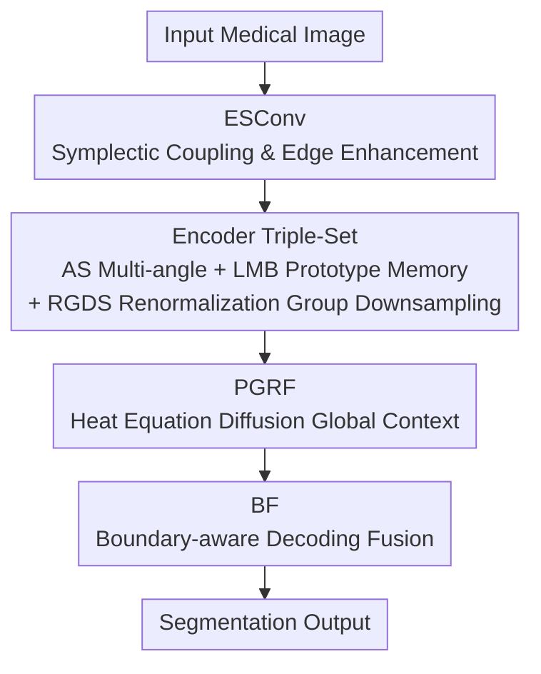

# PMRNet: Physics-informed Multi-scale Refinement Network for Medical Image Segmentation

**Conference**: CVPR 2026  
**Paper**: [CVF Open Access](https://openaccess.thecvf.com/content/CVPR2026/html/Kang_PMRNet_Physics-informed_Multi-scale_Refinement_Network_for_Medical_Image_Segmentation_CVPR_2026_paper.html)  
**Code**: https://github.com/KangBoce/PMRNet  
**Area**: Medical Imaging  
**Keywords**: Medical Image Segmentation, Lightweight Network, Physics Priors, Boundary Awareness, Symplectic Geometry

## TL;DR
PMRNet does not rely on parameter stacking. Instead, it embeds three physics priors—symplectic geometry, renormalization group, and heat diffusion—into the network architecture. With only 0.87M parameters and 3.43 GFLOPs, it outperforms SOTA models with 10–100 times more parameters across 12 medical segmentation datasets, while maintaining real-time inference at 152 FPS.

## Background & Motivation
**Background**: Medical image segmentation commonly utilizes UNet-style encoder-decoders, which later evolved by adding heavy components like attention gates and nested skip-connections. While Transformers (e.g., TransUNet with 105M+ parameters) can capture global relationships, their quadratic complexity makes them almost impossible to deploy in resource-constrained scenarios like portable devices or clinical workstations.

**Limitations of Prior Work**: Existing lightweight directions (e.g., UNeXt, MALUNet, with <2M parameters) are deployable but significantly lag in precision for small objects and complex boundaries. Compromise solutions (e.g., EMCAD, Deformable-LKA) insert large kernels or specialized attention for specific modalities, resulting in inconsistent gains across imaging modalities and slowed inference.

**Key Challenge**: The industry's habitual response to "weak inductive bias" is increasing parameters for accuracy—making accuracy and efficiency a zero-sum trade-off. The authors take the opposite approach: Is it possible to strengthen inductive bias without expanding model capacity?

**Goal**: Achieve high accuracy, low HD95 boundary quality, and real-time speed within a <1M parameter budget, maintaining stability across various imaging modalities.

**Key Insight**: The authors noted three persistent challenges in medical segmentation—boundaries only a few pixels wide being blurred by standard convolutions, downsampling losing fine-grained structures of small objects, and a lack of global context at the bottleneck. These correspond to three mature mechanisms in physics: position-momentum joint updates in Hamiltonian mechanics, coarse-graining in the renormalization group, and information diffusion in the heat equation.

**Core Idea**: Use physics priors as structural inductive biases—symplectic convolutions for boundary preservation, renormalization group downsampling for multi-scale consistency, and heat diffusion for linear-complexity global context—realizing "trading physics for parameters" to achieve high precision in a lightweight model.

## Method

### Overall Architecture
PMRNet is a U-shaped structure consisting of a three-stage encoder, a bottleneck, and a three-stage decoder. For an input medical image, the encoder abstracts features stage-by-stage. Each stage stacks four modules: ESConv/PR for feature processing, AS for multi-angle extraction, LMB for cross-scale prototype matching, and RGDS for downsampling. At the bottleneck, PR is first used for iterative refinement, followed by PGRF to inject global context via heat diffusion. The decoder performs stage-wise upsampling and uses BF for gated skip-connections based on boundary intensity. Finally, the output is projected to the category count via ECB and $1\times1$ convolution. The basic building block is ECB (Depthwise Separable Convolution + BN + SiLU), reused throughout the network.

### Key Designs

**1. ESConv: "Welding" Boundary Gradients into Feature Updates via Symplectic Coupling**

Boundary pixels are often only a few pixels wide, and standard convolutions treat interior and edge pixels equally, easily smoothing them out. The authors tested several remedies: replacing ESConv with fixed Sobel/Canny operators or learnable edge attention resulted in a total decline in IoU and HD95, with fixed operators performing worst. This indicates that treating boundaries as "independent auxiliary signals" decoupled from feature updates is ineffective. ESConv borrows the idea from Hamiltonian mechanics where position and momentum are updated jointly without loss: it treats the feature map as position $q$ and its spatial gradient as momentum $p$. It first uses grouped convolutions initialized with Sobel to calculate gradient magnitudes ($\|\nabla x\|\approx(|G_x*x|+|G_y*x|)/\sqrt{2}$ using L1 approximation for computational efficiency), forming an augmented representation $x_{\text{aug}}=[x;\hat{\nabla}x]$ before splitting back into $q,p$. The core is a coupled residual update similar to a symplectic integrator:

$$\begin{bmatrix} q' \\ p' \end{bmatrix}=\begin{bmatrix} q \\ p \end{bmatrix}+\epsilon\cdot\tanh(\mathrm{BN}(\mathrm{Conv}_{1\times1}([p;-q])))$$

where $\epsilon=0.1$ controls the step size. The anti-symmetric rearrangement $[p;-q]$ is the source of the symplectic structure (BN and tanh make it approximately symplectic, but the practical goal is preventing the gradient signal from washing out). Subsequently, a lightweight detector predicts a boundary map $D$ to modulate the coupled features: $f_{\text{boundary}}=f_{\text{coupled}}\odot(1+D)$. Thus, boundary information evolves coupled with semantic features throughout, rather than being added post-hoc, which is more stable than independent edge streams.

**2. Encoder Triple-Set: AS Multi-angle + LMB Prototype Memory + RGDS Renormalization Group Downsampling**

This cluster consists of three modules working with ESConv in the physics-informed encoder to address three minor issues. **AS (Adaptive Scale Selector)** targets the arbitrary orientation of small objects: instead of rotating features four times (12 rotation operations per forward pass), it initializes the weight tensor $W_{\text{rot}}\in\mathbb{R}^{4C\times C\times3\times3}$ with four sets of shared weights performing Rot90 on each input channel. This is equivalent to "rolling convolution" with 4× parameter sharing, reducing complexity from $O(4CHW)$ to $O(CHW)$, then fusing three branches (small/medium/large) via learned scale weights $\alpha_s$. **LMB (Lightweight Memory Bank)** stores $N$ learnable prototypes at each encoder stage (8/12/16 for stages 1-3, providing more for deep semantics). It reduces query features to $C/4$ and performs cosine similarity matching with temperature scaling (coefficient 10). Retrieved prototype features are folded back to the input via a learnable residual coefficient $\alpha$ (initial 0.1), implementing cross-scale prototype retrieval. **RGDS (Renormalization Group Downsampling)** addresses the issue in statistical physics where direct averaging during coarse-graining loses short-range correlations: before downsampling, it uses a learned coupling function $x_{\text{enhanced}}=x+\alpha\cdot(\beta(x)+\gamma(x)\odot x)$ to embed fine-grained structures into channel activations, followed by a dual-path "strided convolution for low-frequency + average pooling for high-frequency": $\mathrm{RGDS}(x)=f_{\text{low}}+\lambda\cdot f_{\text{high}}$ ($\lambda=0.3$), which is more friendly to small objects than max-pooling.

**3. PGRF: Trading Heat Equation Diffusion for Linear-Complexity Global Context**

The bottleneck requires global context to separate small objects from background clutter, but self-attention has quadratic complexity. PGRF borrows from the idea of entropy-driven diffusion in physical systems—where information naturally flows from high-certainty areas to uncertain areas—modeling feature propagation with a heat equation containing learnable coefficients: $\frac{\partial u}{\partial t}=D(x)\cdot\nabla^2 u+g(x)$, discretized via 3 explicit Euler steps:

$$u^{(k+1)}=u^{(k)}+D(x)\odot\mathcal{L}(u^{(k)})\cdot(0.5)^k+0.1\cdot g$$

The Laplacian operator is approximated by depthwise separable convolution $\mathcal{L}(u)=\mathrm{DSConv}_{3\times3}(u)-u$, and $(0.5)^k$ denotes exponential decay to prevent over-smoothing. Crucially, the diffusion coefficient $D(x)$ is calculated from local variance (high variance = high diffusion for homogeneous areas, low variance = low diffusion near boundaries), allowing certain features to propagate into blurred areas while respecting boundaries. The process is $O(N)$ and contains no attention, which is fundamental to approaching global receptive fields within a lightweight budget.

**4. BF: Boundary-aware Decoding via Boundary-Intensity Gated Skip-Connections**

In the decoding end, if skip-connections fuse encoder features indiscriminately, boundaries will be overwhelmed by regional information. BF first extracts a boundary map $B=\sigma(\mathrm{Conv}_{3\times3}(\cdots))$ from encoder features using a lightweight detector (reduced to $C/8$). It uses two parallel "Enhance" paths to process regional features $f_{\text{region}}=\mathrm{Enhance}([f_{\text{dec}}^{\uparrow};f_{\text{enc}}])$ and boundary features $f_{\text{boundary}}=\mathrm{Enhance}(f_{\text{enc}})$, finally weighting them dynamically based on spatial boundary intensity:

$$\mathrm{BF}(f_{\text{dec}},f_{\text{enc}})=f_{\text{region}}\odot(1-B)+f_{\text{boundary}}\odot B$$

This means relying more on boundary features at the edges and regional features in the interior. Removing BF in ablation studies caused the most significant drop in boundary quality among single-module deletions (HD95 increased from 13.99 to 15.50), confirming that the decoder relies on explicit boundary features to maintain spatial accuracy.

### Loss & Training
The loss is an equal-weighted combination of BCE and Dice: $\mathcal{L}=0.5\cdot\mathcal{L}_{\text{BCE}}+0.5\cdot\mathcal{L}_{\text{Dice}}$. All models were trained for 200 epochs on a single RTX 4090 with a batch size of 8. The AdamW optimizer was used with an initial learning rate of 0.001 and cosine annealing; no pre-training was used. Reported metrics are medians of 3 independent runs, selecting the best checkpoint based on the validation set. The number of iterations $T$ for the PR module is determined by the validation set (2 for stage 2, 3 for stage 3 and bottleneck); exceeding 3 steps yielded no additional gain on PH2.

## Key Experimental Results

### Main Results
On two difficult datasets containing small objects, TG3K and Clinic, PMRNet leads comprehensively with 0.87M parameters / 3.43 GFLOPs (selection of 4 representative methods):

| Dataset | Method | Params(M) | FLOPs(G) | IoU↑ | Dice↑ | HD95↓ |
|--------|------|-----------|----------|------|-------|-------|
| Clinic | TransUNet | 105.32 | 38.52 | 83.87 | 90.35 | 16.72 |
| Clinic | Deformable-LKA | 101.64 | 46.12 | 85.65 | 91.60 | 13.90 |
| Clinic | EMCAD-B2 | 26.76 | 5.60 | 84.30 | 90.47 | 14.47 |
| Clinic | **Ours (PMRNet)** | **0.87** | **3.43** | **87.25** | **92.56** | **13.13** |
| TG3K | EMCAD-B2 | 26.76 | 5.60 | 74.88 | 83.56 | 15.49 |
| TG3K | **Ours (PMRNet)** | **0.87** | **3.43** | **76.19** | **84.73** | **14.96** |

Across 12 datasets (ultrasound, endoscopy, dermoscopy, histopathology), PMRNet achieved the best IoU/Dice/HD95 in most cases. In speed comparisons on ISIC2017, it reached 152.03 FPS, exceeding EMCAD (146.41), PVT-CASCADE (104.59), TransUNet (96.37), and Deformable-LKA (24.73), making it the fastest and most accurate among recent methods.

### Ablation Study
Component ablation and two sets of module substitutions on the PH2 dataset:

| Configuration | IoU↑ | Dice↑ | HD95↓ | Description |
|------|------|-------|-------|------|
| Full PMRNet | 91.02 | 95.23 | 13.99 | Full model |
| w/o LMB | 90.61 | 94.97 | 15.61 | IoU dropped only 0.41, but HD95 rose 1.62 |
| w/o PGRF | 90.43 | 94.89 | 14.84 | Uniform degradation across four metrics |
| w/o BF | 90.24 | 94.78 | 15.50 | Worst boundary drop in single-module deletion |
| w/o All Three | 89.80 | 94.52 | 16.98 | Three modules reinforce each other |

Module substitution experiments further prove the effectiveness of physics priors: PGRF outperformed large kernels (7×7 DSConv×2), dilated convolution, and global pooling on Clinic by 1.11, 1.43, and 1.68 IoU, respectively. ESConv outperformed the closest Edge Attention by 0.93 IoU and Canny+Conv by 1.51 IoU on ISIC2017.

| Substitution (Dataset) | Variant | IoU↑ | HD95↓ |
|------|------|------|-------|
| PGRF (Clinic) | Global Pooling | 85.57 | 14.36 |
| PGRF (Clinic) | **PGRF (Ours)** | **87.25** | **13.13** |
| ESConv (ISIC2017) | Canny Edge + Conv | 81.63 | 15.91 |
| ESConv (ISIC2017) | **ESConv (Ours)** | **83.14** | **13.73** |

### Key Findings
- **BF contributes most to boundary quality**: deleting it caused the worst HD95 degradation, confirming the decoder's reliance on explicit boundary features.
- **LMB preserves boundary consistency rather than regional overlap**: deleting it barely affected IoU (−0.41) but caused HD95 to jump by 1.62.
- **Synergistic effect**: the three modules are not just independently useful but mutually reinforcing. Deleting all three caused drops in IoU and HD95 greater than the sum of individual deletions.
- **Decoupling is harmful**: replacing ESConv with fixed edge operators (Sobel/Canny) performed worse than learnable edge attention, suggesting that decoupling gradient signals from feature updates is inherently detrimental.

## Highlights & Insights
- **The "trading physics for parameters" strategy is ingenious**: Symplectic geometry, renormalization group, and heat equations accurately address boundary, downsampling, and global context issues. This replaces parameter-heavy methods with structural inductive biases, making the 0.87M vs. 100M comparison very convincing.
- **Anti-symmetric rearrangement $[p;-q]$ in symplectic coupling is the highlight**: Instead of simply adding gradients as auxiliary inputs, it allows boundary momentum and feature position to evolve jointly, which explains why fixed operator substitutions failed.
- **Adaptive heat diffusion via local variance**: Diffusion is high in homogeneous areas and low in boundary areas, naturally "propagating context without blurring boundaries." This provides a transferable path for O(N) global modeling that avoids attention mechanisms, applicable to other dense prediction tasks needing lightweight global context.

## Limitations & Future Work
- The authors admit validation was only performed on 2D segmentation; future work will explore volumetric (3D) segmentation and integration with foundation models.
- While physics priors are elegant, ESConv's "approximate symplectic" nature (BN/tanh breaking strict symplectic structure) and PGRF's 3-step Euler discretization involve strong engineering approximations. The actual contribution of physics "fidelity" to final accuracy is not entirely clear, carrying a risk of misaligned interpretation and gains (⚠️ subject to the original text).
- Multiple modules introduce hand-tuned hyperparameters ($\epsilon=0.1$, temperature 10, initial $\alpha$ 0.1, $\lambda=0.3$, iterations T). While cross-modality robustness is good, the transferability of these constants is not fully analyzed.
- Validation was only done on small clinical/small-object datasets; dominance in large-scale natural images or multi-class semantic segmentation remains unknown.

## Related Work & Insights
- **vs. TransUNet / Deformable-LKA**: These rely on attention/large kernels for global context and high precision but have 100M+ parameters and slow inference. PMRNet uses heat diffusion PGRF to achieve $O(N)$ global context, obtaining higher IoU and faster FPS with 0.87M.
- **vs. UNeXt / MALUNet**: Also in the lightweight camp, but these lag in precision for small objects. PMRNet recovers boundary and multi-scale details via physics priors (ESConv+RGDS), surpassing them in accuracy with similar or smaller budgets.
- **vs. EMCAD / Rolling-UNet**: These use modality-specific modules, resulting in inconsistent gains across modalities and potential inference slowdowns. PMRNet's physics priors are universal inductive biases, remaining stable and real-time across 12 datasets.

## Rating
- Novelty: ⭐⭐⭐⭐⭐ Systematically embedding symplectic geometry, renormalization group, and heat equations into a segmentation network is novel and self-consistent.
- Experimental Thoroughness: ⭐⭐⭐⭐⭐ 12 datasets, 15 baselines, multiple module/substitution ablations, and speed comparisons provide comprehensive coverage.
- Writing Quality: ⭐⭐⭐⭐ Motivations and methods are clear, though some physical analogies use strong "strictness" terms while being engineering approximations.
- Value: ⭐⭐⭐⭐ High practical utility for resource-constrained clinical deployment; the physics-for-parameters paradigm has significant transfer potential.

<!-- RELATED:START -->

## Related Papers

- [\[CVPR 2026\] TAMER: A Tri-Modal Contrastive Alignment and Multi-Scale Embedding Refinement Framework for Zero-Shot ECG Diagnosis](tamer_a_tri-modal_contrastive_alignment_and_multi-scale_embedding_refinement_fra.md)
- [\[CVPR 2026\] From Infusion to Assimilation Distillation for Medical Image Segmentation](from_infusion_to_assimilation_distillation_for_medical_image_segmentation.md)
- [\[AAAI 2026\] FunKAN: Functional Kolmogorov-Arnold Network for Medical Image Enhancement and Segmentation](../../AAAI2026/medical_imaging/funkan_functional_kolmogorov-arnold_network_for_medical_image_enhancement_and_se.md)
- [\[CVPR 2026\] TopoSlide: Topologically-Informed Histopathology Whole Slide Image Representation Learning](toposlide_topologically-informed_histopathology_whole_slide_image_representation.md)
- [\[CVPR 2026\] SegMoTE: Token-Level Mixture of Experts for Medical Image Segmentation](segmote_token-level_mixture_of_experts_for_medical_image_segmentation.md)

<!-- RELATED:END -->
