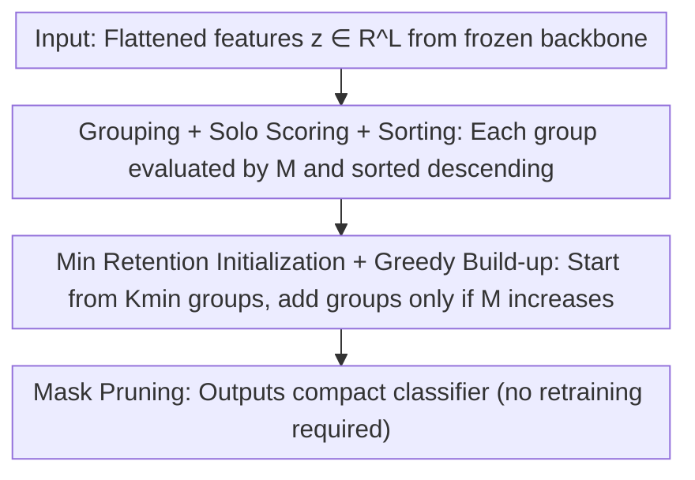

# Post-training Feature Pruning for Fundus Images Classification

**Conference**: CVPR 2026  
**Paper**: [CVF Open Access](https://openaccess.thecvf.com/content/CVPR2026/html/Pham_Post-training_Feature_Pruning_for_Fundus_Images_Classification_CVPR_2026_paper.html)  
**Code**: To be confirmed  
**Area**: Medical Imaging  
**Keywords**: Fundus image classification, feature pruning, post-training, greedy algorithm, cross-domain generalization

## TL;DR
GFP is a post-training, architecture-agnostic feature pruning framework that freezes the backbone and performs "greedy + minimum retention ratio" subset selection only on the final flattened feature vector. By removing redundant dimensions, it frequently improves AUROC/AUPRC across 5 fundus datasets while cutting 4%–96% of feature dimensions and improving cross-dataset generalization.

## Background & Motivation
**Background**: Classification of fundus images (e.g., diabetic retinopathy DR, glaucoma) currently relies on CNN / ViT / hybrid backbones for feature extraction. The backbone output is **flattened** into a high-dimensional feature vector, which is then fed into a linear classification head.

**Limitations of Prior Work**: These flattened features are saturated with redundancy—regular anatomical structures, lighting and equipment styles, and artifacts all contribute highly correlated or weak signals. True pathological clues are often subtle and easily diluted by background features. Retaining these redundant dimensions thins out discriminative signals and amplifies dataset-specific noise, leading to poor robustness across different equipment or imaging conditions. Furthermore, public fundus datasets are generally small; high-dimensional feature spaces are prone to overfitting sampling noise and site-specific characteristics, making the decision space difficult to interpret.

**Key Challenge**: Existing compression and pruning methods mostly operate at the **network weight or neuron level** (channel pruning, attention selection, low-rank decomposition, ViT token pruning). These either modify the feature extraction process itself or require retraining. Moreover, pruning tokens too early can directly delete clinically relevant micro-lesion structures. The removal of redundant coordinates in the **post-training flattened feature space** has remained largely unexplored, especially in medical imaging.

**Goal**: To select a compact and highly discriminative subset from the final feature vector without modifying the backbone architecture or retraining, while directly assessing the diagnostic relevance of each feature dimension.

**Key Insight**: Reframe "redundancy removal" as a **subset selection** problem in the feature space—deciding which dimensions to keep based on their contribution to diagnostic metrics on the training set, rather than relying on indirect proxies like weight magnitudes.

**Core Idea**: Use a training metric-guided **greedy build-up + minimum retention ratio** algorithm to perform post-training pruning on flattened features, resulting in a lightweight, interpretable feature compression framework universal across CNN/ViT/hybrid backbones.

## Method

### Overall Architecture
GFP operates entirely post-training with the backbone frozen, modifying only the flattened feature vector consumed by the classification head. Given a frozen backbone mapping an image to a flattened feature $z\in\mathbb{R}^L$ and a classification head $f_{\text{cls}}$, the goal is to select an index subset $I$ that maximizes the diagnostic metric $M$ (defined as (AUROC+AUPRC)/2 in this paper) on the training set, subject to the retention ratio constraint $|I|/L\ge r_{\min}$. The algorithm follows four steps: dividing the $L$ dimensions into small contiguous groups, scoring each group individually, sorting by score, and performing a greedy build-up starting from the minimum retention ratio. Finally, a binary mask fixes the retained dimensions, yielding a compact classifier without retraining.

### Key Designs

**1. Subset Selection Modeling for Post-training Feature Pruning: Formulating "Redundancy Removal" as Constrained Metric Maximization and Proving Hardness**

GFP formalizes pruning as: finding $I^*=\arg\max_{I}M(f_{\text{cls}}(z_I))$ subject to $|I|/L\ge r_{\min}$, where $z_I$ retains only coordinates in $I$ and sets others to zero. The authors prove this is a cardinality-constrained subset selection problem. The number of feasible subsets grows exponentially with $L$; using Stirling's approximation, the dominant combinatorial term is approximately $\binom{L}{k_{\min}}\approx 2^{LH_2(p)}/\sqrt{2\pi Lp(1-p)}$ (where $p=k_{\min}/L$ and $H_2$ is the binary entropy). The search space is $\Theta(2^L)$ when $r_{\min}\le0.5$. Its decision version is reducible to Set Cover or sparse approximation, making it NP-hard. For typical feature dimensions where $L\approx10^3$, exact solution is infeasible—justifying the need for a greedy approximation. This modeling itself is a contribution: it transforms "feature redundancy" from a vague intuition into an optimizable, provably hard objective.

**2. Grouping + Solo Scoring + Sorting: Linearizing L-dimensional Features into Sg Sortable Groups**

Greedily evaluating $L$ individual dimensions remains too expensive. GFP first slices the flattened vector into $S_g=\lceil L/n\rceil$ contiguous small groups (where group size $n$ is a hyperparameter). For each group, a **solo score** is calculated—zeroing out all other groups and evaluating the training set metric $u_i=M(f_{\text{cls}}(z_{G_i}))$. These groups are then sorted into a sequence $(G_{\pi(1)},\dots,G_{\pi(S_g)})$ in descending order of their solo scores. This step serves as the "scorecard" for the subsequent greedy process: groups with high solo scores are prioritized. Since backbone features are pre-cached and each evaluation involve only masking and a fixed classification head pass, the total cost for solo scoring is $\Theta(NCL)$ (where $N$ is samples and $C$ is classes)—replacing exponential search with a linear scan of $S_g$ groups. Group size $n$ balances granularity against overhead: larger $n$ reduces group count and speeds up evaluation but results in coarser pruning.

**3. Greedy Build-up under Minimum Retention Ratio: Iterative Addition starting from Kmin to Find Improvement**

To prevent over-pruning that might bias towards the training set, GFP initializes based on a minimum retention ratio: retaining at least $K_{\min}=\max(1,\lceil r_{\min}L/n\rceil)$ groups (specifically, the top $K_{\min}$ ranked groups). Let $I_{\text{curr}}$ be the initial subset and its metric. Subsequently, groups are **added one by one** according to their sorted order starting from the $(K_{\min}+1)$-th group. After adding each group, the metric is re-evaluated: $I^*=\arg\max_{t\ge K_{\min}}M(f_{\text{cls}}(z_{\{G_{\pi(1)},\dots,G_{\pi(t)}\}}))$. The optimal subset is updated only when the metric improves. This step naturally achieves "redundancy removal without accuracy loss": group addition stops contributing to the subset once gains cease, effectively identifying the elbow point above the retention lower bound. The build-up involves at most $S_g-K_{\min}$ evaluations, with a total time complexity of $\Theta(NCL^2/n)$—quadratic relative to $S_g\approx L/n$, but still polynomial and manageable compared to the exponential cost of exact search. Finally, the selected $I^*$ is applied as a binary mask to the classification head input, resulting in a compact classifier $f'_{\text{cls}}$ ready for evaluation on validation/test sets without any retraining.

### Loss & Training
GFP is inherently **training-agnostic** (backbone is frozen, no retraining), involving only repeated metric evaluations on the training set. Backbones (EfficientNetV2 / ViT / CoAtNet-2) are first fine-tuned on fundus data using ImageNet pre-trained weights (50 epochs, batch 8, single A6000; EfficientNetV2 uses Adam with lr 1e-4, while ViT/CoAtNet use AdamW with lr 1e-5) before pruning. Two hyperparameters, $n$ (group size) and $r_{\min}$ (minimum retention ratio), are selected via grid search on the validation set ($n\in\{1,\dots,256\}$, $r_{\min}\in\{0,\dots,0.9\}$).

## Key Experimental Results

### Main Results
5 fundus datasets (DDR/Messidor-2 for DR, PAPILA for Glaucoma, ODIR multi-label, RETINA multi-class) × 3 backbones were used to compare no pruning, MP (Magnitude Pruning), L1, and ViT-specific token pruning (TRAM/LTMP). Representative results (AUROC/AUPRC, %):

| Backbone / Method | DDR | Messidor-2 | PAPILA | RETINA |
|------|------|------|------|------|
| EfficientNetV2 | 91.04/92.15 | 87.66/86.38 | 81.33/71.21 | 77.85/58.38 |
| EfficientNetV2 + MP | 91.00/92.11 | 87.64/86.37 | 81.42/72.26 | 73.57/49.30 |
| EfficientNetV2 + **GFP** | **91.25/92.45** | **88.62/87.59** | 81.21/74.02 | **79.10/60.50** |
| CoAtNet | 95.17/96.60 | 89.49/90.95 | 88.25/80.70 | 92.61/85.56 |
| CoAtNet + **GFP** | **96.73/97.37** | **89.61/91.20** | **89.42/84.43** | 93.08/86.43 |
| ViT | 91.33/92.38 | 85.29/85.44 | 86.83/79.27 | 90.75/83.16 |
| ViT + **GFP** | **91.55/92.67** | **85.36/85.80** | **87.33**/77.43 | **92.00**/83.01 |

GFP achieved the best performance in most settings within each backbone and was able to remove a significant number of dimensions (e.g., CoAtNet on Messidor-2 reduced from 1024 to 32, a 96% reduction). The largest gains were seen on CoAtNet: DDR AUROC +1.56, AUPRC +3.73. In contrast, MP was often unhelpful or even detrimental for EfficientNetV2 (RETINA 77.85/58.38 → 73.57/49.30), and ViT-specific TRAM/LTMP performed noticeably worse than the baseline ViT on Messidor-2/PAPILA/RETINA, indicating that token-level pruning is unstable and dataset-dependent.

### Ablation Study
Metrics for feature compactness and separability before and after CoAtNet pruning (Definitions: **Intra-class variance** for compactness, lower is better; **FDR** Fisher Discriminant Ratio = inter-class variance / intra-class variance, higher is better; **Silhouette** coefficient for cluster cohesion and separation, higher is better):

| Metric | DDR | Messidor | PAPILA | REFUGE |
|------|------|------|------|------|
| Intra-var Pre-pruning↓ | 126.08 | 126.70 | 196.04 | 259.97 |
| Intra-var Post-pruning↓ | **34.79** | **38.22** | **8.41** | **126.72** |
| FDR Pre-pruning↑ | 1.56 | 0.40 | 0.20 | 0.70 |
| FDR Post-pruning↑ | **2.04** | **0.44** | **0.37** | **0.84** |
| Silhouette Pre-pruning↑ | 0.49 | 0.25 | 0.19 | 0.20 |
| Silhouette Post-pruning↑ | **0.55** | **0.28** | **0.26** | **0.23** |

Cross-dataset evaluation (DDR↔Messidor-2, AUROC/AUPRC) also demonstrated improved generalization:

| Backbone | DDR→Messidor-2 | Messidor-2→DDR |
|------|------|------|
| EfficientNetV2 | 77.38/75.44 (2152 dim) | 80.83/82.60 (2152 dim) |
| EfficientNetV2 + GFP | 77.17/75.50 (2104 dim) | **82.99/85.14** (1824 dim) |
| ViT | 69.19/69.01 (768 dim) | 72.54/74.95 (768 dim) |
| ViT + GFP | **71.70/70.37** (256 dim) | **73.02/75.44** (416 dim) |
| CoAtNet + GFP | **79.88/81.86** (103 dim) | **77.77/83.49** (32 dim) |

### Key Findings
- Post-pruning intra-class variance dropped significantly (e.g., PAPILA 196.04→8.41), while FDR and Silhouette indices rose consistently—proving GFP removes noise dimensions rather than destroying manifold structure, making features more compact and separable.
- The largest cross-domain improvement was seen for Messidor-2→DDR using EfficientNetV2: AUROC +2.16, AUPRC +2.54, suggesting removed dimensions were largely dataset-specific redundancies.
- CoAtNet showed the most stable pruning surface (maintaining high performance across a wide range of $(n, r_{\min})$), implying hybrid representations contain structured redundancies ideal for safe removal via GFP.
- Comparison with token pruning: TRAM/LTMP tended to prune clinical structures in micro-lesion or localized scenarios, generally performing worse than direct pruning on final features. This confirms that "pruning in feature space rather than the computation graph" is better suited for medical imaging.
- Grad-CAM showed that post-pruning attention aligned better with annotated lesion maps (covering large lesions more relevantly and focusing better on micro-focal lesions), indicating that redundancy removal enhances feature specificity.

## Highlights & Insights
- **Shifting the pruning battlefield from weights/tokens to the final flattened feature space** is an overlooked but highly logical entry point: it is training-agnostic, architecture-agnostic, does not change the backbone, has minimal deployment cost, and allows for direct reading of diagnostic relevance for each dimension.
- **The combination of NP-hard proof and greedy build-up is solid**: by first formulating the intuitive problem as a provably hard subset selection problem and then providing a polynomial approximation via minimum retention + iterative gain checks, the theory and practice are cleanly linked.
- **The counter-intuitive conclusion that "removing features increases accuracy and robustness" is transferable**: in small-sample, multi-site medical classification, redundancy in high-dimensional features often represents dataset-specific noise. The strategy of post-training feature pruning can be extended to other high-dimensional, small-data scenarios for generalization enhancement.

## Limitations & Future Work
- The authors acknowledge: while training-agnostic regarding the backbone, the method requires repeated metric evaluations on the training set, which may be costly for extremely large datasets. Furthermore, evaluating groups independently greedily does not guarantee a global optimal subset.
- GFP only prunes the final flattened features and does not enforce sparsity in intermediate layers; thus, it **reduces feature dimensionality but not backbone inference overhead**—it optimizes the representation redundancy and classification head, not total computation.
- Fixed group sizes and minimum retention ratios are determined via grid search; adaptive or data-driven grouping strategies might perform better.
- The assumption of contiguous groups assumes that the adjacency of feature dimensions is meaningful, which might not hold for certain backbone flattening patterns (⚠️ subject to original text). Note: the paper contains a typo once referring to the method as "CFP"; the main text consistently uses GFP.

## Related Work & Insights
- **vs. Channel Pruning / Network Slimming (MP, L1)**: These operate at the weight/neuron level, requiring retraining and altering the feature extraction process. GFP is entirely post-training, targets flattened features, and outperforms MP/L1 which are often unstable or detrimental on fundus datasets.
- **vs. ViT Token Pruning (TRAM/LTMP)**: Token-level pruning operates within the model's computation graph. Pruning too early can delete micro-lesions and clinical structures, leading to poor performance on medical small targets. GFP prunes final features, avoiding this risk.
- **vs. DeepFS etc. for High-dim Feature Selection**: DeepFS focuses on original input features, whereas GFP targets post-training deep internal representations and is training-agnostic and backbone-universal.

## Rating
- Novelty: ⭐⭐⭐⭐ Post-training flattened feature pruning is a neglected perspective; the combination of modeling and greedy search is clear, though the greedy build-up algorithm itself is relatively traditional.
- Experimental Thoroughness: ⭐⭐⭐⭐ 5 datasets × 3 backbones × multiple baselines, including cross-domain, feature separability, and Grad-CAM analyses.
- Writing Quality: ⭐⭐⭐⭐ Motivation and complexity derivations are well-explained, though typos (GFP/CFP) occur and some hyperparameter justifications are brief.
- Value: ⭐⭐⭐⭐ Training-agnostic, architecture-agnostic, improves generalization; highly practical for clinical small-data scenarios with transferable insights.

<!-- RELATED:START -->

## Related Papers

- [\[AAAI 2026\] WDT-MD: Wavelet Diffusion Transformers for Microaneurysm Detection in Fundus Images](../../AAAI2026/medical_imaging/wdt-md_wavelet_diffusion_transformers_for_microaneurysm_detection_in_fundus_imag.md)
- [\[CVPR 2026\] Dual-Level Hypergraph Generation for Addressing Feature Scarcity in Whole-Slide Image Classification](dual-level_hypergraph_generation_for_addressing_feature_scarcity_in_whole-slide_.md)
- [\[CVPR 2026\] FBTA: Enabling Single-GPU End-to-End Gigapixel WSI Classification with Feature Bridging and Translation Alignment](fbta_enabling_single-gpu_end-to-end_gigapixel_wsi_classification_with_feature_br.md)
- [\[CVPR 2026\] Virtual Immunohistochemistry Staining with Dual-Aligned Multi-Task Feature Guidance](virtual_immunohistochemistry_staining_with_dual-aligned_multi-task_feature_guida.md)
- [\[CVPR 2026\] MedMO: Grounding and Understanding Multimodal Large Language Model for Medical Images](medmo_grounding_and_understanding_multimodal_large_language_model_for_medical_im.md)

<!-- RELATED:END -->
