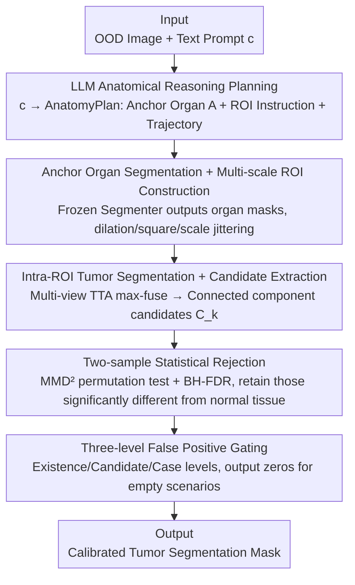

# R2-Seg: Training-Free OOD Medical Tumor Segmentation via Anatomical Reasoning and Statistical Rejection

**Conference**: CVPR 2026  
**Paper**: [CVF Open Access](https://openaccess.thecvf.com/content/CVPR2026/html/Shen_R2-Seg_Training-Free_OOD_Medical_Tumor_Segmentation_via_Anatomical_Reasoning_and_CVPR_2026_paper.html)  
**Code**: To be confirmed  
**Area**: Medical Imaging  
**Keywords**: Tumor Segmentation, Out-of-Distribution Generalization, Training-Free, Test-Time Adaptation, Statistical Hypothesis Testing

## TL;DR
R2-Seg is a **fully parameter-free** training-free framework that utilizes a two-step "Reason-and-Reject" approach. It first employs an LLM for anatomical reasoning to plan Regions of Interest (ROIs), then applies two-sample statistical testing (MMD² + FDR control) to filter candidates generated by a frozen foundation model (BiomedParse) within the ROIs. This suppresses false positives in Out-of-Distribution (OOD) tumor segmentation, simultaneously improving Dice, specificity, and sensitivity across multi-center and multi-modal tumor datasets.

## Background & Motivation
**Background**: Promptable medical segmentation has evolved from SAM and MedSAM to text-driven models like BiomedParse, which can perform unified segmentation, detection, and recognition using natural language prompts without expert intervention.

**Limitations of Prior Work**: Tumors are "abnormal tissues" characterized by irregular shapes, vast size scales (millimeters to centimeters), and diverse intensities. Intra-class spatial heterogeneity across different scanners, protocols, and populations causes severe OOD shifts. Under OOD scenarios, BiomedParse tends to **over-predict the foreground**, often segmenting the entire organ containing the tumor rather than the tumor itself. This leads to surging false positives (e.g., reaching 100% sensitivity but 0% specificity on prostate, cervix, uterus, and bladder), causing overdiagnosis, patient anxiety, and extra financial burdens.

**Key Challenge**: Addressing OOD typically relies on fine-tuning or Test-Time Adaptation (TTA), but medical data is scarce and annotations are expensive. Fine-tuning foundation models on small tumor sets can lead to **catastrophic forgetting**, harming generalization. Meanwhile, standard TTA (entropy minimization, self-supervised test-time training) only calibrates normalization layers while still producing many small false positives, and requires access to model architecture or parameters—which is often unavailable in many deployment scenarios. Thus, the problem becomes: **Can a foundation model be adapted to OOD tumor segmentation without structural changes or parameter updates?**

**Goal**: The objective is decomposed into two tasks: (1) Enhancing the separability of OOD visual embeddings (preventing foreground/background boundary confusion); (2) Calibrating decision boundaries to reject over-predicted false positives.

**Key Insight**: The authors start from embedding separability. In-distribution, visual embeddings are separable and text embeddings ground effectively to the foreground. In OOD, embeddings are difficult to separate and boundaries shift, causing background details to be misidentified as tumors. Therefore, two strategies are applied: using **anatomical reasoning to restrict the search within reasonable ROIs** (restoring separability), and utilizing **statistical testing to reject candidates** that show no significant difference from normal tissue (calibrating boundaries).

**Core Idea**: Implementing the "Reason-and-Reject" principle as a **purely training-free** (gradient-free, no parameter updates) TTA framework—LLM planning + localized prompting + statistical rejection. This is naturally compatible with zero-update test-time augmentation and avoids catastrophic forgetting.

## Method

### Overall Architecture
R2-Seg consists of three serial stages: **Reason (Reasoning Planning)** where an LLM translates free-text cancer types (e.g., "bladder tumor") into a structured AnatomyPlan—anchoring organs, ROI geometric rules, and reasoning trajectories; a frozen segmenter first extracts normal organs to generate multi-scale ROIs. **Segment (Localized Segmentation & Candidate Extraction)** prompts BiomedParse only within these ROIs, combined with multi-view test-time augmentation, to generate probability maps through max-fusion, followed by thresholding and connected component decomposition to obtain candidate regions $\{C_k\}$. **Reject (Statistical Rejection)** performs two-sample testing (MMD² permutation test + BH-FDR control) for each candidate against normal organ features, retaining only those significantly different from normal tissue, followed by a three-level false positive gate for empty mask scenarios. The entire pipeline involves no parameter updates.

### Key Designs

**1. LLM Anatomical Reasoning Planning and ROI Construction: Restricting Over-segmentation to Rational Regions**

Under OOD conditions, BiomedParse visual embeddings are hard to separate, leading to misclassification of large background areas as tumors. R2-Seg uses an LLM planner $\Pi$ to map the text prompt $c$ to $\Pi(c) \to (A, I_{ROI}, r)$: anchor organ set $A$, ROI geometric instructions $I_{ROI}$ (including padding $\rho$, scale jitter set $\Sigma$, and square constraints), and reasoning trajectory $r$. For each anchor organ $a$, the frozen segmenter produces a probability map $P_a = f_\theta(I; c_a, \tau_a)$ and binary mask $M_a = \mathbb{1}\{P_a \ge \tau_a\}$. The axis-aligned bounding box $B_0$ is taken from the union $M^* = \bigcup_a M_a$, and multi-scale square ROIs with padding are generated:
$$B_\sigma = \text{Square}\big(\text{Dilate}(B_0, \lceil\rho/s\rceil\cdot\sigma)\big),\quad \sigma\in\Sigma$$
where $s$ is the in-plane pixel spacing (mm/pixel). Each $B_\sigma$ is cropped as input for subsequent inference. The key is that prompts always fall within the **distribution of known anatomical entities** (ensuring stable organ segmentation) while allowing compositional reasoning for unseen lesions.

**2. Intra-ROI Tumor Segmentation and Multi-view Candidate Extraction: Localization + TTA Integration**

Within each ROI, the frozen segmenter performs multi-view test-time augmentation and max-fuses results back to original resolution:
$$\bar P = \max_{g\in G}\big[\text{Inv}(g)\circ f_\theta(g(I|_{B_\sigma}); c_{tumor}, \tau_{tumor})\big]$$
where $G=\{g_{id}, g_{lr}, g_{tb}\}$ represents identity, left-right flip, and top-bottom flip transformations, and $\text{Inv}(g)$ maps predictions back to original coordinates. Thresholding yields $M_{tumor} = \mathbb{1}\{\bar P\ge\tau_{tumor}\}$, and connected component decomposition $\{C_k\} = \text{Conn}(M_{tumor})$ extracts spatially disjoint candidates. Localization excludes irrelevant backgrounds, and TTA reduces single-view uncertainty, providing a clean candidate set for statistical rejection.

**3. Two-Sample Statistical Rejection and FDR Control: Deciding Retention via Significance Ratios**

Core to the method is learning to reject false positives and reshaping decision boundaries. For each candidate $C_k$, pixel-level features $X=\{\phi(I|_{C_k})\}$ are compared against normal organ mask features $Y=\{\phi(I|_{M^*})\}$ using a non-parametric two-sample test ($\phi$ represents instance-level percentile-normalized intensity within the ROI). Under the null hypothesis $H_0: P_X = P_Y$, the unbiased squared Maximum Mean Discrepancy (with Gaussian kernel $k_\gamma(u,v)=\exp(-\|u-v\|_2^2/2\gamma^2)$) is calculated:
$$\widehat{\text{MMD}}^2 = \tfrac{1}{m(m-1)}\sum_{i\ne i'}k_\gamma(x_i,x_{i'}) + \tfrac{1}{n(n-1)}\sum_{j\ne j'}k_\gamma(y_j,y_{j'}) - \tfrac{2}{mn}\sum_{i,j}k_\gamma(x_i,y_j)$$
Permuting the pooled samples $B$ times yields a permutation p-value $p_k = \frac{|\{b: \widehat{\text{MMD}}^2_{perm,b}\ge\widehat{\text{MMD}}^2_{obs}\}|+1}{B+1}$. Benjamini–Hochberg (BH) correction controls the FDR at level $\alpha$ (sorting p-values, finding $i^*=\max\{i: p_{(i)}\le\alpha i/|K|\}$, and retaining the top $i^*$ candidates). The BH theorem guarantees that under $H_0$, the expected FDR $<\alpha$, with complexity $O(|K|\cdot B\cdot(m+n)^2)$. This transforms the determination of "true tumor candidates" from arbitrary thresholds to statistically guaranteed rejection.

**4. Three-Level False Positive Gating: Handling "Phantom" Tumor Scenarios**

Text-prompted segmenters rarely output empty masks, leading to high false positives on images without tumors. Three levels of gating are added: (L1) **Existence Gate**—calculates global max probability $p_{max}$, positive ratio $\phi$, and KS statistic $p_{KS}$ between foreground/background probabilities; if $p_{max}<\tau_{max}$, $\phi<\tau_\phi$, or $p_{KS}>\tau_{KS}$, the case is deemed negative. (L2) **Candidate-Level Gate**—filters based on area $|C_k|\ge A_{min}$, average probability $\bar P_k\ge\tau_{mean}$, and overlap ratio with organ mask $|C_k\cap M^*|/|C_k|\ge\tau_\cap$. (L3) **Case-Level Score**—$S_k = \bar P_k\sqrt{|C_k|}$, $S^*=\max_k S_k$; if $S^*<\tau_{case}$, an all-zero mask is output. This conservative posterior calibration suppresses false positive rates when negative samples predominate.

## Key Experimental Results

### Main Results
Evaluation was conducted on ten organ-specific tumor datasets (CT+MR, including OOD and in-distribution). Baselines include zero-shot BiomedParse (lower bound), fine-tuned BiomedParse-FT (upper bound), and BiomedParse-LoRA (tuning only the pixel decoder). The following table shows Dice, Sensitivity, Specificity, Accuracy, and Class-average Accuracy (CA) for five representative OOD tumor types:

| Tumor | Method | Dice | Sens. | Spec. | Acc. | CA |
|------|------|------|-------|-------|------|-----|
| Bladder | BiomedParse | 0.069 | 1.000 | 0.000 | 0.976 | 0.546 |
| Bladder | BiomedParse-LoRA | 0.578 | 0.960 | 0.456 | 0.996 | 0.677 |
| Bladder | **Ours** | 0.297 | 0.335 | 0.536 | 0.992 | **0.762** |
| Prostate | BiomedParse | 0.047 | 1.000 | 0.000 | 0.910 | 0.552 |
| Prostate | BiomedParse-LoRA | 0.428 | 0.852 | 0.434 | 0.992 | 0.555 |
| Prostate | **Ours** | **0.465** | 0.645 | 0.587 | 0.971 | **0.890** |
| Cervix | BiomedParse | 0.154 | 1.000 | 0.000 | 0.985 | 0.598 |
| Cervix | BiomedParse-LoRA | 0.485 | 0.949 | 0.359 | 0.996 | 0.686 |
| Cervix | **Ours** | 0.355 | 0.299 | 0.632 | 0.993 | **0.777** |

> Note: BiomedParse's "100% Sensitivity / 0% Specificity" across multiple OOD types is a typical failure mode where the entire organ is segmented as a tumor. Ours (R2-Seg) sacrifices some sensitivity to achieve significantly higher specificity and CA, indicating more calibrated decision boundaries. On difficult cross-domain tasks like liver/pancreas, Ours achieves relative gains of 10–30% in Dice and CA.

### Ablation Study
The paper supports the value of each mechanism using full-slice quantification and FROC trade-offs rather than a standard module-wise ablation table:

| Evaluation/Comparison | Key Result | Description |
|-----------|---------|------|
| Full-slice Quant. (Table 2) | Ours leads in Specificity and CA | Reasoning planning + statistical rejection jointly calibrate boundaries |
| FROC Sensitivity-FP Trade-off | Maintains >80% Sensitivity @10 FP/scan under aggressive rejection | Rejection phase provides favorable operating regions rather than just suppressing positives |
| Forgetting Eval (AMOS22/M&Ms) | Fine-tuned models suffer catastrophic forgetting on abdominal organs | Ours does not update weights, naturally avoiding forgetting |

### Key Findings
- **Over-prediction is the primary OOD pathology**: BiomedParse's 0% specificity proves the issue is not "failing to find the tumor" but "finding too much"; R2-Seg's statistical rejection and three-level gating directly address this.
- **Training-free prevents forgetting**: While fine-tuning/LoRA improves Dice, they cause catastrophic forgetting of normal organ segmentation (most severe in the liver due to tumor sparsity); R2-Seg avoids this by keeping weights frozen.
- **Sensitivity-Specificity is an intentional trade-off**: R2-Seg's sensitivity in bladder/cervix is lower than the baseline, but the resulting high specificity and CA provide a safer operating point for clinical scenarios where overdiagnosis must be minimized.

## Highlights & Insights
- **Integrating statistical hypothesis testing into segmentation post-processing**: Using MMD² two-sample testing and BH-FDR control to "reject candidates" provides a statistically principled criterion for false positive suppression (expected FDR $<\alpha$ under $H_0$), which is far more elegant than simple thresholding and applicable to any training-free calibration for over-prediction.
- **LLM as an anatomical planner rather than a segmenter**: The LLM is strictly responsible for translating free-text cancer types into "anchor organs + ROI rules," anchoring prompts to known in-distribution anatomy and letting the frozen segmenter execute. It cleverly uses linguistic priors to constrain visual search space.
- **Fully zero-parameter update TTA paradigm**: It is compatible with zero-update test-time augmentation, requires no access to model architecture, and avoids catastrophic forgetting, making it highly suitable for deploying black-box foundation model APIs.

## Limitations & Future Work
- Significant drop in sensitivity is a concern: Sensitivities for bladder (0.335) and cervix (0.299) are quite low; the clinical risk of missing tumors must be carefully evaluated—this is the cost of high specificity.
- Heavy reliance on the quality of LLM planning and anchor organ segmentation: If the LLM provides incorrect anchor organs or the frozen segmenter fails to identify normal organs, ROI construction and the "normal tissue reference" for statistical testing will both fail.
- The statistical feature $\phi$ uses instance-level normalized intensity, which is relatively simple; for tumors with weak intensity contrast, MMD² may fail to distinguish between normal and abnormal tissue.
- The pipeline involves multiple hyperparameter thresholds ($\tau_{max}, \tau_\phi, \tau_{KS}, \tau_{mean}, \tau_\cap, \tau_{case}$, etc.), potentially increasing tuning costs and affecting cross-dataset robustness.

## Related Work & Insights
- **vs. BiomedParse (Direct Zero-shot)**: Using the same frozen backbone, R2-Seg adds reasoning planning and statistical rejection to correct over-prediction, raising specificity from 0 to over 0.5.
- **vs. BiomedParse-FT / LoRA (Fine-tuning)**: Fine-tuning improves Dice but causes catastrophic forgetting of normal organs; R2-Seg achieves zero-forgetting by not moving weights, albeit with more conservative sensitivity.
- **vs. Traditional TTA (Entropy Minimization / TTT)**: Traditional methods update normalization layers and require architecture access while still producing small false positives; R2-Seg is purely gradient-free, black-box friendly, and uses statistical tests to explicitly suppress false positives.

## Rating
- Novelty: ⭐⭐⭐⭐⭐ First to combine LLM anatomical planning and two-sample statistical rejection for purely training-free OOD tumor segmentation.
- Experimental Thoroughness: ⭐⭐⭐⭐ Ten multi-modal datasets + FROC + forgetting evaluation, though missing standard module-by-module ablation and sensitivity costs are high.
- Writing Quality: ⭐⭐⭐⭐ Clear mapping between motivation and mechanism, complete formulas, though some gating parts are hyperparameter-heavy.
- Value: ⭐⭐⭐⭐ Practical for black-box foundation model calibration and suppressing clinical overdiagnosis.

<!-- RELATED:START -->

## Related Papers

- [\[CVPR 2026\] PGR-Net: Prior-Guided ROI Reasoning Network for Brain Tumor MRI Segmentation](pgr-net_prior-guided_roi_reasoning_network_for_brain_tumor_mri_segmentation.md)
- [\[CVPR 2026\] VoxTell: Free-Text Promptable Universal 3D Medical Image Segmentation](voxtell_free-text_promptable_universal_3d_medical_image_segmentation.md)
- [\[AAAI 2026\] Training-Free Policy Violation Detection via Activation-Space Whitening in LLMs](../../AAAI2026/medical_imaging/training-free_policy_violation_detection_via_activation-space_whitening_in_llms.md)
- [\[CVPR 2026\] OSA: Echocardiography Video Segmentation via Orthogonalized State Update and Anatomical Prior-aware Feature Enhancement](osa_echocardiography_video_segmentation_via_orthogonalized_state_update_and_anat.md)
- [\[AAAI 2026\] MIRNet: Integrating Constrained Graph-Based Reasoning with Pre-training for Diagnostic Medical Imaging](../../AAAI2026/medical_imaging/mirnet_integrating_constrained_graph-based_reasoning_with_pre-training_for_diagn.md)

<!-- RELATED:END -->
