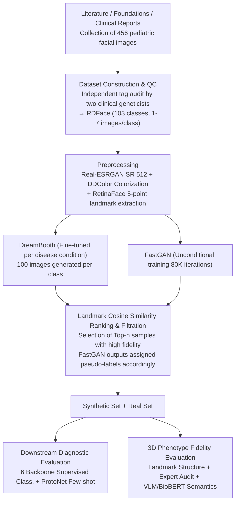

# RDFace: A Benchmark Dataset for Rare Disease Facial Image Analysis under Extreme Data Scarcity and Phenotype-Aware Synthetic Generation

**Conference**: CVPR 2026  
**arXiv**: [2604.03454](https://arxiv.org/abs/2604.03454)  
**Code**: [GitHub](https://github.com/Kkathyf/RDFace)  
**Area**: Medical Imaging / Facial Analysis / Rare Disease Diagnosis  
**Keywords**: Rare disease facial recognition, Extreme data scarcity, Synthetic data augmentation, Phenotype alignment, DreamBooth

## TL;DR

Constructed RDFace, a standardized benchmark dataset containing 456 pediatric facial images covering 103 rare genetic diseases. This work systematically investigates the effectiveness of phenotype-aware synthetic data augmentation (DreamBooth/FastGAN) for diagnosis under ultra-low sample conditions, demonstrating that DreamBooth augmentation improves diagnostic accuracy by up to 13.7% in extreme low-data scenarios.

## Background & Motivation

Rare diseases (RD) affect approximately 350 million people worldwide, with over 10,000 identified types. Diagnosis faces significant challenges:
- **Diagnostic Delay**: European studies show that 25% of rare disease patients wait 5-30 years for a correct diagnosis after symptom onset.
- **Facial Phenotype Value**: Many genetic syndromes exhibit unique craniofacial phenotypes during childhood, making facial analysis a promising non-invasive diagnostic clue.
- **Limitations of Prior Work**: (1) Lack of standardized benchmark datasets; (2) Existing methods typically focus on fewer than 15 syndromes with sufficient samples (hundreds of images per class), failing to address ultra-low sample scenarios; (3) High similarity between different disease phenotypes increases the difficulty of differentiation.

RDFace aims to fill this gap—**with an average of only 4.4 samples per disease category**—reflecting the data constraints of real clinical scenarios.

## Method

### Overall Architecture

RDFace is essentially a "dataset + evaluation protocol" designed to address the core problem: whether synthetic data augmentation can rescue rare disease facial diagnosis under extreme scarcity (averaging 4.4 images per class). The pipeline begins with data collection and quality control to build the benchmark, followed by preprocessing and dual-path synthetic augmentation (DreamBooth / FastGAN). Samples are filtered using landmark similarity and integrated back with real data. Finally, two evaluation tracks are conducted: downstream diagnostic accuracy (supervised classification with 6 pretrained backbones + ProtoNet few-shot) to measure "utility," and a three-dimensional phenotype fidelity assessment to understand "mechanism."

### Key Designs

**1. Dataset Construction and Quality Control: Ensuring Label Credibility under Extreme Scarcity**

The bottleneck in rare disease facial data is not the absence of images, but that images are scattered across literature, hospital foundations, and clinical reports with inconsistent labeling quality. RDFace collected 456 continent-balanced pediatric facial portraits (covering 46 countries) from peer-reviewed literature and verified reports, each with standardized metadata (genetic associations, abbreviations, Orphanet codes), ranging from 1-7 images per class with a mean age of 6.36 years. A critical step involved two clinical geneticists independently auditing the rationality of each image-label association, moving quality control to the ingestion stage to ensure all subsequent evaluations are based on trustworthy labels.

**2. Phenotype-Aligned Synthetic Augmentation Pipeline: Preserving Disease-Specific Craniofacial Phenotypes**

The greatest risk of synthetic augmentation is generating images that "look like faces but lose disease features," thereby diluting specific signals. The pipeline uses Real-ESRGAN to upscale real images to $512 \times 512$ and DDColor for colorization. Subsequently, a DreamBooth model is fine-tuned independently for each disease using "a child with [disease_abbr] disease" as the text prompt, generating 100 images per class. FastGAN is trained unconditionally for 80K iterations. The innovation lies in the filtration stage: synthetic images are ranked by cosine similarity of 5-point facial landmarks against the real class prototype. Only samples with high phenotype fidelity are retained, and unlabeled FastGAN outputs are assigned pseudo-labels based on this ranking. Explicitly setting "phenotype alignment" as a similarity threshold explains why gains stem from fidelity rather than sheer volume.

**3. Three-Dimensional Phenotype Fidelity Evaluation: Cross-Verifying Disease Features via Geometric, Clinical, and Semantic Layers**

Since classification improvements alone do not explain what synthetic images preserve, the paper employs a three-dimensional protocol. ① Geometric: Calculating a $5 \times 5$ Euclidean distance matrix of landmarks per image and measuring cosine similarity with the mean matrix of real intra-class images to quantify craniofacial alignment. ② Clinical: Two doctors used standardized forms to independently judge if synthetic images were "reasonable" for their labels; 62-76% of DreamBooth images were deemed reasonable (Cohen's $\kappa=0.65$), compared to only 2-38% for FastGAN. ③ Semantic: Using Qwen2.5-VL and LLaVA-NeXT to write diagnostic clinical reports for real and synthetic images, followed by BioBERT embeddings to calculate report similarity. Real-synthetic similarity reached 0.84, approaching the real-real baseline. These layers confirm that gains are driven by phenotype fidelity.

### Loss & Training

- Standard Classification: 75%/25% stratified split, 5-fold cross-validation, Cross-Entropy loss.
- Prototypical Networks: 600 training episodes, 100 validation episodes, Euclidean distance metric.
- DreamBooth augmentation selected by Top-N landmark similarity ($N \in \{1000, 2000, 4000, 6000\}$).

## Key Experimental Results

### Main Results

Supervised Classification (Real Data Only):

| Backbone | Top-1 | Top-5 | Top-10 | Top-30 |
|----------|-------|-------|--------|--------|
| DenseNet-169 | **15.93%** | **33.63%** | **43.01%** | **64.42%** |
| Swin-T | 14.34% | 26.19% | 35.93% | 58.41% |
| VGG-16 | 11.68% | 29.91% | 38.41% | 60.88% |
| FaceNet | 9.91% | 24.60% | 34.87% | 58.23% |
| ResNet-152 | 6.90% | 18.58% | 28.50% | 54.34% |
| CLIP | 3.01% | 12.74% | 19.12% | 42.30% |

Standard Classification after DreamBooth Augmentation (Top-1000):

| Backbone | Real only | Real+DB | Real+FG | Real+DB+FG |
|----------|-----------|---------|---------|------------|
| DenseNet | 15.93% | **17.52%** | 13.27% | 16.46% |
| VGG | 11.68% | **16.64%** | 7.26% | 12.92% |
| FaceNet | 9.91% | **15.04%** | 6.55% | 10.97% |
| CLIP | 3.01% | **9.03%** | 1.42% | 4.25% |

### Ablation Study

DreamBooth Scaling Effect (DenseNet Top-1):
- Real only: 15.93% → Top-1000: 17.52% → Top-4000: ~20% → Top-6000: **21.06%** (+5.13%).
- FastGAN showed a continuous downward trend, proving performance gains are driven by phenotype fidelity, not data volume.

Few-Shot Learning 5-way 1-shot (Real+DB Augmentation):
- DenseNet: 26.20% → **29.88%** (+3.68%).
- Swin-T: 22.24% → **26.72%** (+4.48%).

### Key Findings

- Conditional generation (DreamBooth) consistently outperforms unconditional generation (FastGAN); the latter even degrades performance.
- Expert Review of DreamBooth images: 62-76% labeled as "reasonable," Cohen's $\kappa=0.65$ (substantial agreement); FastGAN only 2-38%.
- VLM Phenotype Reports: Real-synthetic similarity is comparable to real-real similarity, with high cross-model consistency.
- Performance gains originate from phenotype fidelity rather than simple sample volume—DreamBooth saturates at Top-6000.

## Highlights & Insights

- **Precise Problem Definition**: Focuses on extreme data scarcity (1-7 samples per class), a core pain point in rare disease AI.
- **3D Fidelity Evaluation**: Landmark structural similarity + clinical expert audit + VLM semantic consistency forms a complete evaluation framework for synthetic data quality.
- **Counter-intuitive Finding**: Unconditional GAN generation harms classification performance, highlighting the criticality of category-conditional constraints.
- **Landmark Pseudo-labeling Strategy**: Intelligently uses facial landmark similarity to assign pseudo-categories to unlabeled FastGAN outputs.

## Limitations & Future Work

- Dataset scale is still limited (456 images / 103 classes), with some classes having only 1 sample.
- Heterogeneous image sources (web searches) lead to missing demographic metadata.
- Advanced synthetic methods (e.g., ControlNet for condition control, diffusion diversity strategies) have not been explored.
- Top-1 accuracy peaks at 21.06%, indicating that 103-class ultra-low sample classification remains extremely challenging.
- Ethical Considerations: Privacy protection for pediatric facial data requires deeper discussion.

## Related Work & Insights

- **GestaltMatcher**: Scaled to hundreds of syndromes via retrieval-based matching but still requires sufficient training samples.
- **GestaltGAN**: Used for privacy-preserving facial synthesis but did not evaluate downstream diagnostic utility.
- **Insight**: The phenotype-aligned synthetic augmentation strategy can be generalized to other extreme low-sample medical imaging scenarios (e.g., rare skin or fundus diseases).

## Rating

- **Novelty**: ⭐⭐⭐⭐ — First standardized benchmark for extreme low-sample rare disease facial diagnosis + comprehensive synthetic augmentation framework.
- **Experimental Thoroughness**: ⭐⭐⭐⭐ — Six backbones, multiple augmentation settings, three-dimensional fidelity assessment; systematic experimental design.
- **Writing Quality**: ⭐⭐⭐⭐ — Clear structure, detailed dataset description, and standardized evaluation protocols.
- **Value**: ⭐⭐⭐⭐ — Provides a transparent, benchmarkable dataset and a scalable evaluation framework for rare disease AI research.

<!-- RELATED:START -->

## Related Papers

- [\[CVPR 2026\] Few-Shot Synthetic Data Generation with Diffusion Models for Downstream Vision Tasks](few-shot_synthetic_data_generation_with_diffusion_models_for_downstream_vision_t.md)
- [\[CVPR 2026\] Dual-Level Hypergraph Generation for Addressing Feature Scarcity in Whole-Slide Image Classification](dual-level_hypergraph_generation_for_addressing_feature_scarcity_in_whole-slide_.md)
- [\[CVPR 2026\] Gastric-X: A Multimodal Multi-Phase Benchmark Dataset for Advancing Vision-Language Models in Gastric Cancer Analysis](gastric-x_a_multimodal_multi-phase_benchmark_dataset_for_advancing_vision-langua.md)
- [\[CVPR 2026\] BiOTPrompt: Bidirectional Optimal Transport Guided Prompting for Disease Evolution-aware Radiology Report Generation](biotprompt_bidirectional_optimal_transport_guided_prompting_for_disease_evolutio.md)
- [\[AAAI 2026\] A Disease-Aware Dual-Stage Framework for Chest X-ray Report Generation](../../AAAI2026/medical_imaging/a_disease-aware_dual-stage_framework_for_chest_x-ray_report_.md)

<!-- RELATED:END -->
