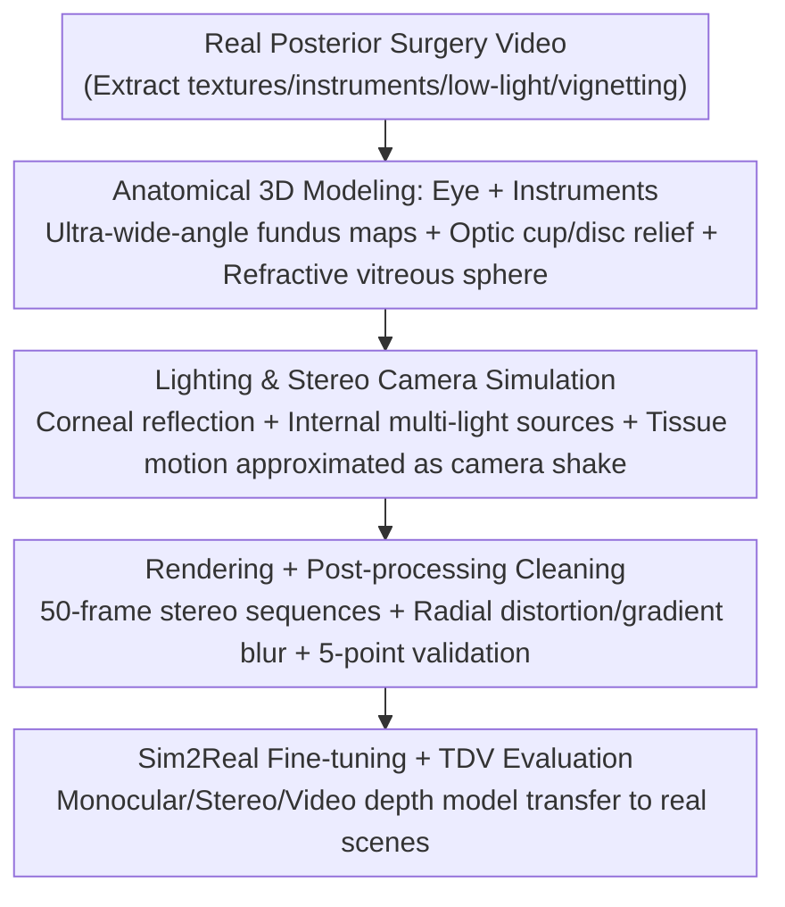

# Real2Sim2Real: RetinalDepth-64K for Depth Estimation in Posterior Segment Ophthalmic Surgery

**Conference**: CVPR 2026  
**Paper**: [CVF Open Access](https://openaccess.thecvf.com/content/CVPR2026/html/Dong_Real2Sim2Real_RetinalDepth-64K_for_Depth_Estimation_in_Posterior_Segment_Ophthalmic_Surgery_CVPR_2026_paper.html)  
**Code**: Project Page https://retinaldepth.github.io/  
**Area**: Medical Image / Depth Estimation / Synthetic Dataset  
**Keywords**: Ophthalmic Surgery, Depth Estimation, Synthetic Data, Sim2Real, Temporal Consistency

## TL;DR
To address the lack of ground truth depth data in fundus (posterior segment) microsurgery, the authors developed a Real2Sim2Real pipeline using Blender to construct RetinalDepth, the first synthetic depth dataset for posterior ophthalmic surgery (44,800 stereo pairs, 896 scenes, with pixel-level depth/normals/instrument segmentation/camera parameters). They also proposed the Temporal Depth Variance (TDV) metric to measure inter-frame stability of video depth, demonstrating that fine-tuning on this data significantly improves the generalization of monocular, stereo, and video depth models in real fundus surgical scenarios.

## Background & Motivation
**Background**: Depth estimation is the foundation for 3D reconstruction, intraoperative navigation, and augmented reality in computer-assisted surgery. Endoscopic scenarios (laparoscopy, colonoscopy, etc.) already utilize structured light (SCARED), CT (SERV-CT), and stereo matching (Hamlyn) to acquire depth ground truth, accumulating a range of real and synthetic datasets.

**Limitations of Prior Work**: There is almost no available depth ground truth for posterior segment ophthalmic surgery under a microscope. This is due to three reasons: ① The posterior surgical field is narrow and restricted, making it unsafe for structured light or CT equipment to approach delicate intraocular tissues; ② Ophthalmic stereo microscopes have extremely short baselines, leading to small parallax ranges and large stereo matching errors; ③ The only existing ophthalmic synthetic set, SMDE, only covers static anterior segment cataract surgery and lacks dynamic instrument-tissue interactions, temporal sequences, and binocular views. Consequently, depth estimation for posterior ophthalmic surgery has long faced a data drought.

**Key Challenge**: Real acquisition is neither safe nor feasible, while existing synthetic sets do not target the posterior segment or include critical annotations like stereo, temporal, or normals—creating a gap between "data accessibility" and "annotation completeness + domain relevance."

**Goal**: To create a high-fidelity synthetic dataset specifically for posterior ophthalmic microsurgery that supports training for stereo, video, and monocular depth, while verifying that "fine-tuning on synthetic data can transfer to real surgical scenarios."

**Key Insight**: Since ground truth cannot be captured directly, graphics are used to "reverse engineer" the entire acquisition chain—extracting visual features from real surgical videos (complex retinal textures, dynamic instruments, dim lighting, vignetting) and recreating them in Blender with anatomically accurate eyeball and instrument models to render pixel-perfect ground truth.

**Core Idea**: Generate synthetic data with perfect labeling via a **Real2Sim2Real** (Real → Sim → Real) closed-loop pipeline and introduce a specialized metric, TDV, to measure inter-frame stability in video scenes, bridging the Sim2Real gap from synthetic training to real-world deployment.

## Method

### Overall Architecture
The core of this work is "dataset creation + metric proposal," centered on a four-stage Real2Sim2Real pipeline: Extract key visual features from real posterior surgery videos (Real) → Perform anatomical 3D modeling of the eye and instruments in Blender with lighting and stereo camera configurations (Real2Sim) → Render stereo sequences with depth/normals/segmentation/camera parameters followed by post-processing (Sim) → Fine-tune monocular/stereo/video depth models on synthetic data for transfer back to real surgical scenes, evaluated using the new TDV metric for temporal stability (Sim2Real). The final output consists of 44,800 stereo pairs (512×512) across 896 scenes, with 50 frames per scene.

### Key Designs

**1. Real-to-Sim Anatomical 3D Modeling: Growing Real Fundus into Simulation**

Simply using tubular geometry for retinal vessels appears unrealistic, so the authors adopted a "mapping + sculpting" approach to reconstruct the posterior fundus. Using a 3D sphere as a base, **ultra-wide-angle fundus images were used as textures** mapped onto the sphere. Based on the positions of the optic cup and disc in the images, **protrusions and depressions were sculpted** onto the sphere to introduce realistic depth variations. Ten ultra-wide-angle fundus images representing different eye diseases were used to generate diverse depth maps (the paper notes this quantity's accuracy is "to be verified," ⚠️ refer to the original text). To replicate complex optical properties, a **glass sphere simulates the vitreous humor**, with randomized colors (corresponding to different aqueous humors), refractive indices, and roughness to create cross-scene optical diversity. Six types of ophthalmic instruments (grasping forceps, peeling forceps, foreign body forceps, intraocular magnets, retinal detachment hooks, and curved laser probes) were modeled with metallic reflective materials and articulated tips to simulate precise actions like grasping and peeling. This step encodes the visual and dynamic features of real surgery into renderable 3D assets.

**2. Lighting & Stereo Camera Simulation: Replicating Imaging Conditions Under a Microscope**

Imaging in posterior surgery is unique: external surgical lights hitting the cornea create strong reflections and local overexposure, obscuring retinal details, while intraocular lighting is limited and changes with instrument movement. The authors designed a lighting simulation placing a point source above the eye for **corneal reflection overexposure** and one or two sources above the retinal texture to simulate intraocular lighting, avoiding fixed lighting by introducing cross-scene perturbations in brightness and shadows. **Two cameras** generate stereo pairs to simulate the microscope's binocular view. To address the difficulty of modeling fine tissue deformation under instrument force, the authors **approximated tissue relative motion as camera motion**, applying synchronized shaking and jitter to the cameras. A **disk with a small aperture** was placed between the eyeball and camera to simulate the trans-pupillary light path, achieving the restricted field of view typical of surgery.

**3. Rendering + Post-processing Cleaning: Obtaining Pixel-perfect Labels and Ensuring Reliability**

Continuous sampling was performed in each scene, using Blender's Cycles renderer to generate **50-frame animations** (512×512). Each frame renders stereo RGB from slightly offset perspectives and outputs initial depth, normals, valid area masks, and instrument masks. Post-rendering, a strict cleaning process was applied: first, a **five-point validation** of the animation (reasonable instrument-retinal scale, proximity to retina, motion within FOV, instrument persistence, and lighting range). This was followed by targeted refinement: masking invalid depth areas, adding **radial lens distortion** using $r = 1 + k\cdot d^2$ (where $k=0.00001$ and $d=\sqrt{(x-x_{center})^2+(y-y_{center})^2}$, with coordinates remapped as $x' = x_{center}+(x-x_{center})\cdot r$) to simulate microscope defects, and applying gradient blur to soften edges (while protecting instrument clarity with masks). Finally, all were standardized to $512\times512\times3$. This resulted in 44,800 pairs of fully annotated stereo images (see Table 1, Table 2), the most comprehensive set for posterior ophthalmic microsurgery.

**4. Temporal Depth Variance (TDV): A Stability Metric for Video Depth**

Existing depth metrics focus on per-frame accuracy and do not explicitly quantify temporal stability, to which intraoperative navigation is extremely sensitive. The authors proposed **Temporal Depth Variance (TDV)**: noting that the camera and retina are relatively static while instruments move, the **depth of the static retinal background should remain constant across frames**. Unnecessary fluctuations are measured using the squared difference of depth in background regions between adjacent frames:

$$\text{TDV}_{seq} = \frac{1}{T-1}\sum_{t=1}^{T-1}\frac{1}{N_t}\sum_{p\in\mathcal{B}_t}\bigl(d_t(p)-d_{t+1}(p)\bigr)^2$$

where $T=50$ is the sequence length, $d_t(p)$ is the predicted depth of pixel $p$ at frame $t$, $\mathcal{B}_t$ is the static background region between frames $t$ and $t+1$, and $N_t=|\mathcal{B}_t|$. The background mask is the complement of the union of instrument masks: $\mathcal{B}_t = \neg(m_t \lor m_{t+1})$ with $m_t\in\{0,1\}^{H\times W}$. A lower TDV indicates higher temporal stability. This metric quantifies phenomena where a model might be accurate per-frame but exhibits jitter—for instance, VGGT, which has high per-frame accuracy, showed a high TDV, highlighting its temporal shortcomings.

## Key Experimental Results

### Main Results
The dataset was used to evaluate several SOTA depth models in zero-shot and fine-tuned settings. The following table shows **zero-shot** results on the RetinalDepth single-image test set (selected metrics, ↑ higher is better, ↓ lower is better):

| Model | Type | $\delta_{0.5}$↑ | $\delta_1$↑ | Abs Rel↓ | RMSE↓ |
|------|------|------|------|------|------|
| Depth Anything (DA) | Monocular | 0.323 | 0.591 | 0.331 | 0.108 |
| Marigold | Monocular | 0.307 | 0.587 | 0.343 | 0.112 |
| DA V2 | Monocular | 0.281 | 0.547 | 0.376 | 0.119 |
| ZoeDepth | Monocular | 0.273 | 0.428 | 75.463 | 0.223 |
| VGGT | Stereo | 0.332 | 0.612 | 0.322 | 0.107 |
| DUSt3R | Stereo | 0.006 | 0.015 | 0.833 | 0.824 |

In zero-shot settings, DA performed best among monocular models, followed by Marigold and DA V2; ZoeDepth/MoGE were weaker. In stereo, VGGT performed significantly better, while DUSt3R and MASt3R failed due to a lack of medical training data. However, even the best models exhibited high errors, signaling a clear domain gap.

The following table shows the **fine-tuned** results on the single-image test set (reported by "Full Image / Instrument" regions, selected):

| Model | Region | $\delta_1$↑ | Abs Rel↓ |
|------|------|------|------|
| VGGT (Stereo) | Full | 0.956 | 0.061 |
| DA (Monocular) | Full | 0.975 | 0.055 |
| DA V2 (Monocular) | Instrument | 0.889 | 0.097 |
| VGGT (Stereo) | Instrument | 0.339 | 93.901 |

Fine-tuning on RetinalDepth drastically improved accuracy for all models across the full image (validating the dataset's efficacy in bridging the domain gap). In the full image, stereo VGGT and monocular DA reached top performance. However, **instrument depth prediction** remained poor for stereo models even after fine-tuning (VGGT/MASt3R had extremely high errors, likely due to difficulties in establishing stereo correspondence on reflective, dynamic instrument surfaces), while monocular models (led by DA V2) performed well on instruments, highlighting the flexibility of monocular cues for fine details.

### Video Depth Estimation
Using RetinalDepth's temporal sequences, video depth was evaluated by comparing per-frame application of single-image models vs. zero-shot video-specific models. The conclusion is that **per-frame applications of fine-tuned single-image models outperform video methods in spatial accuracy, but the latter exhibit better temporal consistency.** VGGT achieved the best spatial accuracy but a high TDV (instability), confirming that TDV captures the temporal limitations of per-frame prediction.

### Key Findings
- Even strong foundation models like DA/VGGT show significant performance drops in fundus surgical scenes, proving a domain gap and the necessity of specialized datasets.
- Fine-tuning boosts full-image accuracy, but "instruments"—the fine dynamic regions—become a watershed: monocular models benefit, while stereo models struggle, leaving an open question on modeling reflective instruments in stereo.
- Spatial accuracy and temporal stability are separate axes: the most accurate per-frame models are not necessarily the most stable, a conflict quantifiable via TDV.

## Highlights & Insights
- **Reverse Acquisition Chain via Graphics**: In intraocular scenes where depth is unsafe to capture, the strategy of extracting features from real video and recreating them anatomically in Blender turns "uncapturable ground truth" into "renderable data." This is transferable to other difficult surgical scenes like the inner ear.
- **Approximating Tissue Deformation as Camera Shake**: Since retinal deformation is hard to simulate precisely, the use of synchronized camera-shaking to approximate tissue drift is a low-cost yet effective engineering trick worth adopting in other soft-tissue simulations.
- **Quantifying the Jitter with TDV**: Leveraging the prior that "the camera is fixed and the background should be static," the metric uses background depth differences across frames to measure stability, filling an overlooked gap in video depth evaluation.
- **Comprehensive Annotation Matrix**: Stereo + Depth + Normals + Segmentation + Camera Params + Temporal sequences are provided in a single set (the most complete compared to existing medical depth sets in Table 1), supporting monocular, stereo, and video models simultaneously.

## Limitations & Future Work
- **Sim-to-Real Gap Persistent**: Despite post-processing like distortion and blur, the images remain Blender renders; real-world details like blood flow, tissue translucency, and dynamic highlights are not fully replicated. Qualitative evaluation was the only option for real data (lacking ground truth).
- **Poor Instrument Depth in Stereo**: Reflective, dynamic, and slender instrument surfaces make stereo correspondence difficult, a problem not entirely solved by fine-tuning.
- **"To be verified" Parameters**: The author acknowledges that some counts (e.g., "10 ultra-wide fundus images") require further verification (⚠️ refer to original text). The alignment between simulation fidelity and real distribution requires more systematic validation.
- **TDV Dependencies**: TDV relies on "static camera + static background." Its reliability drops in scenes with significant camera movement or non-rigid background motion without compensation.
- **Future Work**: Supplementing with real annotated subsets for quantitative Sim2Real validation, introducing stronger material/reflection modeling for instruments, and extending TDV to moving camera scenarios.

## Related Work & Insights
- **vs SMDE**: SMDE only covers static anterior cataract surgery in monocular mode without temporal/normal data; this work targets the posterior segment with stereo, temporal, normal, and segmentation data.
- **vs Endoscopic Datasets (SCARED / SERV-CT / Hamlyn)**: These rely on structured light/CT for ground truth in large-FOV scenes like the abdomen; these methods are unusable in the narrow, short-baseline intraocular environment. This work bypasses physical limitations via synthetic rendering.
- **vs Foundation Models**: Foundation models drop in performance on ophthalmic surgery; this work proves that "specialized synthetic data fine-tuning" is a viable path to bridge medical domain gaps.

## Rating
- Novelty: ⭐⭐⭐⭐ First posterior ophthalmic synthetic set + Real2Sim2Real loop + TDV metric.
- Experimental Thoroughness: ⭐⭐⭐⭐ Covers monocular/stereo/video types and zero-shot/fine-tuned settings; however, real-world data lacks quantitative Sim2Real verification.
- Writing Quality: ⭐⭐⭐⭐ Clear motivation/pipeline; minor OCR noise in some equations/parameters.
- Value: ⭐⭐⭐⭐ Fills a data void in posterior ophthalmic surgery, useful for navigation, reconstruction, and training; data/metrics can be directly reused by the community.

<!-- RELATED:START -->

## Related Papers

- [\[CVPR 2026\] Depth Any Endoscopy: Towards Self-Supervised Generalizable Depth Estimation in Monocular Endoscopy](depth_any_endoscopy_towards_self-supervised_generalizable_depth_estimation_in_mo.md)
- [\[CVPR 2026\] X-PCR: A Benchmark for Cross-modality Progressive Clinical Reasoning in Ophthalmic Diagnosis](x-pcr_a_benchmark_for_cross-modality_progressive_clinical_reasoning_in_ophthalmi.md)
- [\[CVPR 2026\] EchoPOSE: 6D Pose Estimation of Sparse Echocardiograms for Left-Ventricular 3D Shape Reconstruction](echopose_6d_pose_estimation_of_sparse_echocardiograms_for_left-ventricular_3d_sh.md)
- [\[CVPR 2026\] Factorized Context Aggregation for Robust Cancer Risk Estimation via Soft Re-Ranked Retrieval and Hierarchical Anchors](factorized_context_aggregation_for_robust_cancer_risk_estimation_via_soft_re-ran.md)
- [\[CVPR 2026\] Semi-supervised Echocardiography Video Segmentation via Anchor Semantic Awareness and Continuous Pseudo-label Reforging](semi-supervised_echocardiography_video_segmentation_via_anchor_semantic_awarenes.md)

<!-- RELATED:END -->
