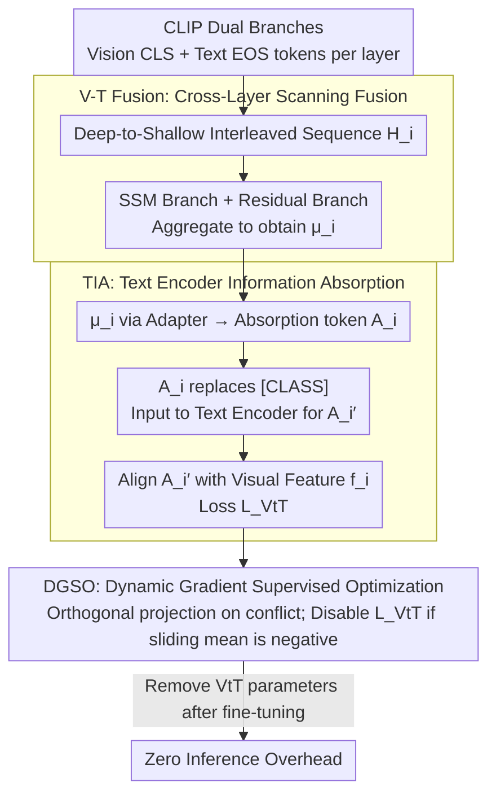

# Reclaiming Lost Text Layers for Source-Free Cross-Domain Few-Shot Learning

**Conference**: CVPR2026  
**arXiv**: [2603.05235](https://arxiv.org/abs/2603.05235)  
**Code**: [zhenyuZ-HUST/CVPR26-VtT](https://github.com/zhenyuZ-HUST/CVPR26-VtT)  
**Area**: Medical Imaging / Cross-Domain Few-Shot Learning  
**Keywords**: CLIP, Cross-Domain Few-Shot Learning, text encoder layer redundancy, vision-text fusion, state space model, gradient optimization

## TL;DR

This paper identifies "Lost Layers" in the CLIP text encoder—a phenomenon where removing certain intermediate layers actually improves performance in Source-Free Cross-Domain Few-Shot Learning (SF-CDFSL). The authors demonstrate that these layers are not redundant but are underutilized due to visual domain shifts. To address this, the VtT model is proposed to reclaim this information at both the layer and encoder levels, achieving state-of-the-art results.

## Background & Motivation

**Practical demand for SF-CDFSL**: In fields such as medical imaging and remote sensing, labeled data is extremely scarce, necessitating knowledge transfer from pre-trained models. However, source domain data is often inaccessible due to privacy concerns and computational costs, giving rise to the Source-Free CDFSL (SF-CDFSL) task.

**CLIP's cross-domain potential**: CLIP demonstrates excellent performance in downstream few-shot tasks due to its large-scale image-text alignment pre-training. Its text encoder is believed to contain knowledge better suited for cross-domain tasks.

**Discovery of "Lost Layers"**: The authors observe that under the SF-CDFSL setting, removing specific intermediate layers (e.g., layers 6-7) of the CLIP text encoder significantly improves performance. This phenomenon is consistent across various CLIP backbone versions and fine-tuning methods.

**Correcting the perception of layer redundancy**: Prior works [40, 49, 57] consider these layers redundant and suggest their removal. However, the authors find that weighting the outputs of these layers using an "Emphasize" strategy yields even better results, indicating that the information is beneficial but currently underutilized.

**Visual domain shift as the root cause**: The Lost Layer phenomenon does not exist on ImageNet (source domain) but emerges on ImageNet-R (cross-domain), proving that visual domain shifts hinder the utilization of beneficial information within the text encoder.

**Re-guiding the visual branch**: The Core Idea is not to discard Lost Layers but to reclaim wasted pre-trained textual knowledge by "teaching the vision encoder to think like the text encoder."

## Method

### Overall Architecture

VtT (teach the Vision to Think like the Text) addresses the counter-intuitive phenomenon where certain intermediate layers of the CLIP text encoder can be removed to improve performance in Source-Free cross-domain few-shot settings. The Mechanism involves activating wasted pre-trained textual knowledge by teaching the visual branch to emulate the text branch, rather than discarding "Lost Layers." As a plug-and-play fine-tuning addon, VtT consists of three modules: V-T Fusion for layer-level integration of vision and text outputs, TIA for encoder-level absorption of fused features back into the text encoder, and DGSO for dynamically balancing classification and knowledge absorption using gradient conflict signals. All VtT parameters are removed after fine-tuning, resulting in zero additional overhead during inference.

### Key Designs

**1. V-T Cross-Layer Scanning Fusion: Interleaving Vision and Text Layers for SSM-based Fusion**

To enable the visual branch to utilize information from various text layers, a mechanism is required to align both sides layer-by-layer. VtT interleaves the CLS tokens from the vision encoder and the EOS tokens from the text encoder into a sequence $H_i = (f_i^l, t_i^l, f_i^{l-1}, t_i^{l-1}, \cdots, f_i^1, t_i^1)$, scanning from deep to shallow layers. These are aggregated using a State Space Model (SSM), where a residual branch (AvgPool + MLP) is added to the SSM branch (MLP + Positional Encoding + 2-layer SSM + AvgPool) to obtain $\mu_i = \mu_i^{\text{res}} + \mu_i^{\text{ssm}}$. Ablations confirm that deep-to-shallow scanning outperforms shallow-to-deep or bidirectional approaches, and SSM (58.2) outperforms MHA (57.2), RNN (57.2), and LSTM (57.4).

**2. Text Encoder Information Absorption (TIA): Injecting Layer Knowledge into the Text Encoder for Distillation**

Layer-level fusion captures "layer details" but lacks an "encoder-wide perspective." TIA maps the fused output $\mu_i$ through a learnable Adapter into an "absorption token" $A_i$. This token replaces the [CLASS] token in the text prompt, forming $r_i' = [a][photo][of][a][A_i]$ to be fed back into the text encoder. This results in $A_i'$, which contains both layer-level details and encoder-level global knowledge. Finally, $L_{\text{VtT}}$ maximizes the cosine similarity between $A_i'$ and the visual feature $f_i$, distilling textual knowledge into visual features.

**3. Dynamic Gradient Supervised Optimization (DGSO): Utilizing Gradient Conflict Signals to Protect Classification**

The risk of adding a distillation objective is potential interference with the primary classification task. DGSO calculates the gradient cosine similarity $C_\theta$ between $L_{ce}$ and $L_{comb} = L_{ce} + \beta L_{VtT}$. If $C_\theta < 0$ (directional conflict), $G_{comb}$ is projected onto the orthogonal direction of $G_{ce}$ to ensure knowledge absorption does not degrade classification. Simultaneously, a queue of $C$ values is maintained to calculate a sliding window mean $M_e$ (length $\lambda=50$). If $M_e < 0$, $L_{VtT}$ is permanently disabled. This "correction followed by dynamic deactivation" mechanism allows the training process to adaptively decide when to incorporate textual knowledge.

### Loss & Training

$$L_{comb} = L_{ce} + \beta \cdot L_{VtT}, \quad \beta = 7$$

Where $L_{ce}$ is the standard cross-entropy classification loss, and $L_{VtT}$ is the vision-text alignment distillation loss.

## Key Experimental Results

### Main Results (5-way 1-shot, 4 CDFSL Datasets)

| Method | CropDisease | EuroSAT | ISIC | ChestX | Avg |
|---|---|---|---|---|---|
| CLIP-LoRA-Vision | 84.22 | 81.72 | 36.40 | 21.86 | 55.97 |
| **CLIP-LoRA + VtT (Ours)** | **87.00** | **85.01** | **38.20** | **22.70** | **58.23** |
| PE-Core-LoRA | 91.75 | 84.49 | 40.89 | 22.02 | 59.78 |
| **PE-Core-LoRA + VtT (Ours)** | **92.61** | **86.16** | **42.20** | **23.04** | **61.00** |

### 5-way 5-shot Results

| Method | CropDisease | EuroSAT | ISIC | ChestX | Avg |
|---|---|---|---|---|---|
| CLIP-LoRA + VtT | 97.21 | 94.58 | 56.20 | 26.42 | 68.57 |
| PE-Core-LoRA + VtT | **98.36** | **94.67** | **60.03** | **27.05** | **70.05** |

### Ablation Study

| TIA | V-T Fusion | DGSO | Avg |
|---|---|---|---|
| ✗ | ✗ | ✗ | 55.9 (baseline) |
| ✓ | ✗ | ✗ | 56.9 (+1.0) |
| ✓ | ✓ | ✗ | 57.6 (+1.7) |
| ✓ | ✗ | ✓ | 57.6 (+1.7) |
| ✓ | ✓ | ✓ | **58.2 (+2.3)** |

### Key Findings

- **Lost Layer Elimination**: Applying VtT makes the performance optimal when using the full text encoder, eliminating the phenomenon where removing layers helped (Figure 1(c)).
- **Attention Map Improvement**: VtT reduces erroneous focus on non-semantic regions while preserving valid attention, improving the cosine similarity of vision-text alignment.
- **Backbone Generalizability**: Consistent improvements are observed across CLIP, SigLip2, and PE-Core backbones.
- **Low Computational Overhead**: Compared to Maple (3.1M parameters, 205G FLOPs), VtT uses only 3.9M parameters and 148.5G FLOPs while achieving 5.1 percentage points higher performance.
- **Effectiveness of Dynamic Loss Combining**: Performance reaches 58.2 Avg with DLC, dropping to 57.2 without it.

## Highlights & Insights

- **Novel Insight**: The paper is the first to systematically analyze the "Lost Layer" phenomenon in CLIP's text encoder, proving the cause is visual domain shift rather than information redundancy.
- **Elegant Methodology**: VtT serves as a training-only plugin that is completely removed during inference, ensuring zero extra overhead.
- **Sophisticated DGSO**: The gradient correction and dynamic stopping mechanism adaptively balance classification and knowledge absorption without manual schedule tuning.
- **Thorough Evaluation**: Experiments cover 4 CDFSL datasets plus 10 Meta-datasets, 3 backbones, and multiple fine-tuning baselines.

## Limitations & Future Work

- While inference is overhead-free, the training phase requires extra computation for SSM forward passes and dual gradient calculations ($L_{ce}$ and $L_{comb}$).
- Hyperparameters $\beta=7$ and $\lambda=50$ are fixed across settings; their sensitivity to varying degrees of domain shift is not fully discussed.
- The analysis of Lost Layers is primarily based on ViT-based CLIP architectures; applicability to CNN backbones or other VLM architectures remains unverified.
- Datasets are focused on specific cross-domain benchmarks (agriculture, remote sensing, medical); more extreme shifts like 3D or video were not explored.

## Related Work & Insights

- **SF-CDFSL**: StepSTP [61] and LDC [32] focus on source-free fine-tuning strategies but do not explore the utilization of text encoder layers.
- **PEFT Methods**: CoOp [75], Maple [25], and CLIP-LoRA [66] offer various fine-tuning strategies; VtT can be integrated as a complementary plugin.
- **Layer Redundancy**: Unlike works [40, 49, 57] that use pruning, this paper proves that "redundant" layers can be beneficial if properly reclaimed.
- **Knowledge Distillation**: The TIA module is inspired by modality transformation methods [41], and DGSO's gradient correction draws from conflict handling in multi-task learning.

## Rating

- Novelty: ⭐⭐⭐⭐ — The discovery and insight into the Lost Layer phenomenon are highly original.
- Experimental Thoroughness: ⭐⭐⭐⭐⭐ — Extensive testing across 14 datasets, multiple backbones, and detailed ablations.
- Writing Quality: ⭐⭐⭐⭐ — Clear analytical logic (discovery → attribution → solution) and intuitive visualizations.
- Value: ⭐⭐⭐⭐ — Provides a new perspective on utilizing layer-wise information for VLM transfer with practical architectural benefits.

<!-- RELATED:START -->

## Related Papers

- [\[CVPR 2026\] Mind the Discriminability Trap in Source-Free Cross-domain Few-shot Learning](mind_the_discriminability_trap_in_source-free_cross-domain_few-shot_learning.md)
- [\[CVPR 2026\] Interpretable Cross-Domain Few-Shot Learning with Rectified Target-Domain Local Alignment](interpretable_cross-domain_few-shot_learning_with_rectified_target-domain_local_.md)
- [\[CVPR 2026\] Tell2Adapt: A Unified Framework for Source Free Unsupervised Domain Adaptation via Vision Foundation Model](tell2adapt_a_unified_framework_for_source_free_unsupervised_domain_adaptation_vi.md)
- [\[AAAI 2026\] MPA: Multimodal Prototype Augmentation for Few-Shot Learning](../../AAAI2026/medical_imaging/mpa_multimodal_prototype_augmentation_for_few-shot_learning.md)
- [\[CVPR 2026\] MUSE: Harnessing Precise and Diverse Semantics for Few-Shot Whole Slide Image Classification](muse_harnessing_precise_and_diverse_semantics_for_few-shot_whole_slide_image_cla.md)

<!-- RELATED:END -->
