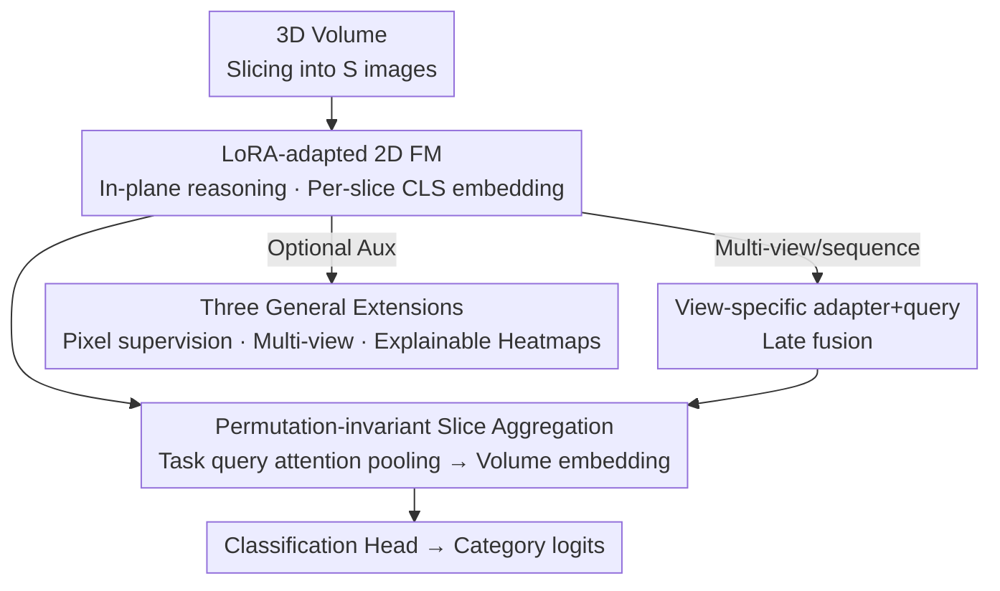

# Revisiting 2D Foundation Models for Scalable 3D Medical Image Classification

**Conference**: CVPR 2026  
**Paper**: [CVF Open Access](https://openaccess.thecvf.com/content/CVPR2026/html/Liu_Revisiting_2D_Foundation_Models_for_Scalable_3D_Medical_Image_Classification_CVPR_2026_paper.html)  
**Code**: TBD  
**Area**: Medical Imaging  
**Keywords**: 3D Medical Classification, 2D Foundation Models, LoRA Adaptation, Slice Attention Aggregation, Scalability

## TL;DR
By adding lightweight task plugins of only ~1M parameters (LoRA adaptation + permutation-invariant slice attention aggregation) to a frozen 2D Foundation Model (FM), a single framework achieves SOTA performance across 12 diverse 3D medical classification tasks (including 1st place in the VLM3D challenge). The study systematically reveals counter-intuitive conclusions, such as "2D methods outperform 3D architectures in 3D classification" and "General FMs can match Medical FMs after proper adaptation."

## Background & Motivation
**Background**: 3D medical image classification (trauma triage, disease diagnosis, severity grading) is central to clinical workflows. Traditionally, 2D convolutional networks (ResNet, DenseNet) are extended to 3D to capture inter-slice dependencies, but 3D networks lack available pre-trained weights and must be trained from scratch. Recently, while Medical FMs have emerged, 3D Medical FMs are often assumed to be the standard for 3D tasks, while 2D FMs are primarily used for 2D tasks.

**Limitations of Prior Work**: The authors identify three commonly overlooked "pitfalls" in existing research. **P1 Data Scale Bias**: Most evaluations are conducted in few-shot or low-data regimes. While adapted FMs outperform training from scratch here, their absolute performance remains below clinical acceptance, and the FM advantage often diminishes as data increases. Low-data evaluations fail to reflect real-world deployment value. **P2 Insufficient Adaptation**: The mainstream approach for using 2D FMs in 3D tasks is "frozen backbone slice feature extraction + mean/median pooling." The authors found that merely replacing this strategy with their method increased the AUC of the same DINOv3 backbone by 0.11, indicating that FM potential is severely underestimated. **P3 Insufficient Task Coverage**: Evaluations are often limited to a single modality or anatomical region, failing to determine if an FM is truly scalable or task-specific.

**Key Challenge**: The tension between scalability (rapid deployment, minimal training cost) and clinical accuracy requirements. The "one model per task" paradigm scales poorly, while simply freezing an FM as a feature extractor limits performance because general features often miss subtle diagnostic signs in medical imaging.

**Goal**: (1) To dismantle these three pitfalls by establishing a benchmark covering realistic data scales, multiple modalities, and various body parts; (2) To identify an adaptation strategy that truly unleashes the potential of 2D FMs, replacing task-specific 3D models with a single scalable framework.

**Key Insight**: Decouple "in-plane feature extraction" and "cross-plane (inter-slice) reasoning"—delegate the former to a 2D FM (with lightweight LoRA adaptation) and the latter to a permutation-invariant aggregation module.

**Core Idea**: By attaching task plugins of approximately 1M parameters to a frozen 2D FM, any 3D medical classification task can be adapted scalably without training separate 3D models for each task.

## Method

### Overall Architecture
AnyMC3D slices a 3D volume $x \in \mathbb{R}^{C\times H\times W\times S}$ into $S$ 2D slices along a specific axis. These are fed slice-by-eye into a **frozen 2D FM** (adapted with LoRA). The class token from the last layer of each slice is taken as the slice embedding $\mathbf{h}_s\in\mathbb{R}^d$. Then, a **task-query-driven permutation-invariant attention pooling** module fuses the $S$ slice embeddings into a volume embedding $\mathbf{v}$, which finally passes through a classification head to produce logits. For a new task, one only needs to add "orange plugins" (LoRA adapters $\psi_t$, task query $\mathbf{q}_t$, and classification head; ~1.3M parameters), while the 2D backbone remains frozen. The framework also supports three optional extensions: multi-view/multi-sequence fusion, pixel-level auxiliary supervision, and explainable 3D heatmaps.

### Key Designs

**1. In-plane Reasoning with LoRA-adapted 2D FM: Awakening Frozen General Features**

Targeting P2: Previous approaches using 2D FMs as frozen feature extractors failed because general pre-trained features miss subtle medical signs (e.g., hemorrhages, small nodules). AnyMC3D freezes the entire 2D backbone $f_\theta$ and adds task-specific LoRA low-rank updates only to the patch embedding and all self-attention projection layers: $\mathbf{W}' = \mathbf{W} + \Delta\mathbf{W}_t$, where $\Delta\mathbf{W}_t = \tfrac{\alpha}{r}\mathbf{B}_t\mathbf{A}_t$. The rank $r\ll\min(d_{in},d_{out})$ controls the learnable capacity, and $\alpha$ scales the update. $\mathbf{B}_t$ is initialized to zero to preserve pre-trained behavior early in training (set to $r=8, \alpha=16$ in the paper). Each slice $\mathbf{x}^s$ is encoded to a slice embedding $\mathbf{h}_s=\tilde f_{\theta,\psi_t}(\mathbf{x}^s)$. The key is "decoupling"—texture/boundary recognition is handled by the 2D FM, while LoRA fine-tunes intermediate features for specific tasks, preserving pre-trained knowledge while capturing task-specific diagnostic details with minimal parameters.

**2. Permutation-invariant Slice Attention Aggregation: Removing Slice Order Bias**

Limitations of Prior Work: Using RNNs/Transformers for slice fusion imposes an "ordered sequence" prior. However, 3D medical images often feature anisotropic spacing and varying coverage; strict sequential modeling is overly sensitive to acquisition differences. This work utilizes **task-query-driven attention pooling**: slice embeddings are stacked as $\mathbf{H}=[\mathbf{h}_1,\dots,\mathbf{h}_S]^\top\in\mathbb{R}^{S\times d}$, and a learnable task query $\mathbf{q}_t$ calculates weights for a weighted average:

$$\boldsymbol{a} = \operatorname{softmax}\!\Big(\tfrac{\mathbf{H}\mathbf{q}_t}{\sqrt{d}}\Big)\in\mathbb{R}^{S}, \qquad \mathbf{v} = \boldsymbol{a}^{\top}\mathbf{H}\in\mathbb{R}^{d}$$

This fusion is invariant to slice permutation, automatically assigning higher weights to "task-relevant slices" without being affected by acquisition order. Ablations show that attention pooling outperforms mean/median pooling and sequential models (LSTM, Transformer) with fewer parameters. The query $\mathbf{q}_t$ also serves as the source for per-slice importance scores in the "heatmap" generation.

**3. Three General Extensions: Covering Clinical Diverse Inputs and Interpretability**

To make the framework truly universal, the authors added three plug-and-play extensions. **Multi-view/sequence learning**: MRI often includes multiple views (sagittal/coronal) or sequences (T1/T2/FLAIR). Each view uses its own LoRA adapter $\psi^{(i)}$ and query $\mathbf{q}^{(i)}$ to calculate a view embedding $\mathbf{v}^{(i)}$, followed by task-query attention pooling for late fusion. **Pixel-level auxiliary supervision**: Since image-level labels are difficult for subtle lesions, patch tokens are rearranged as 2D feature maps and stacked into a pseudo-3D token volume. A lightweight 3D decoder maps these to voxel-level logits. An auxiliary segmentation loss $\mathcal{L}_{total}=\mathcal{L}_{cls}+\lambda_{seg}\cdot\tfrac{1}{|\mathcal{I}|}\sum_{i\in\mathcal{I}}\mathcal{L}_{seg}(\hat{\mathbf{Y}}_i,\mathbf{Y}_i)$ is calculated only on a subset $\mathcal{I}$ with masks. The segmentation branch can be discarded during inference with zero extra cost. **Explainable 3D heatmaps**: 2D heatmaps $\mathcal{M}_s$ are generated from class-to-patch attention. These are weighted by the slice importance scores from Design 2 and stacked into 3D heatmaps, capable of localizing trauma or highlighting secondary signs of PDAC (e.g., ductal dilation).

## Key Experimental Results

### Main Results
The benchmark includes 12 tasks (T1–T12), covering abdominal trauma (bowel/liver/kidney/spleen), early PDAC detection, lung nodules, shoulder MRI, and multi-abnormality chest/head scans across CECT/CT/MRI modalities. Realistic class imbalances are preserved. The table below compares AUROC with SOTA 3D classification methods on 10 tasks:

| Method | Trainable Params (M) | Frozen Backbone | Avg AUC | Avg Rank |
|------|------|------|------|------|
| 3D DenseNet (Scratch) | 11.24 | ✗ | 0.833 | 6.4 |
| MST (FT DINOv2 + Fusion) | 23.05 | ✗ | 0.869 | 4.0 |
| RSNA-Kaggle (2.5D + BiLSTM) | 25.04 | ✗ | 0.810 | 6.8 |
| VoCo (3D Medical FM, FT) | 50.49 | ✗ | 0.793 | 7.0 |
| MII (Frozen + Linear Probe) | 0.03 | ✓ | 0.785 | 8.7 |
| **AnyMC3D (MII)** | **1.32** | ✓ | **0.894** | **1.7** |
| **AnyMC3D (DINOv3)** | **1.20** | ✓ | **0.894** | **2.0** |

AnyMC3D outperforms all baselines with 10–40× fewer trainable parameters than MST and 40–50× fewer than VoCo. In early PDAC detection (T5), AnyMC3D (DINOv3) improved AUC from PanDx's 0.949 to 0.962 using only classification labels, and to 0.973 with pixel supervision. On the CT-RATE dataset (18 abnormalities), AnyMC3D (DINOv2) achieved 0.882 AUC, surpassing CT-Net (0.631) and CT-CLIP (0.768), winning the VLM3D challenge among 118 teams.

### Ablation Study

| Configuration | Conclusion | Explanation |
|------|------|------|
| Slice Fusion: Attention vs. Mean/Median/LSTM/Transformer | Attention is best | Better performance with fewer parameters; sequential models add overhead without gain |
| Backbone Size: ViT-S/B/L | Larger is better | Recommend starting with ViT-S for new tasks and scaling up as needed |
| DINOv2 vs. DINOv3 | Negligible difference | DINOv3 pre-training improvements do not translate to 3D medical classification gains |
| Adaptation: Linear Probe → AnyMC3D | MII 0.785→0.894, MedGemma 0.690→0.866 | Validates that adaptation strategy is critical; linear probing is insufficient |
| Data Scale 20% (T3) | DenseNet 0.741 → AnyMC3D 0.924 (+0.18) | 20% of data surpasses DenseNet with 60%; 3× data efficiency |

### Key Findings
- **Adaptation > Pre-training Paradigm**: For the same Medical FM, simply changing the adaptation strategy (Linear Probe → AnyMC3D) significantly increased AUC. This suggests FM potential has been underestimated; general FMs (DINOv3) can match or beat specialized MedGemma after adaptation—"Medical Pre-training" alone does not guarantee superiority.
- **2D Methods Outperform 3D Architectures**: 3D models trained from scratch (11–33M params) achieved only 0.683–0.833 AUC. Even the best DenseNet trailed top 2D methods by 6.1 points. Large-scale 3D Medical FMs (MedicalNet, VoCo) also fell behind. The authors speculate that classification relies on aggregated per-slice decisions (like radiologists browsing slices) rather than fine-grained inter-slice relationships needed for segmentation.
- **Pre-training and Adaptation are Both Essential**: Frozen 2D/3D Medical FMs perform poorly because diagnostic signs are subtle and require task-specific adaptation of intermediate features rather than relying on frozen general representations.

## Highlights & Insights
- **"Lightweight Plugins + Frozen Backbone" achieves both scalability and precision**: SOTA performance with ~1M parameters per task enables "one framework fits any 3D medical task," which is particularly beneficial for clinical scenarios with scarce positive samples (3× data efficiency).
- **Solid Motivation for Permutation-Invariant Aggregation**: It captures the "anisotropic, varying coverage" nature of 3D medical images without blindly applying sequential modeling, and the task query serves a dual purpose (fusion + heatmap importance).
- **Counter-Intuitive Conclusions have Transferable Value**: The finding that "2D + Slice Fusion > 3D Architecture" aligns with the winning strategies of 2D/2.5D models in 3D classification challenges over the last five years. This suggests architecture choice should match the task's spatial reasoning needs (classification via slice aggregation vs. segmentation via inter-slice relations).
- **Plug-and-play Pixel Auxiliary Supervision**: Using small amounts of segmentation masks during training to improve classification while dropping the branch during inference is a "train-time enhancement, inference-time slimming" approach transferable to other weak-label tasks.

## Limitations & Future Work
- The conclusions are based only on the FMs evaluated; other FMs might have different adaptation characteristics. Benchmark tasks were intra-domain CT/MR; generalization to out-of-domain modalities (e.g., PET) was not explored.
- Pixel auxiliary supervision relies on expensive voxel-level labels; the authors propose using weaker supervision (bounding boxes, radiology reports + vision-language alignment) instead.
- The improved spatial features from DINOv3's Gram anchoring showed no advantage in 3D classification (par with DINOv2), though it might benefit scalable 3D dense prediction tasks, which were not tested here.
- AnyMC3D treats 3D volumes as "slice sets," which is sufficient for classification but might lose information for tasks requiring 3D continuous structural reasoning (e.g., vessel tracking). The method is positioned as for "research purposes," not clinical use.

## Related Work & Insights
- **vs. 3D Medical FMs (MedicalNet / VoCo)**: These use 3D encoders to handle volumes with full fine-tuning (46–50M params). AnyMC3D uses 2D FM + lightweight fusion (~1M) and outperforms them with fewer parameters—challenging the assumption that 3D tasks require 3D FMs.
- **vs. Frozen 2D FM + Mean/Median Pooling (Liu et al. / Zhang et al.)**: These skip proper adaptation, losing subtle diagnostic signs. AnyMC3D's LoRA + attention pooling improves AUC by 0.11 on the same backbone.
- **vs. MST (FT DINOv2 + Slice Transformer)**: MST is expensive to fine-tune and uses sequential modeling. AnyMC3D freezes the backbone, uses permutation-invariant aggregation, has an order of magnitude fewer parameters, and is more robust to acquisition changes.
- **vs. LoRA-DINOv2 for Single Nodule Classification (Veasey et al.)**: They use only three orthogonal slices, losing 3D context. AnyMC3D encodes the full volume per-slice and aggregates, preserving spatial information.

## Rating
- Novelty: ⭐⭐⭐⭐ Components themselves aren't new, but the "decoupling in-plane/cross-plane" perspective and systematic debunking of pitfalls are highly valuable.
- Experimental Thoroughness: ⭐⭐⭐⭐⭐ 12-task cross-modality benchmark + extensive ablations + challenge victory provide solid evidence.
- Writing Quality: ⭐⭐⭐⭐ Clear logic from pitfalls to method to insights; well-synthesized conclusions.
- Value: ⭐⭐⭐⭐⭐ Provides a strong baseline and a practical, scalable paradigm for 3D medical classification, correcting several common misconceptions in the field.

<!-- RELATED:START -->

## Related Papers

- [\[ICML 2025\] Raptor: Scalable Train-Free Embeddings for 3D Medical Volumes Leveraging Pretrained 2D Foundation Models](../../ICML2025/medical_imaging/raptor_scalable_train-free_embeddings_for_3d_medical_volumes_leveraging_pretrain.md)
- [\[CVPR 2026\] Delving Aleatoric Uncertainty in Medical Image Segmentation via Vision Foundation Models](delving_aleatoric_uncertainty_in_medical_image_segmentation_via_vision_foundatio.md)
- [\[CVPR 2026\] Are General-Purpose Vision Models All We Need for 2D Medical Image Segmentation? A Cross-Dataset Empirical Study](are_general-purpose_vision_models_all_we_need_for_2d_medical_image_segmentation_.md)
- [\[CVPR 2026\] Forging a Dynamic Memory: Retrieval-Guided Continual Learning for Generalist Medical Foundation Models](forging_a_dynamic_memory_retrieval-guided_continual_learning_for_generalist_medi.md)
- [\[CVPR 2026\] Attention Consistent Longitudinal Medical Visual Question Answering Guided by Vision Foundation Models](attention_consistent_longitudinal_medical_visual_question_answering_guided_by_vi.md)

<!-- RELATED:END -->
