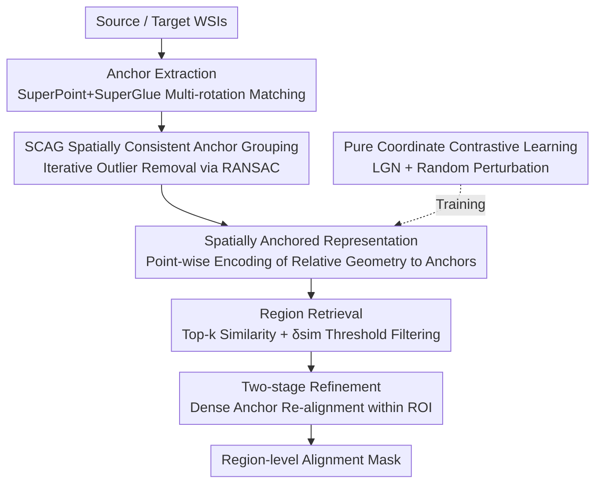

# SAR2Net: Learning Spatially Anchored Representations for Retrieval-Guided Cross-Stain Alignment

**Conference**: CVPR 2026  
**Paper**: [CVF Open Access](https://openaccess.thecvf.com/content/CVPR2026/html/Shen_SAR2Net_Learning_Spatially_Anchored_Representations_for_Retrieval-Guided_Cross-Stain_Alignment_CVPR_2026_paper.html)  
**Code**: https://github.com/Shentl/SAR2Net  
**Area**: Medical Imaging  
**Keywords**: Cross-stain alignment, Whole Slide Image (WSI), Pathological registration, Feature retrieval, Spatially anchored representations

## TL;DR
SAR2Net reformulates HE↔IHC Whole Slide Image (WSI) cross-stain alignment from "deformation transform estimation" to "region-level feature retrieval." By learning a "spatially anchored representation" for each point that depends only on coordinates and relative geometric encoding of anchors, it achieves robust region correspondence under severe tissue deformation and fragmentation without requiring any global coarse alignment. On a self-collected biopsy dataset, it improves mIoU from 0.691 (strongest baseline) to 0.899.

## Background & Motivation
**Background**: In pathological diagnosis, adjacent slices of the same tissue are often stained differently—HE staining shows morphology, while IHC staining shows molecular expression. To jointly interpret these two types of information, spatial correspondences must be established between two gigapixel WSIs of different stains. The mainstream approach treats this as image registration: performing coarse affine/rigid pre-alignment at low resolution, followed by non-rigid refinement at high resolution, driven by similarity metrics like MI/NCC/NGF or feature matching like SuperPoint+SuperGlue.

**Limitations of Prior Work**: All these methods—whether traditional multi-stage pipelines (VALIS, RegWSI) or networks directly regressing transformation parameters—share a common assumption: **the two slices can be roughly pre-aligned**. However, in biopsy specimens, tissue often fragments into multiple disconnected pieces, undergoes significant non-linear distortion, or even includes additional control tissues. The authors observed that approximately 35% of their data falls into this category. Once large tissue blocks fail to align after initial affine transformation, subsequent refinement or learning models lose a reliable starting point, causing the entire pipeline to fail.

**Key Challenge**: The essence of the registration paradigm is "global-to-local," which relies on the existence of a globally consistent correspondence. authentic biopsies often see this global correspondence destroyed, with geometric relationships preserved only within local patches. Tying alignment strictly to global transformations inevitably leads to failure on these challenging samples.

**Goal**: Achieve robust **region-level** cross-stain alignment (region-level is typically sufficient for diagnostic interpretation) without depending on any coarse pre-alignment, maintaining robustness against tissue fragmentation and large deformations.

**Key Insight**: The authors observe that even if the entire tissue is distorted or torn, the **local geometric relationship between a point and its surrounding few anatomical landmarks** remains largely invariant across two adjacent slices. Instead of estimating "how to transform A to B," they learn a descriptor for each point that encodes its "relative position to surrounding anchors." As long as this descriptor is consistent for the same anatomical location on both slides, correspondences can be established through retrieval.

**Core Idea**: Replace "explicit deformation transforms" with "relative geometric encoding to anchors" (spatially anchored representations), transforming cross-stain alignment into a **point-wise feature retrieval** problem.

## Method

### Overall Architecture
The input to SAR2Net is a pair of source/target WSIs, and the output is a region mask in the target slide corresponding to each region in the source slide. The pipeline consists of inference and training branches: During inference, SuperPoint+SuperGlue are used on thumbnails to extract paired landmarks as **spatial anchors**. For each alignment window, RANSAC performs spatially consistent anchor grouping. SAR2Net then computes "spatially anchored representations" for all points on both slides to find region correspondences via feature retrieval, followed by two-stage refinement. The training branch does not use real images; instead, it uses contrastive learning on synthetic 2D coordinates to teach the network to encode "point-anchor relative geometry."

### Key Designs

**1. Spatially Anchored Representation: Reformulating Alignment as Feature Retrieval**

To address the failure of registration paradigms in fragmented/deformed cases, SAR2Net learns a descriptor for any query point $x\in\mathbb{R}^2$ that depends only on its relative geometry to a set of anchors $A=\{a_i\}_{i=1}^K$. Specifically, relative positions $r_i = x - a_i$ are calculated and concatenated with anchor coordinates to form 4D positional descriptors $p_i=[r_i, a_i]\in\mathbb{R}^4$. An MLP $\phi_\theta$ produces embeddings $h_i=\phi_\theta(p_i)\in\mathbb{R}^{256}$ from the perspective of each anchor. A gated attention mechanism aggregates these into the final representation:

$$f(x, A) = \sum_{i=1}^{K} \alpha_i h_i,\quad \alpha_i = \frac{\exp\{W(\tanh(Vh_i)\odot\mathrm{sigm}(Uh_i))\}}{\sum_{j=1}^{K}\exp\{W(\tanh(Vh_j)\odot\mathrm{sigm}(Uh_j))\}}$$

This aggregation allows anchors near the query point to contribute fine-grained local variations while distant anchors provide stable global constraints. This is effective because relative geometry is naturally more stable across adjacent slices than absolute pixel appearance: even with global translation, rotation, or tearing, the relative distance and orientation of a point between specific landmarks remains consistent.

**2. Contrastive Learning on Synthetic Coordinates & Local Geometry-aware Negative Sampling (LGN)**

To ensure $f$ encodes only geometry without interference from stain appearance, the authors **completely avoid training on real images**, using contrastive learning directly in 2D coordinate space. In each iteration, $K+1$ points are sampled: $K$ as anchors and one as query $x$. A rigid transformation $T(\cdot)$ is applied to create a positive pair $((x,A),(T(x),T(A)))$. Negative samples are query points sampled under the same anchor set satisfying $\|x^-_j - T(x)\| > \delta_{neg}$, using InfoNCE ($\tau=0.3$) to pull positives together and push negatives apart.

To prevent the network from focusing solely on the nearest anchor, the authors designed **Local Geometry-aware Negative Sampling (LGN)**. Using the nearest anchor as a reference, a convex hull is formed by its neighbors. Negative samples are symmetrically sampled on the **opposite side of the hull at a similar distance to the reference**. This forces the model to distinguish true local geometric differences rather than just proximity to an anchor. Visualization (Fig. 3) shows that without LGN, similarity maps are overly broad; with LGN, high similarity is constrained within the correct geometric region.

**3. Random Perturbation: Robustness to Deformation**

Pure rigid transformation for positive samples risks overfitting. The authors apply a uniform random perturbation $\epsilon\sim U(-\sigma,\sigma)$ (with $\sigma=5$) to all sampled coordinates to simulate fine non-linear deformations. Ablation studies show this is the **most critical component**. Without it, similarity maps show concentric ring artifacts and rigid matching tendencies; with perturbation, activations become smoother and spatially elastic, better fitting real-world deformations.

**4. Retrieval-Guided Region Alignment Pipeline**

**Anchor Extraction**: Pre-trained SuperPoint+SuperGlue extract paired landmarks on low-res thumbnails. Since these are not rotation-invariant, the source image is rotated every 15° to find the rotation with the most correspondences, followed by merging valid anchor pairs across rotations. **Spatially Consistent Anchor Grouping (SCAG)**: RANSAC is used on sliding windows to iteratively find anchors sharing the same local transformation, filtering out outliers from different tissue fragments. **Region Retrieval**: For each target point, the top-$k$ most similar source points are retrieved. If they mostly fall within a specific source region and the maximum similarity exceeds $\delta_{sim}=0.7$, the region label is assigned. **Two-stage Refinement**: The established region correspondences are treated as ROIs where denser anchors are extracted to re-run alignment, correcting residual errors and boundary offsets.

### Loss & Training
Training uses synthetic 2D coordinates + InfoNCE loss ($\tau=0.3$), Adam optimizer, learning rate $1\times10^{-4}$, and batch size 256. Anchor count $K$ is randomized between $\{4,\dots,10\}$ per batch. Negative sampling uses $\delta_{neg}=20$ and $N=500$ negative queries. Coordinate perturbation $\sigma=5$. Inference uses sliding windows of size 100 with step 50, top-5 retrieval, and $\delta_{sim}=0.7$.

## Key Experimental Results

### Main Results
On a biopsy dataset (154 cases, 370 HE–IHC pairs, 79 IHC stains), SAR2Net was compared against automated WSI registration frameworks VALIS and RegWSI.

| Method | mIoU ↑ | mDice ↑ | aw-IoU ↑ | aw-Dice ↑ |
|------|--------|---------|----------|-----------|
| VALIS | 0.635 | 0.705 | 0.647 | 0.716 |
| RegWSI | 0.691 | 0.786 | 0.699 | 0.794 |
| Ours (single, first round only) | 0.891 | 0.938 | 0.893 | 0.939 |
| Ours (second, two-stage) | **0.899** | **0.942** | **0.901** | **0.944** |

Robustness measured by Success Rate (SR) for IoU/Dice thresholds $t$:

| Method | SR0.75IoU ↑ | SR0.85IoU ↑ | SR0.75Dice ↑ | SR0.85Dice ↑ |
|------|------|------|------|------|
| VALIS | 0.594 | 0.429 | 0.690 | 0.606 |
| RegWSI | 0.545 | 0.324 | 0.740 | 0.574 |
| Ours (single) | 0.899 | 0.768 | 0.971 | 0.910 |
| Ours (second) | **0.939** | **0.812** | **0.974** | **0.946** |

### Ablation Study
Components: Random perturbation (pertu), Local Geometry-aware Negative sampling (LGN), Two-stage refinement (sec).

| Configuration | mIoU ↑ | mDice ↑ | aw-IoU ↑ | Description |
|------|--------|---------|----------|------|
| ✗pertu, ✓LGN, ✗sec | 0.847 | 0.911 | 0.852 | Removing perturbation causes the largest drop |
| ✓pertu, ✗LGN, ✗sec | 0.888 | 0.936 | 0.890 | Removing LGN |
| ✓pertu, ✓LGN, ✗sec | 0.891 | 0.938 | 0.893 | Full single-round model |
| ✓pertu, ✓LGN, ✓sec | **0.899** | **0.942** | **0.901** | Adding refinement |

### Key Findings
- **Random perturbation is the most critical component**: Removing it drops mIoU from 0.891 to 0.847 (−0.044), a much larger impact than removing LGN (−0.003) or refinement (+0.008). It allows the model to generalize from rigid matching to non-linear deformations.
- **Mean vs. Area-weighted (aw) metrics**: While VALIS/RegWSI show higher aw-metrics (indicating they only perform well on large regions), SAR2Net shows negligible difference between mean and aw-metrics. This proves "size robustness," establishing accurate alignment for regions of all sizes.
- **Refinement gains are concentrated in high-threshold areas**: The first round establishes strong global correspondence, while the second round corrects fine-scale local deformations and boundary shifts.

## Highlights & Insights
- **Smart Paradigm Shift**: Moving from registration to retrieval bypasses the "global pre-alignment" bottleneck, which is the fundamental reason for success on fragmented biopsy samples.
- **Zero Real-World Annotations**: Learning geometric priors separately from image appearance using synthetic coordinates circumvents cross-stain appearance variations and saves expensive annotation costs.
- **LGN and Hard Negatives**: Using geometric constraints to construct hard negatives forces the model to learn true spatial invariants, a technique highly applicable to other contrastive learning tasks.
- **Gated Attention**: Naturally implements a "coarse-to-fine" contribution from anchors without requiring hand-crafted multi-scale architectures.

## Limitations & Future Work
- **Region-level focus**: The evaluation and labels are region-level. Downstream tasks requiring pixel/cell-level precision (e.g., single-cell pairing) may require further refinement.
- **Dependence on Anchor Extraction**: If SuperPoint+SuperGlue fail at the thumbnail level due to extreme stain differences or tissue loss, the subsequent retrieval will fail.
- **Narrow Evaluation**: Comparisons are limited to two baselines and a single self-collected dataset. Direct comparisons with deep-learning-based regression methods and public benchmarks are missing.
- **Heuristic Hyperparameters**: Many parameters ($\delta_{neg}, \delta_{merge}, \delta_{split}$) are empirically set, and cross-dataset stability requires further validation.

## Related Work & Insights
- **vs. Traditional Registration (VALIS, RegWSI)**: These rely on rigid initialization. SAR2Net's retrieval-based approach is significantly more robust (mIoU 0.899 vs 0.691) in fragmented cases.
- **vs. SuperPoint/SuperGlue**: Instead of using them for direct final correspondence, this method uses them as tools for low-res anchor extraction, building invariant spatial representations on top of them.

## Rating
- Novelty: ⭐⭐⭐⭐⭐ 
- Experimental Thoroughness: ⭐⭐⭐ 
- Writing Quality: ⭐⭐⭐⭐ 
- Value: ⭐⭐⭐⭐ 

<!-- RELATED:START -->

## Related Papers

- [\[CVPR 2026\] Learning Generalizable 3D Medical Image Representations from Mask-Guided Self-Supervision](learning_generalizable_3d_medical_image_representations_from_mask-guided_self-su.md)
- [\[CVPR 2026\] Forging a Dynamic Memory: Retrieval-Guided Continual Learning for Generalist Medical Foundation Models](forging_a_dynamic_memory_retrieval-guided_continual_learning_for_generalist_medi.md)
- [\[CVPR 2026\] Interpretable Cross-Domain Few-Shot Learning with Rectified Target-Domain Local Alignment](interpretable_cross-domain_few-shot_learning_with_rectified_target-domain_local_.md)
- [\[CVPR 2026\] Cross-Modal Guided Visual Synthesis for Data-Efficient Multimodal Depression Recognition](cross-modal_guided_visual_synthesis_for_data-efficient_multimodal_depression_rec.md)
- [\[CVPR 2026\] TAlignDiff: Automatic Tooth Alignment assisted by Diffusion-based Transformation Learning](taligndiff_automatic_tooth_alignment_assisted_by_diffusion-based_transformation_.md)

<!-- RELATED:END -->
