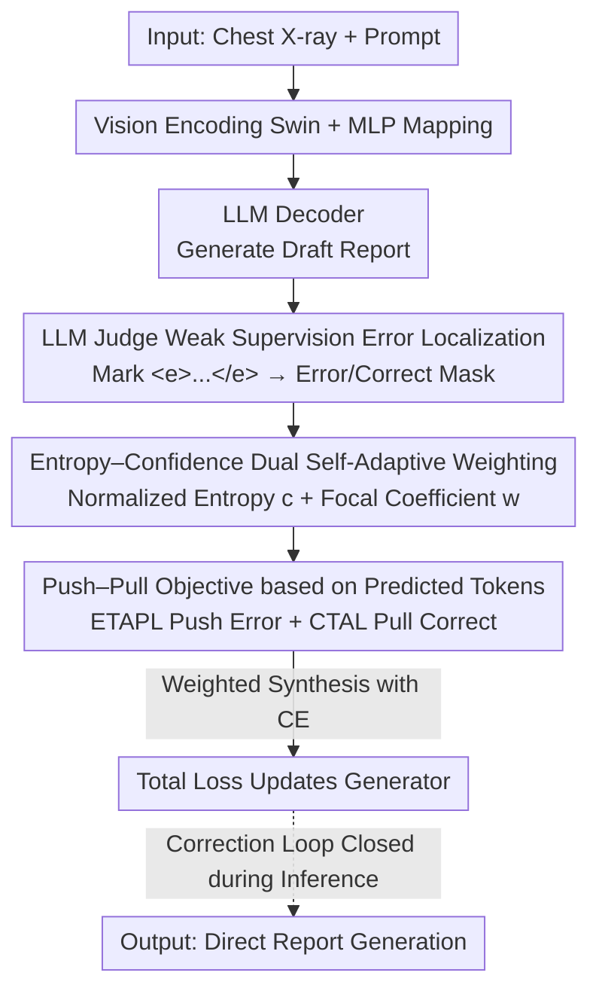

# SAT-RRG: LLM-Guided Self-Adaptive Training for Radiology Report Generation with Token-Level Push–Pull Optimization

**Conference**: CVPR 2026  
**Paper**: [CVF Open Access](https://openaccess.thecvf.com/content/CVPR2026/html/Liu_SAT-RRG_LLM-Guided_Self-Adaptive_Training_for_Radiology_Report_Generation_with_Token-Level_CVPR_2026_paper.html)  
**Code**: None  
**Area**: Medical Imaging  
**Keywords**: Radiology Report Generation, Token-Level Supervision, Push–Pull Optimization, LLM Weak Supervision, Self-Adaptive Training

## TL;DR
SAT-RRG utilizes a frozen LLM as a "judge" to mark semantic errors token-by-token in generated reports. It employs a pair of "push–pull" losses (depressing incorrect words and strengthening correct ones) combined with entropy-confidence self-adaptive weighting. This converts cross-entropy training into a self-correcting process, achieving new SOTA results on both linguistic and clinical metrics for MIMIC-CXR and IU-Xray with zero additional inference overhead.

## Background & Motivation
**Background**: The mainstream approach for Radiology Report Generation (RRG) currently involves encoder–decoder architectures or vision features paired with LLM decoders (e.g., R2GenGPT, Bootstrapping), trained token-by-token using Cross-Entropy (CE) to produce fluent report text.

**Limitations of Prior Work**: Such models often produce reports that "read fluently but are clinically incorrect"—missing critical findings, misidentifying "no effusion" as "effusion," or exhibiting local contradictions. The root cause lies in CE itself: it only increases the probability of the ground-truth token $y^*$ and **does not directly suppress the token $\hat{y}$ currently misselected by the model**. Furthermore, it treats all positions equally, failing to prioritize "areas where error correction is most needed."

**Key Challenge**: Fatal semantic errors in reports are **sparse** (empirically accounting for only about 12.5% of tokens). However, CE averages gradients across every position, lacking both the knowledge of where errors occur and a mechanism to "push down the incorrect ones." Existing token-level feedback methods (RL-based SCoRe/Reflexion, contrastive objectives, post-hoc correction) rely on manual rewards, additional annotations, or independent correction networks, which are difficult to scale in medical scenarios where annotation is expensive.

**Goal**: To enable the model to **locate** semantic conflicts within its own reports during training and **forcefully prioritize** the correction of these sparse, critical positions, without introducing inference overhead or requiring manual token labeling.

**Key Insight**: The authors found that a frozen LLM possesses sufficient semantic judgment to compare "generated reports" with "reference reports" and highlight segments where meaning has been altered. This serves as a **weak supervision trigger signal**, rather than the LLM being the primary contribution. By converting this coarse-grained textual discrepancy into differentiable, token-level gradient modulation, "self-checking" can be embedded into the training loop.

**Core Idea**: Replace pure CE with "LLM error labeling → push–pull loss." The probability of incorrect tokens is explicitly pushed down, while correct tokens are reinforced. The intensity is self-adaptively determined by entropy and confidence, ensuring gradients flow precisely to clinically critical tokens.

## Method

### Overall Architecture
Built upon a standard "vision encoding + LLM decoding" report generator, SAT-RRG adds a self-correction loop **enabled only during training**. Given a chest X-ray $X_v$, a Swin Transformer extracts visual features $Z_v=\text{Swin}(X_v)$, which are projected into the LLM embedding space via an MLP vision mapper to obtain $H_v$. These are concatenated with a prompt $P$ and reference reports, then fed into a LLaMA3-3B decoder to generate reports under CE. During training, the same (frozen) LLM is invoked to compare the draft with the reference report, enclosing semantic conflict segments with `<e>...</e>` tags to generate sparse error/correct token masks. These masks, combined with entropy-confidence weights, drive the ETAPL (push error) and CTAL (pull correct) push–pull losses, which are weighted and synthesized with CE for the final objective. **The entire correction loop is closed during inference**, where the model generates reports directly from images and system prompts without invoking any LLM judge, resulting in zero extra inference cost.

### Key Designs

**1. Weakly Supervised Error Span Localization by LLM Judge: Entrusting "where to correct" to a frozen LLM instead of humans**

A major pain point is the unavailability of token-level error annotations in medical scenarios, while CE is unaware of where semantic errors occur. SAT-RRG allows a frozen LLM to simultaneously view the reference and the draft, using few-shot prompting to highlight only segments that **change the meaning**, wrapped in `<e>...</e>`. Equivalent paraphrasing is not marked. For example, if the draft "right lower lobe pneumonia" contradicts the reference "no evidence of pneumonia," it is marked as an error. Conversely, "no evidence of pneumonia" vs. "no focal consolidation concerning for pneumonia" is **not marked** as the semantics are consistent. This yields mutually exclusive sparse masks $m^{err}_t$ and $m^{cor}_t$, converting coarse text differences into token-level supervision. The labeling is a weak trigger used only during training, and the authors demonstrate robustness to noisy/imperfect labels.

**2. Entropy–Confidence Dual Self-Adaptive Weighting: Distinguishing "Confident Errors" from "Vague Errors"**

Knowing the location of an error is insufficient. Among incorrect tokens, some are **over-confident mistakes** while others are **vague and uncertain**; these require different levels of correction. The authors introduce two complementary weights to modulate token gradients. First, normalized entropy acts as global uncertainty: Shannon entropy $H_{b,t}$ of temperature-scaled probabilities $p_{b,t}$ is divided by $\log V$ to get $\tilde{H}_{b,t}\in[0,1]$. For incorrect tokens, $c^{err}_{b,t}=\tilde{H}_{b,t}$; for correct tokens, $c^{cor}_{b,t}=1-\tilde{H}_{b,t}$. Thus, uncertain mistakes are penalized more heavily, and certain correct predictions are reinforced more. Second, a focal coefficient provides local confidence modulation: let $p_{b,t}(\hat{y}_{b,t})$ be the probability of the selected token,

$$w^{err}_{b,t}=\big(p_{b,t}(\hat{y}_{b,t})\big)^{\gamma},\qquad w^{cor}_{b,t}=\big(1-p_{b,t}(\hat{y}_{b,t})\big)^{\gamma}.$$

Entropy characterizes the ambiguity at the **full vocabulary distribution level**, while focal reflects the confidence **of the selected token**. Combined, they distinguish "confident errors" from "vague predictions." All $w$ and $c$ are detached with no gradients passed through them. Empirical results show errors are concentrated in the mid-confidence range (0.6–0.75), confirming the need to prioritize these uncertain positions.

**3. Push–Pull Objective based on Predicted Tokens (ETAPL + CTAL): Directly pushing down incorrect tokens and pulling up correct ones**

The fundamental flaw of CE is its focus solely on $\log p_{b,t}(y^*)$, ignoring the token the model actually selected. SAT-RRG targets the **log probability of the predicted token** $\log p^{pred}_{b,t}=\log p_{b,t}(\hat{y}_{b,t})$ to create a "push–pull" mechanism. For error tokens ($m^{err}=1$), ETAPL is used:

$$\ell^{ETAPL}_{b,t}=+\,w^{err}_{b,t}\log p^{pred}_{b,t},$$

where the positive sign flips the gradient to push down the error probability. For correct tokens ($m^{cor}=1$), CTAL is used: $\ell^{CTAL}_{b,t}=-\,w^{cor}_{b,t}\log p^{pred}_{b,t}$ to reinforce reliable predictions. Gradient analysis shows correct tokens receive a negative gradient $-(1-p_{b,t}(\hat{y}))$ (increasing probability), and error tokens receive a positive gradient $+(1-p_{b,t}(\hat{y}))$ (decreasing probability). This synthesis creates a smooth, differentiable push–pull dynamic similar to contrastive learning but directly applied to the model's own distribution. Losses are normalized across weighted masks ($E=\sum m^{err}c^{err}$, $C=\sum m^{cor}c^{cor}$) to handle sparsity, forming the EA-FE loss $\mathcal{L}_{EA\text{-}FE}=\lambda_{err}\mathcal{L}_{ETAPL}+\mathcal{L}_{CTAL}$.

### Mechanism Example
Processing a draft sentence: the model generates "consolidation is present, no pleural effusion" while the reference is "no pleural effusion or consolidation." The frozen LLM labels it: `<e>consolidation is present</e>, no pleural effusion`. Consequently, (consolidation, is, present) are penalized by ETAPL, and (no, pleural, effusion) are supported by CTAL, with intensity determined by entropy-focal weights. After one backpropagation step, token probabilities update (Paper Table 1): consolidation 0.80→0.55, is 0.30→0.15, present 0.61→0.42 are pushed down; no 0.92→0.96, pleural 0.79→0.86, effusion 0.71→0.83 are pulled up—errors move away, while correct tokens are stabilized.

### Loss & Training
The final objective fuses EA-FE and CE to maintain the stability of likelihood learning:

$$\mathcal{L}_{total}=\alpha\,\mathcal{L}_{CE}+(1-\alpha)\,\mathcal{L}_{EA\text{-}FE}.$$

A larger $\alpha$ emphasizes CE, while a smaller $\alpha$ strengthens self-correction. Implementation uses LLaMA3-3B + Swin, loss balance coefficient $\lambda=0.5$, focal parameter $\gamma=1.5$. Training is conducted on dual A6000s; inference uses beam=3. EA-FE is active only during training.

## Key Experimental Results

### Main Results
SOTA comparison on two major RRG datasets (@B denotes BLEU):

| Dataset | Method | B-1 | B-4 | METEOR | ROUGE-L |
|--------|------|-----|-----|--------|---------|
| MIMIC-CXR | R2GenGPT (7B) | 0.411 | 0.134 | 0.160 | 0.297 |
| MIMIC-CXR | Bootstrapping (7B) | 0.402 | 0.128 | 0.175 | 0.291 |
| MIMIC-CXR | **Ours (3B)** | **0.428** | **0.143** | 0.167 | **0.303** |
| IU-Xray | EKAGen | 0.497 | 0.190 | 0.210 | 0.399 |
| IU-Xray | **Ours (3B)** | **0.504** | **0.196** | **0.222** | **0.400** |

Despite using only a 3B LLM, BLEU improves by approximately 7.5% / 12.5% over 7B models like R2GenGPT / Bootstrapping. Clinical metrics (MIMIC-CXR) also lead: RadGraph F1 0.205, BERTScore 0.422, RadCliQ 1.150 (↓ better), GREEN 0.310, and RaTEScore 0.540.

> Metric Note: RadGraph F1 measures consistency between generated and reference clinical entity/relationship graphs; RadCliQ is a composite clinical quality metric (lower is better); RaTEScore / GREEN are LLM-based semantic fidelity scores. CheXBert is excluded due to historical calculation inconsistencies.

### Ablation Study
Ablation of loss components (MIMIC-CXR):

| ETAPL | CTAL | B-4 | ROUGE-L | Description |
|:---:|:---:|-----|---------|------|
| ✗ | ✗ | 0.131 | 0.289 | CE Baseline Only |
| ✓ | ✗ | 0.136 | 0.294 | Push Error Only |
| ✗ | ✓ | 0.141 | 0.301 | Pull Correct Only |
| ✓ | ✓ | **0.143** | **0.303** | Full Push–Pull |

Weighting components and $\gamma$ ablation:

| Configuration | B-4 | METEOR | Description |
|------|-----|--------|------|
| Full model | 0.143 | 0.167 | Both Focal + Entropy |
| w/o Focal | 0.139 | 0.165 | Degraded hard token handling |
| w/o Entropy | 0.141 | 0.166 | Decreased fluency/consistency |
| $\gamma=1.0$ | 0.139 | 0.165 | Weak focus on hard samples |
| $\gamma=1.5$ | **0.143** | **0.167** | Optimal tradeoff |
| $\gamma=2.0$ | 0.141 | 0.166 | Over-focusing/slight degradation |

### Key Findings
- ETAPL and CTAL both individually exceed the baseline, and their **combination is optimal**, confirming that "pushing errors" and "pulling correct tokens" are complementary. CTAL provides slightly higher gains than ETAPL.
- Entropy and focal weights are both essential: removing either leads to a drop, proving "confident errors" and "vague errors" must be handled distinctly.
- $\gamma=1.5$ is the sweet spot for focus intensity vs. gradient stability.
- Error tokens account for only ~12.5% of tokens and mostly fall in the mid-confidence range—validating the design premise of concentrating gradients on sparse key positions.

## Highlights & Insights
- **Downgrading LLMs to "Weak Supervision Triggers"**: The authors clarify the LLM is not the contribution but a training-time signal provider, ensuring zero inference overhead while leveraging LLM semantic judgment without multi-step decoding or external correctors.
- **Targeting Predicted Tokens vs. Ground-Truth Tokens**: Push–pull directly manipulates the model's "current beliefs," which is closer to the essence of "self-correction" than CE is. This differentiates it from RL/contrastive methods.
- **Decoupling Uncertainty via Entropy × Focal**: Using global distribution entropy and local token confidence as orthogonal signals to treat "over-confident errors" vs. "vague errors" allows this weighting scheme to be transferable to other sequence generation tasks.
- **Architecture Agnostic**: Changes only the training objective without altering the network, allowing it to be integrated into any RRG generator.

## Limitations & Future Work
- **Strong Dependency on Frozen LLM Label Quality**: Error spans are labeled by few-shot LLM prompts; thoughclaimed robust to noise, semantic bias or omissions by the judge LLM directly contaminate supervision.
- **Validation Limited to Chest X-rays**: Performance across different organs or modalities (CT/MRI) remains unknown.
- **Increased Training Cost**: Every training sample requires an extra LLM judge pass for labeling, reducing throughput during training compared to pure CE.
- **Hyperparameter Tuning**: Balancing push–pull with CE necessitates tuning $\alpha$, $\lambda_{err}$, and $\gamma$ for new datasets.

## Related Work & Insights
- **vs. CE Baseline**: CE only boosts $y^*$ and treats positions equally; Ours pushes $\hat{y}$ and re-weights gradients based on error sparsity.
- **vs. RL / Contrastive / Post-hoc Correction (SCoRe, Reflexion, etc.)**: These rely on manual rewards, extra labels, or multiple decoding passes; Ours is **fully differentiable and trainer-centric** token-level modulation with no RL or inference overhead.
- **vs. Knowledge-Enhanced RRG (EKAGen, KiUT)**: Those inject clinical knowledge into the architecture but lack token-level feedback to distinguish semantic correctness; Ours fills the gap of "training-time self-semantic checking."

## Rating
- Novelty: ⭐⭐⭐⭐ Combining "LLM labeling + predicted token push–pull + entropy-focal weighting" into a self-adaptive framework is novel, though components draw from existing ideas.
- Experimental Thoroughness: ⭐⭐⭐⭐ Solid multi-dataset, NLG + clinical metric evaluation; however, limited to chest X-rays.
- Writing Quality: ⭐⭐⭐⭐ Clear logical chain from motivation to gradient analysis. Table 1's probability walk-through is intuitive.
- Value: ⭐⭐⭐⭐ Plug-and-play, zero inference cost, and 3B exceeding 7B makes it highly attractive for real-world RRG.

<!-- RELATED:START -->

## Related Papers

- [\[CVPR 2026\] BiOTPrompt: Bidirectional Optimal Transport Guided Prompting for Disease Evolution-aware Radiology Report Generation](biotprompt_bidirectional_optimal_transport_guided_prompting_for_disease_evolutio.md)
- [\[CVPR 2026\] CURE: Curriculum-guided Multi-task Training for Reliable Anatomy Grounded Report Generation](cure_curriculum-guided_multi-task_training_for_reliable_anatomy_grounded_report_.md)
- [\[CVPR 2026\] TIM: Temporal Decoupling with Iterative Mutual-Refinement Model for Longitudinal Radiology Report Generation](tim_temporal_decoupling_with_iterative_mutual-refinement_model_for_longitudinal_.md)
- [\[CVPR 2026\] OraPO: Oracle-educated Reinforcement Learning for Data-efficient and Factual Radiology Report Generation](orapo_oracle-educated_reinforcement_learning_for_data-efficient_and_factual_radi.md)
- [\[AAAI 2026\] SPA: Achieving Consensus in LLM Alignment via Self-Priority Optimization](../../AAAI2026/medical_imaging/spa_achieving_consensus_in_llm_alignment_via_self-priority_optimization.md)

<!-- RELATED:END -->
