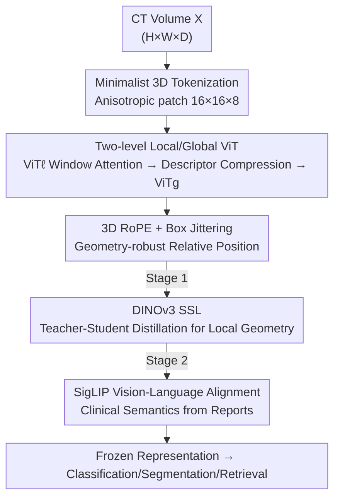

# SPECTRE: Scaling Self-Supervised and Cross-Modal Pretraining for Volumetric CT Transformers

**Conference**: CVPR 2026  
**Paper**: [CVF Open Access](https://openaccess.thecvf.com/content/CVPR2026/html/Claessens_Scaling_Self-Supervised_and_Cross-Modal_Pretraining_for_Volumetric_CT_Transformers_CVPR_2026_paper.html)  
**Code**: https://github.com/cclaess/SPECTRE  
**Area**: Medical Imaging / 3D Vision / Self-supervised / Multimodal VLM  
**Keywords**: CT Foundation Model, 3D Vision Transformer, Self-supervised, Vision-language alignment, Geometry-aware

## TL;DR
SPECTRE is a **pure Transformer-based volumetric CT foundation model**. It addresses three core challenges of volumetric CT—"cubic token explosion, geometric anisotropy, and weak/noisy clinical supervision"—through anisotropic 3D tokenization, a two-level (local/global) ViT, and 3D RoPE. Utilizing a two-stage pretraining pipeline of "DINOv3 SSL → SigLIP Vision-Language Alignment" with **only public CT data**, SPECTRE outperforms existing CT foundation models in biomarker classification, segmentation, and cross-modal retrieval.

## Background & Motivation
**Background**: In 2D natural and medical imaging, self-supervised learning (SSL, e.g., DINO series) and vision-language alignment (VLA, e.g., CLIP series) have successfully learned transferable general representations. ViT has become the dominant backbone due to its flexible and scalable attention mechanism.

**Limitations of Prior Work**: Direct application of these recipes to volumetric CT fails. Existing CT foundation models are either single-region/single-modal VLA (CT-CLIP for chest, Merlin for abdomen), pure image-based SSL (CT-FM, FMCIB, lacking clinical semantics), or segmentation models dependent on dense voxel annotations (VISTA3D, SuPreM). None simultaneously address "fine-grained 3D geometry + generalized clinical semantics + scalability."

**Key Challenge**: Volumetric CT poses several fundamental technical hurdles: ① **Cubic token explosion**—the number of tokens for 3D patches grows cubically with resolution, making the quadratic complexity of self-attention (global attention/large batches) unusable. ② **Geometric heterogeneity**—anisotropic voxel spacing, variable field of view (FOV), and different scanner reconstruction kernels mean isotropic position encodings fail to represent cross-scan geometry accurately. ③ **Weak and noisy clinical supervision**—radiology reports are free-text with sparse labels and research-grade annotations; a single report often lists multiple comorbidities, causing CLIP-style "negative samples" to frequently share semantics with positive samples, thereby weakening the contrastive signal.

**Goal**: Treat these three issues as **core technical problems** rather than minor engineering constraints to build a scalable and generalizable 3D CT foundation model.

**Key Insight**: Adhere as closely as possible to vanilla ViT, introducing only minimal necessary modifications "tailored for CT"—geometry-aware tokenization, 3D RoPE, and two-level attention—integrated with 3D-adapted SSL + VLA pretraining.

**Core Idea**: Utilize a two-level architecture—"Local ViT for fine-grained geometry + Global ViT for whole-scan semantics"—to manage token complexity. Employ a two-stage pretraining strategy—starting with SSL to build a geometric foundation, followed by VLA to inject clinical semantics—to package strong 3D details and broad clinical understanding into a single backbone.

## Method

### Overall Architecture
The input to SPECTRE is a CT volume $X \in \mathbb{R}^{H \times W \times D}$ (with optional radiology reports), and the output is a task-agnostic volumetric representation. This can be frozen for biomarker classification, segmentation, or text-image retrieval. The pipeline follows two main axes: the **Architecture side** uses "minimalist 3D tokenization → local window attention ViTℓ → compressing each window into a descriptor → global attention ViTg" for hierarchical aggregation, making whole-scan attention computable. The **Pretraining side** first runs DINOv3-style SSL on ViTℓ to learn geometry-aware local features (Stage 1), then uses the full model with a Qwen3 text encoder for SigLIP vision-language alignment to inject clinical semantics (Stage 2).

### Key Designs

**1. Minimalist Anisotropic 3D Tokenization: Encoding Voxel Geometry Without Cubic Inflation**

Naive 3D partitioning into isotropic patches causes cubic token growth and ignores the physical fact that CT inter-slice spacing is typically twice the in-plane spacing. SPECTRE uses patches of $H_p \times W_p \times D_p = 16 \times 16 \times 8$—**half the depth of the in-plane dimensions**. This matches the anisotropic voxel spacing, making patches approximately isotropic in physical space. With an embedding dimension of $d=1080$, the compression factor is $\frac{2048}{1080} \approx 1.896$. For a typical $128 \times 128 \times 64$ crop, this generates only 512 tokens—the same as a $256 \times 256$ image with $16 \times 16$ patches. This step brings the "3D token budget" down to "2D-manageable" levels.

**2. Two-level Local/Global Attention: Reducing Whole-scan Attention Complexity to Linear via Window Descriptors**

Direct global self-attention on whole scans is infeasible in 3D. SPECTRE divides the token grid into $G$ windows (each a 3D crop with $m$ tokens). The **local encoder ViTℓ performs attention only within windows**, with a learnable `[cls]` token $c_w$ summarizing window-level context. The complexity $G \cdot O(m^2 d)$ is linear with respect to $G$. To aggregate globally, each window is "flattened" by averaging patch tokens $\bar{t}_w = \frac{1}{m-1}\sum_{i=2}^{m} T^{(\ell)}_{w,i}$ and concatenating it with `[cls]` to form $u_w = [c_w \| \bar{t}_w] \in \mathbb{R}^{2d}$, which is projected back to $d$ dimensions as $\tilde{U}$. Preceded by a global `[cls]` token $c_g$, the **global encoder ViTg performs attention only on the $G+1$ window descriptors**. Since $G \ll m$, global attention costs are minimized while still aggregating whole-scan semantics and long-range dependencies.

**3. 3D RoPE + Box Jittering: Relative Positioning for Variable Spacing and FOV**

Learnable absolute position encodings distort when resolution or FOV changes. SPECTRE uses 3D Rotary Position Embedding (RoPE), which rotates query/key vectors according to continuous axis coordinates, preserving relative positions and enabling cross-resolution transfer. Each head dimension $d_k \equiv 0 \pmod 6$ is assigned $L = d_k/6$ frequency slots; axis angles are defined as $\theta^{(a)}_i = 2\pi \langle \tilde{r}^{(a)}_i, p \rangle$ for $a \in \{h,w,d\}$. To handle spacing/FOV variations, the model adopts **RoPE-box jittering** from DINOv3: applying a global random scale $s \sim U(0.5, 2.0)$ to normalized coordinates before calculating angles.

**4. Two-stage "SSL Foundation → VLA Semantics" Pretraining: Decoupling Geometry and Clinical Understanding**

Dense objectives (mask reconstruction) teach spatial precision, while global alignment objectives (contrastive) teach semantic consistency. These objectives compete under weak 3D supervision. SPECTRE separates them. **Stage 1 (SSL Local Representation)**: Run the DINOv3 teacher-student framework on ViTℓ using a multi-crop strategy (2 global + 8 local views), optimizing DINO + iBOT + KoLeo losses (weight $1:1:0.1$). The iBOT mask ratio is increased to $\rho \sim U(0.2, 0.7)$ as 3D tasks are inherently easier due to more neighbors. **Stage 2 (Global Clinical Alignment)**: Divide the scan into $G=36$ windows of $128 \times 128 \times 64$. Text is encoded using Qwen3-0.6B with LoRA ($r=16, \alpha=64$). Both are projected to a 512-dimensional shared space. **SigLIP** is used instead of CLIP's softmax InfoNCE; the sigmoid binary cross-entropy better suits the "one-scan-to-many-descriptions" noisy structure of clinical data. The vision-to-text loss is:

$$\mathcal{L}_{v \to t} = -\frac{1}{N}\sum_{i=1}^{N}\left[\log\sigma(\text{sim}(\tilde{v}_i, \tilde{t}_i)) + \frac{1}{N-1}\sum_{j \neq i}\log(1 - \sigma(\text{sim}(\tilde{v}_i, \tilde{t}_j)))\right]$$

The total loss is the symmetric average $\mathcal{L}_{\text{SigLIP}} = \frac{1}{2}(\mathcal{L}_{v\to t} + \mathcal{L}_{t\to v})$.

## Key Experimental Results

### Main Results
Representations were evaluated using a "frozen encoder + no fine-tuning" protocol.

**Biomarker Classification (6 benchmarks, kNN on frozen embeddings)**: Compared with 11 CT foundation models, SPECTRE achieved the highest performance in **4 out of 6** (including LUNA16/DLCS malignancy and NSCLC/KiTS survival prediction).

**Semantic Segmentation (Dice %, SEoMT without heavy decoder)**:

| Dataset | nnU-Net ResEnc L | Primus-M | SPECTRE |
| :--- | :--- | :--- | :--- |
| KiTS23 | 88.06 | 86.13 | 86.64 |
| LiTS | 81.20 | 79.52 | 80.14 |
| WORD | 85.79 | 83.19 | 83.31 |

SPECTRE outperformed all Transformer foundation models and approached the performance of convolutional nnU-Net without using a heavy decoder.

**Zero-shot Text→Image Retrieval (CT-RATE Validation, N=1564)**:

| Method | R@5 | R@10 | R@50 | R@100 |
| :--- | :--- | :--- | :--- | :--- |
| CT-CLIP | 2.9 | 5.0 | 18.0 | 28.8 |
| SPECTRE | **17.5** | **25.5** | **48.9** | **59.9** |
| Random | 0.3 | 0.6 | 3.2 | 6.4 |

### Analysis Across Report Sections (Merlin Test Set, R@1 %)

| Section | Method | N=32 | N=64 | N=128 |
| :--- | :--- | :--- | :--- | :--- |
| Findings | Merlin | 77.6 | 68.7 | 59.4 |
| Findings | SPECTRE | 55.5 | 43.8 | 33.0 |
| Impressions | Merlin | 38.4 | 27.7 | 19.4 |
| Impressions | SPECTRE | **43.2** | **32.9** | **24.0** |

### Key Findings
- Merlin is strongest on structured "Findings," but struggles with interpretive "Impressions." SPECTRE is **optimal on Impressions**, likely due to the SigLIP pretraining and text augmentation making it robust to report style variations.
- SOTA results were achieved using **only public CT data**, demonstrating that high-quality transferable representations do not depend on private data.
- Segmentation using only trilinear interpolation upsampling produces smooth, anatomically coherent results but lacks high-resolution detail.

## Highlights & Insights
- **Anisotropic Patches (16×16×8)**: Matching the physical geometry of voxels by "halving depth" makes tokens physically isotropic—an exemplar of "designing-in" priors rather than assuming they will emerge.
- **Hierarchical Aggregation**: Concatenating window `cls` tokens with patch means for projection preserves global context while compressing token counts, a practical trick for managing 3D memory.
- **SigLIP for Clinical Data**: Sigmoid binary terms are better than softmax at handling the "false negatives" inherent in clinical data (where comorbidities co-occur), accommodating the noisy structure of medical reports.
- **Two-stage Decoupling**: Separating "geometry training" from "semantic training" prevents tension between dense and global objectives in weak supervision.

## Limitations & Future Work
- **Training Corpus Bias**: Performance on chest-related tasks (lung) is significantly stronger than on abdominal tasks due to corpus distribution.
- **Noise in Clinical Reports**: Variability in report completeness and Institutional terminology introduces instability in weak supervision signals.
- **Over-smoothed Segmentation**: The encoder-only output is efficient but can blur small or faint lesions, requiring an improved high-resolution recovery path.
- **High Training Cost**: As a foundation model, training requires substantial compute, although the release of weights alleviates this burden for downstream users.

## Related Work & Insights
- **vs CT-CLIP / Merlin (VLA)**: These use CLIP-style contrastive alignment for single regions. SPECTRE uses SigLIP + multi-regional SSL, leading to more robust retrieval across report sections.
- **vs CT-FM / FMCIB (SSL)**: These lack clinical semantics. SPECTRE adds a VLA stage to bridge structural and clinical meanings.
- **vs Primus / SwinUNETRv2 (3D ViT)**: SPECTRE's use of anisotropic patches and 3D RoPE with box jittering provides superior scalability and segmentation results.
- **vs VISTA3D (Supervised)**: While those models rely on dense labeling, SPECTRE is task-agnostic and transferable via its frozen backbone.

## Rating
- Novelty: ⭐⭐⭐⭐ (Solid systematic combination of 3D adaptations for existing techniques).
- Experimental Thoroughness: ⭐⭐⭐⭐ (Unified frozen protocol across various tasks).
- Writing Quality: ⭐⭐⭐⭐ (Clear mapping between technical challenges and solutions).
- Value: ⭐⭐⭐⭐⭐ (Public-data-only, open-source 3D foundation model with high reuse potential).

<!-- RELATED:START -->

## Related Papers

- [\[CVPR 2026\] InvCoSS: Inversion-driven Continual Self-supervised Learning in Medical Multi-modal Image Pre-training](invcoss_inversion-driven_continual_self-supervised_learning_in_medical_multi-mod.md)
- [\[CVPR 2026\] Depth Any Endoscopy: Towards Self-Supervised Generalizable Depth Estimation in Monocular Endoscopy](depth_any_endoscopy_towards_self-supervised_generalizable_depth_estimation_in_mo.md)
- [\[ICML 2026\] Scaling Vision Transformers for Functional MRI with Flat Maps](../../ICML2026/medical_imaging/scaling_vision_transformers_for_functional_mri_with_flat_maps.md)
- [\[CVPR 2026\] CRFT: Consistent-Recurrent Feature Flow Transformer for Cross-Modal Image Registration](crft_consistent-recurrent_feature_flow_transformer_for_cross-modal_image_registr.md)
- [\[CVPR 2026\] Cross-Modal Guided Visual Synthesis for Data-Efficient Multimodal Depression Recognition](cross-modal_guided_visual_synthesis_for_data-efficient_multimodal_depression_rec.md)

<!-- RELATED:END -->
