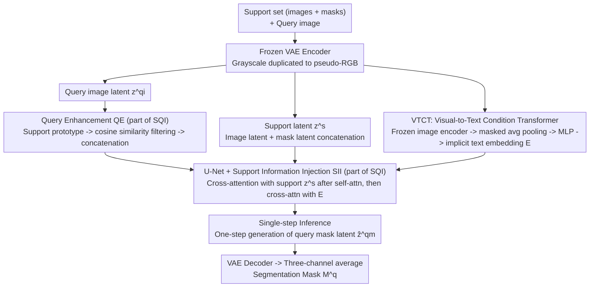

# SD-FSMIS: Adapting Stable Diffusion for Few-Shot Medical Image Segmentation

**Conference**: CVPR 2026  
**arXiv**: [2604.03134](https://arxiv.org/abs/2604.03134)  
**Code**: None  
**Area**: Medical Image Segmentation  
**Keywords**: few-shot segmentation, medical imaging, stable diffusion, cross-domain, foundation model

## TL;DR

Proposes SD-FSMIS, a framework that adapts pre-trained Stable Diffusion to few-shot medical image segmentation. Through a support-query interaction module and a visual-to-text condition transformer, it achieves efficient adaptation and demonstrates particularly outstanding performance in cross-domain scenarios.

## Background & Motivation

Few-shot medical image segmentation (FSMIS) aims to segment new categories using only a minimal number of annotated samples, addressing core challenges of data scarcity and domain shift in medical imaging. Existing methods primarily focus on designing more sophisticated matching networks, such as prototype networks and attention mechanisms; however, these architectures trained from scratch remain fragile in cross-domain scenarios.

The authors propose a paradigm shift: instead of designing increasingly complex task-specific architectures, they leverage the rich visual priors inherent in large-scale pre-trained generative models (e.g., Stable Diffusion). Diffusion models learn extensive texture, shape, and contextual representations from massive datasets (e.g., LAION-5B). These priors hold significant potential for dense prediction tasks but remain under-explored in FSMIS.

**Core Problem**: How to efficiently and directly adapt the general visual priors of SD to the FSMIS task?

## Method

### Overall Architecture

The core proposition of SD-FSMIS is a paradigm shift: rather than stacking more complex matching networks from scratch, it is better to directly borrow the general visual priors learned by Stable Diffusion on LAION-5B. The framework reuses the conditional generative architecture of SD, encoding both support and query sets into latent space using a frozen VAE (grayscale channels are replicated to pseudo-RGB). The U-Net then performs a single-step generation of the query mask latent representation under "textual conditions translated from the support set" before decoding back to pixels. Three designs solve specific issues: enabling the query to see the support (SQI, consisting of Support Information Injection (SII) and Query Enhancement (QE)), converting visual cues into conditions understandable by SD (VTCT), and achieving non-iterative results (single-step inference).

### Key Designs

**1. Support-Query Interaction Module (SQI): Enabling Few-Shot Matching in SD's Self-Attention with Minimal Changes**

SD is natively unaware of the "support-query" relationship, and attaching a complex matching head would revert to traditional approaches. SQI chooses to modify the U-Net minimally: an additional cross-attention layer (Support Information Injection, SII) is inserted after the standard self-attention, allowing query features to attend to support features as Keys and Values. This is followed by the original text cross-attention. The entire block operation is defined as $\hat{z}^q = \text{FFN}(\text{CAttn}(\text{CAttn}(\text{SAttn}(z^q), z^s), E))$. Parallelly, Query Enhancement (QE) is employed: a foreground prototype is obtained via masked average pooling of the support set, and its cosine similarity with the query latent representation is calculated. Locations exceeding a similarity threshold (0.7) are averaged to form a query prototype, which is concatenated back to the query latent to strengthen the matching signal. This reuses the representational power of SD’s pre-trained attention while injecting few-shot matching capabilities at minimal cost.

**2. Visual-to-Text Condition Transformer (VTCT): Translating Support Images into "Language Understood" by SD**

The condition interface of SD is text embeddings, whereas the support set provides visual cues, creating a misalignment. VTCT uses a frozen image encoder to extract support image features. After masked average pooling to obtain class prototypes, a learnable MLP projects these prototypes into the text embedding space to serve as conditions for the diffusion model. Ablation studies show that "visual conditions" significantly outperform "null text," indicating that this "visual-to-textual condition" carries much more category guidance than an empty prompt.

**3. Single-step Inference Design: Iteration-Free Diffusion for One-Step Mask Generation**

Diagnostic segmentation does not require the diversity of step-by-step sampling used in diffusion; iteration instead slows down inference. SD-FSMIS skips the iterative diffusion process during inference, generating the latent representation of the query mask in a single step. This is mapped back to pixel space via the VAE decoder and averaged across three channels to obtain the final segmentation mask, compressing inference to one step while maintaining accuracy.

### Loss & Training

The model is trained using an MSE loss between the predicted and ground truth query mask latent representations. It employs an episode-based meta-learning strategy (1-way 1-shot). Pseudo-labels generated by superpixel clustering are used as training annotations, requiring no explicit manual labeling. VAE weights remain frozen throughout, and only a small number of new parameters are trained.

## Key Experimental Results

### Main Results

| Dataset | Metric (Dice %) | Ours | Prev. SOTA (DIFD) | Gain |
|--------|-------------|------|-----------------|------|
| Abd-MRI Setting 1 | Mean Dice | 83.16 | 84.12 | Comparable |
| Abd-CT Setting 1 | Mean Dice | 83.66 | 80.19 | +3.47 |

### Ablation Study

| Configuration | Key Metric | Description |
|------|---------|------|
| Without SQI | Dice Decrease | Support-Query interaction is vital for adaptation |
| Without VTCT (null text) | Dice Decrease | Visual conditions provide more information than null embeddings |
| Without QE | Dice Decrease | Query enhancement provides beneficial prototype matching signals |

### Key Findings

- Achieves competitive results under standard FSMIS settings.
- Significantly outperforms SOTA methods in more challenging cross-domain scenarios, demonstrating superior generalization capabilities.
- Validates the significant potential of visual priors from large-scale generative models for data-efficient medical segmentation.

## Highlights & Insights

- **Paradigm Innovation**: Shifting from designing task-specific networks to adapting pre-trained foundation models marks a significant transition in the FSMIS field.
- The framework design is minimalist yet effective, achieving FSMIS adaptation with only minor modifications to SD.
- The VTCT module's approach of translating visual cues into a "language SD understands" is clever.
- Outstanding cross-domain generalization suggests that SD's general visual priors are indeed valuable in the medical domain.

## Limitations & Future Work

- Reliance on adapting SD to grayscale medical images (via channel replication) might lack elegance.
- Currently validated only on abdominal MRI/CT data; requires verification across more organs and modalities.
- While efficient, single-step inference might sacrifice opportunities for iterative refinement.

## Related Work & Insights

- Similar to DiffewS in utilizing diffusion models for few-shot segmentation, but SD-FSMIS is specifically adapted for medical scenarios whereas DiffewS targets natural images.
- Provides heuristic value for other dense prediction tasks requiring cross-domain generalization.

## Rating

- **Novelty**: ⭐⭐⭐⭐ — First systematic exploration of SD in FSMIS.
- **Technical Depth**: ⭐⭐⭐⭐ — Rational design of SQI and VTCT.
- **Experimental Thoroughness**: ⭐⭐⭐ — Dataset range could be broader.
- **Value**: ⭐⭐⭐⭐ — Cross-domain generalization has practical application value.

<!-- RELATED:START -->

## Related Papers

- [\[CVPR 2026\] Focus on Background: Exploring SAM's Potential in Few-shot Medical Image Segmentation with Background-centric Prompting](focus_on_background_exploring_sams_potential_in_few-shot_medical_image_segmentat.md)
- [\[CVPR 2026\] Universal-to-Specific: Dynamic Knowledge-Guided Multiple Instance Learning for Few-Shot Whole Slide Image Classification](universal-to-specific_dynamic_knowledge-guided_multiple_instance_learning_for_fe.md)
- [\[CVPR 2026\] Interpretable Cross-Domain Few-Shot Learning with Rectified Target-Domain Local Alignment](interpretable_cross-domain_few-shot_learning_with_rectified_target-domain_local_.md)
- [\[CVPR 2026\] MUSE: Harnessing Precise and Diverse Semantics for Few-Shot Whole Slide Image Classification](muse_harnessing_precise_and_diverse_semantics_for_few-shot_whole_slide_image_cla.md)
- [\[CVPR 2026\] Diffusion-Based Native Adversarial Synthesis for Enhanced Medical Segmentation Generalization](diffusion-based_native_adversarial_synthesis_for_enhanced_medical_segmentation_g.md)

<!-- RELATED:END -->
