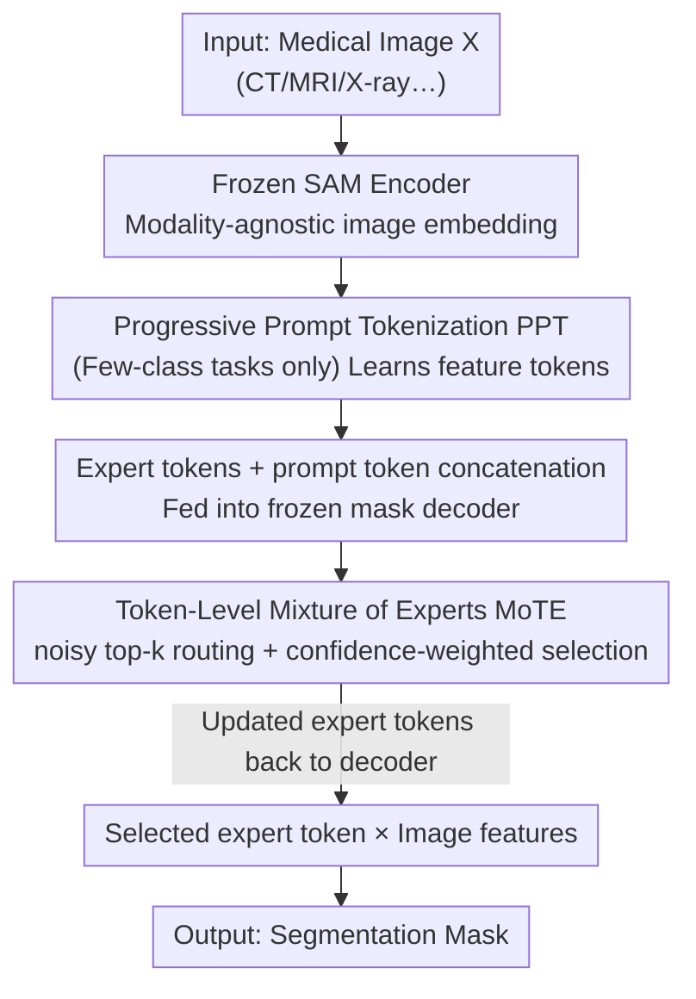

# SegMoTE: Token-Level Mixture of Experts for Medical Image Segmentation

**Conference**: CVPR 2026  
**Paper**: [CVF Open Access](https://openaccess.thecvf.com/content/CVPR2026/html/Lu_SegMoTE_Token-Level_Mixture_of_Experts_for_Medical_Image_Segmentation_CVPR_2026_paper.html)  
**Code**: None  
**Area**: Medical Imaging  
**Keywords**: Medical Image Segmentation, SAM Adaptation, Token-Level Mixture of Experts, Modality Adaptive, Low Annotation Cost

## TL;DR
SegMoTE freezes the entire SAM and embeds a set of learnable "expert tokens" and a Token-level MoE router (MoTE) only within the mask decoder. It dynamically selects experts based on the imaging modality and incorporates a Progressive Prompt Tokenization (PPT) module to achieve interaction-free segmentation. By training only 17M parameters using the MedSeg-HQ dataset (approx. 0.15M masks), which is less than 1% of the size of existing datasets, it achieves SOTA results in multi-modal medical segmentation.

## Background & Motivation
**Background**: Adapting foundation models like SAM (Segment Anything Model) from natural images to medical segmentation is currently mainstream. Common approaches include full-parameter fine-tuning (MedSAM), fine-tuning decoder layers (IMIS), or various Parameter-Efficient Fine-Tuning (PEFT) methods, often relying on massive datasets (e.g., SAM-Med2D with 4.6M images, IMed-361M).

**Limitations of Prior Work**: Two primary bottlenecks exist. First, a **lack of modality/task adaptation**—CT, MRI, and X-ray images exhibit high heterogeneity. Feeding multi-modal data indiscriminately into SAM causes the original output tokens to become "homogenized" during training, eroding the discriminative power between modalities and leading to poor OOD generalization. Second, **indiscriminate data scaling**—expanding datasets to pursue performance introduces significant supervisory noise and redundancy. This pulls the representation toward a new distribution, damaging SAM’s original capabilities (distribution shift / negative transfer), turning progress into a competition for data volume rather than representation design.

**Key Challenge**: The conflict lies between the need for modality-specific discriminative representations versus using unified output tokens for all modalities, and the goal of achieving generalization versus the risk of destroying pre-trained capabilities through data expansion. Essentially, it is the conflict between "serving heterogeneous modalities with a single set of representations" and "preserving SAM's original capabilities."

**Goal**: To enable the model to adapt to different modalities/anatomical tasks with **minimal changes to SAM and extremely low annotation costs**, while reducing dependence on manual prompts.

**Key Insight**: The "selecting experts based on input" mechanism of MoE is naturally suited for "selecting representations based on modality." This allows for modality-specific processing while adding only a small number of parameters and keeping the backbone frozen. Furthermore, by learning the "prompts" for sparse foreground tasks, interaction-free segmentation can be realized.

**Core Idea**: Replace unified output tokens with token-level MoE (MoTE) to dynamically activate expert tokens based on modality; replace "human-provided prompts" with "model-learned prompts" via Progressive Prompt Tokenization (PPT).

## Method

### Overall Architecture
SegMoTE extends a token-level expert router onto a frozen SAM. The frozen SAM encoder first extracts modality-agnostic image embeddings. For datasets with clear foreground-background classes (e.g., ISIC for dermoscopy, SZ-CXR for chest X-rays), the PPT module converts latent feature maps into semantically aligned "feature tokens" (multi-class tasks do not use PPT). These tokens are concatenated with a set of learnable expert tokens and original prompt tokens, then fed into decoder layers 1/2 of the mask decoder. Each layer performs self-attention, followed by token↔image bidirectional attention to interact with image embeddings. The expert tokens are then passed to the MoTE for dynamic expert selection and token updates. Updated expert tokens are fed back into the decoder, and finally, only the selected reinforced tokens are point-wise multiplied with image features to produce the segmentation mask. During training, the SAM backbone is fully frozen; only the MoTE (10M) and PPT (7M) modules, totaling 17M parameters, are updated. The loss function is a weighted combination of segmentation Dice loss and a router load-balancing loss.

### Key Designs

**1. Expert tokens: Providing each modality with a dedicated token to replace SAM's homogenized unified output tokens**

**Mechanism**: The original SAM mask prediction relies on a limited number of output tokens, which has restricted adaptation capacity for heterogeneous medical modalities and suffers from homogenization during training. SegMoTE introduces a set of learnable expert tokens $[N\times 256]$ (where $N$ depends on the number of modalities/task complexity), concatenated along the sequence dimension with original SAM output tokens $[4\times256]$ and prompt tokens. Expert tokens undergo self-attention in each decoder layer, followed by bidirectional attention (token→image to absorb visual features, and image→token) for updates. In the token→image phase, they integrate image visual features, geometric semantics of prompt tokens, and mask representations of other tokens before being passed to MoTE for dynamic weight updates. Ultimately, **only the selected expert token** is used for prediction, enabling differentiated processing of multi-modal images within the same batch. This preserves SAM's unified output modeling while gaining modality adaptation.

**2. MoTE Token-Level Mixture of Experts: Noisy top-k routing + confidence weighting for dynamic expert selection by modality**

**Mechanism**: Expert tokens alone are insufficient; the key is **selecting the correct token for each image** during inference. MoTE performs dynamic expert selection and fusion at the token level. Given expert tokens $X\in\mathbb{R}^{B\times T\times D}$, the router first calculates logits $L=XW_g\in\mathbb{R}^{B\times T\times E}$ (where $E$ is the number of experts). During training, a noisy top-k gate injects noise to prevent premature convergence to a single expert: $\tilde{L}=L+(\text{softplus}(XW_n)+\varepsilon)\odot Z,\ Z\sim\mathcal{N}(0,1)$. For each token, the top-k expert scores $s_{b,t}$ are retrieved. The maximum logit is used as token confidence $c_{b,t}=\max_j s_{b,t}[j]$, with the corresponding index $\text{idx}_{b,t}=\arg\max_j s_{b,t}[j]$. A softmax then yields token weights $G(\cdot)_{b,t}$ as a reliability measure to explicitly weight the representation $\tilde{z}_{b,t}=G(\cdot)_{b,t}\cdot h^{(\text{idx}_{b,t})}_{b,t}$, amplifying high-confidence tokens and suppressing low-confidence ones. Final prediction is driven only by the reinforced routed tokens, with expert selection and information focusing guided by both deterministic routing ($\text{idx}$) and confidence-weighted routing ($G$). Ablations show that different modalities indeed learn preferences (e.g., CHAOS-T1 frequently activates token 0, ISIC prefers token 2, SZ-CXR token 1, and AMOS-CT token 3), confirming that experts learn discriminative modality-task representations.

**3. Load Balancing Loss: Constraining with squared coefficient of variation to prevent expert over-utilization or idling**

**Design Motivation**: Token-level routing can lead to a few experts being overloaded while others remain idle, harming training stability and generalization. SegMoTE defines expert $e$'s importance as $\text{imp}_e=\sum_{b,t}G_{b,t,e}$ and load as $\text{load}_e=\sum_{b,t}\mathbb{1}(G_{b,t,e}>0)$. A balancing loss is constructed using the squared coefficient of variation $CV^2=\text{std}(x)^2/(\frac{1}{N}\sum_i x_i)^2$: $\mathcal{L}_{balance}=CV^2(\{\text{imp}_e\})+CV^2(\{\text{load}_e\})$. A smaller $CV^2$ indicates more uniform usage across experts, encouraging balanced utilization and improving stability. This term is integrated into the total loss with a small weight $\lambda_{balance}=0.01$, ensuring it does not override the primary segmentation objective.

**4. Progressive Prompt Tokenization (PPT): Learning "model-generated prompts" from "human-provided prompts" for interaction-free segmentation**

**Mechanism**: For sparse target tasks like ISIC or SZ-CXR with only background and a single target, traditional interactive segmentation still requires user clicks/boxes, creating an operational burden. PPT treats mask and text prompts as specific carriers of foreground information. By **randomly sampling** mask/text prompts, it uses learnable queries $Q$ through multi-head attention to focus on normalized image features. This allows feature tokens to progressively learn to distinguish foreground/background and capture key distributional cues during training. The attention-enhanced representation then passes through MLP projection and residual fusion to generate "feature-conditioned" prompt tokens. These serve as adaptive prompts aligned with the modality/anatomical context, enabling **inference without any human intervention**. The authors explicitly limit PPT to binary classification (clear foreground-background) tasks, as inter-class interference in multi-class segmentation makes prompt token mapping difficult.

### Loss & Training
Segmentation utilizes the Dice loss $\mathcal{L}_{seg}(y^E,y)=1-\frac{2\sum_i y^E_i y_i}{\sum_i y^E_i+\sum_i y_i}$. The total loss weights this with the load balancing loss: $\mathcal{L}_{total}=\mathcal{L}_{seg}+\lambda_{balance}\cdot\mathcal{L}_{balance}$, where $\lambda_{balance}=0.01$. The training data is the self-constructed MedSeg-HQ (integrating 12 public datasets, ~154,569 high-quality masks, 6 modalities, 100+ semantic classes, quality-checked by 5 experts based on clarity/contrast/entropy/foreground ratio/connected components). Images are resized to 512×512, split 9:1 at a patient-independent level. Optimization uses Adam (lr 1e-4, halved at 7/12 epochs) on 8×RTX 4090 with a total batch size of 10, using SAM-Base as default with a frozen backbone.

## Key Experimental Results

### Main Results
OOD Zero-shot Segmentation (box prompt, Dice, excerpts):

| Dataset | Category | SAM | SAM-Med2D | IMIS | Ours |
|--------|------|-----|-----------|------|------|
| ISLES | Ischemic stroke lesion | 55.00 | 67.93 | 71.24 | **77.30** |
| SegThor | Average (4 classes) | 76.55 | 79.06 | 80.52 | **83.39** |
| TotalSeg(MRI) | Average (12 abd. organs) | 67.11 | 66.72 | 70.62 | **71.48** |

Binary ISLES shows a ~7% improvement over the second-best; multi-class SegThor / TotalSeg(MRI) show ~+1% / +2% gains respectively; overall improvement of 1%~6% over the runner-up.

Joint training with unfrozen decoder (box prompt, Dice, excerpts):

| Dataset | SAM | SAM-Med2D | IMIS | Ours |
|--------|-----|-----------|------|------|
| ISIC2018 | 86.15 | 88.32 | 88.93 | **93.02** |
| SZ-CXR | 86.72 | 88.72 | 92.03 | **95.04** |
| CHAOS(T1) | 82.67 | 86.14 | 86.92 | **89.00** |
| BTCV | 77.82 | 80.52 | 82.24 | **84.51** |

Binary tasks see 3%~7% improvements over baselines after unfreezing.

### Ablation Study
Parameter scale and expert configuration:

| Configuration | Key Metrics | Description |
|------|---------|------|
| SAM(Large) | 308M learnable | Full training, resource heavy |
| MedSAM(Base) | 93M | Full decoder fine-tuning |
| IMIS(Base) | 29M | Fine-tuned decoder |
| **SegMoTE(Base)** | **17M (MoTE 10M + PPT 7M)** | Only ~1.4% of total SAM params, outperforms baselines |
| Num. Experts N:M=4:1 | OOD Optimal | Best for 4 modalities; significant drop at N=12 (Experts > Modalities) |
| PPT, Q=2 | ISIC2018 87.68 | Default config, Q=2 is sufficient |
| w/o PPT | ISIC2018 84.87 / ISLES 59.00 | Without PPT, OOD ISLES drops by ~6% |

### Key Findings
- **Quality over Quantity**: SegMoTE, trained on only 0.15M masks (less than 1% of existing datasets), outperforms baselines trained on massive mixed datasets in both in-domain and out-of-domain scenarios, validating "Data Quality + Representation Design > Blind Data Expansion."
- **Experts must match modalities**: N:M=4:1 is optimal. Performance degrades when the number of experts significantly exceeds modalities (N=12). Four experts are sufficient to cover core features, and additional modalities (like MR FLAIR) can also be absorbed.
- **Experts learn modality-specific routing**: Different datasets show stable preferences for specific tokens. Heatmaps reveal sparse, discrete "responsibility regions," providing interpretability.
- **PPT yields maximum benefit for OOD**: Removing PPT on ISLES (OOD binary task) leads to a ~6% drop, indicating that self-generating prompts from image features is particularly effective for cross-domain generalization; $Q=2$ is sufficient.

## Highlights & Insights
- **"Freeze backbone + replace tokens" is an elegant paradigm for low-cost SAM adaptation**: By not touching the encoder and avoiding full decoder fine-tuning—instead upgrading the "unified output token" to "expert tokens + MoE routing"—the model gains modality adaptation while preserving original SAM capabilities with only 17M parameters.
- **Aligning MoE's "input-based expert selection" with "modality-based representation selection"**: This mapping is natural, and the noisy top-k + confidence weighting makes routing both explorative and stable. Routing preference visualizations make the "black-box router" interpretable.
- **Learning "prompts" via PPT**: Using randomly sampled masks/text as weak foreground priors to learn adaptive prompt tokens via learnable queries achieves interaction-free inference for binary tasks. This logic can be transferred to other interactive segmentation tasks wishing to remove manual prompts.
- **Load balancing via $CV^2$** effectively and simply avoids expert collapse by directly constraining importance and load statistics.

## Limitations & Future Work
- **PPT applies only to binary classification**: The authors acknowledge that inter-class interference in multi-class segmentation makes prompt token mapping difficult. PPT is effective only for clear foreground-background tasks; multi-organ scenarios still require interactive prompts.
- **Number of experts requires modality-based pre-setting**: $N$ is strongly correlated with the number of modalities (N=12 leads to degradation). Changing datasets/modality combinations might require re-tuning the expert configuration, and a mechanism for automatically determining $N$ is missing.
- **2D and SAM-Base only**: Experiments primarily focused on 2D slices and SAM-Base. The authors look forward to but have not yet validated 3D data and medical video.
- **Dependence on MedSeg-HQ Quality Control**: High performance is partially due to high-quality masks screened via expert QC. This evaluation system (5 dimensions like clarity/contrast/entropy + 5-expert cross-validation) is costly and poses a high barrier for reproduction.

## Related Work & Insights
- **vs. MedSAM / IMIS (Full/Partial SAM fine-tuning)**: These rely on full-parameter or decoder fine-tuning with massive data expansion, leading to large parameter counts and susceptibility to distribution shift. Ours freezes the backbone, adds only 17M token-level modules, and outperforms them with 1% of the data. The difference lies in "Modified Representations vs. Data Stacking."
- **vs. Existing Medical MoE (MoSE, M4oE, PAMoE, ConvLoRA)**: Most still use unified output representations and do not directly address modality/task differences. Ours performs **token-level modality-aware routing**, assigning inputs to dedicated expert paths for more discriminative representations.
- **vs. Traditional Interactive Segmentation (Point/Box prompts)**: These depend on per-image user prompts, creating a high operational burden. Ours utilizes PPT for self-generated prompts and interaction-free inference in binary tasks, with better OOD generalization.

## Rating
- Novelty: ⭐⭐⭐⭐ The combination of token-level expert tokens + MoE routing to adapt SAM and learning prompts is novel; MoE and SAM adaptation individually are not.
- Experimental Thoroughness: ⭐⭐⭐⭐ Comprehensive in/out-domain tests, frozen/unfrozen settings, and multi-dimensional ablations on expert counts/Q/PPT; lacks 3D and video validation.
- Writing Quality: ⭐⭐⭐⭐ Clear chain of logic from motivation to module to formula to visualization. Expert routing heatmaps and preference statistics are persuasive.
- Value: ⭐⭐⭐⭐ Adapting SAM to multi-modal medical segmentation with extremely low annotation/parameter costs is highly attractive for practical applications.

<!-- RELATED:START -->

## Related Papers

- [\[CVPR 2026\] Divide, Conquer, and Aggregate: Asymmetric Experts for Class-Imbalanced Semi-Supervised Medical Image Segmentation](divide_conquer_and_aggregate_asymmetric_experts_for_class-imbalanced_semi-superv.md)
- [\[CVPR 2026\] From Infusion to Assimilation Distillation for Medical Image Segmentation](from_infusion_to_assimilation_distillation_for_medical_image_segmentation.md)
- [\[NeurIPS 2025\] Mamba Goes HoME: Hierarchical Soft Mixture-of-Experts for 3D Medical Image Segmentation](../../NeurIPS2025/medical_imaging/mamba_goes_home_hierarchical_soft_mixture-of-experts_for_3d_medical_image_segmen.md)
- [\[CVPR 2026\] SAT-RRG: LLM-Guided Self-Adaptive Training for Radiology Report Generation with Token-Level Push–Pull Optimization](sat-rrg_llm-guided_self-adaptive_training_for_radiology_report_generation_with_t.md)
- [\[CVPR 2026\] PMRNet: Physics-informed Multi-scale Refinement Network for Medical Image Segmentation](pmrnet_physics-informed_multi-scale_refinement_network_for_medical_image_segment.md)

<!-- RELATED:END -->
