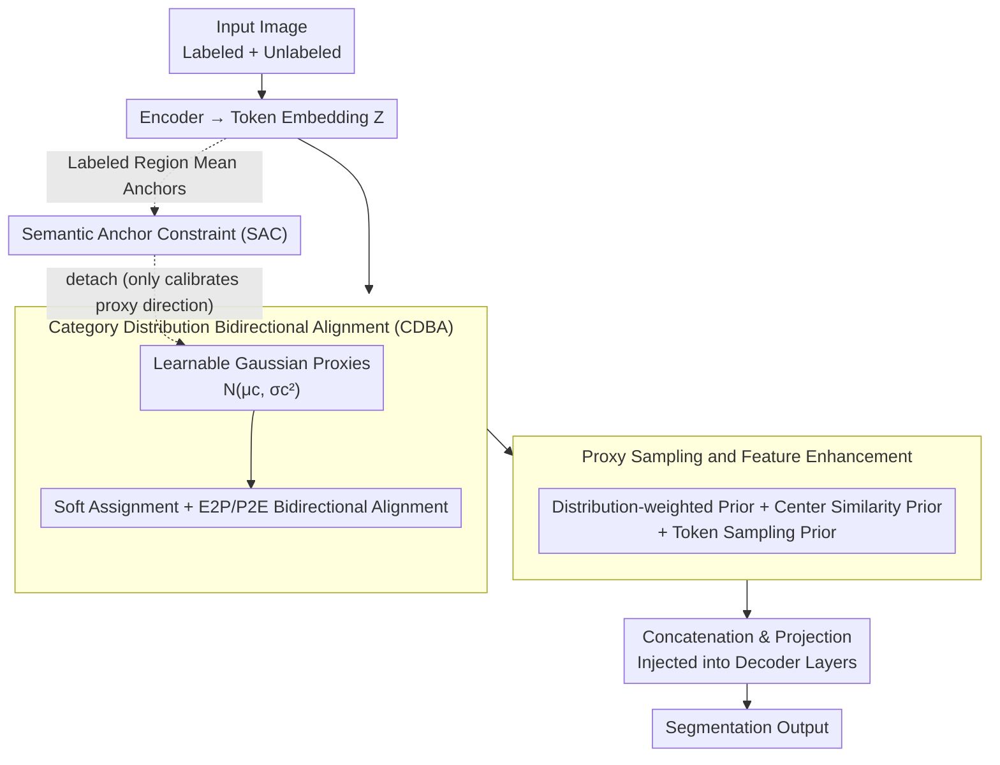

# Semantic Class Distribution Learning for Debiasing Semi-Supervised Medical Image Segmentation

**Conference**: CVPR 2026  
**arXiv**: [2603.05202](https://arxiv.org/abs/2603.05202)  
**Code**: [GitHub](https://github.com/Zyh55555/SCDL)  
**Area**: Medical Imaging  
**Keywords**: Semi-supervised segmentation, Class imbalance, Distribution learning, Proxy distribution, Semantic anchors

## TL;DR

Ours proposes SCDL (Semantic Class Distribution Learning), a plug-and-play module that learns structured class-conditional feature distributions through Category Distribution Bidirectional Alignment (CDBA) and aligns them with learnable class proxies. Combined with Semantic Anchor Constraints (SAC), it utilizes labeled data to guide proxies toward correct semantics, alleviating supervision and representation biases in semi-supervised medical image segmentation and achieving significant improvements on tail organs.

## Background & Motivation

1. **Background**: Semi-supervised medical image segmentation (SSMIS) utilizes a small amount of labeled data + a large amount of unlabeled data for training. Mainstream methods include consistency regularization, contrastive learning, and pseudo-labeling. However, medical image datasets generally suffer from severe class imbalance—large organs (e.g., liver) occupy many pixels, while small organs (e.g., esophagus, adrenal gland) have very few.

2. **Limitations of Prior Work**: The combination of class imbalance and semi-supervised mechanisms leads to two levels of bias. (1) Supervision bias: Pixel-level gradients dominated by head classes and the self-reinforcement effect of pseudo-labels bias the supervision toward majority classes. (2) Representation bias: Existing methods (reweighting, output calibration) only operate at the loss or output layers, lacking direct constraints on class-conditional feature distributions. This results in compact head-class features while tail-class features remain divergent, causing tail classes to be "swallowed" by head classes in the feature space.

3. **Key Challenge**: Unlabeled data is primarily used for local consistency regularization and is rarely used to explicitly correct the skew in class-conditional feature distributions. Consequently, unlabeled data does not help minority classes establish robust feature representations, and the imbalance persists.

4. **Goal**: To directly alleviate representation bias caused by class imbalance at the feature space level, rather than only at the loss or output levels.

5. **Key Insight**: Learn a proxy distribution (Gaussian distribution) for each semantic class. Through bidirectional alignment constraints, embeddings are pulled toward corresponding proxies while proxies are pushed away from non-target embeddings. Simultaneously, semantic anchors from labeled regions provide correct semantic supervision for the proxies.

6. **Core Idea**: By learning class-conditional proxy distributions and performing bidirectional alignment, the class distribution structure is directly reshaped in the feature space, ensuring stable representation learning signals even for minority classes.

## Method

### Overall Architecture

SCDL is a plug-and-play module that can be attached to existing semi-supervised segmentation networks. The pipeline revolves around "constructing a proxy distribution for each class in the feature space": After the encoder outputs token embeddings, CDBA maintains a learnable Gaussian proxy distribution for each semantic class and performs bidirectional alignment between embeddings and proxies. Then, samples are drawn from the proxy distributions to construct structured priors that are injected into each decoder layer, providing stable representations for tail classes. Concurrently, SAC extracts semantic anchors from labeled regions to calibrate the correct semantic direction for these randomly initialized proxies. The entire mechanism does not change the baseline architecture, only adding a set of extra constraints in the embedding space.

### Key Designs

**1. Category Distribution Bidirectional Alignment (CDBA): Preventing tail classes from being swallowed**

Existing methods mostly perform reweighting at the loss or output level without addressing class-conditional feature distributions. This results in head classes having compact features while tail classes are divergent and "swallowed." CDBA operates directly in the embedding space: it maintains a learnable Gaussian proxy distribution $p(u|c) = \mathcal{N}(\mu_c, \text{diag}(\sigma_c^2))$ for each semantic class $c$, and calculates the soft assignment of each token embedding to each proxy as $P(c|z_{i,l}) = \text{softmax}_c(\cos(z_{i,l}, \mu_c))$. The alignment is bidirectional—Embedding-to-Proxy (E2P) pulls the embedding toward its assigned proxy, while Proxy-to-Embedding (P2E) ensures each proxy learns to distinguish between belonging and non-belonging embeddings:

$$\mathcal{L}_{E2P} = \sum P(c|z) \cdot [1 - \cos(z, \mu_c)], \qquad \mathcal{L}_{P2E} = \frac{1}{C}\sum \exp\big(-(\mathcal{E}_c^+ - \mathcal{E}_c^-)\big).$$

The mechanism for debiasing lies in the soft assignment: every embedding contributes to the gradient update of all proxies according to its weight. Thus, even tail classes like the esophagus receive continuous learning signals and are not drowned out by frequency bias. E2P provides attraction to proxies, while P2E provides discriminative power, together reshaping the distributions in the feature space.

**2. Proxy Sampling and Feature Enhancement: Converting learned distributions into semantic priors**

Learning the distribution is only the first step; it must assist the segmentation decoder. This step samples from the proxy distributions to construct three complementary priors for the decoder: the distribution-weighted prior $\mathbf{r}^{dist}$ samples $S$ points from the distribution and weights the proxy mean by the average cosine similarity between embeddings and samples, thus preserving variance and uncertainty info; the center similarity prior $\mathbf{r}^{center}$ uses the cosine similarity between the embedding and proxy means for complementary deterministic signals; the token sampling prior $\mathbf{z}^{sam}$ applies local perturbation sampling to each token to enhance robustness. These are concatenated and passed through a lightweight projection layer into the decoder. 

**3. Semantic Anchor Constraint (SAC): Providing correct semantic starting points**

Proxies are randomly initialized and can easily converge to incorrect class relationships without constraints. SAC uses labeled data as a safeguard: for each class, ground-truth masks filter non-target regions to extract the mean of class-aware embeddings as a semantic anchor $\text{anchor}_c = \frac{1}{|\mathcal{Z}_c|}\sum_{z \in \mathcal{Z}_c} z$. The proxy mean is then pulled toward the anchor using cosine similarity:

$$\mathcal{L}_{SAC} = \frac{1}{C}\sum [1 - \cos(\mu_c, \text{anchor}_c)].$$

The anchors are detached during backpropagation, so SAC only updates the proxies without disturbing the encoder. It relies on the "deterministic signal" of labeled data—even tiny amounts of labels suffice to fix the proxy direction, allowing subsequent training to refine precision. 

### Loss & Training

Total loss = Baseline segmentation loss + $\mathcal{L}_{E2P}$ + $\mathcal{L}_{P2E}$ + $\mathcal{L}_{SAC}$. The weight decay for the SCDL module is set to 1e-4. Other configurations vary with the baseline (e.g., GenericSSL, DHC, GA-CPS). Training is conducted with a batch size of 4 on NVIDIA A40 GPUs.

## Key Experimental Results

### Main Results

Results on Synapse (20% labels) and AMOS (5% labels) datasets:

| Method | Synapse DSC↑ | Synapse ASD↓ | AMOS DSC↑ | AMOS ASD↓ |
|------|-------------|-------------|----------|----------|
| GenericSSL Baseline | 55.94 | 6.14 | 35.73 | 45.82 |
| SCDL-GenericSSL | **58.90 (+2.96)** | **5.79** | **47.35 (+11.62)** | **22.84** |
| DHC Baseline | 46.16 | 10.04 | 40.11 | 40.65 |
| SCDL-DHC | **49.17 (+3.01)** | 10.59 | **49.28 (+9.17)** | **17.47** |
| GA-CPS Baseline | 66.29 | 5.44 | 50.90 | 13.77 |
| SCDL-GA-CPS | **67.50 (+1.21)** | **3.32** | **61.57 (+10.67)** | 10.08 |
| GA-MagicNet Baseline | 66.00 | 3.42 | 59.15 | 8.66 |
| SCDL-GA-MagicNet | **66.75 (+0.75)** | 3.65 | **62.16 (+3.01)** | **5.65** |

Significant improvement on tail organs (Synapse, SCDL-DHC vs. DHC):

| Organ | DHC | SCDL-DHC | Gain |
|------|-----|----------|------|
| Portal & Splenic Vein (PSV) | 30.7 | 42.6 | +11.9 |
| Esophagus (Es) | 14.7 | 23.5 | +8.8 |
| Right Adrenal Gland (RAG) | 27.9 | 36.7 | +8.8 |

Drastic recovery on AMOS (SCDL-DHC): Right adrenal gland 0%→33.9%, Left adrenal gland 0%→30.3%.

### Ablation Study

On Synapse (GA-CPS baseline):

| Config | DSC↑ | ASD↓ | Note |
|------|------|------|------|
| Baseline | 66.29 | 5.44 | GA-CPS |
| + CDBA | 66.77 (+0.48) | 6.24 | DSC increases but ASD rises |
| + CDBA + SAC | **67.50 (+1.21)** | **3.32** | SAC addition causes ASD to drop by 2.92 |

### Key Findings

- CDBA alone can improve DSC but may harm ASD (boundary quality); the addition of SAC is crucial as it improves both DSC and boundary precision significantly.
- SCDL gains are concentrated on tail classes/small organs: On AMOS with 5% labels, DHC's Dice for Adrenal Glands recovered from 0% to ~30%, indicating SCDL effectively prevents minority classes from being ignored.
- The improvement is moderate on strong baselines (e.g., +0.75% for GA-MagicNet) but substantial on weaker ones (e.g., +11.62% for GenericSSL on AMOS), suggesting SCDL is adept at correcting severe class bias.
- ASD improvement is particularly notable after adding SAC (decreasing from 6.24 to 3.32), showing semantic anchors help improve boundary geometry quality.

## Highlights & Insights

- **Plug-and-play Design**: SCDL can be seamlessly integrated into any existing SSMIS method without modifying the base architecture, enhancing its practical value.
- **Soft Assignment Alleviates Frequency Bias**: Unlike hard assignment, every embedding influences the learning of all proxies via soft weights, ensuring minority class proxies receive continuous gradients even with few samples.
- **Complementary Prior Design**: Combining distribution-weighted (uncertainty), center similarity (certainty), and token sampling (robustness) priors provide a comprehensive semantic signal to the decoder.
- **Distribution-level Learning with Unlabeled Data**: Moving beyond simple consistency regularization to model global class distributions with unlabeled data represents an important paradigm shift.

## Limitations & Future Work

- Proxies assume isotropic Gaussians (diagonal covariance), which may lack the flexibility to represent complex class boundary shapes.
- SAC uses a simple mean for semantic anchors, which might be insufficient for multi-modal distributions (e.g., organs with high appearance variance across slices).
- The rise in ASD when using CDBA alone suggests that distribution alignment without semantic supervision may introduce instability.
- Validation is limited to CT multi-organ segmentation; experiments on other modalities (MRI, pathology, retina) are currently missing.

## Related Work & Insights

- **vs. DHC**: DHC uses dynamic hybrid curriculum learning for semi-supervised imbalance. SCDL-DHC achieves a 3%+ DSC gain over DHC with better results on tail classes.
- **vs. GA-MagicNet/GA-CPS**: GA series use geometry-aware augmentation. SCDL provides an orthogonal distribution-level solution, and the two can be combined.
- **vs. CLD**: CLD uses contrastive distribution learning but primarily at the output level; SCDL directly constrains class-conditional distributions in the embedding space.

## Rating

- Novelty: ⭐⭐⭐⭐ Combination of bidirectional alignment and semantic anchors for distributions is novel.
- Experimental Thoroughness: ⭐⭐⭐⭐ Systematic validation across four baselines and two datasets, though limited to CT.
- Writing Quality: ⭐⭐⭐⭐ Clear problem definition with deep analysis of supervision/representation/distribution biases.
- Value: ⭐⭐⭐⭐ Plug-and-play module offers direct value to the SSMIS community.

<!-- RELATED:START -->

## Related Papers

- [\[CVPR 2026\] Divide, Conquer, and Aggregate: Asymmetric Experts for Class-Imbalanced Semi-Supervised Medical Image Segmentation](divide_conquer_and_aggregate_asymmetric_experts_for_class-imbalanced_semi-superv.md)
- [\[CVPR 2026\] SemiGDA: Generative Dual-distribution Alignment for Semi-Supervised Medical Image Segmentation](semigda_generative_dual-distribution_alignment_for_semi-supervised_medical_image.md)
- [\[CVPR 2026\] Semi-supervised Echocardiography Video Segmentation via Anchor Semantic Awareness and Continuous Pseudo-label Reforging](semi-supervised_echocardiography_video_segmentation_via_anchor_semantic_awarenes.md)
- [\[CVPR 2026\] A Semi-Supervised Framework for Breast Ultrasound Segmentation with Training-Free Pseudo-Label Generation and Label Refinement](a_semi-supervised_framework_for_breast_ultrasound_segmentation_with_training-fre.md)
- [\[CVPR 2026\] Adaptation of Weakly Supervised Localization in Histopathology by Debiasing Predictions](adaptation_of_weakly_supervised_localization_in_histopathology_by_debiasing_pred.md)

<!-- RELATED:END -->
