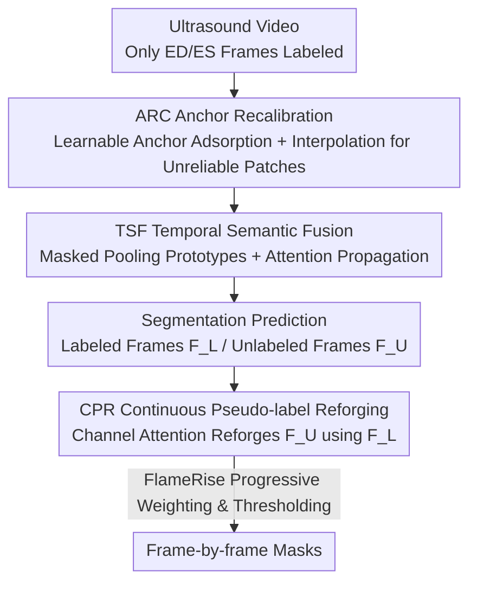

# Semi-supervised Echocardiography Video Segmentation via Anchor Semantic Awareness and Continuous Pseudo-label Reforging

**Conference**: CVPR 2026  
**Paper**: [CVF Open Access](https://openaccess.thecvf.com/content/CVPR2026/html/Fang_Semi-supervised_Echocardiography_Video_Segmentation_via_Anchor_Semantic_Awareness_and_Continuous_CVPR_2026_paper.html)  
**Code**: https://github.com/YunPeng-Fang/EchoForge  
**Area**: Medical Imaging  
**Keywords**: Echocardiography segmentation, semi-supervised video segmentation, learnable anchors, pseudo-labels, temporal consistency

## TL;DR
EchoForge utilizes a set of learnable anchors to recalibrate noisy ultrasound regions and propagates anatomical semantic prototypes across frames. By employing a "progressive reforging" pseudo-label strategy, it fully exploits unlabeled frames, achieving real-time and precise echocardiography video segmentation under extremely sparse supervision where only ED/ES frames are annotated.

## Background & Motivation

**Background**: Echocardiography is the primary diagnostic tool for cardiovascular diseases. Automatic segmentation of structures like the left ventricular endocardium is a prerequisite for measuring clinical indices such as Ejection Fraction (EF) and End-Diastolic/End-Systolic Volumes (EDV/ESV). Mainstream methods have evolved from early frame-by-frame 2D CNNs to incorporating optical flow for temporal consistency, and recently to leveraging the strong representations of foundation models like SAM.

**Limitations of Prior Work**: Ultrasound images are inherently contaminated by speckle noise and artifacts, leading to blurred target boundaries. The heart undergoes significant shape and scale changes during contraction and relaxation. Moreover, manual annotation is extremely expensive, and clinical data often **only provide labels for the end-diastolic (ED) and end-systolic (ES) frames**. Frame-by-frame CNNs ignore temporal dynamics and are sensitive to noise; optical flow generates erroneous motion fields in low signal-to-noise ratio ultrasound; and directly applying SAM fails to capture temporal dynamics.

**Key Challenge**: The contradiction between extremely sparse supervision signals (only two labeled frames per video) and the requirement for accurate segmentation across the entire cardiac cycle. Existing pseudo-label methods attempt to utilize intermediate frames but suffer from the fatal flaw where **initial noisy pseudo-labels are continuously propagated and amplified**. Furthermore, teacher-student or cross-pseudo-supervision paradigms are easily biased by annotated keyframes, failing to learn robust representations for unlabeled frames.

**Goal**: Under a semi-supervised setting with only ED/ES annotations, Ours aims to (1) suppress speckle noise and stabilize blurred boundaries; (2) maintain spatiotemporal consistency of anatomical structures across frames; and (3) make pseudo-labels for intermediate unlabeled frames usable and progressively improved during training.

**Key Insight**: Instead of relying solely on global attention (which can be distracted by noise), the authors introduce a small set of "magnet-like" learnable anchor vectors that actively adsorb feature patches most similar to the foreground/background to stabilize uncertain regions. Simultaneously, labeled frames are treated as reliable reference sources to "reforge" the pseudo-labels of unlabeled frames.

**Core Idea**: Utilize **Anchor Semantic Awareness (ASA)** to calibrate noise-sensitive uncertain regions to reliable prototypes, followed by **Continuous Pseudo-label Reforging (CPR) + FlameRise curriculum scheduling** to continuously inject sparse annotation information into unlabeled frames.

## Method

### Overall Architecture
EchoForge is a semi-supervised echocardiography video segmentation framework. The input is an ultrasound video (only ED/ES frames are annotated), and the output is the segmentation mask for every frame in the sequence. The architecture consists of two main modules in series: first, **ASA (Anchor Semantic Awareness)** performs spatial purification and temporal propagation of encoded features. It contains two sub-modules—ARC (Anchor Recalibration) for noise suppression and TSF (Temporal Semantic Fusion) for consistency. Built upon ASA is **CPR (Continuous Pseudo-label Reforging)**, which uses features from labeled frames to reforge pseudo-labels for unlabeled frames, coordinated with the **FlameRise** strategy to progressively release pseudo-label supervision.

### Key Designs

**1. ARC Anchor Recalibration: Pulling noisy uncertain regions back to reliable prototypes using learnable anchors**

To address the issue where speckle noise disrupts global attention and blurs boundaries, ARC avoids using bounding boxes and instead maintains a set of **learnable foreground/background anchor vectors**. These carry initial foreground/background information and act like magnets to adsorb feature patches in the ultrasound background that most resemble the target. During initialization, channel-wise softmax is applied to encoded feature maps $X\in\mathbb{R}^{C\times H\times W}$ via $1\times1$ convolutions to obtain foreground/background weights $M_i(x,y)$. Initial anchors are aggregated via global weighted average pooling: $a_i^{(0)}=\frac{\sum_{x,y}M_i(x,y)X(x,y)}{\sum_{x,y}M_i(x,y)}$. Subsequently, KNN identifies the $K$ nearest pixel neighbors $N_i$ in the feature space for each anchor. $N_i$ and $a_i^{(0)}$ are fed into a Feature Fusion module (cross-attention + residual) to get updated anchors $a_i$. Finally, the feature map is split into non-overlapping patches, and cosine similarity between each patch and both anchors is calculated to obtain foreground/background probabilities $s^{FG}_k, s^{BG}_k$. High-confidence patches retain original features, while patches falling in the uncertain interval $[0.4, 0.6]$ are dynamically weighted and linearly interpolated toward the more confident anchor. This calibrates only "uncertain" regions, purifying noise without destroying established structures.

**2. TSF Temporal Semantic Fusion: Propagating anatomical prototypes to stabilize the deforming left ventricle**

To tackle temporal inconsistency caused by the drastic shape changes of the left ventricle, TSF extracts and propagates key anatomical prototypes above ARC. It first performs masked pooling on reference frame features $F_r$ and their masks $m_i^r$ to obtain a set of semantic tokens: $t_{\mathrm{sem},i}=\frac{1}{\sum_{u,v}m_i^r(u,v)}\sum_{u,v}m_i^r(u,v)F_r(u,v)$, stacked as $T_{sem}\in\mathbb{R}^{N\times C}$. Then, an In-context Fusion module (Transformer block: self-attention + cross-attention + FFN) models the relationship between the reference frame and the target frame $F_t$, where $T_{sem}$ serves as queries and target patch tokens serve as keys/values. This yields enhanced target features $F'_t$ and semantic prototypes $P_{sem}$. Finally, a set of learnable queries $Q$ interacts deeply with $P_{sem}$ (using self-attention within each, and masked cross-attention for the query branch using $F'_t$ as values, followed by FFN) to obtain $Q_{final}$ and $P_{final}$ for joint mask generation. Essentially, "anatomical semantics confirmed in previous frames" are injected into the current frame via attention, enhancing both boundary accuracy and spatiotemporal consistency.

**3. CPR Continuous Pseudo-label Reforging + FlameRise: Improving pseudo-label quality through training**

To prevent the amplification of initial noise and frame bias in existing methods, CPR uses a lightweight channel attention to reforge "reliable semantics of labeled frames" into unlabeled ones. It splits predicted features into labeled $F^L$ and unlabeled $F^U$, performing **channel-level** cross-attention: $A=\mathrm{softmax}(\mathrm{IN}(Q^TK))$ and $\hat{F}^U=AV^T$, where $Q, K, V$ are linear mappings of $F^L, F^U, F^U$ respectively. Reconstructed features are semantically aligned to generate new pseudo-labels $\hat{y}^U$. To avoid overfitting early noisy predictions, FlameRise allows pseudo-label supervision to increase gradually: the pseudo-label weight $\lambda(e)$ is 0 before the burn-in epoch $E_0$ and linearly increases to $\lambda_{\max}$ between $E_0$ and $E_1$. Meanwhile, the confidence threshold $\tau(e)$ linearly decreases from $\tau_0$ to $\tau_1$, calculating unsupervised loss only on high-confidence pixels. This curriculum approach avoids locking in errors during early stages.

### Loss & Training
The total loss consists of Dice loss for labeled frames, BCE loss for boundary refinement, and unsupervised loss for unlabeled frames:

$$\mathcal{L}_{\text{total}}=\mathcal{L}_{\text{bce}}(P_i,G_i)+\mathcal{L}_{\text{dice}}(P_i,G_i)+\mathcal{L}_{U(e)}(P_i,\hat{y}^U)$$

where $\hat{y}^U$ denotes the pseudo-labels reforged by CPR, and the weight and threshold for $\mathcal{L}_{U(e)}$ are scheduled by FlameRise. The backbone is an ImageNet-pre-trained ResNet-50, optimized with Adam for 50 epochs using polynomial learning rate decay (initial $1\times10^{-4}$, power 0.9). Videos are uniformly sampled to 10 frames.

## Key Experimental Results

Datasets used are CAMUS (500 cases, full-frame annotation, but only ED/ES used for training) and EchoNet-Dynamic (10,030 clips, only ED/ES labeled). Two evaluation variants were derived from CAMUS: CAMUS-Semi (evaluated only on ED/ES frames) and CAMUS-Full (evaluated on all frames). Metrics include mDice (higher is better), mHD (lower is better), ASD (mm for CAMUS / pixels for EchoNet, lower is better), as well as Pearson correlation (corr) and mean bias for LVEF.

### Main Results

| Dataset | Method | mDice↑ | mHD↓ | ASD↓ | corr↑ | bias |
|--------|------|--------|------|------|-------|------|
| CAMUS-Semi | DSA (2024, Prev. SOTA) | 93.65 | 3.45 | 1.25 | 0.891 | 0.52 |
| CAMUS-Semi | MemSAM (2024, SAM-based) | 93.26 | 4.04 | 1.49 | 0.788 | 4.78 |
| CAMUS-Semi | **EchoForge** | **94.89** | **3.12** | **1.18** | **0.913** | 0.23 |
| EchoNet-Dynamic | DSA (2024) | 92.75 | 3.22 | 1.15 | 0.871 | -0.63 |
| EchoNet-Dynamic | **EchoForge** | **93.63** | **3.05** | **1.02** | **0.887** | -0.51 |

EchoForge outperforms various SOTA models including Cutie, VideoMamba, CLAS, TCS, PKEchoNet, DSA, MemSAM, and P-Mamba across all standard metrics on both benchmarks. Wilcoxon rank-sum tests for mDice yield P-values < 0.05, indicating statistically significant improvements. mDice on CAMUS-Full decreased by only ~0.5% compared to CAMUS-Semi (94.36 vs 94.89), demonstrating robust temporal consistency throughout the cardiac cycle.

### Ablation Study

| Configuration | TSF | ARC | CPR | mDice↑ | mHD↓ | ASD↓ |
|------|-----|-----|-----|--------|------|------|
| I (Baseline) |  |  |  | 88.52 | 6.32 | 2.15 |
| II | ✓ |  |  | 92.36 | 4.02 | 1.60 |
| III | ✓ | ✓ |  | 93.43 | 3.38 | 1.34 |
| IV (Full) | ✓ | ✓ | ✓ | **94.89** | **3.12** | **1.18** |

Ablation on the number of anchors: mDice for 1/2/3/4 anchors was 94.52/94.89/94.96/94.91, but FPS dropped sharply from 92 to 23. The authors selected 2 anchors as a trade-off between accuracy and efficiency.

### Key Findings
- Stepwise addition of the three components leads to consistent gains: TSF increases the baseline from 88.52 to 92.36 (+3.84, largest contribution, indicating temporal semantic propagation is core); ARC adds +1.07; CPR adds +1.46. All three are indispensable.
- Efficiency: EchoForge has 67M parameters, 125G FLOPs, and runs at 46 FPS, meeting clinical real-time (>25 FPS) requirements. Compared to MemSAM (257M, 13 FPS), it is over 3x faster with higher accuracy, achieving a superior accuracy-efficiency trade-off.
- Diminishing returns for the number of anchors: Increasing from 2 to 3 anchors only improved mDice by 0.07 while dropping FPS from 46 to 35, suggesting a small number of anchors is sufficient to cover foreground/background semantic centers.

## Highlights & Insights
- **"Learnable Anchors + Calibrate only Uncertain Zones"** is clever: replacing uniform response in global attention with directional interpolation in the $[0.4, 0.6]$ confidence band purifies speckle noise while preserving confirmed structures. This is a reusable idea for low SNR medical imaging.
- **FlameRise Curriculum Scheduling** directly tackles semi-supervised pain points: pseudo-labels are filthiest early on, so the strategy starts with burn-in, strict thresholds, and low weights, then increases involvement as the model strengthens. This dual scheduling of weight and threshold is transferable to any pseudo-label self-training task.
- **Treating Labeled Frames as "Semantic Reforging Sources"** (CPR uses $F^L$ as query to reforge $F^U$) is an efficient reuse of sparse annotation information, offering better resistance to keyframe bias than simple teacher-student pseudo-label generation.

## Limitations & Future Work
- The method was trained and evaluated under fixed cropping assumptions for ED frame starts and ES frame ends; robustness to non-standard acquisitions or misaligned frame sequences in real clinical videos is not fully verified.
- Validation was limited to left ventricle-related segmentation on CAMUS and EchoNet-Dynamic; generalization to more complex structures like the right ventricle or valves and different ultrasound hardware remains to be explored.
- Numerous hyperparameters exist (number of anchors, FlameRise's $E_0, E_1, \lambda_{\max}, \tau_0, \tau_1$). The authors did not provide a systematic analysis of their sensitivity or the necessity for retuning across different datasets.

## Related Work & Insights
- **vs. Frame-by-frame 2D CNN / Optical Flow (CLAS, TCS)**: These either ignore temporal cues or rely on noise-sensitive optical flow. EchoForge replaces explicit motion estimation with TSF's semantic prototype propagation, which is more stable in low SNR ultrasound.
- **vs. SAM-based (MemSAM)**: MemSAM leverages foundation model representations but lacks temporal precision and is slow. EchoForge achieves higher accuracy with a lighter structure (46 FPS vs. 13 FPS), making it more suitable for real-time clinical use.
- **vs. Other Pseudo-label Methods (CLAS, TCS)**: These are prone to noise amplification. EchoForge's CPR channel attention reforging + FlameRise progressive scheduling flips the "growing noise" trend into "increasingly clean" pseudo-labels.

## Rating
- Novelty: ⭐⭐⭐⭐ The combination of learnable anchor recalibration and continuous pseudo-label reforging is novel in the context of semi-supervised ultrasound segmentation, though components draw from established attention and self-training concepts.
- Experimental Thoroughness: ⭐⭐⭐⭐ Solid results on two benchmarks against eight SOTA models with statistical testing and efficiency/anchor-count ablations; lacks cross-device and multi-structure generalization analysis.
- Writing Quality: ⭐⭐⭐⭐ Clear motivations and complete visualizations, though some formula layouts and symbols should be verified against the original text.
- Value: ⭐⭐⭐⭐ achieving real-time, high-precision segmentation with only ED/ES labels provides significant practical value for reducing clinical annotation costs.

<!-- RELATED:START -->

## Related Papers

- [\[CVPR 2026\] A Semi-Supervised Framework for Breast Ultrasound Segmentation with Training-Free Pseudo-Label Generation and Label Refinement](a_semi-supervised_framework_for_breast_ultrasound_segmentation_with_training-fre.md)
- [\[CVPR 2026\] Semantic Class Distribution Learning for Debiasing Semi-Supervised Medical Image Segmentation](semantic_class_distribution_learning_for_debiasing.md)
- [\[CVPR 2026\] Divide, Conquer, and Aggregate: Asymmetric Experts for Class-Imbalanced Semi-Supervised Medical Image Segmentation](divide_conquer_and_aggregate_asymmetric_experts_for_class-imbalanced_semi-superv.md)
- [\[AAAI 2026\] ProPL: Universal Semi-Supervised Ultrasound Image Segmentation via Prompt-Guided Pseudo-Labeling](../../AAAI2026/medical_imaging/propl_universal_semi-supervised_ultrasound_image_segmentation_via_prompt-guided_.md)
- [\[CVPR 2026\] OSA: Echocardiography Video Segmentation via Orthogonalized State Update and Anatomical Prior-aware Feature Enhancement](osa_echocardiography_video_segmentation_via_orthogonalized_state_update_and_anat.md)

<!-- RELATED:END -->
