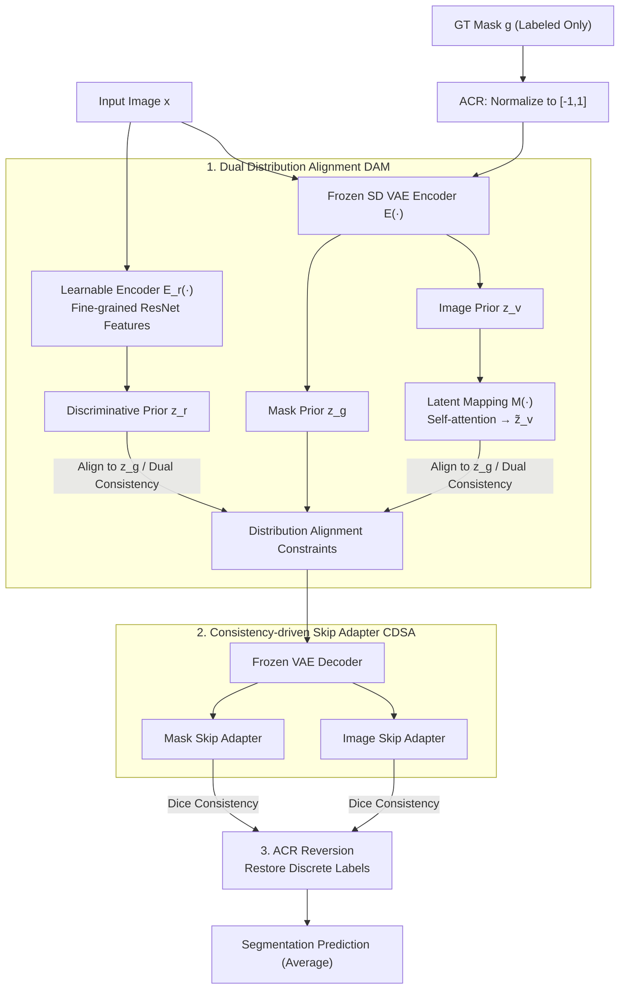

# SemiGDA: Generative Dual-distribution Alignment for Semi-Supervised Medical Image Segmentation

**Conference**: CVPR 2026  
**arXiv**: [2604.23274](https://arxiv.org/abs/2604.23274)  
**Code**: https://github.com/taozh2017/SemiGDA (Available)  
**Area**: Medical Image / Semi-supervised Segmentation / Generative Segmentation  
**Keywords**: Semi-supervised medical segmentation, generative segmentation, latent space distribution alignment, Stable Diffusion VAE, consistency learning

## TL;DR
SemiGDA shifts semi-supervised medical image segmentation from a "pixel-wise discriminative" to a "generative" paradigm. By utilizing two structurally distinct encoders to model and align the latent space prior distributions of images and masks, and leveraging a frozen Stable Diffusion VAE decoder equipped with lightweight skip adapters to "generate" masks, the method outperforms 11 SOTA semi-supervised approaches across four types of datasets (colonoscopy, dermoscopy, pathology, ultrasound) under 10%/30% label settings (e.g., surpassing the second-best by 10 points in Dice on BUSI with 10% labels).

## Background & Motivation
**Background**: The fully supervised paradigm for medical image segmentation requires extensive expert annotation, which is costly and difficult to obtain. Semi-supervised medical image segmentation (SMIS) has become the primary alternative, utilizing a small amount of labeled data + a large volume of unlabeled data. Existing SMIS methods primarily follow two technical lines: pseudo-labeling (iterative refinement of labels for unlabeled data) and consistency learning (enforcing output invariance under input/feature perturbations, exemplified by Mean Teacher frameworks and dual-stream mutual learning).

**Limitations of Prior Work**: These methods are inherently **discriminative paradigms**—performing pixel-wise classification using only segmentation masks for supervision while ignoring distribution constraints at the feature level. This leads to two specific issues: 1) with extremely few labels, discriminative models easily overfit, generalize poorly, and fail to learn robust semantic representations; 2) in complex tasks, they struggle to capture global structure and integrate contextual semantic information. Furthermore, training stability is often compromised by noise in the initial pseudo-labels.

**Key Challenge**: Discriminative segmentation naturally focuses on learning decision boundaries (which pixel belongs to which class) rather than the structured distribution of the data itself. When labels are sparse, the decision boundary lacks sufficient support, forcing the model to memorize limited hard labels without adaptively modeling unlabeled data. Previous generative attempts (using GAN/VAE for adversarial alignment) often face convergence difficulties during training.

**Goal + Key Insight**: The authors propose that instead of forcing decision boundaries in discriminative space, it is more effective to map both images and masks to a latent space, align their **prior distributions**, and then "synthesize" high-quality masks from the aligned latent variables. This elevates the supervisory signal from the "mask level" to the "feature distribution level," providing richer information and enabling structured semantic consistency even with few labels. To make generative segmentation feasible under semi-supervised conditions, three problems must be solved: (1) how to model and align the distribution transformation from image to mask; (2) how to compensate for the lack of fine-grained semantic detail in generative decoders despite their global context; (3) how to adapt discrete ground truth (GT) dimensions to VAE inputs.

**Core Idea**: Replace "pixel-wise discrimination" with "dual-distribution alignment + generative decoding." Heterogeneous encoders align image and mask priors in latent space. A frozen SD VAE decoder + lightweight skip adapters decode aligned latent variables into masks, while dual-branch consistency constraints utilize unlabeled data.

## Method

### Overall Architecture
The input consists of images $x\in\mathbb{R}^{H\times W\times 3}$ and GT masks $g$ (for labeled data). The strategy is to encode images through two separate paths to obtain latent distributions, align both to the mask prior distribution, and use a frozen VAE decoder with skip adapters to "generate" masks, followed by an inverse transformation to restore discrete labels.

Three coordination paths are involved: 1) Image $x$ passes through a **frozen SD VAE encoder** $\mathcal{E}(\cdot)$ to obtain image prior $p(z_v|x)$, then through a **latent space mapping model** $\mathcal{M}(\cdot)$ (using self-attention for global dependencies) to yield $\tilde z_v$. 2) The same image $x$ passes through a **learnable encoder** $E(\cdot)$ (ResNet backbone) to extract fine-grained discriminative features $z_r$. 3) (Labeled data only) GT mask $g$ passes through the same VAE encoder $\mathcal{E}$ to obtain mask prior $z_g$ as an alignment anchor. These form the **DAM (Dual-distribution Alignment Module)**. Aligned features enter the frozen VAE decoder, where multi-scale features are injected by **CDSA (Consistency-driven Skip Adapter)** via two parallel adapters (Image / Mask). **ACR (Annotation Conversion and Reversion)** handles parameter-free normalization before and after the VAE. Inference utilizes the average of both branches.

### Key Designs

**1. DAM: Dual-distribution Alignment Module**

The authors address the limitation where discriminative models lack feature-level distribution constraints by using heterogeneous encoders to model image-to-mask transformation. The frozen SD VAE encoder $\mathcal{E}$ encodes images into a Gaussian prior $p(z_v|x)=\mathcal{N}(z_v;\mu_{z_v},\sigma_{z_v})$, which is mapped via $\mathcal{M}$ to $p(\tilde z_v|z_v)$ to capture global image-mask dependencies on a low-dimensional manifold. Simultaneously, a learnable encoder $E$ provides $p(z_r|x)$ for fine-grained discriminative features.

The **distribution alignment loss elevates supervision from the mask level to the feature distribution level**. For labeled data, both image branches are pulled toward the mask prior anchor:

$$\mathcal{L}_{sup}^{p}=\|\tilde z_v^{l}-z_g\|_2^2+\|z_r^{l}-z_g\|_2^2$$

For unlabeled data, the two branches are aligned via consistency constraints:

$$\mathcal{L}_{unsup}^{p}=\|\tilde z_v^{u}-z_r^{u}\|_2^2$$

This approach provides a "soft supervision" for unlabeled data and avoids adversarial instability by minimizing feature distance rather than solving a minimax game.

**2. CDSA: Consistency-driven Skip Adapter**

While DAM handles feature-level consistency, VAE decoders often struggle with fine-grained multi-scale details. CDSA inserts two parallel lightweight convolutional adapters at the decoder skip connections: the **Image Skip Adapter** processes multi-scale features $S_v=\{\mathcal{E}^{(i)}(x)\}$ from the VAE encoder, while the **Mask Skip Adapter** processes features $S_r=\{E^{(i)}(x)\}$ from the learnable encoder.

Alignment is enforced using Dice loss $\mathcal{L}_{dice}(\hat y,y)=1-\frac{2\sum(\hat y\odot y)}{|\hat y|_1+|y|_1}$. On labeled data, both are supervised by GT: $\mathcal{L}_{sup}^{s}=\mathcal{L}_{dice}(\hat y_v^{l},y)+\mathcal{L}_{dice}(\hat y_r^{l},y)$. On unlabeled data, bidirectional Dice consistency is enforced between the two outputs: $\mathcal{L}_{unsup}^{s}=\mathcal{L}_{dice}(\hat y_v^{u},\hat y_r^{u})+\mathcal{L}_{dice}(\hat y_r^{u},\hat y_v^{u})$.

**3. ACR: Annotation Conversion and Reversion**

To feed discrete GT masks ($0 \sim K-1$) into a VAE designed for continuous natural images, ACR performs a two-step parameter-free transformation:

$$G'=2\cdot\frac{G}{K}-1$$

The inverse transformation perfectly restores discrete labels, ensuring end-to-end semantic integrity without introducing learnable parameters.

### Loss & Training
The total loss consists of supervised and unsupervised terms: $\mathcal{L}_{total}=\mathcal{L}_{sup}+\lambda_u\mathcal{L}_{unsup}$. The supervision term is $\mathcal{L}_{sup}=\mathcal{L}_{sup}^{p}+\mathcal{L}_{sup}^{s}$, and the unsupervised term is $\mathcal{L}_{unsup}=\mathcal{L}_{unsup}^{p}+\mathcal{L}_{unsup}^{s}$. The weighting $\lambda_u(t)=\beta\cdot e^{-5(1-t/t_{max})^2}$ uses a Gaussian warm-up. Training is performed in two stages: pre-training the mapping network and encoder (200 epochs) to stabilize latent space, then overall fine-tuning (350 epochs). All VAE components remain frozen.

## Key Experimental Results

### Main Results
Compared against 11 SOTA methods on six medical datasets using Dice, IoU, and 95HD. Results for 10% labels:

| Dataset (10% Labels) | Metric | Ours | Prev. SOTA | Gain |
|--------------------|------|------|-----------|------|
| Kvasir | Dice | 83.03 | 81.19 (UnCo) | +1.84 |
| CVC-ClinicDB | Dice | 79.37 | 78.75 (CSCPA) | +0.62 |
| ISIC-2018 | Dice | 86.28 | 85.75 (CSCPA) | +0.53 |
| BCSS (Pathology) | Dice / IoU | 74.05 / 62.68 | 71.95 / 59.48 (CSCPA) | +2.10 / +3.20 |
| BUSI (Ultrasound) | Dice | 75.57 | 65.16 (CSCPA) | **+10.41** |

The generative paradigm shows significant robustness in complex domains like pathology and ultrasound under low-label settings.

### Ablation Study
Ablation of components (Baseline = final mask supervision only, no feature constraints or skip adapters):

| Config | ClinicDB 10% Dice | Kvasir 10% Dice | BUSI 10% Dice |
|------|-------------------|-----------------|---------------|
| Baseline | 74.23 | 77.01 | 70.48 |
| + DAM | 75.92 | 80.02 | 73.07 |
| + CDSA | 76.83 | 81.84 | 75.25 |
| + DAM + CDSA (Full) | 79.37 | 83.03 | 75.57 |

Dual unsupervised consistency ($\mathcal{L}_{unsup}^{p}$ and $\mathcal{L}_{unsup}^{s}$) significantly reduced 95HD on CVC-ClinicDB from 4.97 to 3.88.

### Key Findings
- **DAM and CDSA are complementary**: While DAM "corrects" latent distributions to focus on lesions, CDSA sharpens boundaries.
- **Both skip adapters are essential**: Image and Mask adapters capture distinct distribution properties; using both yields unified optimal performance.
- **Superiority in low-label scenarios**: Performance remains stable even at 1% label ratios, where discriminative methods decline sharply.

## Highlights & Insights
- **Paradigm Shift**: Moving from pixel-wise discrimination to latent distribution alignment provides a more informative supervisory signal that resists overfitting.
- **Efficient Leverage of SD VAE**: Reusing frozen VAE latent representations gains zero-shot generalization and stabilizes training without adversarial games.
- **Training-free ACR**: A simple yet effective normalization trick for adapting generative models designed for continuous data to discrete label tasks.
- **Heterogeneous Dual Consistency**: Different encoder architectures provide complementary perspectives, allowing mutual pseudo-supervision for unlabeled data.

## Limitations & Future Work
- **Dependency on SD VAE**: The method relies on pre-trained SD latent space; performance might degrade if the target modality differs significantly from the SD training distribution (e.g., non-RGB or 3D volumes).
- **Computational Overhead**: Training two encoders and an inference process involving dual branches adds complexity, though specific efficiency metrics (parameters/FPS) were not detailed.
- **Qualitative Mapping Theory**: The empirical mechanism for how the mapping network prevents "feature collapse" lacks rigorous theoretical proof beyond qualitative visualization.

## Related Work & Insights
- **vs. Discriminative SMIS**: While standard methods focus on output consistency, SemiGDA uses distribution alignment, leading to better robustness in data-scarce medical domains.
- **vs. Adversarial SMIS**: It replaces difficult adversarial optimization with direct feature distance minimization (MSE).
- **vs. Recent SOTA (CVPR'25)**: While recent methods improve consistency/contrastive strategies within discriminative frameworks, SemiGDA achieves a paradigm shift that yields wider margins in complex modalities like BUSI.

## Rating
- Novelty: ⭐⭐⭐⭐⭐
- Experimental Thoroughness: ⭐⭐⭐⭐
- Writing Quality: ⭐⭐⭐⭐
- Value: ⭐⭐⭐⭐

<!-- RELATED:START -->

## Related Papers

- [\[CVPR 2026\] Divide, Conquer, and Aggregate: Asymmetric Experts for Class-Imbalanced Semi-Supervised Medical Image Segmentation](divide_conquer_and_aggregate_asymmetric_experts_for_class-imbalanced_semi-superv.md)
- [\[CVPR 2025\] Semantic Class Distribution Learning for Debiasing Semi-Supervised Medical Image Segmentation](../../CVPR2025/medical_imaging/semantic_class_distribution_learning_for_debiasing_semi-supervised_medical_image.md)
- [\[CVPR 2026\] D$^2$-FOSA: Dual-Diffusion Guided EEG-to-Image Reconstruction with Frequency-Oriented Semantic Alignment](d2-fosa_dual-diffusion_guided_eeg-to-image_reconstruction_with_frequency-oriente.md)
- [\[ICML 2026\] Are We Overconfident in Models and Results for Semi-Supervised 3D Medical Image Segmentation?](../../ICML2026/medical_imaging/are_we_overconfident_in_models_and_results_for_semi-supervised_3d_medical_image_.md)
- [\[CVPR 2026\] Semi-supervised Echocardiography Video Segmentation via Anchor Semantic Awareness and Continuous Pseudo-label Reforging](semi-supervised_echocardiography_video_segmentation_via_anchor_semantic_awarenes.md)

<!-- RELATED:END -->
## Related Papers

- [\[CVPR 2026\] Semantic Class Distribution Learning for Debiasing Semi-Supervised Medical Image Segmentation](semantic_class_distribution_learning_for_debiasing.md)
- [\[CVPR 2026\] Divide, Conquer, and Aggregate: Asymmetric Experts for Class-Imbalanced Semi-Supervised Medical Image Segmentation](divide_conquer_and_aggregate_asymmetric_experts_for_class-imbalanced_semi-superv.md)
- [\[CVPR 2026\] GenTract: Generative Global Tractography](gentract_generative_global_tractography.md)
- [\[CVPR 2026\] SD-FSMIS: Adapting Stable Diffusion for Few-Shot Medical Image Segmentation](sd_fsmis_adapting_stable_diffusion_for_few_shot_medical_image_segmentation.md)
- [\[ICML 2026\] Are We Overconfident in Models and Results for Semi-Supervised 3D Medical Image Segmentation?](../../ICML2026/medical_imaging/are_we_overconfident_in_models_and_results_for_semi-supervised_3d_medical_image_.md)

<!-- RELATED:END -->
