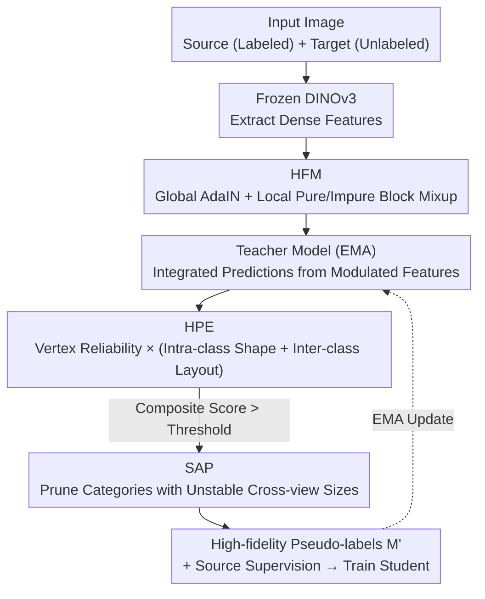

# SHAPE: Structure-aware Hierarchical Unsupervised Domain Adaptation with Plausibility Evaluation for Medical Image Segmentation

**Conference**: CVPR 2026  
**Paper**: [CVF Open Access](https://openaccess.thecvf.com/content/CVPR2026/html/Zhou_SHAPE_Structure-aware_Hierarchical_Unsupervised_Domain_Adaptation_with_Plausibility_Evaluation_for_CVPR_2026_paper.html)  
**Code**: https://github.com/BioMedIA-repo/SHAPE  
**Area**: Medical Imaging / Unsupervised Domain Adaptation / Image Segmentation  
**Keywords**: Unsupervised Domain Adaptation, Medical Image Segmentation, Pseudo-labeling, Hypergraph, Anatomical Plausibility

## TL;DR
SHAPE reframes Unsupervised Domain Adaptation (UDA) for cross-modal medical segmentation from "local pixel correctness" to "global anatomical plausibility." By performing class-aware Hierarchical Feature Modulation (HFM) on a frozen DINOv3 to generate high-fidelity features, evaluating pseudo-labels at both anatomical shape and layout levels via Hypergraph Plausibility Evaluation (HPE), and removing hallucinated categories through Structural Anomaly Pruning (SAP), the method uses only high-quality pseudo-labels that pass plausibility checks for self-training. It sets a new SOTA on cardiac and abdominal cross-modal benchmarks.

## Background & Motivation

**Background**: The performance of medical segmentation models drops significantly when deployed across different imaging devices or modalities. Unsupervised Domain Adaptation (UDA) avoids re-annotation by transferring knowledge from a labeled source domain to an unlabeled target domain. Existing UDA methods generally fall into two categories: alignment-based methods (matching source/target domains in image appearance, feature distribution, or output predictions) and pseudo-label-based methods (using source-domain models to generate pseudo-labels for self-training in the target domain).

**Limitations of Prior Work**: This paper identifies fundamental flaws in both categories. First, **feature alignment is semantic-agnostic**—monolithic strategies like AdaIN or spectral normalization apply a uniform transformation across the entire feature map, averaging the style features of different anatomical structures. This fails to generate class-specific style information, leading to imprecise alignment and poor distribution fidelity. Second, **pseudo-label verification ignores global anatomical constraints**—existing methods rely on pixel-level confidence (predictive entropy) or local consistency to filter pseudo-labels, which cannot prevent "anatomically impossible" pseudo-labels (deformed shapes, incorrect spatial arrangements) from contaminating the training process.

**Key Challenge**: The quality upper bound of self-training is determined by pseudo-label quality. Pixel-level metrics can only ensure "local pixel correctness" but cannot guarantee "global anatomical shape and relative position plausibility." For example, a heart segmentation result might have high confidence for every pixel yet exhibit an anatomically non-existent shape.

**Goal**: To shift the adaptation target from local pixel correctness to global anatomical plausibility by simultaneously addressing "structure-preserving feature alignment" and "global-aware pseudo-label verification."

**Key Insight**: Standard graphs can only represent pairwise relations and fail to capture the holistic interactions between multiple anatomical structures. In contrast, **hypergraphs** naturally represent higher-order relationships, enabling the modeling of both intra-class shapes of individual structures and inter-class spatial layouts of the entire anatomy.

**Core Idea**: Use class-aware hierarchical feature modulation to generate structure-preserving high-fidelity features, then model each prediction as a hypergraph to calculate a "plausibility score" based on shape and layout to serve as a quality gate for pseudo-labels. Finally, prune hallucinated categories that are unstable across different views. Only pseudo-labels that pass these three-stage checks are used for self-training.

## Method

### Overall Architecture
SHAPE is built on a frozen DINOv3 ViT-S/16 encoder followed by a trainable UNet-style decoder, forming a cascade of "feature modulation → multi-level verification → self-training." Given an input image, the encoder extracts dense feature maps. **HFM** performs dual-granularity modulation (global style + local structure-aware) on source/target features to produce four sets of high-fidelity features (original, cross-domain stylized, local mixed). These features are integrated by a teacher model (EMA of the student) to produce multiple target-domain predictions. These predictions are sent to **HPE**, which constructs a hypergraph for each and calculates a comprehensive plausibility score from vertex reliability, intra-class shape, and inter-class layout. Samples passing a dynamic threshold gate are then processed by **SAP**, which prunes hallucinated categories based on their size instability across views. Finally, only refined high-fidelity pseudo-labels $M'$ serve as the target-domain supervision alongside the source-domain supervised loss to train the student.

### Key Designs

**1. Hierarchical Feature Modulation (HFM): Replacing Monolithic Alignment with Class-aware, Spatially Differentiated Mixing**

To address the issue where monolithic alignment averages the styles of different anatomical structures, HFM performs dual-granularity modulation. At the **global** level, AdaIN aligns the channel statistics of source features $F_s$ to the target $F_t$, yielding a stylized map $F_{s\to t}=\sigma(F_t)\frac{F_s-\mu(F_s)}{\sigma(F_s)+\epsilon}+\mu(F_t)$. At the **local** level, features are upsampled to a finer grid ($N=4HW$ tokens). For each token, a "purity score" $P(m_i)=\max_k \frac{\sum_{v\in m_i}\mathbb{I}(v=k)}{|m_i|}$ is calculated based on its label sub-block. Tokens are then classified as either pure semantic cores ($T_{pure}$) or impure structural boundaries ($T_{impure}$) based on a threshold $\tau_p$. Pure tokens undergo Mixup with target tokens of the same class: $(1-\lambda)f_s^i+\lambda f_t^j$ (where $f_t^j$ is selected from a pool of representative samples). Impure boundary tokens undergo AdaIN-style alignment based on boundary statistics. This differentiated strategy—interpolation for semantic cores and statistical alignment for boundaries—aligns distributions while preserving inter-class discriminability. t-SNE visualizations show that global AdaIN collapses target features into a single cluster, whereas HFM aligns centroids while preserving intra-class variance and relative tissue structures.

**2. Hypergraph Plausibility Evaluation (HPE): Global Plausibility Scoring via Vertex/Shape/Layout Layers**

To address the inability of pixel-level metrics to handle global anatomical plausibility, HPE models each predicted segmentation as a multi-level structural hypergraph $G=(V,E)$. The vertex set $V$ consists of all foreground pixels. The hyperedge set includes "class hyperedges" $E_C$ (encoding intra-class shape) and a "layout hyperedge" $e_l$ (encoding inter-class spatial arrangement). The scoring is tripartite: (1) **Vertex Score** $S_{vertex}=\frac{1}{|V|}\sum_p w_p$, where weights $w_p$ are derived from the average entropy (certainty) and JSD (consistency) of teacher ensembles; (2) **Intra-class Shape Score** $S_{intra}$, calculated using the Z-score of the isoperimetric ratio $\phi(e_k)=4\pi\cdot\text{Area}/(\text{Perimeter}^2+\epsilon)$ for each mask, where $S_{\phi,k}=\exp(-|z_k|)$, penalizing malformed outliers via softmax weighting; (3) **Inter-class Layout Score** $S_{inter}$, evaluated similarly using the Z-score of the relative cosine orientation $\psi_{ij}$ between class centroids. These are fused as $S_{final}=S_{vertex}\cdot(\alpha S_{intra}+(1-\alpha)S_{inter})$. The structural score acts as a **multiplicative gate**, suppressing predictions that have high pixel confidence but poor anatomy. Only samples with $S_{final}$ exceeding a top-$\rho$ percentile dynamic threshold enter self-training.

**3. Structural Anomaly Pruning (SAP): Filtering Hallucinated Categories via Cross-view Size Stability**

Even if a whole image passes HPE, hallucinated regions of individual classes might still exist (appearing/disappearing or fluctuating wildly in size across different augmentations). SAP defines a "structural signature" for class $k$ as its pixel count vector $c_k$ across $N_{ens}$ teacher predictions. A structural instability score is calculated using the coefficient of variation: $\Upsilon(k)=\frac{\text{std}(c_k)}{\bar c_k+\epsilon}$. Robust anatomical structures exhibit low signature variance, whereas hallucinations show high fluctuation. Classes with an instability score exceeding a dynamic threshold $\theta_A$ (the $q$-th percentile of foreground class instability within a batch) are judged as anomalies $K_{anom}$. Pixels belonging to $K_{anom}$ in the pseudo-label map are set to an ignore index, resulting in the refined map $M'$. This step serves as a "class-level refinement" complementing the "image-level gating" of HPE.

### Loss & Training
The total loss is $L_{total}=L_{sup}+\gamma_{unsup}L_{unsup}$. The source supervised loss $L_{sup}$ is the average segmentation loss over the set of original and HFM-modulated features $\mathcal{F}_s=\{F_s,F_{s\to t},F_{s,cross}\}$, i.e., $L_{sup}=\frac{1}{|\mathcal{F}_s|}\sum_{F'\in\mathcal{F}_s}L_{seg}(D(F'),L_s)$, to enhance domain robustness. The target unsupervised loss is applied only on the subset $B_{sel}$ that passes plausibility checks, using high-fidelity pseudo-labels $M'$ weighted by pixel certainty $w_p$. $L_{seg}$ is a combination of Dice and Focal loss. The teacher $D_{ema}$ is an EMA of the student decoder (momentum 0.9). $\gamma_{unsup}$ uses a ramp-up schedule. Key hyperparameters: purity threshold $\tau_p=1$, fusion weight $\alpha=0.25$, selection percentile $\rho$ following a sigmoid increase from 0.1, anomaly threshold $\theta_A$ at the 50th percentile, and $\gamma_{unsup}=1$.

## Key Experimental Results

Datasets: MMWHS (20 CT + 20 MRI, segmenting AA/LAC/LVC/MYO) for cardiac; MICCAI 2015 Abdominal CT (30 cases) + CHAOS T2SPIR MRI (20 cases, segmenting LIV/RK/LK/SPL) for abdominal. Metrics: Dice (DSC, higher is better) and Average Surface Distance (ASD, lower is better).

### Main Results

Comparison of average DSC (%) on the cardiac dataset (higher is better). SHAPE is the best in both directions:

| Method | Type | MRI→CT DSC | CT→MRI DSC |
|------|------|------|------|
| W/o adaptation | Lower Bound | 45.91 | 36.91 |
| SIFA | Alignment | 74.63 | 63.78 |
| UPL-SFDA | Pseudo-label | 79.18 | 74.06 |
| IPLC | Pseudo-label | 80.91 | 76.07 |
| DDFP | Alignment | 84.46 | 75.37 |
| **SHAPE** | **Ours** | **90.08** | **78.51** |
| Supervised | Upper Bound | 93.37 | 84.41 |

Comparison of average DSC (%) on the abdominal dataset:

| Method | Abd MRI→CT DSC | Abd CT→MRI DSC |
|------|------|------|
| W/o adaptation | 40.08 | 41.54 |
| SIFA | 83.35 | 84.17 |
| UPL-SFDA | 85.07 | 85.06 |
| DDFP | 85.17 | 86.27 |
| **SHAPE** | **87.48** | **86.89** |

On Heart MRI→CT, SHAPE achieves 90.08% DSC, which is 5.62 percentage points higher than the runner-up DDFP (84.46%) and narrows the gap to the supervised upper bound (93.37%) to only 3.29 points.

### Ablation Study (Cardiac dataset, adding modules to a strong baseline with DINOv3 backbone)

| Configuration | HFM | HPE | SAP | MRI→CT DSC | CT→MRI DSC |
|------|-----|-----|-----|------|------|
| (a) Baseline | | | | 82.02 | 71.58 |
| (b) +HFM | ✓ | | | 85.67 | 75.46 |
| (c) +HPE | | ✓ | | 82.71 | 72.09 |
| (d) +HFM+HPE | ✓ | ✓ | | 85.80 | 75.81 |
| (e) +HFM+SAP | ✓ | | ✓ | 86.03 | 76.23 |
| (f) SHAPE (Full) | ✓ | ✓ | ✓ | **90.08** | **78.51** |

### Key Findings
- **HFM is the largest single contributor**: Adding only HFM improves MRI→CT from 82.02% to 85.67% (+3.65 points), validating the importance of shifting from global alignment to class-aware, structure-preserving modulation. Adding only HPE also yields stable gains (82.71%), proving the effectiveness of anatomical plausibility verification.
- **Synergy between modules**: The combinations in (d) and (e) only reach ~86%, whereas the full SHAPE model jumps to 90.08%. This indicates a synergistic effect where improved feature quality and multi-level pseudo-label verification work together better than their individual parts.
- **Visual evidence of feature alignment**: t-SNE shows that global AdaIN causes distribution collapse by clustering target features indiscriminately, whereas HFM aligns centroids while preserving intra-class variance.
- **Hyperparameter Sensitivity**: Performance remains stable across variations in the fusion weight $\alpha$ and anomaly thresholds, indicating the method is not overly sensitive to key hyperparameters.

## Highlights & Insights
- **Quantifying "Plausibility" as a Supervisory Signal**: The use of hypergraph-based isoperimetric ratios (shape) and centroid orientation (layout) successfully quantifies "anatomical likeness" as a score applied as a multiplicative gate. This is a clean paradigm for injecting domain priors into self-training.
- **Dual-level Protection (Image-level + Class-level)**: HPE handles overall prediction plausibility, while SAP handles class-specific stability. These complementary granularities are much more robust than simple pixel-level confidence filtering.
- **Cross-view Size Variance as a Hallucination Signal**: Using the coefficient of variation for pixel counts across multiple perturbed predictions is an intuitive and low-cost metric for identifying hallucinations.

## Limitations & Future Work
- **Reliance on Frozen DINOv3 Priors**: The method relies on the strong semantic priors provided by DINOv3. Its effectiveness on encoders with weaker priors or significantly different medical imaging characteristics remains to be verified.
- **Complexity of Hypergraph Scoring**: Several thresholds (purity, selection percentile, anomaly threshold, temperature $\tau$) are introduced. While robustness is reported, cross-dataset transferability may require further validation.
- **Evaluation on Simple Structures**: The method was tested on cardiac and abdominal organs with relatively regular shapes and few classes. Its effectiveness on more complex or irregular structures (e.g., lesions, vascular trees) has not yet been tested.

## Related Work & Insights
- **vs. SIFA**: SIFA uses adversarial learning for monolithic image/feature alignment, which remains a content-agnostic global mapping. SHAPE’s HFM performs class-aware local mixing to preserve inter-class discriminability.
- **vs. UPL-SFDA / IPLC**: These methods filter pseudo-labels based on pixel-level uncertainty, which fails to block anatomically implausible global predictions. SHAPE uses hypergraphs as a "global structure" quality gate.
- **vs. GNN-based Modeling**: GNNs only represent pairwise relations and cannot model the holistic interactions of multiple structures. SHAPE uses hypergraphs to express higher-order relations for the first time as a pseudo-label quality gate in UDA.

## Rating
- Novelty: ⭐⭐⭐⭐⭐ First use of hypergraphs as pseudo-label plausibility gates combined with class-aware feature modulation.
- Experimental Thoroughness: ⭐⭐⭐⭐ Solid comparison across two datasets, ablation studies, and visualizations, though limited to few-class regular organs.
- Writing Quality: ⭐⭐⭐⭐⭐ Clearly articulated motivations regarding the two fundamental flaws in prior work, with clear formulas and cascade logic.
- Value: ⭐⭐⭐⭐ Practical SOTA improvement on cross-modal medical UDA with open-source code, though dependent on strong encoder priors.

<!-- RELATED:START -->

## Related Papers

- [\[CVPR 2026\] Tell2Adapt: A Unified Framework for Source Free Unsupervised Domain Adaptation via Vision Foundation Model](tell2adapt_a_unified_framework_for_source_free_unsupervised_domain_adaptation_vi.md)
- [\[CVPR 2026\] CoFiDA-M: Concept-Aware Feature Modulation for Cross-Domain Adaptation with Image-Only Inference](cofida-m_concept-aware_feature_modulation_for_cross-domain_adaptation_with_image.md)
- [\[CVPR 2026\] Sketch2CT: Multimodal Diffusion for Structure-Aware 3D Medical Volume Generation](sketch2ct_multimodal_diffusion_for_structure-aware_3d_medical_volume_generation.md)
- [\[CVPR 2026\] Personalized Longitudinal Medical Report Generation via Temporally-Aware Federated Adaptation](personalized_longitudinal_medical_report_generation_via_temporally-aware_federat.md)
- [\[CVPR 2026\] MedCLIPSeg: Probabilistic Vision-Language Adaptation for Data-Efficient and Generalizable Medical Image Segmentation](medclipseg_probabilistic_vision-language_adaptation_for_data-efficient_and_gener.md)

<!-- RELATED:END -->
