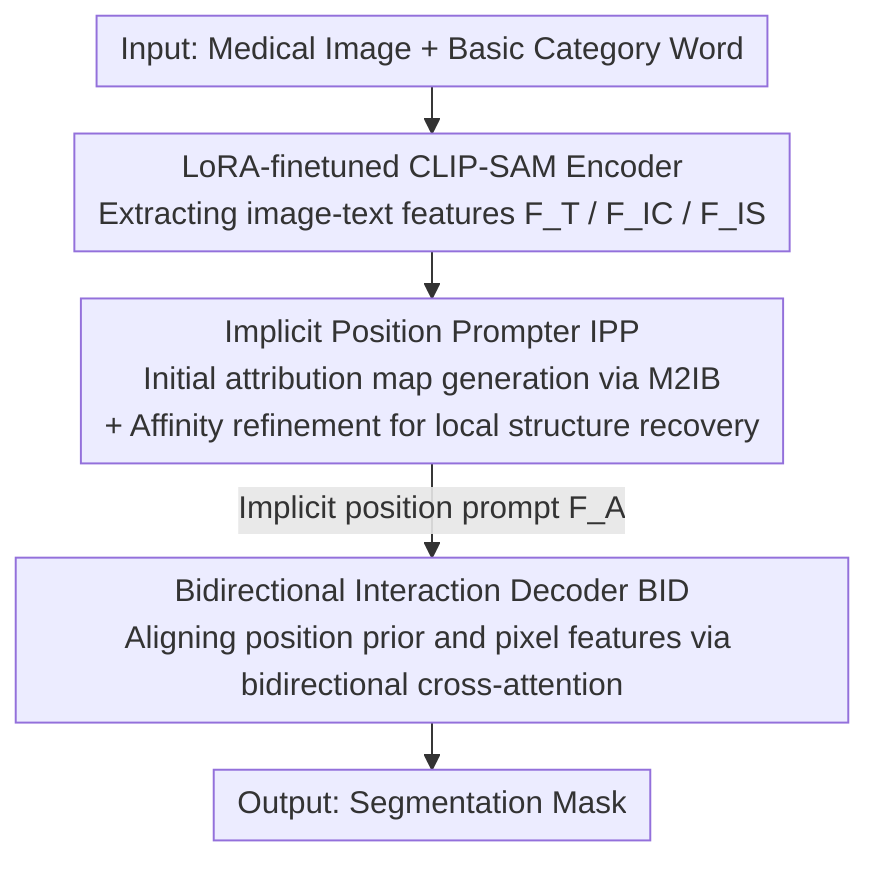

# Simple-ViLMedSAM: Simple Text Prompts Meet Vision-Language Models for Medical Image Segmentation

**Conference**: CVPR 2026  
**Paper**: [CVF Open Access](https://openaccess.thecvf.com/content/CVPR2026/html/Qian_Simple-ViLMedSAM_Simple_Text_Prompts_Meet_Vision-Language_Models_for_Medical_Image_CVPR_2026_paper.html)  
**Code**: https://github.com/qcc001/Simple-ViLMedSAM  
**Area**: Medical Images  
**Keywords**: Medical Image Segmentation, CLIP-SAM, Text Prompts, Information Bottleneck, Zero-shot/Few-shot

## TL;DR
Simple-ViLMedSAM connects CLIP and SAM using an "Implicit Position Prompter (IPP) + Bidirectional Interaction Decoder (BID)," enabling medical image segmentation driven solely by **the most basic category words** (such as "polyp" or "lung") provided by users. This eliminates the need for expert point/box prompts and verbose clinical descriptions. It comprehensively outperforms existing SAM-based methods on zero-shot and few-shot tasks across four public datasets.

## Background & Motivation

**Background**: Medical image segmentation has long been hindered by scarce annotations, high annotation costs, and strong cross-modality heterogeneity. Visual foundation models like SAM bring hope, but when applying SAM to medical images, mainstream approaches either rely on manual geometric prompts (points/boxes) provided by experts or follow two-stage CLIP-SAM or text-driven routes.

**Limitations of Prior Work**: The three existing routes each have major drawbacks. (1) Self-prompting methods (e.g., UN-SAM, Self-Prompt-SAM) eliminate manual dots/boxes but lack medical semantics, often leading to inaccurate localization. (2) Two-stage methods (e.g., SaLIP, which generates class-agnostic masks first and then uses CLIP for classification) suffer from computational redundancy, and the separation of stages discards context, causing a domain gap. (3) Text-driven methods (e.g., MedCLIP-SAM v2), although incorporating CLIP's image-text alignment, **rely heavily on complex, semantically rich clinical descriptions**; their performance collapses with slight prompt variations, exhibiting poor robustness.

**Key Challenge**: Existing CLIP-SAM methods treat "text $\rightarrow$ explicit geometric prompt (point/box)" as a bridge, which locks their performance to the accuracy of the prompts. The simpler the text and the scarcer the information, the less accurate the generated geometric prompts. Empirical results in Table 3 validate this: when shifting from simple words to complex descriptions, the Dice scores of SaLIP and MedCLIP-SAM v2 increase by 4.85 to 10.86. In other words, these methods **force users to write complex prompts**.

**Goal**: To achieve high-precision segmentation under the condition of only providing extremely simple text like "category names", holding true for both zero-shot and few-shot scenarios.

**Key Insight**: The authors argue that CLIP's output should not be rigidly converted into explicit geometric prompts. Instead, CLIP should directly generate an **implicit position attribution map**, handing over the soft prior of "this region is likely the target" to SAM, and then allowing both to mutually correct errors at the pixel level. CLIP is strong at global semantic localization, while SAM excels in pixel-level details; they should perform their respective duties with bidirectional alignment.

**Core Idea**: Replace explicit geometric prompts with the "implicit position attribution map" generated by CLIP, and then fuse this positional prior with SAM's pixel features using bidirectional cross-attention, thereby breaking free from the dependency on complex prompts.

## Method

### Overall Architecture
Simple-ViLMedSAM is an integrated CLIP-SAM framework. The inputs are "a medical image + a basic category word," and the output is the segmentation mask of that category. The entire pipeline consists of three stages: first, **the CLIP encoder and the LoRA-fine-tuned SAM encoder** extract image-text features, respectively; then, these are fed into the **Implicit Position Prompter (IPP)**—which compresses CLIP features into an initial position attribution map using a Multimodal Information Bottleneck (M2IB) and then recovers local structures leveraging SAM features via an affinity-based refinement strategy, ultimately generating the implicit position prompt $F_A$; finally, the **Bidirectional Interaction Decoder (BID)** aligns and mutually corrects this position prior with SAM's pixel features via bidirectional cross-attention, upsampling the result to decode the mask. The training is optimized end-to-end using a joint CE + Dice loss.

### Key Designs

**1. LoRA-Finetuned CLIP-SAM Dual Encoder: Replacing points/boxes and long clinical descriptions with basic category words**

This design directly targets the limitation of "dependency on expert prompts." The framework uses a CLIP text encoder to encode the category word into $F_T=\Psi_{text}(T)$, and a CLIP image encoder to extract $F_{IC}=\Psi_{img}(I)$. Both are projected into a shared semantic space, enabling the extraction of the "rough position in the image corresponding to the word" using just a single category word. Concurrently, a SAM image encoder extracts pixel-level features $F_{IS}=\Phi_{img}(I)$. Following SAMed, a **LoRA bypass** composed of two low-rank matrices is attached to the SAM encoder for efficient fine-tuning. This adapts SAM to medical image distributions without full-parameter training (the entire model has only 3.9M trainable parameters, which is an order of magnitude smaller than H-SAM's 18.4M). In the ablation study, LoRA brings a consistent gain across almost every configuration (e.g., IPP alone increases from 52.74 to 56.98 Dice), showing that this medical domain adaptation step is indispensable. This encoding stage establishes the premise that "simple text is sufficient": CLIP provides semantic localization, and SAM provides details, with a clear division of labor.

**2. Implicit Position Prompter IPP: M2IB-compressed position map + Affinity-based refinement for structure recovery**

IPP is the core of this paper, aiming to address the pain point where simple category words contain too sparse information, and the direct localization provided by CLIP is blurry and designed only for classification, making it unsuited for pixel-level segmentation. IPP tackles this in two steps. First, the **Multimodal Information Bottleneck (M2IB)**: Since standard CLIP embeddings are designed for classification, IPP utilizes the information bottleneck principle to retain only the most text-relevant regions while compressing irrelevant background. The optimization objective is formulated as

$$\max\big[\,\mathrm{MI}(Z_{IC}, F_T;\theta) - \beta\,\mathrm{MI}(Z_{IC}, I;\theta)\,\big]$$

The first term ensures that the compressed representation $Z_{IC}$ captures semantic clues aligned with the text, while the second term suppresses redundancy to prevent overfitting. The compressed representation is obtained by

$$Z_{IC} = h_{IC}(I;\alpha)\odot F^{\ell}_{IC} + \sigma\big(1-h_{IC}(I;\alpha)\big)\odot\varepsilon$$

where $h_{IC}(I;\alpha)$ is the learned **attribution map**, with the value at each position representing the "probability of belonging to the target region," and $\varepsilon\sim\mathcal{N}(0,I)$ represents Gaussian noise. This yields an initial attribution map $A_{init}$. Second, the **Affinity-based Refinement**: Since the initial map still lacks details, SAM features' local structure awareness is leveraged for recovery. First, a pixel-wise self-similarity matrix is computed from the SAM features as $S=\frac{F_{IS}}{\lVert F_{IS}\rVert}\big(\frac{F_{IS}}{\lVert F_{IS}\rVert}\big)^{T}$. Then, low-confidence positions are masked out using a threshold $\epsilon$ to obtain the affinity matrix

$$C=\mathrm{Softmax}(S+M),\quad M_{ij}=\begin{cases}0,& S_{ij}\ge\epsilon\\ -\infty,& S_{ij}<\epsilon\end{cases}$$

Treating $C$ as attention weights, the activations are propagated from the initial map to obtain the refined map $A_f$. The initial map and refined map are concatenated, normalized, and fed into a lightweight convolutional projection network, fusing into the implicit position prompt $F_A$. The ingenuity of this design lies in: M2IB ensures "accurate semantic alignment" and the affinity refinement ensures "structural recovery," complementarily transforming a simple word into a usable pixel-level soft prior. Figure 5 shows that its response is more focused on the target than ProxyCLIP, and it suppresses false activations outside the lung region in X-rays.

**3. Bidirectional Interaction Decoder BID: Allowing mutual error correction between position priors and pixel features rather than unidirectional feeding**

BID addresses the limitation where having only the position prior is insufficient. If the prior (global semantics) and the SAM pixel features (local details) are fused only unidirectionally, one side is prone to dominate, discarding information from the other. BID uses **two layers of bidirectional cross-attention** to let both serve as queries for each other. The first layer lets SAM pixel features $F_{IS}$ query the position prior $F_A$ to align the semantic prior with the visual embedding: $Q_1=\mathrm{LN}(\mathrm{CrossAttn}(F_{IS},F_A,F_A)+F_{IS})$, which is then enhanced via residuals and an MLP to obtain $M=\mathrm{LN}(\mathrm{MLP}(Q_1+F_A))$. The second layer reverses this, setting the position prior $F_A$ as the query, the pixel features $F_{IS}$ as the key, and the value as $M+F_{IS}$: $Q_2=\mathrm{LN}(\mathrm{CrossAttn}(F_A,F_{IS},M+F_{IS})+M)$, thereby precisely aligning structural clues with text semantics and suppressing irrelevant activations. Finally, the two pathways $Q_1$ and $Q_2$ are projected back to spatial representations and summed after hierarchical upsampling to yield the prediction $Y=\mathrm{Upsample}(Q_1)+\mathrm{Upsample}(Q_2)$. Bidirectionality (rather than unidirectionality) is the key: the position prior and pixel features influence and learn from each other, resulting in spatially more coherent and semantically more accurate predictions. In ablation studies, BID alone (with LoRA) lifts the score from 55.02 to 56.98 Dice, and when stacked on top of IPP, it further increases to 59.83.

### Loss & Training
The model is optimized end-to-end using a weighted sum of cross-entropy and Dice loss: $L=L_{ce}+\lambda\,L_{dice}$ with $\lambda=1$ (consistent with MedSAM, which has been proven robust on various medical segmentation tasks). $L_{ce}=-\frac{1}{N}\sum_i(y_i\log x_i+(1-y_i)\log(1-x_i))$ and $L_{dice}=1-\frac{2\sum x_iy_i}{\sum x_i^2+\sum y_i^2}$. SAM uses ViT-H, and the text side adopts BiomedCLIP. Images are resized to $224\times224$ for BiomedCLIP and $1024\times1024$ for SAM. Optimization is performed using AdamW, with warmup for zero-shot tasks and customized configurations for few-shot tasks, running on a single RTX 4090.

## Key Experimental Results

### Main Results
Four public datasets span endoscopy (Kvasir-SEG polyp), dermoscopy (ISIC skin lesion), chest X-ray (COVID-QU-Ex lung), and CT (lung/heart/trachea). During training for evaluation, about 800 training images are deliberately chosen from **other datasets** to specifically test cross-modality/cross-target generalization. The evaluation metrics are Dice% and IoU%.

Zero-shot tasks (Table 1, competitors are categorized into three groups: native SAM geometric prompts / prompt-free SAM / CLIP-SAM text):

| Dataset | Metric | Ours | Runner-up | Gain |
|--------|------|------|------|------|
| Kvasir-SEG | Dice / IoU | 59.83 / 50.45 | 57.78 / 47.15 (SAMAug) | +2.05 / +3.30 |
| ISIC | Dice / IoU | 79.65 / 70.67 | 76.19 / 65.68 (H-SAM) | +3.46 / +4.99 |
| Chest X-ray | Dice / IoU | 82.60 / 74.82 | 80.44 / 69.77 (H-SAM) | +2.16 / +5.05 |
| Chest CT | Dice / IoU | 93.62 / 89.25 | 86.27 / 78.45 (H-SAM) | +7.35 / +10.80 |

Using only 3.9M trainable parameters and simple category name prompts, our method achieves comprehensive leadership across all four datasets; on CT, the Dice/IoU exceeds the runner-up by 7.35/10.8.

Few-shot tasks (Table 2, competitors include the UNet-based UniverSeg and three SAM-based variants): Our method similarly achieves victory across all four datasets, yielding 75.48 Dice on Kvasir-SEG (runner-up Self-Prompt-SAM: 62.10), 85.08 Dice on ISIC, 90.34 on Chest X-ray, and 94.13 on Chest CT, with a substantial lead on Kvasir and ISIC.

### Ablation Study
Dissecting the trio of LoRA / IPP / BID on Kvasir-SEG (Dice% / IoU%):

| LoRA | IPP | BID | Dice% | IoU% | Description |
|------|-----|-----|-------|------|------|
| ✗ | ✗ | ✗ | 46.69 | 37.51 | Baseline |
| ✗ | ✓ | ✗ | 52.74 | 41.17 | Add IPP |
| ✗ | ✓ | ✓ | 54.47 | 43.10 | IPP+BID (no LoRA) |
| ✓ | ✗ | ✗ | 55.02 | 44.43 | LoRA only |
| ✓ | ✗ | ✓ | 56.98 | 46.52 | LoRA+BID |
| ✓ | ✓ | ✗ | 59.02 | 49.73 | LoRA+IPP |
| ✓ | ✓ | ✓ | **59.83** | **50.45** | Full Model |

### Key Findings
- **Each component of the trio contributes positively, with their stack rendering the best performance**: The Dice score increases steadily from the 46.69 baseline to 59.83. The contribution of IPP is the most substantial (improving Dice by +6.05 individually without LoRA), BID further complements it, and LoRA consistently boosts every configuration.
- **Simple vs. Complex Prompts (Table 3, the biggest selling point of this paper)**: When switching from simple words to complex clinical descriptions generated by MedGemma, SaLIP and MedCLIP-SAM v2 experience average Dice improvements of 4.85 and 10.86, respectively. In contrast, our method achieves almost identical performance with simple and complex prompts (differing by only +0.71 Dice / +0.78 IoU). This demonstrates that our method **achieves near-peak performance without relying on complex prompts**, truly breaking free from the dependency on prompt engineering.
- **Refinement Outperforms ProxyCLIP**: Figure 5 reveals that the response of affinity-based refinement on polyp/melanoma/lung regions is more focused than that of ProxyCLIP, and it can also suppress false activations below the lung area in X-rays.

## Highlights & Insights
- **"Implicit position map" replacing "explicit geometric prompt" is the real decoupling point**: Previously, CLIP-SAM rigidly converted text into points/boxes, constraining precision by prompt accuracy. By switching to a soft attribution map, the information sparsity of simple words is compensated for by M2IB and the affinity-based refinement, eliminating the ceiling of prompt engineering. This is the most transferable idea of this paper.
- **Information bottleneck is applied to the right place**: M2IB formalizes the objective of "retaining only text-relevant information while compressing irrelevant background" as a mutual information target. This precisely resolves the fundamental mismatch where "CLIP embeddings are designed for classification and are unsuitable for pixel-level tasks," rendering a more principled design than empirical CAM.
- **Bidirectional attention over unidirectional fusion**: Allowing the position prior and pixel features to serve as mutual queries for bidirectional correction avoids one-sided dominance. This symmetric design can be transferred to any segmentation or detection task requiring the fusion of "global semantic priors + local detail features."
- **Parameter efficiency**: The entire model requires only 3.9M trainable parameters yet outperforms H-SAM with 18.4M, presenting compelling parameter efficiency.

## Limitations & Future Work
- **Explicit limitations by the authors**: Currently, this work addresses only **2D single-target, known category label** segmentation, leaving validation in complex scenarios—such as 3D volumetric data, multi-target, open-vocabulary (semantically ambiguous clinical descriptions), and overlapping organs/weak boundaries—untouched.
- **Independent observation**: Although the evaluation spans multiple modalities, it covers only 4 datasets with only about 800 training samples per dataset, meaning the statistical robustness of the generalization findings is limited. Furthermore, the sensitivity analyses for hyperparameters—such as the affinity refinement threshold $\epsilon$ and M2IB's $\beta/\sigma/\ell$—are not elaborated on in the main text (delegated to the appendix), necessitating parameter tuning for real-world deployment.
- **Directions for improvement**: Expanding the implicit position map mechanism to 3D (propagating affinity slice-by-slice), supporting open-vocabulary and multi-target queries, and introducing boundary-aware losses for weak boundaries.

## Related Work & Insights
- **vs. Prompt-free SAM (UN-SAM / Self-Prompt-SAM / H-SAM)**: These methods eliminate manual point/box prompts by self-prompting but lack medical semantics and are prone to localization errors. This work injects text semantics using CLIP, leading H-SAM comprehensively across the four datasets in the zero-shot task.
- **vs. Two-stage CLIP-SAM (SaLIP)**: SaLIP generates class-agnostic masks prior to CLIP classification, yielding computational redundancy and context loss. Our framework is an end-to-end integrated model that directly provides soft priors via attribution maps, bypassing the domain gap.
- **vs. Text-driven CLIP-SAM (MedCLIP-SAM v2)**: Both introduce CLIP, yet MedCLIP-SAM v2 relies on complex clinical descriptions and is highly sensitive to prompt precision (switching to complex prompts improves Dice by 10.86). Ours uses the implicit position map, enabling peak performance with only simple words (with an increase of only +0.71). Robustness is the core difference.
- **vs. ProxyCLIP**: ProxyCLIP injects spatial consistency into the image encoding stage using VFM proxy attention. In contrast, our method refines structures on top of the CLIP attribution map that already contains semantic priors; Figure 5 demonstrates that our response is more focused with fewer false activations.

## Rating
- Novelty: ⭐⭐⭐⭐ "Implicit position map replacing explicit geometric prompt + bidirectional decoder" is a substantive improvement over the CLIP-SAM paradigm, with a highly solid selling point of achieving peak performance using simple prompts.
- Experimental Thoroughness: ⭐⭐⭐⭐ Includes four-modality zero/few-shot tasks, ablation studies of the three components, and prompt style analysis. However, there are relatively few datasets, and hyperparameter sensitivity is relegated to the appendix.
- Writing Quality: ⭐⭐⭐⭐ Clear logical chain traversing Motivation-Pain Point-Design, with complete formulas and diagrams.
- Value: ⭐⭐⭐⭐ Achieving better-than-SOTA performance with minimalist prompts and only 3.9M parameters is highly friendly for annotation-scarce environments and clinical deployment, and the methodology is highly transferable.

<!-- RELATED:START -->

## Related Papers

- [\[CVPR 2026\] IVAAN: Instance-level Vision-Language Alignment via Attribute-Guided Text Prompts Generation for Nuclei Analysis](ivaan_instance-level_vision-language_alignment_via_attribute-guided_text_prompts.md)
- [\[CVPR 2026\] Delving Aleatoric Uncertainty in Medical Image Segmentation via Vision Foundation Models](delving_aleatoric_uncertainty_in_medical_image_segmentation_via_vision_foundatio.md)
- [\[CVPR 2026\] MedCLIPSeg: Probabilistic Vision-Language Adaptation for Data-Efficient and Generalizable Medical Image Segmentation](medclipseg_probabilistic_vision-language_adaptation_for_data-efficient_and_gener.md)
- [\[CVPR 2026\] VoxTell: Free-Text Promptable Universal 3D Medical Image Segmentation](voxtell_free-text_promptable_universal_3d_medical_image_segmentation.md)
- [\[CVPR 2026\] From Infusion to Assimilation Distillation for Medical Image Segmentation](from_infusion_to_assimilation_distillation_for_medical_image_segmentation.md)

<!-- RELATED:END -->
