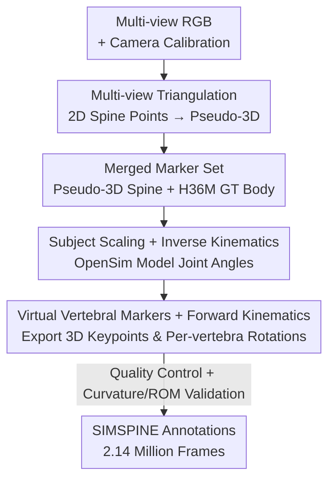

# SIMSPINE: A Biomechanics-Aware Simulation Framework for 3D Spine Motion Annotation and Benchmarking

**Conference**: CVPR 2026  
**Paper**: [CVF Open Access](https://openaccess.thecvf.com/content/CVPR2026/html/Khan_SIMSPINE_A_Biomechanics-Aware_Simulation_Framework_for_3D_Spine_Motion_Annotation_CVPR_2026_paper.html)  
**Code**: https://saifkhichi96.github.io/research/simspine/ (Project page, claimed to be open-sourced)  
**Area**: Medical Imaging / 3D Vision / Human Pose  
**Keywords**: Spine motion, Biomechanics, Musculoskeletal modeling, 3D keypoints, Dataset

## TL;DR
The authors construct a "biomechanics-aware" simulation annotation pipeline by concatenating off-the-shelf 2D spine detectors, multi-view geometric triangulation, and OpenSim musculoskeletal inverse kinematics. This pipeline automatically supplements the Human3.6M dataset with 15 anatomically consistent vertebral-level 3D keypoints and per-vertebra rotations, creating SIMSPINE—the first open 3D spine motion dataset (2.14 million frames). With accompanying 2D/3D baselines, the framework improves the AUC for indoor spine tracking from 0.63 to 0.80.

## Background & Motivation
**Background**: Human motion capture and 3D pose estimation have successfully enabled the tracking of large-scale limb movements for applications in action recognition and human-computer interaction. Mainstream 2D→3D lifting models are primarily trained on the Human3.6M dataset.

**Limitations of Prior Work**: Existing methods focus on joint geometry while neglecting the spine. The spine consists of 24 movable vertebrae, each with 3 rotational degrees of freedom (DOF). Spine motion is highly non-linear with significant inter-vertebral coupling. "Micro-movements" such as vertebral rotation, postural sway, and pelvic compensation are critical for determining spinal stability, load distribution, and injury risk (essential for ergonomics and rehabilitation). Current RGB-based approaches either rely on kinematic tape markers (requiring skin exposure and controlled environments) or are limited to 2D (like SpineTrack) with opaque annotations and low biomechanical credibility.

**Key Challenge**: Learning vertebral-level motion requires large-scale 3D spine annotations. However, *in vivo* measurements (biplanar fluoroscopy, EOS, dynamic MRI) are accurate but expensive, involve radiation dose, and are restricted to small-sample static captures. Pure vision methods lack vertebral-level ground truth, creating a conflict between accuracy and scale.

**Goal**: To obtain anatomically valid and clinically relevant 3D spine motion annotations during natural, unconstrained full-body movements (without requiring static poses, close-up naked views, or fixed cameras).

**Key Insight**: Spine micro-movements are coupled with global body pose changes. Musculoskeletal models (such as OpenSim) can already solve joint trajectories into anatomically constrained vertebral movements, yet they have not been integrated with computer vision for large-scale image annotation.

**Core Idea**: Replace expensive *in vivo* measurements with "biomechanics-aware keypoint simulation"—using musculoskeletal inverse kinematics to "supplement" existing pose datasets with vertebral-level 3D keypoints, thereby bridging musculoskeletal simulation and computer vision.

## Method

### Overall Architecture
The method is essentially an **offline data generation pipeline** rather than a new neural network architecture. The input consists of synchronized multi-view RGB images from Human3.6M, camera calibrations, and official 3D body markers. The output includes anatomically consistent vertebral-level 3D spine keypoints and per-vertebra Euler rotations for every frame. The pipeline consists of five steps: predicting spine points using a 2D detector and triangulating them into "pseudo-3D"; merging these with Human3.6M ground truth (GT) body markers into a unified set; performing Inverse Kinematics (IK) using a subject-scaled OpenSim model to solve for joint angles; placing virtual markers on vertebrae and using Forward Kinematics (FK) to calculate 3D trajectories; and finally performing quality control and curve validation. The elegance lies in using the anatomically constrained IK as a "weak supervisor" to pull noisy 2D detections back into biomechanically plausible solutions.

### Key Designs

**1. Multi-view Triangulation for Pseudo-3D Estimation**

Starting without vertebral 3D ground truth, the authors use the SpinePose pre-trained 2D detector to predict 9 spine points $\hat{u}_{v,t}$ for each view $v$. Using Human3.6M calibration parameters $\{K_v, R_v, t_v\}$, they perform robust triangulation to find the pseudo-3D points that minimize reprojection error:

$$\tilde{X}_t = \arg\min_X \sum_{v\in V} \rho\big(\|\Pi(K_v[R_v|t_v]X) - \hat{u}_{v,t}\|_2^2\big)$$

where $\Pi(\cdot)$ is the perspective projection and $\rho$ is the Huber robust penalty to suppress outliers. View consistency and reprojection error thresholds are used to filter points, followed by zero-phase low-pass filtering to reduce temporal jitter. These "pseudo-labels" are inherently noisy and are intended for refinement by anatomical constraints rather than direct training.

**2. Merged Marker Set + Subject-Scaled Inverse Kinematics (Core)**

This step is critical for refining noisy detections. Pseudo-3D spine points $\tilde{X}_t$ and GT body markers $Y_t$ are merged via semantic mapping and temporal synchronization into a unified OpenSim marker set $Z_t = \{Y_t, \tilde{X}_t\}$. The body model is based on the Rajagopal full-body model with lumbar details from the Beaucage-Gauvreau model, scaled per subject. A weighted least-squares IK is solved frame-by-frame:

$$q_t^\star = \arg\min_{q_t} \sum_{m\in M} w_m \|z_{m,t} - \hat{z}_m(q_t)\|_2^2 + \lambda\|Dq\|_2^2$$

$\hat{z}_m(q_t)$ represents the marker positions derived via FK. A crucial design choice is the weight assignment: **reliable Human3.6M body markers are given high weights, while noisy pseudo-spine points are given low weights**. This ensures the musculoskeletal structure dominates the solution. The term $\|Dq\|$ penalizes joint velocity/acceleration for temporal smoothness. The model allows full 3-DOF articulation for the lumbar spine (T12–L1 to L5–S1) while using a single 3-DOF joint for the cervicothoracic junction, balancing RGB identifiability with anatomical realism.

**3. Virtual Vertebral Markers + Forward Kinematics**

While IK provides joint angles $q_t^\star$, downstream tasks require 3D coordinates. Virtual markers are placed at vertebral centroids, and their 3D trajectories are calculated via FK from $q_t^\star$. This yields 3D spine keypoints distributed from the sacral base to the lower cervical region. Simultaneously, per-vertebral Euler rotations (flexion/extension, lateral bending, axial rotation) are exported. Each frame contains 37 markers and 62 kinematic axes, providing data (rotations) that pure visual annotation cannot provide.

**4. Biomechanical Validity Verification**

The authors address concerns regarding the physical plausibility of simulated data by comparing results with biomechanical literature. Lumbar Lordosis Angle (LLA) and Thoracic Kyphosis Angle (TKA) calculated via the Cobb method fell within normal adult ranges (32–41° and 28–39°, respectively). The results also replicated movement-related trends (e.g., decreased lordosis when sitting). Spinal Range of Motion (ROM) gradients (e.g., flexion peaking at L4–L5) matched classic reports like White & Panjabi (1978). This verification elevates the "automated labels" from appearing correct to being biomechanically valid.

## Key Experimental Results

The authors establish baselines for three tasks: 2D spine pose estimation, multi-view 3D triangulation reconstruction, and monocular 3D lifting.

### Main Results: 2D Spine Pose Estimation

Fine-tuning SpinePose on a mixture of SpineTrack (outdoor) and SIMSPINE (indoor) data yielded the following:

| Model | Training Data | Outdoor AP_S | Indoor AUC |
| :--- | :--- | :--- | :--- |
| SpinePose-m (Original) | SpineTrack | 0.914 | 0.633 |
| SpinePose-l-ft | +SIMSPINE | 0.917 | **0.803** |
| SpinePose-m-ft | +SIMSPINE | **0.928** | 0.798 |
| ViTPose-b | +SIMSPINE | 0.921 | 0.794 |

Indoor spine tracking AUC increased significantly from 0.63 to 0.80.

### Multi-view Triangulation / Monocular Lifting

| Task | Configuration | Metric | Value |
| :--- | :--- | :--- | :--- |
| Multi-view Triangulation | Fine-tuned detector | MPJPE (Full Spine) | 38.5 mm |
| Multi-view Triangulation | Fine-tuned detector | P-MPJPE | 29.5 mm |
| Multi-view Triangulation | GT 2D (Oracle) | P-MPJPE | Sub-millimeter (0.67 mm) |
| Monocular Lifting | Spine-only (Det. 2D) | P-MPJPE | 18.6 mm |
| Monocular Lifting | Full-body (Det. 2D) | P-MPJPE | **16.3 mm** |
| Monocular Lifting | Full-body (GT 2D) | P-MPJPE | **13.5 mm** |

Triangulation reaches sub-millimeter precision with GT 2D, proving geometric consistency. The degradation to ~30mm with the detector suggests the bottleneck is 2D noise. For monocular lifting, **training with full-body keypoints outperforms spine-only training**, indicating that global context aids vertebral localization.

### Ablation Study: Mixing Proportions and Strategy

| SIMSPINE Ratio | Indoor AUC | Outdoor AP | Note |
| :--- | :--- | :--- | :--- |
| 0% | 0.61 | High | Pure outdoor, poor indoor |
| 2% (≈31k images) | ≈0.79 | ≈0.84 | Near saturation, default config |
| 10% | 0.79 | ≈0.84 plateau | Minimal indoor gain |

### Key Findings
- **Using only 2% of SIMSPINE (matched to the size of SpineTrack) pushed indoor AUC from 0.61 to ~0.79.** High-quality small samples are more effective than massive amounts of redundant synthetic data.
- **Per-batch (PB) mixing is superior to per-epoch (PE) alternation.** PB allows the optimizer to observe both domains simultaneously in every iteration, leading to smoother gradient statistics and avoiding bias toward a single domain.
- The 2D detector is the bottleneck of the 3D pipeline; using GT 2D leads to nearly perfect triangulation, whereas detected 2D introduces decimeter-scale errors.

## Highlights & Insights
- **"Weak Supervision + Physical Priors" as an Annotation Engine**: By using anatomically constrained IK as a "regularizer" for noisy 2D detectors, the framework allows the musculoskeletal structure to correct visual errors. This paradigm is transferable to other tasks lacking 3D ground truth but possessing structural priors (e.g., hand or foot biomechanics).
- **Weighted IK is critical**: Assigning high weights to reliable GT and low weights to noisy pseudo-labels prevents the spine reconstruction from being misled by detection noise.
- **Integrating validation into the method**: By comparing Cobb angles and ROM gradients with clinical literature, the authors provide falsifiable evidence for the credibility of simulated annotations.

## Limitations & Future Work
- **Kinematics Only**: The pipeline solves IK but does not perform dynamic validation (e.g., muscle activation, ground reaction forces, load balance). Trajectories are geometrically plausible but not physically verified in terms of force.
- **Simplified Anatomical Modeling**: Only 5 lumbar joints and one cervicothoracic joint are articulated; the rest are treated as rigid bodies. It ignores rib cage coupling, soft tissue, and inter-vertebral translation.
- **Limited Visual Domain**: All motions are derived from the fixed indoor views of Human3.6M, lacking clinical pathology or diverse "in-the-wild" appearances.
- **Healthy Subject Assumption**: The model only scales by height/weight and does not account for age, gender, or pathology-induced sagittal alignment differences.
- **Benchmarking of Angle Annotations**: While rotations are provided, they have not yet been benchmarked for representation or normalization.

## Related Work & Insights
- **vs. SpineTrack**: SpineTrack provides real RGB images but is limited to 2D with opaque annotations. SIMSPINE builds on its detector but elevates it to 3D with biomechanical validation.
- **vs. *In Vivo* Measurements**: While fluoroscopy offers sub-millimeter precision, SIMSPINE traded absolute accuracy for scale (2.14M frames) and natural movement, serving as a scalable proxy for algorithm development.
- **vs. 2D→3D Lifting**: Standard full-body reconstruction often ignores anatomical validity and inter-vertebral consistency. This work demonstrates that treating the spine as an anatomically constrained sub-structure aided by global context improves localization.

## Rating
- Novelty: ⭐⭐⭐⭐ First open resource to bridge musculoskeletal IK and vision for large-scale 3D spine annotation.
- Experimental Thoroughness: ⭐⭐⭐⭐ Extensive baselines and biomechanical verification, though lacks absolute *in vivo* accuracy comparison.
- Writing Quality: ⭐⭐⭐⭐ Clear pipeline explanation and honest discussion of limitations.
- Value: ⭐⭐⭐⭐ Fills a significant gap in 3D vertebral-level annotation for biomechanics and rehabilitation.

<!-- RELATED:START -->

## Related Papers

- [\[CVPR 2026\] A Supervised Multi-task Framework for Joint cryo-ET Restoration Enabled by Generative Physical Simulation](a_supervised_multi-task_framework_for_joint_cryo-et_restoration_enabled_by_gener.md)
- [\[CVPR 2026\] Prospective Dynamic 3D MRI Reconstruction via Latent-Space Motion Tracking from Single Measurement](prospective_dynamic_3d_mri_reconstruction_via_latent-space_motion_tracking_from_.md)
- [\[CVPR 2026\] Sketch2CT: Multimodal Diffusion for Structure-Aware 3D Medical Volume Generation](sketch2ct_multimodal_diffusion_for_structure-aware_3d_medical_volume_generation.md)
- [\[CVPR 2026\] Benchmarking Endoscopic Surgical Image Restoration and Beyond](benchmarking_endoscopic_surgical_image_restoration_and_beyond.md)
- [\[CVPR 2026\] CROWn: A Unified 3D Medical Segmentation Framework Integrating Anti-Aliased Downsampling and Phase-Calibrated Fusion](crown_a_unified_framework_for_anti-aliased_downsampling_and_phase-calibrated_fus.md)

<!-- RELATED:END -->
