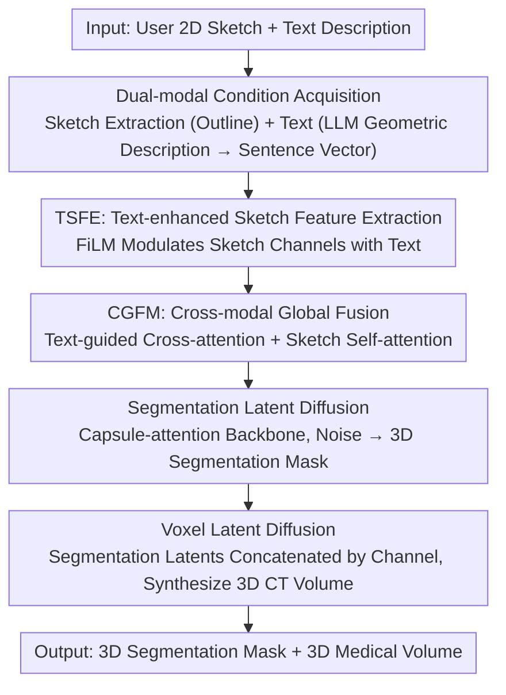

# Sketch2CT: Multimodal Diffusion for Structure-Aware 3D Medical Volume Generation

**Conference**: CVPR 2026  
**Paper**: [CVF Open Access](https://openaccess.thecvf.com/content/CVPR2026/html/An_Sketch2CT_Multimodal_Diffusion_for_Structure-Aware_3D_Medical_Volume_Generation_CVPR_2026_paper.html)  
**Code**: https://github.com/adlsn/Sketch2CT  
**Area**: Medical Imaging  
**Keywords**: Medical Image Synthesis, Latent Diffusion, Sketch & Text Conditioning, 3D Volume Generation, Data Augmentation

## TL;DR
Sketch2CT enables users to use a single 2D sketch and a text description to first generate anatomically consistent 3D segmentation masks through dual-modal fusion, and then synthesize corresponding 3D CT volumes using segmentation-conditioned latent diffusion, achieving low-cost, controllable, and structure-preserved medical volume data augmentation.

## Background & Motivation
**Background**: Medical imaging long faces data scarcity due to privacy concerns, acquisition costs, and the rarity of expert annotations. Diffusion models have become the mainstay for medical image synthesis due to high fidelity and stable training, enabling conditional generation via text, segmentation masks, or sketches.

**Limitations of Prior Work**: Existing medical synthesis pipelines have significant drawbacks: (1) 2D slice-based diffusion is visually realistic but lacks anatomical continuity between adjacent slices, failing to form consistent 3D volumes; (2) Direct full 3D diffusion preserves spatial coherence but incurs massive computational/VRAM overhead, limiting resolution and scalability; (3) Segmentation-guided conditional models rely on pre-existing masks, restricting output diversity and controllability.

**Key Challenge**: Controllability requires conditions, but pure segmentation mask conditioning either needs existing masks or (like MedGen3D, which generates random masks before synthesizing volumes) loses structural control due to mask randomness. A single sketch lacks depth and volumetric context, making it difficult to reconstruct a complete 3D segmentation from a single projection. It is challenging to simultaneously achieve controllability, 3D consistency, and computational efficiency.

**Goal**: To decouple the problem into two steps—first generating anatomically consistent 3D segmentation masks from low-cost sketches and text, and then synthesizing high-fidelity 3D CT volumes based on these masks.

**Key Insight**: The authors observe that sketches and text are naturally complementary—sketches provide coarse structural outlines (structural blueprints), while text provides the depth, volume, and geometric semantics (e.g., symmetry, topological continuity) missing from sketches. Fusing the two allows for efficient, structure-preserved 3D volume generation in latent space.

**Core Idea**: Utilizing "sketch + text" dual-modal conditions, a two-stage latent diffusion process is driven by two layers of fusion: local (FiLM text modulation of sketches) and global (two-level attention). This first generates 3D segmentation masks and subsequently synthesizes 3D medical volumes.

## Method

### Overall Architecture
Sketch2CT is a clear two-stage latent space diffusion pipeline. The first stage is "Segmentation Mask Generation": 2D sketches capturing outlines are extracted from 3D segmentations, geometric metrics are converted into text descriptions via an LLM, and sketches and text are fused through two layers (TSFE + CGFM). This is fed into a segmentation latent diffusion model with a capsule-attention backbone to generate anatomically consistent 3D masks from noise. The second stage is "Medical Volume Generation": the generated segmentation latent variables are channel-wise concatenated into the volume latent diffusion model as structural priors to synthesize high-fidelity 3D CT volumes aligned with the segmentation. Both stages operate within the latent space compressed by MONAI's 3D AutoencoderKL and employ v-prediction parameterization.

### Key Designs

**1. Dual-modal Condition Acquisition: Sketch for Structure, Text for 3D Semantics**

The pain point is that a single sketch lacks depth and volumetric context, making it difficult to recover full 3D segmentations from one 2D projection, while multi-view sketches significantly increase user burden. The authors make two low-cost modalities complementary: **Sketch Side**—Surface projections of organs are rendered in 3D Slicer (axial for volumetric organs like liver/heart, sagittal for tubular organs like the aorta to fit the main axis), followed by grayscale conversion, histogram equalization, bilateral filtering, Canny edge detection, and morphological thinning to obtain clean, continuous outline sketches; abstraction levels are controlled by adjusting thresholds/kernel sizes. **Text Side**—2D snapshots are generated along axial/coronal/sagittal axes, and geometric metrics (volume, surface area, major axis length, max/min diameter, sphericity, compactness, centerline length, etc.) are calculated from the segmentation mask. Snapshots and metrics are fed into GPT-4o-mini acting as a "geometric description expert," outputting only geometric JSON (shape, surface smoothness, symmetry, topological continuity, etc., explicitly excluding any diagnostic/clinical information, thus requiring no medical-specific LLM). These are then encoded into text embeddings using a pre-trained sentence transformer. The effectiveness lies in the sketch providing intuitive structural priors while the text supplements the missing 3D geometric semantics, and users can freely edit the text during inference for interactive control without reference segmentations.

**2. TSFE: Text-enhanced Sketch Feature Extraction (Local Modulation)**

The pain point is that sketches are sparse with only edges and little texture/shading information, and boundaries are often discontinuous due to projection or noise. Directly encoding them with a convolutional backbone leads to feature ambiguity and loss of structural cues. TSFE uses text semantic priors to "reinforce" sparse sketches: sketches are encoded into capsule embeddings $f_s \in \mathbb{R}^{d_s}$ via a convolutional backbone + primary capsules + attention routing; text is encoded as $f_t \in \mathbb{R}^{d_t}$ via sentence vectors. A FiLM mechanism generates per-channel scale and shift parameters $\gamma, \beta = g(f_t)$ from the text to modulate the sketch features: $\tilde{f}_s = \gamma \odot f_s + \beta$ (where $\odot$ denotes element-wise multiplication). This allows the text to adaptively amplify semantically relevant sketch channels and suppress irrelevant ones, producing more stable and informative sketch embeddings. It is effective because it injects global semantics—"what organ the text understands"—directly into the channel-level representation of the sketch, alleviating feature ambiguity of sparse edges.

**3. CGFM: Cross-modal Global Fusion (Two-level Attention Alignment)**

Local modulation alone is insufficient for global alignment. CGFM uses two levels of attention for cross-modal joint reasoning: first, text-guided **cross-attention** integrates fine-grained semantics, $F_{local} = \text{Attention}(\tilde{f}_s, f_t, f_t)$, capturing local correspondences between sketch outlines and text semantics; then, sketch-guided **self-attention** aggregates these into a global representation $F_{global} = \text{SelfAttn}(F_{local})$, summarizing the organ's overall geometry and semantics. Finally, a concatenated projection yields the joint multimodal feature $z_{fusion} = \text{Proj}([F_{local} \| F_{global}])$ as the conditional input for segmentation latent diffusion. TSFE performs local channel modulation while CGFM performs global hierarchical alignment; the two complementarily bridge the modality gap, producing robust geometry-aware multimodal embeddings.

**4. Two-stage Latent Space Diffusion (Segmentation LDM → Volume LDM)**

The pain point is that direct 3D diffusion in voxel space is computationally and memory-prohibitive. Both stages first compress data into a compact latent space using MONAI's 3D AutoencoderKL. **Segmentation Stage**: The segmentation volume $x_0$ is encoded as $z_0 = E_{seg}(x_0)$, forward noise is added $q(z_t|z_{t-1}) = \mathcal{N}(\sqrt{\alpha_t} z_{t-1}, (1-\alpha_t)I)$, and the reverse UNet denoising network $\epsilon_\theta$ receives the condition $z_{fusion}$ via cross-attention layers. Using v-prediction parameterization, the target velocity is $v_t = \sqrt{\alpha_t}\,\epsilon - \sqrt{1-\alpha_t}\,z_0$, and the loss is $L_{diff} = \mathbb{E}_{t,z_0,\epsilon}[\|\epsilon_\theta(z_t,t,z_{fusion}) - v_t\|_2^2]$. Denoising yields the latent variable, which is then decoded into the 3D segmentation mask. **Volume Generation Stage**: The previous stage's segmentation mask is encoded as $z_{seg}$ to serve as a structural prior, channel-wise concatenated with the noisy image latent variable $z_{t-1} = \epsilon_\theta(z_t \| z_{seg}, t)$ to guide denoising. This ensures the synthesized volume preserves anatomical geometry while generating realistic tissue textures. The effectiveness lies in latent space diffusion reducing the computational load of full 3D generation, while the "segmentation latent as structural prior" establishes a strong constraint between geometry and texture, ensuring alignment between the image and anatomical structure.

### Loss & Training
Both diffusion stages use v-prediction parameterization and minimize the MSE between predicted and target velocities (Eq. 9). AutoencoderKL uses three resolution levels, channel widths of (32, 64, 64), one residual block per level, and spatial attention only at the deepest layer. During diffusion training, the autoencoder is frozen and used only as a latent encoder/decoder. The denoising 3D UNet has channel widths of (32, 64, 64), one residual block per level, spatial attention at the last two levels, a 1024-dimensional cross-attention condition, and one transformer layer per attention level. A DDPM scheduler with 1000 steps is used, with an Adam learning rate of $1\times10^{-4}$, batch size of 10, mixed precision, and training for 300 epochs (on a single NVIDIA H200). All volumes are resampled to $128\times128\times128$, and datasets are split into 8:2 for training/testing.

## Key Experimental Results

Evaluated on three public CT datasets + one MRI dataset: CHAOS liver (20 CT, liver), AVT aorta (56 CT, aorta), Decathlon liver (131 CT, liver), Decathlon heart (20 MRI, heart).

### Main Results: Synthetic Image Quality (Table 1, FID↓ / LPIPS↑)

| Method | CHAOS Liver FID/LPIPS | AVT Aorta FID/LPIPS | Decathlon Liver FID/LPIPS | Decathlon Heart FID/LPIPS |
|------|------|------|------|------|
| Med-DDPM | 114.4 / 0.220 | 119.6 / 0.213 | 115.3 / 0.207 | 128.7 / 0.192 |
| MedGen3D | 43.6 / 0.300 | 47.1 / 0.294 | 45.7 / 0.296 | 96.8 / 0.248 |
| Seg-Diff | 37.8 / 0.310 | 38.9 / 0.313 | **34.8 / 0.335** | 68.4 / 0.265 |
| **Ours** | **33.7 / 0.332** | **36.9 / 0.321** | 36.5 / 0.328 | **65.1 / 0.269** |

Sketch2CT achieves the best FID/LPIPS on most datasets; it leads significantly on the noisier Decathlon heart dataset, which is harder for all methods. Seg-Diff slightly outperforms in FID only on the larger Decathlon liver (its 2D diffusion benefits from more data) but lacks axial continuity; Sketch2CT achieves image quality comparable to 2D methods while preserving full 3D spatial information.

### Key Findings
- **3D consistency is the core advantage of Sketch2CT**: 2D methods (Seg-Diff) have high single-slice quality but lack axial continuity. Sketch2CT matches 2D image quality while preserving full 3D spatial coherence.
- **Sketch+Text dual-modal is controllable and low-cost**: Experiments validated that user-drawn cheap sketches can drive generation effectively using 20 pairs of "hand-drawn sketches + light text".
- **Synthetic data truly improves performance**: Segmentation models trained on Sketch2CT synthetic images approach the upper bound of real data training, proving its practical value as a data augmentation tool. Two medical imaging experts also performed qualitative confirmation of anatomical realism, structural continuity, and clinical plausibility.

## Highlights & Insights
- **The "Mask then Volume" two-stage approach secures both controllability and 3D consistency**: The segmentation stage ensures anatomical structures are controlled by sketch+text, while the volume stage translates structural priors into texture, avoiding the lack of control in purely random masks (MedGen3D) and the discontinuities of pure 2D stitching.
- **Using an LLM as a "purely geometric descriptor" is clever**: Having GPT-4o-mini output only geometric JSON for shape/symmetry/topology while explicitly excluding clinical diagnosis supplements the 3D context missing from sketches without relying on medical-specific LLMs. This "describe segmentation as a general 3D object" idea is transferable to any shape-conditional generation.
- **Dual-layer fusion of local FiLM + global two-level attention**: TSFE injects text semantic priors at the channel level to stabilize sparse sketches, and CGFM performs cross-modal global alignment. This complementary bridging of the modality gap is a reusable paradigm for handling "sparse structural modalities + semantic text modalities."

## Limitations & Future Work
- The current implementation covers only a few organs and focuses on single-organ synthesis, without performing multi-organ joint generation (as acknowledged by the authors).
- Latent space compression loses some fine-scale details; the authors argue that global anatomical consistency is more critical for medical analysis than fine detail, but this may be insufficient for tasks requiring subtle lesion detection.
- Sketch extraction relies on 3D Slicer/PyVista rendering + a series of manual OpenCV operators (thresholds, kernel sizes), with limited automation and robustness, requiring retuning for different organs.
- Evaluation mainly focuses on segmentation fidelity/downstream generalization, lacking large-scale blind evaluation by radiologists and pathology diversity validation; the authors plan to expand to multi-organs, introduce disease-specific sketch editing to simulate pathological changes, and perform broader expert assessments.

## Related Work & Insights
- **vs MedGen3D [24]**: It first generates random 3D masks then synthesizes volumes; random masks result in weak structural control. Sketch2CT uses sketches+text for controllable mask generation, yielding higher structural fidelity and downstream generalization.
- **vs Seg-Diff [29]**: It is a segmentation-guided 2D diffusion with good single-slice quality but lacks axial continuity and cannot generate masks itself. Sketch2CT generates 3D masks directly and preserves consistency, only being slightly surpassed in FID on the largest single dataset.
- **vs Med-DDPM [13]**: Pure 3D/slice diffusion without multimodal structural conditions, resulting in much lower structural fidelity (Dice ~0.50). Sketch2CT significantly improves anatomical consistency via dual-modal conditions.

## Rating
- Novelty: ⭐⭐⭐⭐ First to apply sketch+text dual-modal diffusion to structure-aware 3D medical volume generation, with a clear two-stage + dual-layer fusion design.
- Experimental Thoroughness: ⭐⭐⭐⭐ Solid evaluation across four datasets with FID/LPIPS + fidelity + downstream generalization; however, ablation studies are missing from the main text (placed in supplementary).
- Writing Quality: ⭐⭐⭐⭐ Clear description of motivation and methodology with complete formulas; some module details are slightly brief.
- Value: ⭐⭐⭐⭐ Provides a low-cost, controllable path for medical volume data augmentation, with downstream segmentation performance approaching the upper bound of real data.

<!-- RELATED:START -->

<!-- RELATED:END -->

## Related Papers

- [\[CVPR 2026\] MR-RAG: Multimodal Relevance-Aware Retrieval-Augmented Generation for Medical Visual Question Answering](mr-rag_multimodal_relevance-aware_retrieval-augmented_generation_for_medical_vis.md)
- [\[CVPR 2026\] SHAPE: Structure-aware Hierarchical Unsupervised Domain Adaptation with Plausibility Evaluation for Medical Image Segmentation](shape_structure-aware_hierarchical_unsupervised_domain_adaptation_with_plausibil.md)
- [\[CVPR 2026\] Masked-Diffusion Autoencoders for 3D Medical Vision Representation Learning](masked-diffusion_autoencoders_for_3d_medical_vision_representation_learning.md)
- [\[CVPR 2026\] Personalized Longitudinal Medical Report Generation via Temporally-Aware Federated Adaptation](personalized_longitudinal_medical_report_generation_via_temporally-aware_federat.md)
- [\[CVPR 2026\] MedGEN-Bench: Contextually Entangled Benchmark for Open-Ended Multimodal Medical Generation](medgen-bench_contextually_entangled_benchmark_for_open-ended_multimodal_medical_.md)

<!-- RELATED:END -->
