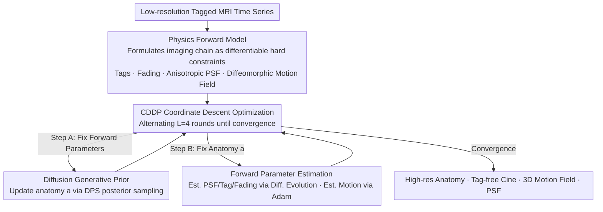

# Solving a Nonlinear Blind Inverse Problem for Tagged MRI with Physics and Deep Generative Priors

**Conference**: CVPR 2026  
**arXiv**: [2603.00882](https://arxiv.org/abs/2603.00882)  
**Code**: None  
**Area**: Medical Imaging  
**Keywords**: Tagged MRI, Inverse Problem, Diffusion Prior, Motion Estimation, Image Super-resolution

## TL;DR

The InvTag framework is proposed, which for the first time combines an MR physics forward model with a pre-trained diffusion generative prior to unifiedly solve three sub-tasks of 3D Tagged MRI: anatomical recovery, Cine synthesis, and motion estimation, without requiring any additional training data.

## Background & Motivation

Tagged MRI tracks internal motion by applying periodic tags to tissue, widely used in cardiac motion analysis and brain biomechanics research. However, its post-processing faces three major challenges:

**Tag Interference**: The presence of tags prevents the direct application of conventional anatomical segmentation methods.

**Tag Fading**: Due to T1 relaxation, tag contrast decreases sharply over time, violating the brightness constancy assumption of optical flow methods.

**Low Resolution**: To accelerate acquisition, the spatial resolution of Tagged MRI is typically lower than that of standard structural MRI.

Traditional methods treat motion tracking, Cine synthesis, and super-resolution as independent tasks, but these are inherently coupled: reliable motion tracking requires handling tag fading and spectral overlap, while resolving spectral overlap requires separating anatomical structures from tag patterns. The authors propose a unified framework to solve these jointly.

## Method

### Overall Architecture

InvTag formulates Tagged MRI analysis as a **nonlinear blind inverse problem**: given a low-resolution Tagged MRI time series, it simultaneously recovers four components—high-resolution anatomical image $a$, a tag-free Cine sequence, 3D diffeomorphic motion fields $\{\phi_t\}$, and the unknown anisotropic point spread function (PSF) of the imaging system. It is "nonlinear" because deformable spatial transformations are inherently nonlinear, and "blind" because the PSF and tag fading parameters are unknown a priori. The framework consists of three components: a **physics forward model** mapping unknowns to observations (hard constraint), a **diffusion generative prior** providing anatomical priors (soft constraint), and a **CDDP coordinate descent optimizer** solving between them.

### Key Designs

**1. Physics-based Forward Model: Differentiable Hard Constraints**

Traditional methods treat motion tracking, Cine synthesis, and super-resolution as independent, yet they are intertwined—reliable motion tracking requires handling fading and spectral overlap, while resolving overlap requires separating anatomy from tags. InvTag explicitly models the imaging chain:

$$g_t^{\Box} = h_\gamma^{\Box} * \phi_{\theta_t}^* [a \cdot f_{\beta_t}(q_\alpha^{\Box})] + n_t^{\Box}$$

where $a$ is the reference anatomy, $q_\alpha^{\Box}$ is the sinusoidal tag pattern parameterized by SPAMM physics, $f_{\beta_t}$ is the affine fading model, $h_\gamma^{\Box}$ is the anisotropic Gaussian PSF, and $\phi_{\theta_t}$ is the PINN-based diffeomorphic deformation field (ensured by exponential mapping $\phi_t = \exp\{v_t\}$ to avoid folding). Crucially, all frames share the same anatomy $a$, with inter-frame differences generated solely by $\phi_t$, naturally constraining temporal consistency without extra regularization.

**2. Diffusion Generative Prior: Manifold Constraints for Undetermined Problems**

The blind inverse problem is inherently underdetermined; relying solely on data fidelity may lead to divergence. InvTag utilizes a diffusion model pre-trained on 80,000+ 1mm isotropic T1w 3D head volumes as an anatomical prior. Through DPS (Diffusion Posterior Sampling), the data fidelity term is integrated into the reverse diffusion SDE:

$$da_\tau = -\eta_\tau \Big[\frac{1}{2}a_\tau + s_\vartheta(a_\tau, \tau) - \rho \nabla_{a_\tau} \mathcal{L}_{\text{rec}}(\hat{a}_0(a_\tau))\Big] d\tau + \sqrt{\eta_\tau} d\bar{w}$$

The score term $s_\vartheta$ pulls the sample toward the anatomical manifold, while the data fidelity gradient ensures the reconstruction matches observations. This avoids the need for paired Tagged/Cine data while leveraging generative priors to compensate for resolution and missing information.

**3. Coordinate Descent with Diffusion Prior (CDDP): Alternating Convergence**

Anatomy $a$ and forward model parameters are interdependent, making simultaneous optimization highly non-convex. CDDP splits this into two steps: (A) fix forward parameters and update $a$ via diffusion posterior sampling; (B) fix $a$ and perform maximum likelihood estimation for the forward model. Low-dimensional parameters ($\gamma, \alpha, \beta_t$) are optimized via a bounded Differential Evolution optimizer due to the non-convex landscape, while high-dimensional motion parameters $\theta_t$ use Adam. The first frame jointly estimates $(a^\star, \alpha^\star, \gamma^\star)$, which are then fixed; subsequent frames update only fading and motion, saving computation and avoiding tag phase ambiguity.

### Loss & Training

- **Data Reconstruction Loss**: $\mathcal{L}_{\text{rec}}(a) = \sum_t \sum_{\Box} \|g_t^{\Box} - \mathcal{A}_t^{\Box}(a)\|_2^2$
- **Diffusion Prior**: Pre-trained weights are frozen, using 256 DDIM sampling steps.
- **CDDP Iteration**: $L=4$ rounds of coordinate descent; motion is initialized from the previous time step.
- No external Tagged or Cine training data, paired supervision, or fine-tuning required.

## Key Experimental Results

### Main Results

**Tag-to-Cine Synthesis** (160 test cases, 20 AIBL + 20 Sleep subjects × 4 settings):

| Method | PSNR ↑ (t=1) | SSIM ↑ (t=1) | PSNR ↑ (t=6) | SSIM ↑ (t=6) |
|------|-------------|-------------|-------------|-------------|
| LowpassFuse | 26.43 | 0.62 | 26.68 | 0.66 |
| HARP Demod. | 24.28 | 0.52 | 23.93 | 0.54 |
| **Ours (InvTag)** | **28.38** | **0.83** | **28.41** | **0.84** |

**Motion Estimation**:

| Method | EPE ↓ | EPE@95 ↓ | NegDet(%) ↓ |
|------|-------|----------|-------------|
| LKUnet | 1.35 | 2.94 | 0.043 |
| DeepTag | 1.27 | 2.97 | 0.060 |
| SyN | 1.06 | 2.41 | <0.001 |
| DRIMET | 0.79 | 1.61 | <0.001 |
| **Ours (InvTag)** | **0.60** | **1.31** | **<0.001** |

### Ablation Study

| Configuration | PSNR ↑ | SSIM ↑ | EPE ↓ | EPE@95 ↓ |
|------|--------|--------|-------|----------|
| w/o PSF Estimation | 27.27 | 0.69 | 0.62 | 1.41 |
| w/o Fading Estimation | 28.21 | 0.80 | 0.71 | 1.56 |
| w/o CDDP (Joint Opt.) | 22.05 | 0.46 | 1.57 | 2.73 |
| **Full Model** | **28.40** | **0.83** | **0.60** | **1.31** |

### Key Findings

- Removing CDDP in favor of joint optimization leads to significant failure (PSNR drop of 6.35), indicating alternating optimization is critical for solving blind inverse problems.
- PSF estimation contributes significantly to synthesis quality, while fading estimation is more critical for motion tracking.
- The model successfully recovers anatomy and motion on real rotating gel phantom data, even though the diffusion prior was trained only on synthetic ellipses.
- Negligible variance in PSF/tag parameters across 5 random initializations confirms the reliability of CDDP convergence.

## Highlights & Insights

- **First Unified Framework**: Simultaneously addresses the three core tasks of Tagged MRI, leveraging task coupling for mutual enhancement.
- **Nonlinear Blind Inverse Problem**: Successfully utilizes MR physics as hard constraints and diffusion priors as soft constraints, overcoming the limitation of previous diffusion solvers that assumed linear or known forward operators.
- **Zero-shot Generalization**: Requires no Tagged/Cine training data, relying exclusively on a T1w diffusion prior.
- The CDDP strategy demonstrates excellent stability and robust convergence in non-convex optimization landscapes.

## Limitations & Future Work

- **Long Runtime**: Requires 1.2 hours per frame (on a single A40 GPU); repeated diffusion sampling and PINN optimization are bottlenecks.
- Only assumes sinusoidal tags; grid tags or higher-order tag patterns are not yet supported.
- Validated only on brain Tagged MRI, not yet extended to cardiac applications.
- Lacks uncertainty quantification, which may impact clinical confidence.

## Related Work & Insights

- Compared to traditional frequency-domain methods like HARP/SinMod, InvTag estimates tag frequencies automatically rather than requiring presets.
- Unlike general diffusion inverse solvers like DPS, InvTag handles a more complex nonlinear + blind setting.
- The CDDP alternating optimization strategy can be generalized to other medical imaging inverse problems involving unknown forward models.

## Rating

- Novelty: ⭐⭐⭐⭐⭐ — First to combine MR physics with diffusion priors for nonlinear blind inverse problems.
- Experimental Thoroughness: ⭐⭐⭐⭐ — 160 cases + real data + full ablation, though cardiac data is missing.
- Writing Quality: ⭐⭐⭐⭐⭐ — Clear mathematical derivation and comprehensive physical modeling.
- Value: ⭐⭐⭐⭐ — Elegant methodology, though runtime efficiency limits immediate clinical deployment.

<!-- RELATED:START -->

## Related Papers

- [\[CVPR 2026\] KLIP: localized distribution shift detection via KL-divergence with diffusion priors in Inverse Problems](klip_localized_distribution_shift_detection_via_kl-divergence_with_diffusion_pri.md)
- [\[AAAI 2026\] Unsupervised Multi-Parameter Inverse Solving for Reducing Ring Artifacts in 3D X-Ray CBCT](../../AAAI2026/medical_imaging/unsupervised_multi-parameter_inverse_solving_for_reducing_ring_artifacts_in_3d_x.md)
- [\[CVPR 2026\] GenTract: Generative Global Tractography](gentract_generative_global_tractography.md)
- [\[CVPR 2026\] Dynamic Stream Network for Combinatorial Explosion Problem in Deformable Medical Image Registration](dynamic_stream_network_for_combinatorial_explosion_problem_in_deformable_medical.md)
- [\[CVPR 2026\] MicroFM: Physics-guided Flow Matching for Isotropic Microscopy Reconstruction](microfm_physics-guided_flow_matching_for_isotropic_microscopy_reconstruction.md)

<!-- RELATED:END -->
