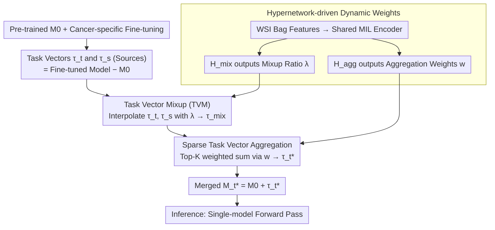

# STEPH: Sparse Task Vector Mixup with Hypernetworks for Efficient Knowledge Transfer in WSI Prognosis

**Conference**: CVPR 2026  
**arXiv**: [2603.10526](https://arxiv.org/abs/2603.10526)  
**Code**: [GitHub](https://github.com/liupei101/STEPH)  
**Area**: Medical Imaging / Computational Pathology  
**Keywords**: Whole Slide Images (WSI), Survival Analysis, Cross-cancer Knowledge Transfer, Task Vectors, Hypernetworks, Model Merging

## TL;DR

STEPH proposes a model merging scheme based on Task Vector Mixup (TVM) combined with hypernetwork-driven sparse aggregation. It efficiently integrates predictive knowledge from multiple cancer-specific models into a target cancer model. On 13 TCGA datasets, it achieves an average C-Index of 0.6949 (+5.14% vs. cancer-specific learning, +2.01% vs. ROUPKT). During inference, it requires only a single model forward pass, which is significantly more efficient than multi-model representation transfer schemes.

## Background & Motivation

**Background**: Gigapixel Whole Slide Images (WSI) are central data sources for cancer prognosis (survival analysis). Cancer-specific models based on Multi-Instance Learning (MIL) are the mainstream framework. However, training samples for each cancer type are limited (approximately 1,000 cases), and high tumor heterogeneity restricts generalizability.

**Limitations of Prior Work**: (1) **Cancer-specific Learning**—Small data volume and high heterogeneity lead to poor generalization; (2) **Multi-cancer Joint Training**—Extremely high computational costs due to the massive size of WSIs and associated privacy risks; (3) **Representation Transfer (ROUPKT)**—Uses WSI representations from multiple source models for routing aggregation, but requires running all source models during inference, with costs scaling linearly with the number of source models.

**Key Challenge**: How to efficiently absorb cross-cancer knowledge into a single model without the high computational cost of joint training or the high inference overhead of multi-model ensembles?

**Goal**: To "merge" prognostic knowledge from various cancer types into a target cancer model via model merging, achieving lightweight and efficient cross-cancer transfer.

**Key Insight**: Task vectors $\tau_t = \mathcal{M}_t - \mathcal{M}_0$ encode the prognostic knowledge for a specific cancer. Unlike model merging in Multi-Task Learning (MTL), which aims to preserve multi-task capabilities (addressing task interference), the goal in WSI prognosis is to enhance target task generalization. This is achieved by mixing source and target task vectors through mixup interpolation to obtain better optimization directions.

**Core Idea**: Perform mixup interpolation on each source-target task vector pair to absorb beneficial knowledge, then use a hypernetwork to learn input-adaptive sparse aggregation weights to merge them into a single enhanced model.

## Method

### Overall Architecture

STEPH addresses a practical contradiction: while each cancer type has only ~1,000 WSIs leading to poor generalization, neither joint training (expensive computation) nor multi-model inference (expensive inference) is ideal. The core idea is to perform knowledge transfer in the **parameter space** rather than the data space. First, a pre-trained model $\mathcal{M}_0$ is fine-tuned for each cancer type to create specific models, and task vectors $\tau_t = \mathcal{M}_t - \mathcal{M}_0$ are computed to encode cancer-specific knowledge. Next, the target task vector $\tau_t$ is mixed with each source task vector $\tau_{s_i}$ via mixup interpolation to generate a set of mixed vectors. A hypernetwork then selects the most beneficial vectors via weighted summation to form $\tau_t^*$. Finally, this is added back to the initial model $\mathcal{M}_t^* = \mathcal{M}_0 + \tau_t^*$ to obtain the enhanced target model. The merged result is a single model, requiring only one forward pass during inference. The mixup ratio $\lambda$ and aggregation weights $w$ are not manually tuned constants; they are adaptively output by two hypernetworks (sharing an MIL encoder) that process the current WSI features.

### Key Designs

**1. Task Vector Mixup (TVM): Mixing source knowledge into the target model in parameter space**

Classic mixup interpolates inputs or features; STEPH applies it to task vectors. For each source-target pair $(\tau_t, \tau_{s_i})$, a linear interpolation is performed: $\tau_{\text{mix}} = \lambda_i \tau_t + (1-\lambda_i)\tau_{s_i}$. This creates an optimization direction that absorbs source knowledge while retaining target knowledge. Crucially, $\lambda_i$ is not fixed but adaptively generated by a hypernetwork $\mathcal{H}_{\text{mix}}$ based on the current WSI bag-of-patches features (mean-MIL encoder + sigmoid constraint to $[0,1]$). This allows different samples to have different mixing ratios. The authors justify this via Vicinal Risk Minimization (VRM): task vectors are essentially accumulated gradients from fine-tuning; performing mixup on them approximates gradients learned from "virtually mixed data," leading to better generalization. Loss landscape visualization and Sharpness-Awareness (SAR) analysis confirm that training and test losses are lower when $\lambda$ falls within the $[0.7, 0.8]$ range.

**2. Sparse Task Vector Aggregation: Selecting only the top-K beneficial source cancers**

Mixing the target with 12 source cancer types produces a set of mixed vectors of varying quality—some source models might be poorly trained, or some cancer types might inherently conflict with the target. Averaging all of them could introduce noise. Following sparse routing in MoE, STEPH uses another hypernetwork $\mathcal{H}_{\text{agg}}$ (sharing the MIL encoder with $\mathcal{H}_{\text{mix}}$ but with an independent output head) to generate non-negative weights $w=\{w_i \ge 0\}$. Only the top-$K$ vectors are kept for the weighted sum $\tau_t^* = \sum_j w_j \tau_{\text{mix},j}$. These weights are also input-adaptive, allowing different WSIs to benefit from different source cancers. To prevent weight explosion, an auxiliary loss $\mathcal{L}_{\text{agg}} = (\log\sum_i e^{w_i})^2$ is applied. Visualizations show that for BRCA as a target, cancers like KIPAN, COADREAD, and BLCA receive higher weights, indicating useful knowledge transfer.

**3. Hypernetwork-driven Dynamic Weights: Replacing over-fitted grid search on small data**

The adaptive $\lambda$ and $w$ parameters are the key to STEPH's robustness in low-data scenarios. With only ~1,000 WSI cases per cancer, searching for fixed hyperparameters on a small validation set easily leads to overfitting. Letting hypernetworks dynamically generate weights per sample turns the decision of "how much to trust which source" into a learnable, sample-dependent process. The two hypernetworks share a mean-MIL encoder to save parameters. During training, in addition to the primary NLL survival loss, two regularizers are used: $\mathcal{L}_{\text{mix}} = \sum_j \lambda_j^2 / K$ to encourage absorbing source knowledge, and $\mathcal{L}_{\text{agg}} = (\log\sum_i e^{w_i})^2$ to stabilize aggregation weights. This hypernetwork scheme is highly versatile—applying it to existing model merging methods yield an average improvement of 14.5%.

### Loss & Training

NLL Survival Loss + Aux Losses ($\beta=0.05, \gamma$ via cross-validation); $K=5$; $m=12$ (source cancers); 5-fold CV; UNI for patch feature extraction.

## Key Experimental Results

### Main Results—13 TCGA Datasets Mean C-Index

| Method | Category | Mean C-Index |
|------|------|-------------|
| Vanilla (Cancer-specific) | Cancer-specific | 0.6609 |
| Fine-tuned (Cancer-specific) | Cancer-specific | 0.6611 |
| ROUPKT | Representation Transfer | 0.6812 |
| Model Avg. | Model Merging | 0.5804 |
| AdaMerging | Model Merging | 0.5689 |
| TIES AM | Model Merging | 0.6396 |
| Surgery AM | Model Merging | 0.5943 |
| Iso-C AM | Model Merging | 0.5699 |
| **STEPH** | **Model Merging** | **0.6949** |

### Ablation Study

| Configuration | Mean C-Index |
|------|-------------|
| w/o mixup, fix $\lambda=0$ (Source only) | 0.6860 |
| w/o mixup, fix $\lambda=1$ (Target only) | 0.6851 |
| w/ mixup, trainable $\lambda$ | 0.6921 |
| w/ mixup, **hypernetwork $\lambda$** | **0.6949** |
| w/o sparsity | 0.6912 |
| w/ sparsity, trainable $w$ | 0.6490 |
| w/ sparsity, **hypernetwork $w$** | **0.6949** |

### Hypernetwork Enhancement of Existing Methods

| Method | Original | + Hypernetwork Aggregation | Gain |
|------|------|-----------|------|
| AdaMerging | 0.5689 | 0.6877 | +20.9% |
| TIES | 0.6396 | 0.6802 | +6.3% |
| Surgery | 0.5943 | 0.6668 | +12.2% |
| Iso-C | 0.5699 | 0.6761 | +18.6% |

### Key Findings

- STEPH outperforms cancer-specific learning in 12 out of 13 datasets, with an average improvement of 5.14% and a maximum of 11.4% (BRCA).
- Standard model merging methods (AdaMerging/TIES, etc.) perform poorly (0.57~0.64) on WSI prognosis tasks because they are designed for multi-task stability rather than single-task enhancement.
- Hypernetwork-driven input-adaptive weights are the core—applying them to any existing method yields a 14.5% average improvement.
- SAR analysis shows that TVM improvements come mainly from the attention layers rather than the embedding layers, suggesting that attention aggregation in MIL benefits more from cross-cancer knowledge than instance encoding.
- Visualization of $\lambda$ dynamics: For BRCA, cancers like KIPAN, COADREAD, and BLCA show $\lambda_i < 0.3$ and high $w_i$, proving that BRCA extracts beneficial knowledge from these specific types.

## Highlights & Insights

1. **Model Merging for Single-Task Enhancement vs. MTL**: Shifting from the goal of multi-task capability to enhancing a single task’s generalization introduces new methodological needs—moving from resolving task interference to mining beneficial knowledge.
2. **VRM Theoretical Framework for TVM**: Task vector mixup is not just parameter averaging; it approximates training on mixed virtual data, providing a solid theoretical foundation.
3. **Universality of Hypernetworks**: The ability of hypernetwork-driven aggregation to improve four existing methods by 14.5% demonstrates that the input-adaptive mechanism is a powerful and generalizable tool.

## Limitations & Future Work

1. Dependence on the TCGA dataset; some cancer types have very few samples (<400), potentially biasing model evaluation.
2. Experiments are based on general attention-based MIL; advanced MIL methods (e.g., graph-based) have not been verified.
3. STEPH still requires training data to learn merging weights; training-free model merging remains a future direction.
4. $K=5$ (top-5 mixed vectors) is globally fixed; adaptive K values were not explored.

## Related Work & Insights

- **vs. ROUPKT**: ROUPKT must run all source models during inference to get representations for routing, causing costs to scale linearly. STEPH merges into a single model, requiring only one forward pass, offering a massive leap in efficiency.
- **vs. AdaMerging/TIES**: General merging methods focus on multi-task balance and interference resolution; STEPH focuses on single-task enhancement and mining beneficial knowledge.
- **vs. Data Mixup**: While classic mixup operates in input/feature space, STEPH operates in the parameter space (task vectors), representing an interesting extension of the mixup philosophy.

## Rating

⭐⭐⭐⭐

- **Novelty** ⭐⭐⭐⭐: Using model merging for single-task enhancement is a novel perspective; TVM is backed by VRM theory.
- **Experimental Thoroughness** ⭐⭐⭐⭐⭐: 13 datasets, multiple baseline categories, extensive ablations, visualizations, and hyperparameter analyses.
- **Writing Quality** ⭐⭐⭐⭐: Clear problem definition with strong theoretical analysis and visual evidence.
- **Value** ⭐⭐⭐⭐: Provides an efficient solution for cross-cancer knowledge transfer in computational pathology; the hypernetwork aggregation is highly generalizable.

<!-- RELATED:START -->

## Related Papers

- [\[CVPR 2026\] Any2Any 3D Diffusion Models with Knowledge Transfer: A Radiotherapy Planning Study](any2any_3d_diffusion_models_with_knowledge_transfer_a_radiotherapy_planning_stud.md)
- [\[CVPR 2026\] GeneVAR: Causal MeanFlow for Autoregressive Gene-to-WSI Tile Synthesis](genevar_causal_meanflow_for_autoregressive_gene-to-wsi_tile_synthesis.md)
- [\[ICLR 2026\] BioX-Bridge: Model Bridging for Unsupervised Cross-Modal Knowledge Transfer across Biosignals](../../ICLR2026/medical_imaging/biox-bridge_model_bridging_for_unsupervised_cross-modal_knowledge_transfer_acros.md)
- [\[CVPR 2026\] GaussianPile: A Unified Sparse Gaussian Splatting Framework for Slice-based Volumetric Reconstruction](gaussianpile_a_unified_sparse_gaussian_splatting_framework_for_slice-based_volum.md)
- [\[CVPR 2026\] Momentum Memory for Knowledge Distillation in Computational Pathology](momentum_memory_for_knowledge_distillation_in_computational_pathology.md)

<!-- RELATED:END -->
