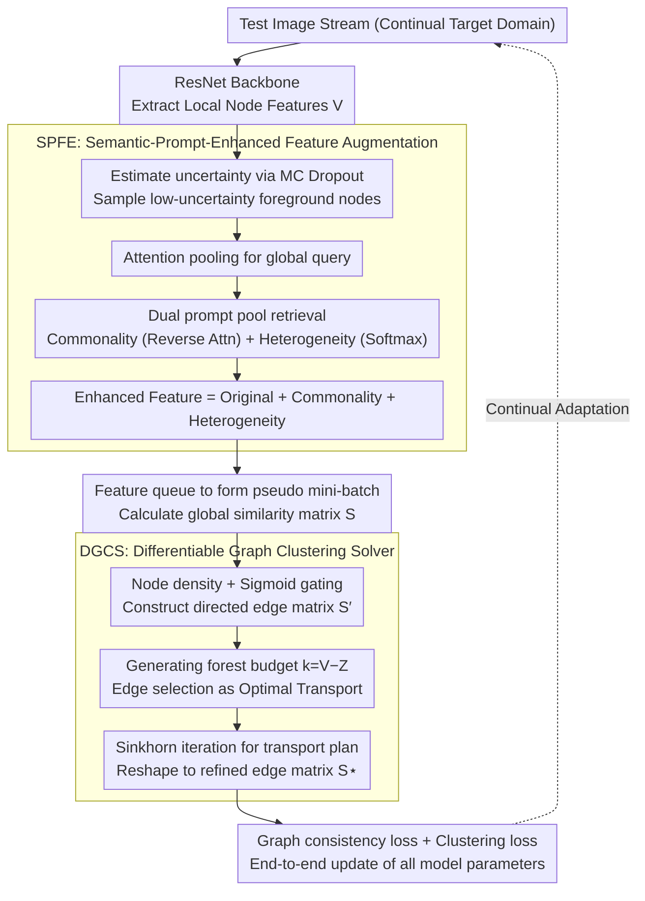

# SPEGC: Continual Test-Time Adaptation via Semantic-Prompt-Enhanced Graph Clustering for Medical Image Segmentation

**Conference**: CVPR2026  
**arXiv**: [2603.11492](https://arxiv.org/abs/2603.11492)  
**Code**: [Jwei-Z/SPEGC-for-MIS](https://github.com/Jwei-Z/SPEGC-for-MIS)  
**Area**: Medical Image Segmentation  
**Keywords**: Continual Test-Time Adaptation, Graph Clustering, Semantic Prompt, Optimal Transport, Domain Shift, Retina/Polyp Segmentation

## TL;DR

The SPEGC framework is proposed to refine the raw similarity matrix into high-order structural representations using semantic-prompt-enhanced features and a differentiable graph clustering solver. This guides the adaptation of medical image segmentation models on continuously changing target domains, effectively alleviating error accumulation and catastrophic forgetting.

## Background & Motivation

**Background**: Medical images suffer from performance degradation when pre-trained models are deployed to new target domains due to differences in acquisition equipment, operators, and scanning protocols, making them unsuitable for direct clinical use.

**Background**: Classical TTA assumes a static target domain, whereas real clinical data arrives as a continuous stream with evolving distributions, making Continual Test-Time Adaptation (CTTA) more practically significant.

**Limitations of Prior Work**: Existing CTTA methods relying on entropy minimization or pixel/instance-level signals often produce misleading gradients under severe domain shift, triggering a vicious cycle of "self-reinforced error accumulation."

**Limitations of Prior Work**: Prompt-based methods with frozen backbones only learn lightweight prompts in the input space. Without updating core parameters, the performance ceiling remains low.

**Limitations of Prior Work**: Local features of unlabeled test samples are highly susceptible to noise and style variations under domain shift, rendering directly calculated similarity matrices unreliable.

**Key Challenge**: Existing methods fail to fully exploit the internal cluster-level structural information of data to guide adaptation, preventing dynamic adjustment of decision boundaries.

## Method

### Overall Architecture

SPEGC aims to break the "self-reinforced error accumulation" cycle in CTTA—where entropy or pixel-level signals become unreliable under severe domain shift. Instead of relying on these fragile signals, it seeks supervision from the **internal high-order clustering structures** of the test data. The process involves: a ResNet backbone extracting local features; MC Dropout estimating uncertainty to sample reliable foreground nodes; Semantic-Prompt-Enhanced Feature Augmentation (SPFE) injecting global context into these nodes; enhanced features forming a pseudo mini-batch to compute a global similarity matrix; and a Differentiable Graph Clustering Solver (DGCS) refining this matrix into clean structural representations via an optimal transport formulation. Finally, graph consistency and clustering losses backpropagate these structural signals to the model to guide adaptation.

### Key Designs

**1. SPFE — Semantic-Prompt-Enhanced Feature Augmentation: Providing global context via decoupled prompt pools**

Local features under domain shift are easily biased by noise and style. SPFE first uses MC Dropout for multiple forward passes to estimate an uncertainty map based on feature variance, selecting only the top $p\%$ least uncertain foreground nodes to filter out noise (this step alone provides a ~1.9% gain). For selected nodes, SPFE uses attention pooling to form a global query $\hat{q}_i$, then retrieves context from two decoupled pools: the **Heterogeneity Prompt Pool** $P_{HE}$ uses standard Softmax attention to capture domain-specific patterns and category-discriminative information; the **Commonality Prompt Pool** $P_{CO}$ uses reverse attention with ReLU truncation to retrieve cross-domain shared semantics that do **not** match the query, preventing core knowledge from being washed away by domain styles. These are integrated as context: $V_i^* = V_i + p_{CO}(i) + p_{HE}(i)$. Ablations show that adding heterogeneity prompts alone decreases performance due to unconstrained noise, while commonality prompts combined with clustering loss yield a 4.55% gain, proving the necessity of "discriminative info + shared knowledge" decoupling.

**2. DGCS — Differentiable Graph Clustering Solver: Edge sparsification as differentiable Optimal Transport**

To refine the similarity matrix into a reliable structure, DGCS uses learnable projections $W_q, W_k$ for a global matrix $S$ (omitting Softmax to preserve high-confidence signals), then incorporates node density $D(v_i)$ and Sigmoid gating for a directed edge matrix $S'$. Based on graph theory, a spanning forest with $Z$ connected components has exactly $k = V - Z$ edges. DGCS models edge selection as a binary optimal transport problem, using the Sinkhorn algorithm to iteratively solve for an entropy-regularized transport plan $\Gamma^*$, which is reshaped into the refined edge matrix $S^\star$. This process is fully differentiable, allowing clustering structures to participate in end-to-end training rather than serving as offline post-processing.

### Loss & Training

$$L = L_G + \lambda L_C$$

- **Graph Consistency Loss** $L_G$: Forces semantic predictions to be consistent for nodes with high structural similarity in $S^\star$ (via KL divergence + stop-gradient), converting structural signals into model constraints.
- **Clustering Loss** $L_C$: Constraints the Commonality Prompt Pool to ensure shared prompts across all images in a batch are close in semantic space (via cosine distance), explicitly locking cross-domain knowledge.
- $\lambda=0.2$

## Key Experimental Results

### Main Results

| Method | Avg DSC (Retina) | Avg DSC (Polyp) |
|------|:---:|:---:|
| No Adapt | 72.75 | 71.49 |
| SAR (ICLR'23) | 73.44 | 69.21 |
| VPTTA (CVPR'24) | 73.40 | 73.40 |
| NC-TTT (CVPR'24) | 79.23 | 75.44 |
| GraTa (AAAI'25) | 78.66 | 76.24 |
| TTDG (CVPR'25) | 82.88 | 76.20 |
| **Ours (SPEGC)** | **84.37** | **78.27** |

### Ablation Study

| Configuration | Avg DSC |
|------|:---:|
| No Adapt (Baseline) | 72.75 |
| + Graph Clustering | 74.64 |
| + MC Dropout Uncertainty Sampling | 76.52 |
| + Heterogeneity Prompt Only (Unconstrained) | 75.39 (↓) |
| + Commonality Prompt + $L_C$ | 81.07 |
| + Complete (Common + Hetero) | **84.37** |

### Key Findings

- **Structure-driven beats Entropy-driven**: Entropy methods like SAR fall below the "No Adapt" baseline in polyp tasks due to "overconfident" wrong predictions on camouflaged objects; SPEGC avoids this by relying on internal data structures.
- **Excellent Long-term CTTA Stability**: In 5-round continuous adaptation experiments, SPEGC achieved the highest average DSC (83.10%) with only a 1.27% performance decay, balancing anti-forgetting and anti-error accumulation.
- **Commonality Prompt is Crucial**: Adding heterogeneity prompts alone reduced performance (75.39 vs 76.52), indicating noise introduction; the commonality prompt + clustering loss provided a significant 4.55% gain.
- **Efficiency-Performance Trade-off**: A pool size of 7 yielded the highest DSC (85.24%) but increased FLOPs to 21.7G; a size of 3 (84.37%, 5.8G FLOPs) was selected as the optimal balance.

## Highlights & Insights

- Introduces graph clustering into CTTA, replacing unreliable pixel/entropy signals with high-order structural information.
- Sophisticated decoupled prompt pool design: Reverse attention captures cross-domain shared knowledge, while standard attention extracts domain-specific information.
- Models edge sparsification as an Optimal Transport problem solved via Sinkhorn, achieving end-to-end differentiable graph clustering.
- Comprehensively outperforms SOTA on two medical segmentation benchmarks, with long-term CTTA experiments validating robustness against catastrophic forgetting.

## Limitations & Future Work

- DGCS similarity matrix computation has $O(V^2)$ complexity; FLOPs grow sharply with feature pool size (reaching 120G at pool size 15), limiting scalability.
- The number of clusters $Z$ is a manual hyperparameter requiring tuning for different tasks.
- Validated only on ResNet-50/ResUNet-50; stronger backbones (e.g., ViT/Swin) or larger datasets have not been tested.
- Focused on single-sample online adaptation; mini-batch scenarios remain unexplored.
- The commonality pool relies on the assumption that continuous data shares core semantics, which may not hold under extreme domain shifts.

## Related Work & Insights

- **Clustering-based Segmentation**: Yu et al. recast cross-attention as a clustering solver; Liang et al. proposed recurrent cross-attention; Ding et al. extended clustering to 3D. However, these are static in-domain post-processing methods and cannot use dynamic graph structures to guide adaptation.
- **CTTA**: SAR (entropy filtering), DomainAdaptor (BN stats), VPTTA (visual prompts + BN alignment), NC-TTT (noise estimation), GraTa (gradient alignment), TTDG (graph matching + pre-trained priors). SPEGC is most related to TTDG but differs by relying entirely on internal target data structure rather than source prototypes.

## Rating

- Novelty: ⭐⭐⭐⭐ — The combination of prompt decoupling and Optimal Transport based graph clustering is novel in CTTA.
- Experimental Thoroughness: ⭐⭐⭐⭐ — Multiple benchmarks, cross-domain tests, long-term CTTA, ablations, and visualizations provided.
- Writing Quality: ⭐⭐⭐⭐ — Clear structure, complete mathematical derivations, and well-articulated motivation.
- Value: ⭐⭐⭐⭐ — Highly relevant for medical imaging deployment, though computational overhead remains a minor hurdle for implementation.

<!-- RELATED:START -->

## Related Papers

- [\[ICCV 2025\] Progressive Test Time Energy Adaptation for Medical Image Segmentation](../../ICCV2025/medical_imaging/progressive_test_time_energy_adaptation_for_medical_image_segmentation.md)
- [\[CVPR 2026\] MedCLIPSeg: Probabilistic Vision-Language Adaptation for Data-Efficient and Generalizable Medical Image Segmentation](medclipseg_probabilistic_vision-language_adaptation_for_data-efficient_and_gener.md)
- [\[AAAI 2026\] Cross-Sample Augmented Test-Time Adaptation for Personalized Intraoperative Hypotension Prediction](../../AAAI2026/medical_imaging/cross-sample_augmented_test-time_adaptation_for_personalized_intraoperative_hypo.md)
- [\[ICML 2026\] MedCRP-CL: Continual Medical Image Segmentation via Bayesian Nonparametric Semantic Modality Discovery](../../ICML2026/medical_imaging/medcrp-cl_continual_medical_image_segmentation_via_bayesian_nonparametric_semant.md)
- [\[CVPR 2026\] Diffusion-Based Native Adversarial Synthesis for Enhanced Medical Segmentation Generalization](diffusion-based_native_adversarial_synthesis_for_enhanced_medical_segmentation_g.md)

<!-- RELATED:END -->
