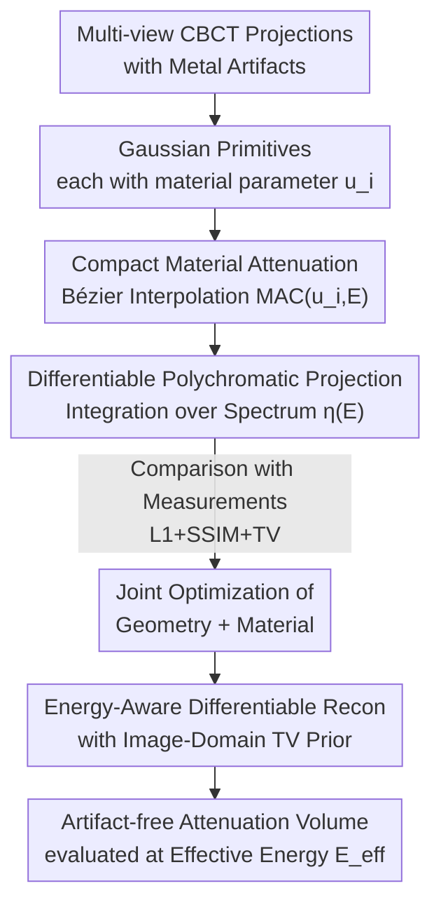

# Splat-Based Metal Artifact Reduction in Cone-Beam CT via Compact Attenuation Modeling

**Conference**: CVPR 2026  
**Paper**: [CVF Open Access](https://openaccess.thecvf.com/content/CVPR2026/html/Choi_Splat-Based_Metal_Artifact_Reduction_in_Cone-Beam_CT_via_Compact_Attenuation_CVPR_2026_paper.html)  
**Code**: None  
**Area**: Medical Imaging / 3D Reconstruction  
**Keywords**: Cone-Beam CT, Metal Artifact Reduction, Gaussian Splatting, Polychromatic X-ray, Differentiable Reconstruction

## TL;DR
By compressing "energy-dependent material attenuation" into a scalar parameter per Gaussian (interpolating MAC along a Bézier curve) and embedding a differentiable polychromatic Beer–Lambert forward projection into Gaussian Splatting, this work jointly optimizes geometry and material **without requiring metal masks**. It achieves CBCT metal artifact reduction an order of magnitude faster than neural field methods like Polyner while maintaining higher structural fidelity.

## Background & Motivation
**Background**: Cone-beam CT (CBCT) can reconstruct 3D volumes from a single rotation, serving as a primary tool for medical diagnosis and industrial inspection. Traditional reconstructions (FDK, analytical back-projection) assume X-rays are monochromatic, meaning attenuation is independent of energy. Recent advanced approaches shift toward "differentiable forward projection + neural fields": SAX-NeRF, NAF, and R2-Gaussian use continuous representations (NeRF / Instant-NGP / Gaussian Splatting) to fit projection measurements.

**Limitations of Prior Work**: Real X-ray sources are **polychromatic**—photon energy follows a spectrum, and the attenuation coefficient $\mu$ varies with both energy $E$ and material composition. When the scanned area contains high-attenuation metals, such as dental fillings or orthopedic implants, low-energy photons are preferentially absorbed (beam hardening). This causes the detected projections to exhibit strong non-linear distortion, resulting in dark streaks, shadows, and intensity artifacts in reconstruction. The monochromatic assumption fails completely here. Existing physical modeling methods have drawbacks: Polyner uses a NeRF backbone and relies on metal segmentation masks, leading to noise amplification and slow convergence; Diner simplifies attenuation to be energy-independent, losing critical polychromatic behavior; Park et al. assume a linear dependence on energy, oversimplifying the physics and leaving obvious artifacts.

**Key Challenge**: To accurately remove metal artifacts, one must **faithfully model energy-dependent attenuation** $\mu(l, E)$. However, directly optimizing a high-dimensional attenuation field (space $\times$ energy) either leads to computational explosion in 3D cone-beam geometry (neural fields) or requires extra metal masks to isolate metal regions for separate treatment. There is a tension between physical fidelity and optimizability.

**Key Insight**: The authors observe a crucial physical fact—although the absolute magnitudes of **Mass Attenuation Coefficient (MAC) curves** for clinically relevant biological tissues (water, protein, fat, bone) and metals (Ti, Fe, Al, Cr, Co, Ni) differ greatly, their **shapes (trends with energy) are highly correlated and smooth**, effectively lying on a **low-dimensional manifold** (validated using the NIST database in Figure 3). Thus, it is unnecessary to optimize a full high-dimensional MAC curve for every voxel; interpolating along this manifold with a single scalar is sufficient.

**Core Idea**: Each Gaussian primitive is assigned an additional **compact material parameter** $u_i \in [0,1]$, used to interpolate the MAC curve of that primitive along a quadratic Bézier curve. This "energy-dependent attenuation" is integrated into the differentiable polychromatic forward model of Gaussian Splatting, allowing joint optimization of geometric and material parameters in a mask-free manner.

## Method

### Overall Architecture
The method builds upon the R2-Gaussian framework for CBCT reconstruction: the attenuation field is represented as a sum of $M$ anisotropic Gaussian primitives $\mu(x)=\sum_i \delta_i \exp(-\tfrac12(x-p_i)^\top \Sigma_i^{-1}(x-p_i))$, where each primitive has a center $p_i$, covariance $\Sigma_i$, and density $\delta_i$. This work introduces three components to upgrade it from "monochromatic reconstruction" to "polychromatic metal artifact reduction": (1) Assigning a scalar material parameter $u_i$ to each Gaussian, mapped to an energy-dependent MAC curve $\mu_\rho(u_i,E)$ via a quadratic Bézier curve; (2) Replacing the monochromatic Beer–Lambert projection with a **polychromatic forward projection** integrated over the energy spectrum $\eta(E)$; (3) Designing the entire pipeline to be fully differentiable, enabling image-domain priors like SSIM/TV in the voxel domain, with joint optimization of $\{p_i,\Sigma_i,\delta_i,u_i\}$ using L1+SSIM+TV losses. The entire process requires no metal masks or paired supervision.

### Key Designs

**1. Compact Material Attenuation Modeling: Interpolating MAC along a Bézier Curve**

The challenge is that modeling polychromatic physics requires knowing how attenuation at each location varies with energy. Optimizing a high-dimensional MAC vector per primitive is unstable and produces spatially inconsistent estimates. The authors decompose the linear attenuation coefficient by density: $\mu(E)=\rho\,\mu_\rho(E)$, where the MAC $\mu_\rho(E)$ is an **intrinsic material property** determined by elemental composition (available via NIST tables), and density $\rho$ is the structure-dependent component carried by the Gaussian density parameter $\delta_i$. Since real MAC curves lie on a low-dimensional manifold, they are approximated with a **quadratic Bézier curve** using the minimum, middle, and maximum MAC vectors $(b_s, b_m, b_f)$ as control points:

$$\mu_\rho(u_i, E) = (1-u_i)^2 b_s(E) + 2(1-u_i)u_i\, b_m(E) + u_i^2 b_f(E),$$

where $u_i \in [0,1]$ is a continuous scalar that smoothly interpolates along the material manifold. This is effective because differences between materials lie primarily in magnitude and curvature rather than complex high-frequency patterns; a single scalar suffices to express the "physically relevant variation." This reduces material optimization to one dimension, stabilizing the polychromatic estimation and avoiding spatial inconsistencies. Figure 3 shows the close fit between the Bézier approximation and real NIST curves (typical values: water $u\approx0$, bone $u\approx0.33$, titanium $u\approx0.80$, iron $u\approx0.94$, nickel $u\approx1.0$).

**2. Differentiable Polychromatic Forward Projection: Embedding Spectral Integration**

Baseline R2-Gaussian only formulates monochromatic Beer–Lambert as a Gaussian projection, failing to account for energy-dependent attenuation. This work extends it to a full polychromatic model by explicitly integrating over the X-ray spectrum $\eta(E)$:

$$P(\hat{x}, E) = -\log \sum_{E=0}^{E_{\max}} \eta(E)\exp\!\Big(-\sum_{i=1}^{M} f_P(\hat{x}\mid p_i,\Sigma_i)\,\delta_i\,\mu_\rho(u_i,E)\Big),$$

where $f_P(\hat{x}\mid p_i,\Sigma_i)$ is the projection weight of the $i$-th Gaussian onto pixel $\hat{x}$, and $\mu_\rho(u_i,E)$ is the Bézier-controlled attenuation. The spectrum $\eta(E)$ is generated using the SPEKTR simulator (following Polyner), with a default of $N=15$ energy samples. The significance is that polychromatic beam hardening is directly incorporated into the differentiable forward pass, allowing $u_i$ and geometric parameters to be optimized end-to-end. The model adaptively learns attenuation behaviors for different tissues/metals, explaining metal-induced non-linearities at the source **without utilizing metal masks**.

**3. Energy-Aware Differentiable Reconstruction and TV Regularization**

The **reconstruction** is also designed to be differentiable. The attenuation volume is aggregated as $\mu(x,E)=\sum_i f_R(x\mid p_i,\Sigma_i)\,\delta_i\,\mu_\rho(u_i,E)$, allowing image-domain priors in the voxel domain. The total loss combines projection-domain L1 + SSIM and voxel-domain TV:

$$\mathcal{L}_{\text{total}} = \mathcal{L}_1(P_{GT}, P) + \lambda_0 \mathcal{L}_{\text{SSIM}}(P_{GT}, P) + \lambda_1 \mathcal{L}_{\text{TV}}(\mu(V, E_{\text{eff}})),$$

where $\lambda_0=0.25$ and $\lambda_1=3.0$. The final image is evaluated at the effective energy $E_{\text{eff}}=\sum_i \eta(E_i)E_i$. Differentiable reconstruction allows structure and material to be optimized together; geometry convergence drives material estimation and vice versa. Gaussian Splatting's sparse/analytical projection avoids the heavy MLP queries of neural fields, preserving high-frequency details while reducing computation by an order of magnitude.

## Loss & Training
The parameters $\{p_i, \Sigma_i, \delta_i, u_i\}$ are optimized per-Gaussian; initialization follows R2-Gaussian. Gradients are backpropagated end-to-end via a CUDA-based differentiable projection pipeline. Bézier MAC bases are constructed from NIST curves for water, iron, and aluminum over a 10–90 keV spectrum.

## Key Experimental Results

### Main Results
Synthetic datasets Lung (with Fe), Teeth (with Ti), and Broccoli (with Al) were used. 3D PSNR and SSIM are reported.

| Dataset | Metric | Ours | Polyner (Next Best) | FDK |
|--------|------|------|----------------|-----|
| Lung (Fe) | PSNR3D / SSIM3D | **28.96 / 0.994** | 20.63 / 0.977 | 17.21 / 0.905 |
| Teeth (Ti) | PSNR3D / SSIM3D | **27.40 / 0.993** | 20.74 / 0.970 | 17.71 / 0.885 |
| Broccoli (Al) | PSNR3D / SSIM3D | **27.76 / 0.997** | 21.60 / 0.990 | 18.00 / 0.963 |

Ours exceeds Polyner by 6~8 dB in PSNR. Supervised post-processing methods (ACDNet / DICDNet / OSCNet) fail to generalize due to domain shifts, with PSNR dropping significantly. On real data (walnut, garlic, chicken scanned with Bruker SKYSCAN 1273), FDK shows strong artifacts and Polyner suffers from over-smoothing, while Ours maintains the best fidelity.

Efficiency Comparison (Intel Xeon 4214R + RTX A6000):

| Scene | Polyner | Park et al. | Ours |
|------|---------|-------------|------|
| Broccoli | 1h50m | 1h49m | **29m** |
| Garlic | 1h30m | 1h27m | **20m** |
| Blueberry | 1h33m | 1h28m | **19m** |

Speedup is approximately one order of magnitude across all scenes.

### Ablation Study
| Config | PSNR3D | SSIM3D | Description |
|------|--------|--------|------|
| Baseline (R2-Gaussian) | 23.22 | 0.984 | Monochromatic GS |
| Baseline + Poly | 27.97 | 0.994 | Add polychromatic model, +4.75 dB |
| Baseline + Poly + TV | 28.04 | 0.995 | Add TV, +0.07 dB |

Spectral sampling density $N$ from 7 to 63 showed minimal impact on PSNR (< 0.15 dB), confirming that the MAC manifold is smooth and low-dimensional.

### Key Findings
- **Polychromatic Model is the Main Driver**: Adding the polychromatic model increases PSNR by 4.75 dB, while TV only adds 0.07 dB.
- **Robustness to Spectral Sampling**: The model is highly insensitive to $N$, allowing for efficient computation with low sampling (e.g., $N=15$).
- **Mask-free Speedup**: Avoiding metal masks and NeRF queries reduces reconstruction time from ~2 hours to ~20-40 minutes.
- **Generalization**: Physical-driven optimization outperforms supervised methods that fail on out-of-distribution (OOD) geometries and materials.

## Highlights & Insights
- **Low-Dimensional Manifold to Scalar Parameter**: Compressing "material type" into a continuous $[0,1]$ interpolation parameter $u_i$ is a clever design—it is both physically grounded and reduces optimization complexity.
- **Value of Mask-free Approaches**: Clinical metal segmentation is difficult and error-prone. Bypassing masks improves robustness to metal size, shape, and location.
- **Transferable Idea**: The use of Bézier curves with scalar interpolation to parameterize physical spectra can be applied to spectral imaging, material decomposition, or hyperspectral reconstruction.
- **Shift in Perspective**: Instead of "detecting and repairing" metal regions, this work redefines the problem as "correctly modeling polychromatic physics." Once the physics is correct, metal artifacts (as non-linear consequences) are naturally resolved.

## Limitations & Future Work
- **Limitations**: The compact material model only covers materials on the low-dimensional manifold; it may fail for materials with MAC curves that deviate significantly. Spectrum modeling relies on simulators (SPEKTR) rather than direct measurement, which may introduce residual biases. Performance depends on Gaussian density initialization.
- **Future Work**: Extending the method to dynamic or sparse-angle acquisition; making Bézier control points learnable; using measured spectra from photon-counting detectors to eliminate simulation bias.

## Related Work & Insights
- **vs R2-Gaussian**: Introduces material parameters $u_i$ and polychromatic projection to upgrade the baseline from monochromatic reconstruction to MAR.
- **vs Polyner**: Both are physical-driven, but Polyner's NeRF-based masked approach is slower and more prone to noise.
- **vs Park et al. / Diner**: Replaces oversimplified linear or energy-independent models with a Bézier curve that better fits real MAC curvature while remaining stable.
- **vs Supervised Post-processing**: Ours avoids the generalization failures inherent in data-driven image-domain methods.

## Rating
- Novelty: ⭐⭐⭐⭐⭐ (Elegant parameterization of MAC manifold via Bézier curves in GS)
- Experimental Thoroughness: ⭐⭐⭐⭐ (Solid synthetic/real validation, though clinical data is limited)
- Writing Quality: ⭐⭐⭐⭐ (Clear physical derivations and well-structured)
- Value: ⭐⭐⭐⭐⭐ (Mask-free, high speed, and SOTA fidelity for CBCT MAR)

<!-- RELATED:START -->

## Related Papers

- [\[CVPR 2026\] SPECTRE：面向体积 CT Transformer 的自监督与跨模态预训练](scaling_self-supervised_and_cross-modal_pretraining_for_volumetric_ct_transforme.md)
- [\[CVPR 2026\] GH-NAF: Grid-Adaptive Hash-Level-Attended Neural Attenuation Fields for Discrepancy-Aware CBCT](gh-naf_grid-adaptive_hash-level-attended_neural_attenuation_fields_for_discrepan.md)
- [\[CVPR 2026\] Modeling the Brain's Grammar: ROI-Guided fMRI Pretraining for Transferable and Interpretable Vision Decoding](modeling_the_brains_grammar_roi-guided_fmri_pretraining_for_transferable_and_int.md)
- [\[CVPR 2026\] PETAR: Localized Findings Generation with Mask-Aware Vision-Language Modeling for PET Automated Reporting](petar_localized_findings_generation_with_mask-aware_vision-language_modeling_for.md)
- [\[CVPR 2026\] VesMamba: 3D Pulmonary Vessel Segmentation from CT images via Mamba with Structural Perception and Scale-aware Filtering](vesmamba_3d_pulmonary_vessel_segmentation_from_ct_images_via_mamba_with_structur.md)

<!-- RELATED:END -->
