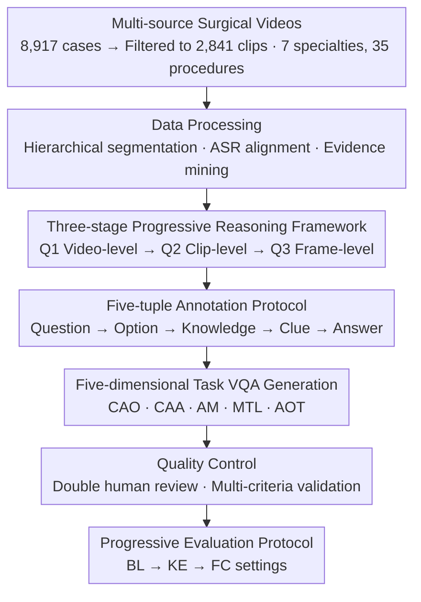

# SurgCoT: Advancing Spatiotemporal Reasoning in Surgical Videos through a Chain-of-Thought Benchmark

**Conference**: CVPR 2026  
**Paper**: [CVF Open Access](https://openaccess.thecvf.com/content/CVPR2026/html/Wang_SurgCoT_Advancing_Spatiotemporal_Reasoning_in_Surgical_Videos_through_a_Chain-of-Thought_CVPR_2026_paper.html)  
**Code**: https://github.com/CVI-SZU/SurgCoT  
**Area**: Medical Image / Video Understanding / Multimodal VLM  
**Keywords**: Surgical Videos, Spatiotemporal Reasoning, Chain-of-Thought, Benchmark, Multimodal Large Language Models

## TL;DR
This paper constructs SurgCoT, the first cross-specialty surgical video spatiotemporal reasoning benchmark (covering 7 surgical specialties, 35 procedures, 2,841 videos, 19,345 main questions + 59,177 sub-questions). By employing a "three-stage progressive reasoning + five-tuple annotation protocol (Question→Option→Knowledge→Clue→Answer)," surgical CoT reasoning is decomposed into a "Video-level → Clip-level → Frame-level" hierarchical chain. Evaluations of over ten mainstream MLLMs reveal significant gaps in fine-grained spatiotemporal reasoning, while the structured protocol consistently improves progressive reasoning accuracy.

## Background & Motivation
**Background**: Surgical videos are core data for perioperative diagnosis, treatment, and teaching, containing rich dynamic anatomical and procedural information. Recently, MLLMs have been introduced to surgical scenes for tasks such as surgical phase recognition, instrument identification, tissue detection, and surgical understanding. Consequently, evaluation frameworks are needed to measure their real-world clinical utility.

**Limitations of Prior Work**: Existing surgical benchmarks fall into two categories: general benchmarks have broad coverage but focus on general QA like "phase/instrument"; specialty benchmarks focus on narrow domains (ophthalmology, endoscopy) but remain at frame/clip-level VQA, treating videos as discrete segments and **ignoring cross-temporal dependencies, thus failing to evaluate spatiotemporal or causal reasoning**. However, surgeons precisely need to track subtle, rapid spatiotemporal changes for fine-grained inference and decision-making.

**Key Challenge**: The evaluation of MLLMs remains at the level of "isolated frame recognition," whereas clinical reasoning is inherently "progressive spatiotemporal + causal." It requires first determining "if there is bleeding," then locating "when and where it occurs," and finally pinpointing the "exact frame and anatomical point." Existing benchmarks lack both this hierarchical structure and verifiable intermediate evidence, failing to answer the crucial question: "Can MLLMs achieve expert-level progressive spatiotemporal reasoning?"

**Goal**: (1) Build a unified surgical video reasoning benchmark that is cross-specialty, covers full procedures, and includes localization supervision and clinical reference standards; (2) design an annotation and evaluation protocol capable of forcing MLLMs to perform hierarchical CoT reasoning; (3) systematically evaluate mainstream MLLMs to reveal their capability boundaries.

**Key Insight**: Explicitly decompose the clinical diagnostic process into three stages: "Video-level understanding → Clip-level localization → Frame-level localization," using five-tuple annotations to separate and concatenate "background knowledge" and "spatiotemporal clues" at each stage.

**Core Idea**: Structure and verify surgical CoT reasoning through a "three-stage progressive reasoning framework + five-tuple annotation protocol," allowing evaluation to both score and audit the reasoning chain while progressively narrowing the spatiotemporal scope.

## Method

### Overall Architecture
SurgCoT is an evaluation benchmark rather than a new model. Its core consists of a "dataset construction pipeline + three-stage five-tuple reasoning protocol + progressive evaluation protocol." The construction pipeline involves four steps: data processing (multi-source video collection, hierarchical segmentation, evidence mining) → three-stage progressive reasoning + five-tuple annotation → VQA generation (producing 78,522 QA pairs based on structured templates + ontology driving) → quality control (double human review + multi-criteria validation). During evaluation, each main question is decomposed into three progressive sub-questions $Q1 \to Q2 \to Q3$ and assessed under three settings: BL (Baseline: video + main question only), KE (Knowledge Enhanced: adds clinical knowledge), and FC (Full Context: adds full video + knowledge + clues) to observe if MLLMs improve progressively with scaffolding enhancement.

### Key Designs

**1. Data Processing and Evidence Mining: Converting Unlabeled Surgical Videos into Spatiotemporally Localizable Supervision Units**

Addressing the lack of frame-level localization and cross-temporal evidence in existing benchmarks, the authors collected 8,917 cases from YouTube, ASVIDE, ten open-source libraries, and clinical archives. Based on procedural integrity, clinical validity, and bilingual commentary (for temporal alignment), 2,841 high-quality clips were selected (31.9% of the original), all de-identified. Standardized segmentation was performed using hierarchical clue fusion of visual scenes, instrument-tissue transitions, and ASR anchors to cut semantically coherent segments. ASR alignment produced millisecond-precise captions, and ontology-driven normalization mapped surface terms to standardized entities. Crucially, end-to-end **evidence mining** was conducted: ASR captions served as semantic anchors for procedure/phase annotation; spatial evidence utilized YOLOv10 for tissue detection, SAM2 for instrument segmentation, and ByteTrack for cross-frame tracking; temporal evidence detected action starts from appearance change metrics, with anomalies tracked for onset time and minimal ROI. All evidence and ASR timestamps were bidirectionally aligned to support "three-stage window narrowing + region-level localization" progressive reasoning.

**2. Five-tuple Annotation Protocol: Verifiable Reasoning through Knowledge/Clue Separation**

Five fields are annotated for each stage: Question (clinical questions fitting surgical workflows), Option (mutually exclusive candidates to distinguish similar phenomena like "instrument reflection vs. actual bleeding" and constrain the hypothesis space), Knowledge (providing domain priors independent of video content, such as color/blood flow patterns, typical anatomy, instrument behavior), Clue (providing localizable evidence within the video, such as time windows, spatial ROIs, landmarks), and Answer (the adjudicated target). The design's ingenuity lies in **explicitly separating Knowledge and Clue and placing them before the Answer**: Knowledge provides the clinical "why," and Clue anchors the "where/when," forming a transparent and video-grounded chain of thought. Furthermore, the Answer is **carried forward** as conditional context for the next stage, forcing causal dependency and spatiotemporal narrowing—transforming "black-box answering" into structured reasoning auditable field by field.

**3. Three-stage Progressive Reasoning: Simulating Clinical Diagnosis through "Video → Clip → Frame" Cascaded Conditioning**

Complex spatiotemporal diagnosis is decomposed into three hierarchically interdependent stages, with each stage narrowing sub-questions based on verified evidence from the prior stage. Q1 Video-level Understanding: identifies high-level clinical events (e.g., "is there active bleeding"), establishing a global hypothesis space. Q2 Clip-level Analysis: performs spatiotemporal localization under validated Q1 output, determining "when" the target event first appears and "where" it occurs (ROI granularity), pruning the hypothesis space from video-level to spatiotemporal segments. Q3 Frame/Patch-level Localization: strictly conditioned on Q2 spatiotemporal boundaries, requiring pixel/bbox-level precise localization of the onset frame and anatomical site (e.g., "suture hole vs. adjacent tissue"). The three stages are linked via three mechanisms: semantic constraint propagation (output of each stage is an immutable premise for the next), spatiotemporal range refinement (minutes $\to$ seconds $\to$ sub-seconds), and evidence accumulation/verification (Knowledge evolves from general anatomy $K1$ to lesion-specific $K3$, Clue from temporal landmark $C1$ to spatial region $C2$ to pixel evidence $C3$). Formally: $(Q_1,O_1,K_1,C_1)\!\Rightarrow\!A_1 \to (Q_2,O_2,K_2,C_2,A_1)\!\Rightarrow\!A_2 \to (Q_3,O_3,K_3,C_3,A_2)\!\Rightarrow\!A_3$, ensuring diagnostic decisions (e.g., surgical advice $A3$) must be grounded in confirmed lesion locations ($A2$) and established pathology ($A1$), forming an auditable reasoning chain with decreasing uncertainty.

**4. Five-dimensional Clinical Reasoning Tasks: Covering the Cognitive Loop from Normal Workflow to Anomaly Handling**

Five types of spatiotemporal reasoning tasks were defined with clinical expert assistance, each generating VQA with spatial/temporal/semantic distractors via the three-stage framework: CAO (Causal Action Ordering, determining the causal sequence of surgical micro-actions), CAA (Cue-Action Alignment, aligning preoperative cues to the spatiotemporal start of micro-actions), AM (Affordance Mapping, grounding tool-tissue interactions using spatiotemporal evidence), MTL (Micro-Transition Localization, identifying frame-level boundaries between micro-phases), and AOT (Anomaly Onset Tracking, localizing anomaly start and early trajectories). The first four evaluate normal process reasoning, while AOT evaluates anomaly scenario handling; together, they constitute a holistic evaluation loop for surgical reasoning.

### Loss & Training
This paper presents an evaluation benchmark and does not train a new model; thus, there is no loss function. Evaluation used a unified zero-shot template and fixed decoding (temperature=0.0, top_p=1.0, max_new_tokens=4096, repetition_penalty=1.0). The primary metric is accuracy. Local open-source models were run using Torch 2.9.0 + Transformers 4.57.1, CUDA 12.4, bf16, on 8× NVIDIA A100 80GB. ⚠️ Note: The abstract mentions "10 leading MLLMs," while another part of the text says "12"; the original text should be referred to for specifics.

## Key Experimental Results

### Main Results
Average accuracy (%) across five reasoning tasks (CAO/CAA/AM/MTL/AOT) under three settings (BL → KE → FC). The table below lists representative values from the Avg. column for each model:

| Model | Category | BL | KE | FC |
| :--- | :--- | :--- | :--- | :--- |
| GPT-5 | Commercial | 76.62 | 80.54 | **87.58** |
| Claude-Sonnet-4.5 | Commercial | 74.10 | 78.87 | 87.54 |
| Gemini-2.5-Pro | Commercial | 70.02 | 81.83 | 87.20 |
| MedGemma-27B-IT | Medical-specific | 70.96 | 76.37 | 86.37 |
| LLaVA-Med-7B | Medical-specific | 68.15 | 75.22 | 81.73 |
| Qwen3-VL-8B | Open-source | 75.44 | 81.48 | 86.92 |
| InternVL-8B | Open-source | 67.95 | 73.58 | 82.32 |
| Qwen2.5-VL-7B | Open-source | 68.85 | 71.22 | 79.45 |

Observations: (1) Commercial models generally lead over open-source and medical-specific models; (2) All models exhibit significant limitations in fine-grained spatiotemporal understanding; (3) Accuracy improves steadily and progressively as KE and FC scaffolding are added, validating the effectiveness of the five-tuple protocol.

### Ablation Study
Comparing the accuracy of the main question (Q) against sub-questions (Q1/Q2/Q3) to observe performance drops:

| Model | Main Question Q (FC) | Sub-question Q3 (FC) | Description |
| :--- | :--- | :--- | :--- |
| GPT-5 | 76.62 (BL Q) | 47.60 | Strong main Q but sharp drop in deep sub-questions, exposing CoT reasoning gaps. |
| Various Commercial | High | Significant decrease | Performance drops are common across intermediate steps. |

LLaVA-Med-7B improved by nearly 7% from BL → KE, indicating that explicit knowledge enhancement compensates for domain limitations. GPT-5 improved by only about 4%, suggesting its stronger internal linguistic reasoning already integrates knowledge more smoothly. In the KE → FC stage, Qwen2.5-VL-7B improved by 8.23% and Claude-Sonnet-4.5 by approximately 13.44%, highlighting the critical role of spatiotemporal grounding (Clue) for fine-grained inference.

### Key Findings
- **CoT Reasoning Gaps**: Models perform passably on main questions but accuracy plummets when decomposed into intermediate sub-questions (especially Q3 frame-level localization; GPT-5 drops from 76.62% on main Q to 47.60% on Q3), suggesting they perform "intuitive jumping" rather than true progressive reasoning.
- **Scaffolding is Effective but Cannot Replace Capability**: The five-tuple protocol (KE/FC) steadily lifts accuracy, with medical-specific models benefiting more from knowledge enhancement; however, even with full scaffolding, fine-grained spatiotemporal localization remains a universally acknowledged weakness.
- **Commercial > Open-source ≈ Medical-specific**: In tasks requiring cross-specialty multimodal spatiotemporal fusion, general commercial large models' strong linguistic reasoning is an advantage; medical-specialized pre-training does not necessarily yield a spatiotemporal reasoning advantage.

## Highlights & Insights
- **Explicitly mapping the clinical diagnostic process to a "Video → Clip → Frame" three-stage cascade**, with forward-carried Answers forcing causal dependency, is the most impactful design—it transforms CoT from a black box into an auditable reasoning chain.
- The **separation of Knowledge and Clue** in labeling can be migrated to any reasoning evaluation requiring a division between "domain prior + instance evidence" (e.g., pathology, radiology, industrial inspection), decoupling "why" from "where/when" via structured fields.
- The **evidence mining pipeline using YOLOv10+SAM2+ByteTrack** converts unlabeled surgical videos into spatiotemporally localizable units, providing an engineering path for low-cost expansion of surgical video annotation.
- The diagnostic finding of **"correct main question, incorrect sub-question"** has methodological value for MLLM evaluation: looking only at final answers overestimates models, while decomposition reveals true reasoning flaws.

## Limitations & Future Work
- The benchmark itself evaluates but does not provide a training paradigm; "protocol improves scores" is an enhancement at the prompt/context level and does not result in a model that has internalized hierarchical reasoning, leaving a gap from clinical-level reasoning.
- Although the data covers 7 specialties and 35 procedures, long-tail rare procedures remain, and some specialty samples might be imbalanced; the mix of public platforms and private archives means distribution bias cannot be entirely excluded.
- There's an inconsistency in model counts between the abstract (10) and body (12) ⚠️; cross-setting (BL/KE/FC) and cross-task comparisons require caution due to varying difficulties.
- Accuracy is the sole primary metric; the benchmark lacks finer human scoring dimensions for clinical rationality and interpretability of the reasoning chain.

## Related Work & Insights
- **vs. General Surgical Benchmarks (SSG-VQA / SurgVLM-Bench / SurgBench)**: These have broad coverage but remain at frame/clip-level, lack spatiotemporal and progressive reasoning; SurgCoT is the only one in Table 1 to check all boxes—ST (spatiotemporal), Pro. (progressive), Loc. (localization), and Clin. (clinical reference)—while providing three-level annotation.
- **vs. Specialty Benchmarks (EndoVis-VQLA / CoPESD / OphNet)**: These focus on narrow procedures within a single specialty with poor generalization; SurgCoT achieves more realistic expert-level cognitive assessment through its cross-specialty coverage.
- **vs. Spatiotemporal Benchmark MedFrameQA**: MedFrameQA pioneered cross-frame spatiotemporal modeling but lacks scale and fine-grained localization; SurgCoT unifies spatiotemporal reasoning, hierarchical knowledge, and localization supervision within a clinically validated framework, advancing both scale and granularity.

## Rating
- Novelty: ⭐⭐⭐⭐ First cross-specialty surgical CoT spatiotemporal reasoning benchmark; the three-stage five-tuple protocol is truly innovative, though it remains a "benchmark + protocol" rather than a new model/algorithm.
- Experimental Thoroughness: ⭐⭐⭐⭐ Evaluates 10+ mainstream MLLMs across three settings and three stages, though verification on the training side is missing.
- Writing Quality: ⭐⭐⭐⭐ The construction pipeline and reasoning protocol are clearly explained, despite minor inconsistencies in model counts.
- Value: ⭐⭐⭐⭐⭐ Sets a new auditable, clinically aligned standard for surgical video MLLM evaluation with high reproducibility.

<!-- RELATED:START -->

## Related Papers

- [\[CVPR 2026\] Event-Level Detection of Surgical Instrument Handovers in Videos](event_level_detection_of_surgical_instrument_handovers_in_videos.md)
- [\[CVPR 2026\] Synergistic Bleeding Region and Point Detection in Laparoscopic Surgical Videos](synergistic_bleeding_region_and_point_detection_in_laparoscopic_surgical_videos.md)
- [\[CVPR 2026\] Gastric-X: A Multimodal Multi-Phase Benchmark Dataset for Advancing Vision-Language Models in Gastric Cancer Analysis](gastric-x_a_multimodal_multi-phase_benchmark_dataset_for_advancing_vision-langua.md)
- [\[CVPR 2026\] TRCoRSurg: Temporal-Relational Co-Reasoning for Surgical Video Triplet Recognition](trcorsurg_temporal-relational_co-reasoning_for_surgical_video_triplet_recognitio.md)
- [\[CVPR 2026\] X-PCR: A Benchmark for Cross-modality Progressive Clinical Reasoning in Ophthalmic Diagnosis](x-pcr_a_benchmark_for_cross-modality_progressive_clinical_reasoning_in_ophthalmi.md)

<!-- RELATED:END -->
