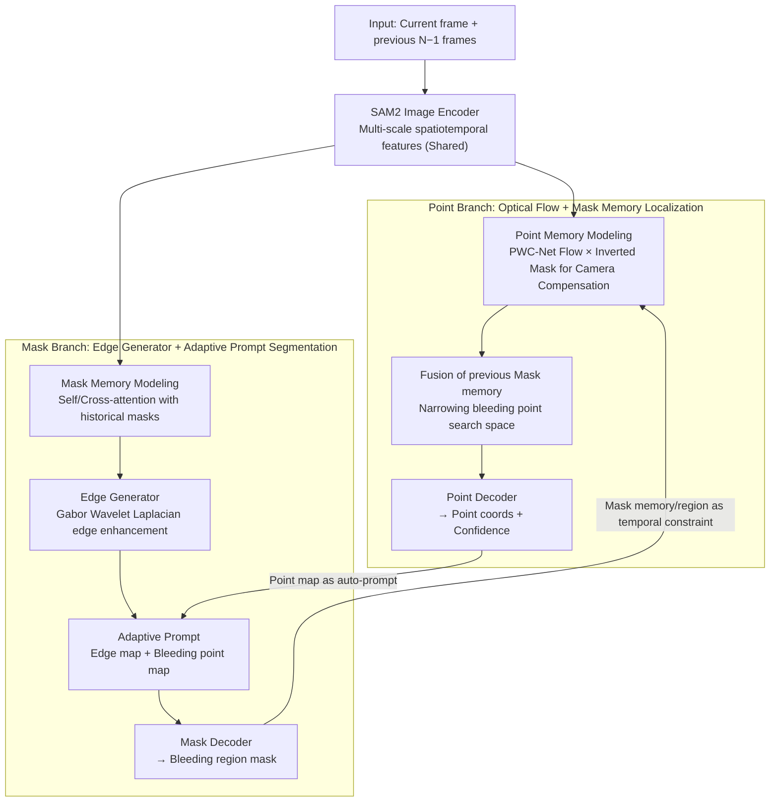

# Synergistic Bleeding Region and Point Detection in Laparoscopic Surgical Videos

**Conference**: CVPR 2026  
**arXiv**: [2503.22174](https://arxiv.org/abs/2503.22174)  
**Code**: [GitHub](https://github.com/PJLallen/SurgBlood)  
**Area**: Medical Imaging  
**Keywords**: Bleeding Detection, Laparoscopic Surgery, SAM2, Dual-task Synergy, Optical Flow

## TL;DR

The authors construct SurgBlood, the first annotated laparoscopic surgery dataset for both bleeding regions and bleeding points. They propose BlooDet, a SAM2-based dual-branch bidirectional guided online detector, achieving joint optimization of bleeding region segmentation and bleeding point localization through synergistic Mask/Point branches.

## Background & Motivation

Intraoperative bleeding in laparoscopic minimally invasive surgery is an emergency that severely impacts surgical safety:
- **Bleeding region detection** quantifies blood loss and assists in intraoperative decision-making.
- **Bleeding point localization** helps surgeons quickly identify the source for hemostasis.

**Limitations of Prior Work**:
1. Most algorithms target single-frame images, lacking video temporal modeling.
2. Focus is primarily on bleeding regions, neglecting the clinical need for source localization.
3. Multi-task frameworks fail to fully exploit the potential of SAM2 in cross-task joint optimization.

**Lack of public multi-task real bleeding datasets.**

**Key Challenge**: Narrow laparoscopic field of view, unstable lighting, rapid blood accumulation changing tissue appearance, and bleeding points obscured by blood or tissue.

## Method

### Overall Architecture

BlooDet adopts a **dual-branch bidirectional guidance** architecture based on SAM2, comprising a Mask branch (bleeding region detection) and a Point branch (bleeding point localization). The two branches achieve synergistic optimization by providing mutual prompts and temporal information. The core objective function is a coupled optimization:

$$\{\boldsymbol{\theta}^*, \boldsymbol{\vartheta}^*\} = \arg\min_{\boldsymbol{\theta}, \boldsymbol{\vartheta}} \Big[\mathcal{L}_{\mathtt{m}}\big(\boldsymbol{\theta}(\boldsymbol{\vartheta})\big) + \mathcal{L}_{\mathtt{p}}\big(\boldsymbol{\vartheta}(\boldsymbol{\theta})\big)\Big]$$

This is solved via an alternating optimization strategy: the Mask branch parameters are updated while the Point branch is fixed, followed by updating the Point branch with the fixed Mask branch. The pipeline is: SAM2 image encoder (shared) extracts multi-scale spatiotemporal features → features are fed into Point and Mask branches → branches use each other's outputs as prompts/temporal constraints (bidirectional guidance) → output bleeding point coordinates and bleeding region mask.

### Key Designs

**1. Point Branch: Camera Motion Compensation via Optical Flow + Mask Memory**

Due to the narrow field of view and constant camera movement, bleeding points are often obscured. The Point branch uses a frozen PWC-Net to estimate inter-frame optical flow $O_i(x,y)$ and filters out unstable flow in bleeding regions using an inverted Mask map to calculate average background viewpoint shift:

$$\bar{O}_i(\Delta x, \Delta y) = \frac{1}{H \times W} \sum_{X=1}^{H} \sum_{Y=1}^{W} (1-M_i) \cdot O_i(x,y)$$

**Key Insight**: Using only **background** optical flow for motion compensation effectively isolates camera jitter. Integrating previous Mask and Point memory features via attention mechanisms narrows the bleeding point search space.

**2. Mask Branch: Edge Generator + Adaptive Prompt for Human-AI Interaction Replacement**

Surgical scenes often exhibit low contrast. The Mask branch utilizes multi-scale Gabor wavelet Laplacian filters to specifically enhance bleeding edges:

$$F'_{\text{mask}} = (\text{ReLU}(F_{\text{mask}})) \odot (\mathbf{L}_\mathbf{g}(x,y) * F_{\text{mask}})$$

The edge map $E_m$ and the bleeding point map $P_m$ from the Point branch are concatenated as adaptive prompts for the Mask decoder, replacing manual interaction required by standard SAM2.

**3. Bidirectional Cross-branch Guidance: Mutual Constraint**

**Mechanism**: The predicted bleeding points serve as automatic prompts for the Mask decoder to focus attention, while the predicted Mask provides temporal cues and spatial constraints for the Point branch. This reduces the solution space for both tasks more effectively than a simple joint head.

### Loss & Training

- **Mask Branch**: $\mathcal{L}_\mathtt{m} = \lambda_\mathtt{r} \mathcal{L}_\mathtt{r} + \lambda_\mathtt{e} \mathcal{L}_\mathtt{e}$, where region and edge losses are Focal Loss + Dice Loss.
- **Point Branch**: $\mathcal{L}_\mathtt{p} = \lambda_\mathcal{P} \mathcal{L}_\mathcal{P} + \lambda_\mathtt{s} \mathcal{L}_\mathtt{s}$, utilizing Smooth L1 Loss for point supervision and BCE for existence determination.
- **Loss weights**: $\lambda_\mathtt{r}=1, \lambda_\mathtt{e}=1, \lambda_\mathtt{s}=1, \lambda_\mathcal{P}=0.5$.
- **SurgBlood Dataset**: 95 video clips from 42 cholecystectomy cases (5,330 frames). Features pixel-level masks and bleeding point coordinates. Types: Gallbladder (21.64%), Calot's triangle (25.01%), Vessels (15.78%), Liver bed (37.75%).

## Key Experimental Results

### Main Results

| Method | SurgBlood IoU ↑ | SurgBlood Dice ↑ | PCK-5% ↑ | PCK-10% ↑ |
|------|----------------|-----------------|----------|-----------|
| SAM 2† | 50.93 | 67.49 | 41.68 | 71.99 |
| MemSAM† | 52.84 | 69.14 | 31.80 | 64.91 |
| D-CeLR* | 51.30 | 67.82 | 24.22 | 63.92 |
| ConsisTNet | 40.43 | 57.59 | 32.83 | 68.15 |
| **BlooDet (Ours)** | **64.88** | **78.70** | **55.85** | **83.69** |

BlooDet outperforms 13 comparison methods on SurgBlood, with IoU gains of 12.05% over SAM2. It also achieves state-of-the-art region detection on HemoSet (IoU 59.62).

### Ablation Study

| Configuration | SurgBlood DSC ↑ |
|------|----------------|
| Mask + Point only (No edge generator, no temporal consistency) | ~67.49 |
| + Edge generator + Cross-branch guidance | 78.70 |

### Key Findings

- Adding joint prediction heads to pure region detection methods yields poor results without synergistic design.
- Optical flow combined with Mask memory is crucial for tracking bleeding points amidst camera motion.
- Edge generators effectively mitigate blurred bleeding boundaries in low-contrast surgical scenes.
- Alternating optimization leads to joint optimality for both branches.

## Highlights & Insights

- **Novelty**: First joint detection task for bleeding regions and points in laparoscopic surgery.
- **Value**: Introduction of the SurgBlood dataset with dual annotations for real surgical videos.
- The dual-branch design is elegant: Mask provides spatial constraints for Point, while Point provides precise prompts for Mask.
- Clever use of background optical flow (excluding bleeding regions) for motion compensation.

## Limitations & Future Work

- Dataset size is relatively small (95 clips); generalization remains to be validated.
- Validation is limited to cholecystectomy; expansion to other surgeries is needed.
- Point branch depends on frozen PWC-Net flow, which may degrade in extreme blur.
- Multi-point bleeding scenarios and bleeding intensity quantification are not yet considered.

## Related Work & Insights

- Building multi-task frameworks on SAM2 via prompt mechanisms is a promising direction.
- Camera motion compensation strategies using optical flow in surgical vision can be generalized.
- Quality control in dataset construction (4 annotators + 2 reviewers) ensures reliable ground truth.

## Rating

- Novelity: ⭐⭐⭐⭐⭐
- Experimental Thoroughness: ⭐⭐⭐⭐
- Writing Quality: ⭐⭐⭐⭐
- Value: ⭐⭐⭐⭐⭐

<!-- RELATED:START -->

## Related Papers

- [\[CVPR 2026\] Event-Level Detection of Surgical Instrument Handovers in Videos](event_level_detection_of_surgical_instrument_handovers_in_videos.md)
- [\[CVPR 2026\] SurgCoT: Advancing Spatiotemporal Reasoning in Surgical Videos through a Chain-of-Thought Benchmark](surgcot_advancing_spatiotemporal_reasoning_in_surgical_videos_through_a_chain-of.md)
- [\[CVPR 2026\] URICA: A Uniformity Region Affine Identifier Capture Algorithm for Arbitrary Region Retrieval in Pathology Images](urica_a_uniformity_region_affine_identifier_capture_algorithm_for_arbitrary_regi.md)
- [\[AAAI 2026\] Rethinking Surgical Smoke: A Smoke-Type-Aware Laparoscopic Video Desmoking Method and Dataset](../../AAAI2026/medical_imaging/rethinking_surgical_smoke_a_smoke-type-aware_laparoscopic_video_desmoking_method.md)
- [\[CVPR 2026\] Benchmarking Endoscopic Surgical Image Restoration and Beyond](benchmarking_endoscopic_surgical_image_restoration_and_beyond.md)

<!-- RELATED:END -->
