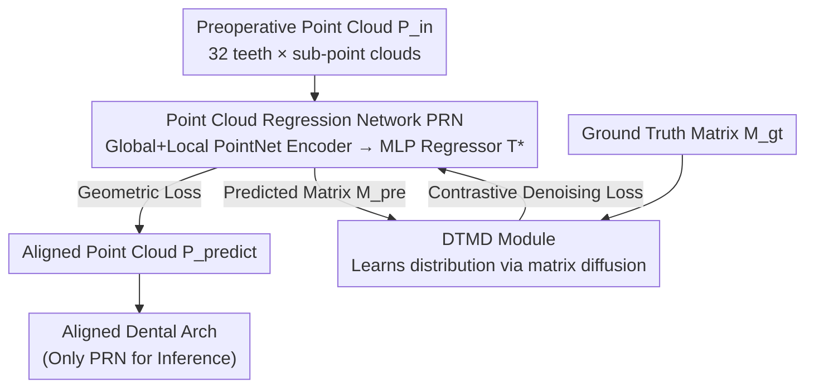

# TAlignDiff: Automatic Tooth Alignment assisted by Diffusion-based Transformation Learning

**Conference**: CVPR 2026  
**Paper**: [CVF Open Access](https://openaccess.thecvf.com/content/CVPR2026/html/Liu_TAlignDiff_Automatic_Tooth_Alignment_assisted_by_Diffusion-based_Transformation_Learning_CVPR_2026_paper.html)  
**Code**: None (claimed to be open-sourced after acceptance)  
**Area**: Medical Imaging / 3D Vision  
**Keywords**: Automatic tooth alignment, orthodontics, point cloud regression, diffusion models, transformation matrix

## TL;DR
TAlignDiff utilizes a Point Cloud Regression Network (PRN) to directly predict a $4\times4$ transformation matrix for each tooth from preoperative point clouds. Simultaneously, a lightweight Diffusion Transformation Model Denoising (DTMD) module learns the latent distribution of "clinically valid transformation matrices." By employing a contrastive denoising loss to pull the regression output toward this distribution, the model constrains the statistical properties of the transformation matrices beyond mere geometric alignment, achieving TRE/AAE errors superior to existing methods.

## Background & Motivation

**Background**: The mainstream approach for automatic tooth alignment (orthodontic planning) involves sampling preoperative 3D dental models into point clouds and using regression networks supervised by "point-wise geometric losses." These networks output rigid transformations (rotation + translation) for each tooth to move them to target positions. Point cloud regression methods such as PSTN, TANet, and LETA have significantly reduced the manual workload for orthodontists.

**Limitations of Prior Work**: Relying solely on geometric constraints on point clouds ensures that the "transformed point cloud matches the target" but completely ignores the distribution characteristics of the transformation matrices themselves. The authors observe that tooth displacement and movement are results of long-term biomechanics, occlusal relationships, and anatomical constraints. Consequently, real transformation matrices exhibit strong statistical patterns: for instance, the lateral movement of a molar is often correlated with a counter-clockwise rotation, and rotation angles are physiologically constrained (molars rarely rotate more than 15°). Pure geometric losses are unaware of these clinical priors, potentially resulting in solutions that are geometrically matching but clinically irrational.

**Key Challenge**: Geometric consistency (point cloud alignment) and distributional rationality (clinically valid transformation matrices) are complementary supervision signals, yet existing methods utilize only the former. The most related work, TADPM, introduces diffusion modeling but performs regression directly from high-dimensional geometric features, making it highly dependent on large datasets and less stable for small clinical samples.

**Goal**: To integrate the intrinsic distribution characteristics of transformation matrices while maintaining geometric consistency, specifically optimized for small clinical datasets containing only hundreds of cases.

**Key Insight**: A point cloud regression network is used to provide initial transformation values, while a lightweight diffusion model—which performs diffusion solely on the "transformation matrices" rather than raw point clouds/meshes to reduce dimensionality—acts as a "critic." By comparing the difference in noise estimation between the predicted and ground-truth matrices at the same diffusion step, the regression output is guided toward a valid distribution, creating a bidirectional feedback loop between geometric regression and diffusion refinement.

## Method

### Overall Architecture

TAlignDiff takes a preoperative tooth point cloud $P_{in}$ (4096 points, split into 32 sub-point clouds for 32 permanent teeth) and outputs a $4\times4$ transformation matrix $T=\{T_i\}\in\mathbb{R}^{32\times4\times4}$ for each tooth. Applying $T$ to the preoperative cloud yields the aligned target cloud $P_{gt}=T\cdot P_{in}$. Each matrix $T_i=\begin{bmatrix}R_i & D_i\\ 0 & 1\end{bmatrix}$ consists of a $3\times3$ rotation $R_i$ and a $3\times1$ translation $D_i$.

The framework consists of two complementary branches: the **Point Cloud Regression Network (PRN)** (backbone, responsible for geometry) and the **Diffusion Transformation Model Denoising (DTMD)** (auxiliary, responsible for distribution). PRN aligns point clouds via geometric loss, while DTMD learns the latent distribution of valid matrices unsupervised and refines PRN outputs through a contrastive denoising loss. Crucially, **DTMD is only project-involved during training and is entirely removed during inference**, acting as a fixed "clinical rationality critic" without increasing inference overhead.

### Key Designs

**1. PRN: Global + Local Dual Encoding for Geometric Regression**

This branch handles traditional geometric alignment. It employs two PointNet encoders: $\epsilon_g$ extracts global features of the entire arch (relative arrangement), and $\epsilon_l$ extracts local geometric details of individual teeth. These features are concatenated and fed into an MLP decoder (fully connected channels [512, 256, 16]) to regress the matrix: $T^*=\phi(\epsilon_g(P_{in})\oplus\epsilon_l(P_{in}))$. Two geometric losses are used: point-wise reconstruction loss $L_{rec}=\frac1N\sum\lVert T^*\cdot P_{in}-T\cdot P_{in}\rVert_1$ penalizes positional deviations, and centroid offset loss $L_{center}=\frac1M\sum\lVert C_{predict}-C_{target}\rVert_1$ constrains the overall displacement of each tooth. Global and local features are both necessary as alignment depends on both individual tooth pose and its relative position in the arch.

**2. DTMD: Diffusion on Transformation Matrices as a Critic**

The input to DTMD is not point clouds or meshes, but low-dimensional vectors reshaped from the ground truth matrices $M_{gt}$. This significant reduction in dimensionality compared to TADPM allows the model to work effectively on small clinical datasets. It follows a standard DDPM forward process $q(M_t\mid M_0)=\mathcal N(M_t\mid\sqrt{\gamma_t}M_0,(1-\gamma_t)I)$ and reverse denoising. The training objective is for the noise estimator $\epsilon_{\theta_d}$ to predict the added noise: $L_{diffusion}=\mathbb E\big[\lVert\epsilon-\epsilon_{\theta_d}(M_t,t)\rVert_2^2\big]$. Once trained, $\epsilon_{\theta_d}$ effectively encodes the gradient field $\nabla_x\log p(x)$ of valid orthodontic plans, representing how far a matrix is from a clinically reasonable distribution.

**3. Contrastive Denoising Loss: Distributional Feedback**

This is the core bridge that feeds DTMD's priors back into PRN. Gaussian noise is added to both the predicted matrix $M_{pre}$ and the ground truth matrix $M_{gt}$ at the same step $t$. Both are fed into the fixed DTMD to compute noise estimations, which are then compared:

$$L_{denoi}=\mathbb E_{M^t_{gt},M^t_{pre},t}\Big[\big\lVert \epsilon_{\theta_d}(M^t_{gt},t)-\epsilon_{\theta_d}(M^t_{pre},t)\big\rVert_1\Big]$$

Intuitively, as the pre-trained DTMD acts as a critic encoding the gradient flow of valid plans, aligning the noise estimations forces the prediction $M_{pre}$ onto the same valid manifold as $M_{gt}$. Unlike direct L1 loss on matrices (element-wise numerical proximity), this constraint enforces clinical rationality based on learned distributional metrics.

**4. Multi-stage Joint Training**

To prevent interference between branches during early training, a phased strategy is used: For the first 200 epochs, supervised PRN and unsupervised DTMD are **trained independently** until stable. Subsequently, the contrastive denoising loss is introduced; for the next 200 epochs, **only PRN is trained while DTMD parameters are fixed**, using the critic to optimize PRN output. Total loss: $L_{total}=L_{rec}+\lambda_1 L_{center}+\lambda_2 L_{denoi}+\lambda_3 L_{diffusion}$ (optimal weights $\lambda_1{=}0.1, \lambda_2{=}0.01, \lambda_3{=}0.1$). Data augmentation includes multi-tooth rotation and single-tooth translation to handle small sample sizes.

### Loss & Training
Total Objective: $L_{total}=L_{rec}+\lambda_1 L_{center}+\lambda_2 L_{denoi}+\lambda_3 L_{diffusion}$.  
- $L_{rec}$ is the primary geometric alignment loss.  
- $L_{center}$ constrains centroid displacement.  
- $L_{diffusion}$ trains the DTMD distribution.  
- $L_{denoi}$ provides distribution feedback to PRN.  
Optimized with Adam, PRN learning rate 0.01, DTMD 0.005, batch size 4, 400 epochs total on a single RTX 3090.

## Key Experimental Results

**Datasets**: Primary data from ISICDM 2024 Challenge, 124 clinical preoperative cases (4096 points, 32 teeth). Split: 74/20/30. An independent orthodontic dataset (30 cases) was used for cross-domain generalization without retraining.  
**Metrics**: TRE (Target Registration Error) and AAE (Absolute Arch Error). **Lower is better**.

### Main Results (Comparison with SOTA, Table 2)

| Method | Val TRE | Val AAE | Test TRE | Test AAE |
| :--- | :--- | :--- | :--- | :--- |
| PointNet++ | 0.769 | 0.702 | 0.791 | 0.717 |
| PointMLP | 0.826 | 0.758 | 0.819 | 0.743 |
| TADPM | 0.907 | 0.848 | 0.890 | 0.821 |
| PSTN | 0.730 | 0.658 | 0.779 | 0.705 |
| TANet | 0.885 | 0.828 | – | – |
| LETA | 0.777 | 0.712 | – | – |
| **Ours (TAlignDiff)** | **0.690** | **0.617** | **0.725** | **0.646** |

The proposed method achieves the lowest TRE/AAE across all sets, with significance $p<0.01$.

### Ablation Study (Table 1, Test Set)

| $\lambda_1$ | $\lambda_2$ | $\lambda_3$ | Test TRE | Test AAE | Note |
|---|---|---|---------|---------|------|
| 0 | 0 | 0 | 0.784 | 0.711 | Baseline ($L_{rec}$ only) |
| 0.1 | 0 | 0 | 0.748 | 0.670 | + $L_{center}$ |
| 0.1 | 0.01 | 0.1 | **0.725** | **0.646** | Full Model (Optimal) |

### Key Findings
- **$L_{center}$ provides significant gains**: (Baseline 0.784 → 0.748), but increasing $\lambda_1$ too much degrades performance, indicating it should remain a constraint.
- **$L_{denoi}$ (DTMD feedback) is the core contributor**: Adding DTMD loss reduces TRE from 0.748 to 0.725, validating the value of distribution priors.
- **TADPM performs poorly on small datasets**: Its Test TRE (0.890) confirms that regressing from high-dimensional space is unstable with limited clinical data, whereas regressing low-dimensional matrices is more robust.
- Visual alignment is significantly closer to ground truth even in difficult cases like deep overbite.

## Highlights & Insights
- **Diffusion as a "Critic," not a "Generator"**: DTMD doesn't generate the matrix; it provides a distributional metric. This "diffusion as learned score field $\nabla\log p(x)$" paradigm is transferable to any regression task requiring outputs to follow a valid distribution (e.g., pose estimation).
- **Auxiliary Branch with Zero Inference Cost**: Because DTMD is only used for supervision, the model gains distribution priors "for free" during inference.
- **Dimension Reduction for Small Data**: Conducting diffusion on $32\times4\times4$ matrices rather than high-dimensional points is the key to training effectively on just 74 cases.

## Limitations & Future Work
- Small data scale (74 training cases) leaves questions regarding long-tail orthodontic malocclusions and population diversity ⚠️.
- Distributional properties (e.g., translation-rotation correlation) are argued qualitatively; direct verification of whether DTMD explicitly learns these physical constraints is missing.
- Multi-stage training and fixed weights are somewhat manual; end-to-end adaptive scheduling might improve performance.
- Only geometric/arch errors are evaluated; expert evaluation of functional occlusion and clinical acceptability is needed.

## Related Work & Insights
- **vs TADPM**: Both use diffusion for orthodontics, but TADPM's high-dimensional dependency makes it unstable on small data. TAlignDiff decouples geometry and distribution, proving more robust (TRE 0.725 vs 0.890).
- **vs PSTN / TANet / LETA**: These rely on pure geometric regression. TAlignDiff’s additional distributional prior through contrastive denoising yields consistently lower errors.

## Rating
- Novelty: ⭐⭐⭐⭐ Using diffusion as a critic for transformation matrix distributions via noise estimation feedback is logical and fits clinical priors.
- Experimental Thoroughness: ⭐⭐⭐⭐ Includes cross-domain testing and ablations, though data scale is small and clinical metrics are missing.
- Writing Quality: ⭐⭐⭐⭐ Clear motivation regarding matrix distribution and well-derived loss functions.
- Value: ⭐⭐⭐⭐ Clear clinical utility for orthodontic planning; the "diffusion-critic" paradigm is highly transferable.

<!-- RELATED:START -->

## Related Papers

- [\[CVPR 2026\] Diffusion with a Linguistic Compass: Steering the Generation of Clinically Plausible Future sMRI Representations for Early MCI Conversion Prediction](diffusion_with_a_linguistic_compass_steering_the_generation_of_clinically_plausi.md)
- [\[CVPR 2026\] Breaking the Continuum: Discrete Distribution Learning for Structural MRI Reconstruction](breaking_the_continuum_discrete_distribution_learning_for_structural_mri_reconst.md)
- [\[CVPR 2026\] Bridging Brain and Semantics: A Hierarchical Framework for Semantically Enhanced fMRI-to-Video Reconstruction](bridging_brain_and_semantics_a_hierarchical_framework_for_semantically_enhanced_.md)
- [\[CVPR 2026\] Clinically-Grounded Counterfactual Reasoning for Medical Video Diagnosis](clinically-grounded_counterfactual_reasoning_for_medical_video_diagnosis.md)
- [\[CVPR 2026\] GenTract: Generative Global Tractography](gentract_generative_global_tractography.md)

<!-- RELATED:END -->
