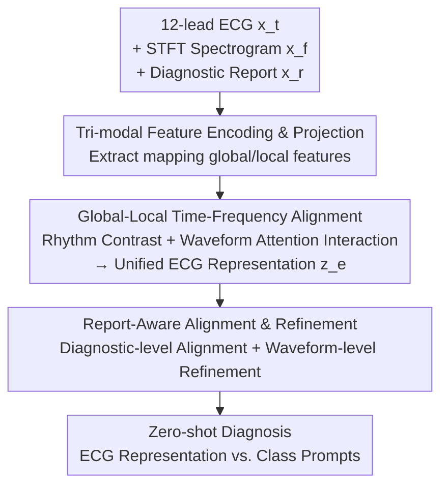

# TAMER: A Tri-Modal Contrastive Alignment and Multi-Scale Embedding Refinement Framework for Zero-Shot ECG Diagnosis

**Conference**: CVPR 2026  
**Area**: Medical Imaging / Self-supervised Representation Learning  
**Keywords**: ECG diagnosis, Zero-shot, Tri-modal contrastive learning, Time-frequency alignment, Report-guided refinement  
**Code**: https://github.com/zhouxw12345/TAMER  
**Paper**: [CVF Open Access](https://openaccess.thecvf.com/content/CVPR2026/html/Zhou_TAMER_A_Tri-Modal_Contrastive_Alignment_and_Multi-Scale_Embedding_Refinement_Framework_CVPR_2026_paper.html)  

## TL;DR
TAMER treats Electrocardiogram (ECG) waveforms, STFT spectrograms, and clinical diagnostic reports as three complementary modalities for self-supervised pre-training. Through "time-frequency" global/local alignment and "report-anchored" diagnostic-level and waveform-level refinement, it achieves State-of-the-Art (SOTA) performance in zero-shot classification (81.2% average AUC) and cross-domain transfer (83.1%) across three public datasets.

## Background & Motivation

**Background**: Clinically, ECG is the most affordable and widely used tool for Cardiovascular Disease (CVD) screening, but labeled ECG data is scarce. The mainstream approach involves using Self-Supervised Learning (SSL) to pre-train representations from massive unlabeled ECG data, following either contrastive paths (constructing positive/negative pairs) or generative paths (masked reconstruction). Recent works have begun introducing clinical diagnostic reports for cross-modal supervision (e.g., MERL, C-MET), reframing ECG analysis as a vision-language representation learning task.

**Limitations of Prior Work**: The authors point out two specific shortcomings. First, pure single-modality ECG SSL relies solely on the electrical signal itself, leading to limited representation capability that fails to capture complex structural/functional abnormalities, especially as signals are naturally noisy. Second, existing multi-modal methods are "coarse" in two dimensions: time-domain and frequency-domain features suffer from resolution differences and modal noise due to STFT transformation, leading to semantic misalignment and unstable fusion at the global rhythm level; furthermore, ECG-report alignment often only performs coarse global matching, ignoring the local fine-grained correspondence between "specific waveform abnormalities ↔ specific diagnostic phrases," which hinders the detection of subtle abnormalities.

**Key Challenge**: ECG diagnosis inherently requires "multi-scale" information—both global rhythm consistency (rhythm regularity) and local waveform details (critical diagnostic segments like QRS complexes and ST segments). However, if cross-modal alignment is performed only at a single granularity (global), information is lost at the other granularity (local), making it difficult to satisfy both requirements.

**Goal**: The problem is decomposed into three sub-problems: (1) How to align time-domain and frequency-domain ECG features into a unified representation at both global and local levels; (2) How to simultaneously inject high-level clinical report semantics into global diagnostic embeddings and local waveforms; (3) How to generalize to unseen categories and domains under a completely zero-shot setting (no downstream fine-tuning, all parameters frozen).

**Key Insight**: The authors' key observation is that explicitly converting 1D ECG waveforms into 2D spectrograms via STFT is equivalent to introducing an additional "visual modality." Consequently, ECG diagnosis is reformulated into a vision-language representation learning paradigm. The time, frequency, and text branches each provide non-redundant complementary information, and joint alignment reduces alignment ambiguity.

**Core Idea**: Replace "single-modality or global coarse alignment" with "tri-modal (ECG waveform + spectrogram + diagnostic report) and multi-scale (global rhythm / local waveform) contrastive alignment," enabling the model to understand both rhythm and waveform details under zero-shot conditions.

## Method

### Overall Architecture
TAMER is a tri-modal self-supervised pre-training framework. The input consists of triplets (12-lead ECG waveform $x^t$, STFT-derived spectrogram $x^f$, and clinical diagnostic report $x^r$). The output is a highly generalizable ECG representation used directly for zero-shot classification by calculating similarity with category text prompts. The process consists of three serial modules: First, **TFEP** extracts global features $(g^t,g^f,g^r)$ and local features $(l^t,l^f,l^r)$ for each modality and projects them into latent space; next, **GLTSA** performs global rhythm contrastive alignment and local waveform attention interaction across time-frequency branches to fuse a unified ECG representation $z^e$, using dropout perturbations for consistency regularization; finally, **RAAR** performs diagnostic-level alignment between $z^e$ and the global report embedding $g^r$, and waveform-level refinement between local ECG waves $l^t$ and local report words $l^r$ to inject clinical semantics. The three contrastive losses are optimized end-to-end.

### Key Designs

**1. Tri-modal Feature Encoding and Projection (TFEP): Expanding 1D signals into "Time-Frequency-Text" branches with dual-scale extraction.**

The pain point is that single-modality ECG signals fail to capture complex pathologies and are noisy. TFEP converts the raw waveform $x^t \in \mathbb{R}^{L\times T}$ ($L$=12 leads, $T$=duration) into a spectrogram $x^f \in \mathbb{R}^{L\times F\times M}$ (500 Hz sampling, 0.25s Hann window, 62-point overlap), creating a 2D "visual modality." Dedicated encoders are used: a randomly initialized 1D ResNet-34 for ECG, a 2D CNN for spectrograms, and a **frozen** Med-CPT encoder for reports (maintaining semantic stability). Each branch extracts both local features $l$ (hidden layers) and global features $g$ (average pooling). On the report side, attention weights $w$ of the [CLS] token are extracted to measure the importance of each word—these serve as soft weights in waveform-level refinement. Features are projected into modality-specific latent spaces before alignment. This ensures frequency information is explicitly structured as 2D representations rather than relying on the model to learn them implicitly.

**2. Global-Local Time-Frequency Alignment (GLTSA): Rhythm-level contrast for global consistency and waveform-level attention for local details.**

To address semantic misalignment and the lack of local waveform modeling, GLTSA includes three sub-modules. **RLCA (Rhythm-level Contrastive Alignment)**: Performs InfoNCE contrast on global feature pairs $(g^t,g^f)$, pulling time/frequency embeddings of the same sample closer and pushing others away. The loss is $L_{\text{RLCA}}=L_{\text{CL}}(g^t,g^f)$, with bidirectional contrastive loss defined as:

$$\mathcal{L}_{i,j}^{a2b} = -\log \frac{\exp(\text{sim}(\eta_i^a,\eta_i^b)/\tau)}{\sum_{j=1}^{N}\mathbf{1}_{[j\neq i]}\exp(\text{sim}(\eta_i^a,\eta_j^b)/\tau)}$$

where $\tau$ is temperature and $\text{sim}(\cdot)$ is cosine similarity. **WLAI (Waveform-level Attention Interaction)**: Concatenates local $l^t,l^f$ through two-stage residual attention $z^{(1)}=l^{\text{joint}}+\text{att}(l^{\text{joint}})$, $z^{(2)}=z^{(1)}+\text{att}(z^{(1)})$, then uses a learnable class token + attention pooling $z^e=\text{attpool}(z^{(2)})$ to aggregate a unified representation. This identifies diagnostic-sensitive waves like QRS complexes. **UECR (Uncertainty-aware Consistency Regularization)**: Applies dropout to $z^e$ to generate views $z^u,z^v$ and applies $L_{\text{UECR}}=L_{\text{CL}}(z^u,z^v)$ to enforce view-invariance against noise.

**3. Report-Aware Alignment and Refinement (RAAR): Injecting clinical semantics across two scales.**

RAAR uses the frozen text encoder for stable diagnostic semantics across two scales. **RADA (Diagnostic-level Alignment)**: Aligns the unified ECG representation $z^e$ with the global report embedding $g^r$ via $L_{\text{RADA}}=L_{\text{CL}}(z^e,g^r)$. **RGWR (Report-guided Waveform-level Refinement)**: Operates between local ECG token sets $\{t_i^k\}$ and report word sets $\{r_i^m\}$ using bidirectional cross-attention to get context-aware representations $c_i^k$. It utilizes the report token attention weights $w_i$ from TFEP to construct a **weighted contrastive loss**:

$$\mathcal{L}_{\text{ECG}} = -\frac{1}{2NK}\sum_{i=1}^{N}\sum_{k=1}^{K} w_i^k \log \frac{\exp(\text{sim}(t_i^k,c_i^k)/\lambda)}{\sum_{j=1}^{K}\exp(\text{sim}(t_i^k,c_i^j)/\lambda)}$$

$L_{\text{RGWR}}=L_{\text{ECG}}+L_{\text{report}}$. This forces the model to focus on critical abnormalities corresponding to important diagnostic terms.

### Loss & Training
The total loss is the sum of alignment losses: $L_{\text{total}}=L_{\text{RLCA}}+L_{\text{UECR}}+L_{\text{RAAR}}$. Pre-training is conducted on MIMIC-ECG (771k high-quality triplets) using an A100 GPU; AdamW optimizer, initial learning rate $2\times10^{-4}$, weight decay $1\times10^{-7}$, cosine annealing with warm restarts ($T_0$=40000), temperature $\lambda=0.04$, 50 epochs, batch size 256. For zero-shot tasks, all parameters are frozen; category descriptions are generated via CKEPE prompt dictionary for similarity scoring.

## Key Experimental Results

### Main Results
Evaluation uses macro-AUC. Settings include zero-shot classification and cross-domain transfer. Single-modality SSL baselines use 100% source domain labels for fine-tuning, while multi-modal methods (MERL, C-MET) and TAMER use 0%.

| Dataset | Setting | TAMER | MERL | C-MET | Strong Single-modal (ST-MEM) |
|--------|------|-------|------|-------|------------------|
| CPSC2018 | Zero-shot | **88.3** | 82.8 | 80.1 | 62.27 |
| PTBXL-Super | Zero-shot | **76.5** | 74.2 | 76.2 | 76.12 |
| CSN | Zero-shot | **78.7** | 74.4 | 76.3 | 73.05 |
| Avg (3 Sets) | Zero-shot | **81.2** | — | — | — |
| Avg (3 Sets) | Cross-domain | **83.1** | — | — | — |

TAMER leads overall. A notable exception: in PTBXL-Super→CSN transfer, ST-MEM (84.50) outperforms TAMER (80.95), which authors attribute to the robustness of mask modeling under specific domain shifts.

### Ablation Study

| Configuration | Zero-shot AUC | Cross-domain AUC | Description |
|------|-----------|---------|------|
| Full (RLCA+WLAI+RGWR) | 81.19 | 83.08 | Full Model |
| w/o RLCA | 80.62 | 81.49 | Removes rhythm alignment |
| w/o WLAI | 76.16 | 78.94 | Removes waveform interaction (Most significant drop) |
| w/o RGWR | 78.73 | 79.44 | Removes report refinement |

| Modal Combination | Zero-shot | Cross-domain |
|----------|--------|------|
| time+spec+report | 81.19 | 83.08 |
| time+report | 77.53 | 79.12 |
| time+spec | — | 63.33 |

### Key Findings
- **WLAI (Waveform-level Attention Interaction) is the most critical**: Removing it drops zero-shot AUC by 5.03%, proving that local waveform fusion is the "soul" of the framework, far more critical than global rhythm alignment (RLCA drop only 0.57%).
- **Tri-modality is non-redundant**: Removing spectrograms (time+report) or reports (time+spec) leads to significant performance loss.
- **Med-CPT is the best text encoder**: Outperforms Clinical ModernBERT and PubMedBERT, as its contrastive pre-training better models medical report consistency.
- **No parameter heavy lifting**: TAMER (122.05M) has a similar scale to MERL (114.27M); gains come from architecture rather than capacity.

## Highlights & Insights
- **STFT Spectrogram as a "Visual Modality"**: This cleverly connects ECG to mature vision-language paradigms, making explicit frequency structures first-class citizens for alignment.
- **Leveraging [CLS] Attention Weights as Soft Labels**: RGWR uses the text encoder's own token importance for weighted contrastive loss—a low-cost trick to focus on "diagnostically important" segments.
- **Clean Multi-scale Split**: Global (RLCA/RADA) handles rhythm and semantics, while Local (WLAI/RGWR) handles waveform details, providing empirical answers on the necessary granularity for medical signal alignment.

## Limitations & Future Work
- **Robustness Challenge**: Underperforms ST-MEM in specific cross-domain paths, suggesting contrastive alignment might be less robust than generative modeling under certain shifts; fusion with mask reconstruction could be explored.
- **Dependency on High-Quality Reports**: Effectiveness in scenarios with scarce or poor-quality reports remains unverified.
- **Fixed STFT Hyperparameters**: Robustness across different sampling rates or clinical devices wasn't extensively analyzed.

## Related Work & Insights
- **vs MERL**: While MERL is a dual-modal baseline, TAMER improves by adding the spectrogram modality and refining alignment from "coarse" to "diagnostic + waveform" scales, leading to comprehensive gains.
- **vs C-MET**: TAMER is significantly stronger on CPSC2018/CSN, with the gap primarily attributed to local waveform interaction (WLAI) and fine-grained report alignment (RGWR).

## Rating
- Novelty: ⭐⭐⭐⭐ Integrating STFT as a visual modality in tri-modal contrastive learning is a clever assembly of mature components.
- Experimental Thoroughness: ⭐⭐⭐⭐ Multi-dataset, multi-setting, and multi-dimensional ablations are provided.
- Writing Quality: ⭐⭐⭐⭐ Clear structure and honest reporting of counter-examples.
- Value: ⭐⭐⭐⭐ Achieves SOTA in zero-shot/cross-domain settings with open-source code, offering high practical value for ECG pre-training.

<!-- RELATED:START -->

## Related Papers

- [\[CVPR 2026\] PMRNet: Physics-informed Multi-scale Refinement Network for Medical Image Segmentation](pmrnet_physics-informed_multi-scale_refinement_network_for_medical_image_segment.md)
- [\[CVPR 2026\] Interpretable Cross-Domain Few-Shot Learning with Rectified Target-Domain Local Alignment](interpretable_cross-domain_few-shot_learning_with_rectified_target-domain_local_.md)
- [\[ICML 2025\] From Token to Rhythm: A Multi-Scale Approach for ECG-Language Pretraining](../../ICML2025/medical_imaging/from_token_to_rhythm_a_multi-scale_approach_for_ecg-language_pretraining.md)
- [\[AAAI 2026\] PulseMind: A Multi-Modal Medical Model for Real-World Clinical Diagnosis](../../AAAI2026/medical_imaging/pulsemind_a_multi-modal_medical_model_for_real-world_clinical_diagnosis.md)
- [\[CVPR 2026\] A Semi-Supervised Framework for Breast Ultrasound Segmentation with Training-Free Pseudo-Label Generation and Label Refinement](a_semi-supervised_framework_for_breast_ultrasound_segmentation_with_training-fre.md)

<!-- RELATED:END -->
