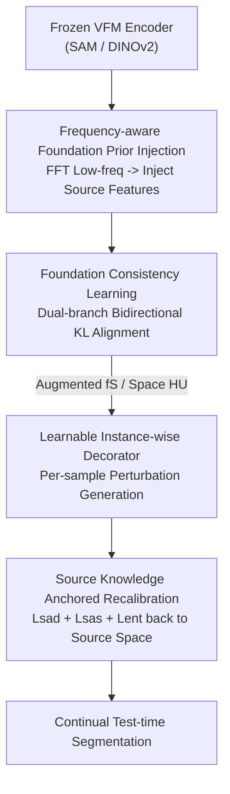

# TANGO: Learning Distribution-wise Foundation Prior Consistency and Instance-wise Style Calibration for Medical Image Generalization

**Conference**: CVPR 2026  
**Paper**: [CVF Open Access](https://openaccess.thecvf.com/content/CVPR2026/html/Liu_TANGO_Learning_Distribution-wise_Foundation_Prior_Consistency_and_Instance-wise_Style_Calibration_CVPR_2026_paper.html)  
**Code**: TBD  
**Area**: Medical Image  
**Keywords**: Continual Test-time Adaptation, Medical Image Segmentation, Visual Foundation Model, Frequency Domain Prior, Style Calibration

## TL;DR
TanGo distills the low-frequency generalization priors of Visual Foundation Models (SAM/DINOv2) into a lightweight source model during the **training phase** and employs learnable per-sample "decorators" to pull drifted test images back to the augmented source distribution during the **testing phase**, achieving SOTA in Continual Test-time Adaptation (CTTA) for medical image segmentation.

## Background & Motivation
**Background**: Deploying medical image segmentation models often encounters domain shifts caused by different scanners, protocols, and hospitals. Test-time Adaptation (TTA) and Continual Test-time Adaptation (CTTA) combat shifts by online fine-tuning parts of the source model (e.g., BN affine parameters, visual prompts) using unlabeled target samples. Representative methods include TENT, CoTTA, DomainAdaptor, and VPTTA.

**Limitations of Prior Work**: These methods imply two untenable assumptions: (i) the source model itself possesses a strong generalization prior; (ii) the test distribution is relatively stable. In practice, source models often overfit limited source data (demonstrated via t-SNE in the paper), and regularization strategies based on source predictions can mislead target model optimization. Furthermore, single-source to multi-target drift in real-world scenarios is large and continuously evolving, further amplifying pseudo-label error accumulation and category forgetting.

**Key Challenge**: The success of CTTA depends on "how reliable the source model is." However, existing practices directly use an overfitted source model as an anchor for online adaptation, which is akin to building on sand—the anchor itself is unstable, and adaptation leads to further deviation.

**Goal**: (1) Make the source model more generalizable and the feature space more stable during the training phase; (2) Reset each drifted test image accurately back to this augmented source distribution during the testing phase without damaging semantics.

**Key Insight**: Visual Foundation Models (VFMs) provide powerful image content understanding and stable feature representations. Low-frequency components encode domain-related styles, while high-frequency signals preserve anatomical structures. Thus, the authors use the **low-frequency prior** of VFMs as a "generalization anchor" injected into a lightweight expert model during training, followed by style calibration back to this augmented source space during testing.

**Core Idea**: A collaborative training-testing paradigm involving "training-time VFM low-frequency prior distillation + test-time instance-wise style calibration back to the anchor," replacing the traditional CTTA approach of directly fine-tuning an overfitted source model.

## Method

### Overall Architecture
TanGo is a two-stage paradigm. The **Training Phase** uses Distribution-wise Consistency Learning (DSCL) to distill frequency-domain generalization priors from a frozen VFM encoder into a lightweight source model $f_S$ (e.g., ResUNet-34 / PraNet), forming a unified, domain-coordinated feature space $H_U$. The **Testing Phase** uses Instance-wise Style Adaptive Calibration to adaptively align the incoming target sample distribution $H_T^i$ with this source knowledge anchored space $H_U$. The training phase consists of "Frequency-aware Foundation Prior Injection (FAFPI)" and "Consistency Training (FCL)"; the testing phase consists of "Learnable Instance-wise Decorator (LID)" and "Source Knowledge Anchored Recalibration (SKAR)".

### Key Designs

**1. Frequency-aware Foundation Prior Injection (FAFPI): Injecting VFM's Low-frequency "Style Base" into the Expert Model**

Distilling entire feature maps from VFMs to lightweight models is expensive and may introduce high-frequency anatomical noise. FAFPI extracts only the "low-frequency" layer: Adapters are added to the frozen VFM for parameter-efficient fine-tuning on the medical domain, and a lightweight Feature Refinement Module (depth-wise separable 3×3 conv) aligns VFM intermediate features $\tilde F_i^V$ to source features $F_i^S$ in resolution. Both are processed via 2D FFT, and a binary mask $M$ (controlled by hyperparameter $r=0.4$) isolates low-frequency amplitude components. The injection formula is $\tilde{\mathcal{F}}^{SA}_{li} = \mathcal{F}^{SA}_{li} + \Sigma(\mathcal{F}^{SA}_{li}) \odot \mathcal{F}^{VA}_{li} \odot R$, where $R \sim U(0,1)$. Here, $\Sigma(\cdot)$ is the standard deviation of source amplitudes to regulate intensity, and $R$ is uniform random noise to perturb the fused amplitude, forcing $f_S$ to focus on structural cues in the phase components to enhance robustness. Finally, inverse FFT reconstructs fused features $\tilde F_i^S$, which carry VFM low-frequency priors and allow the source model to "rehearse" potential distribution shifts.

**2. Foundation Consistency Learning (FCL): Distilling Priors into the Source Model via Dual-branch Bidirectional KL**

The source model must produce consistent segmentations for both "original features" and "prior-injected features." FCL generates two prediction branches during training: the original source branch $f_S(F_i^S)$ and the prior-injected branch $f_S(\tilde F_i^S)$. These are aligned using bidirectional KL divergence: $L_{FCL} = \frac{1}{2N}\sum_i [\mathrm{KL}(\tilde q_i^S \| q_i^S) + \mathrm{KL}(q_i^S \| \tilde q_i^S)]$. This bidirectional constraint forces the source model to output identical segmentations regardless of whether the prior is present, effectively internalizing VFM generalization behavior into the representation space $H_U$ of $f_S$. The total training loss includes segmentation losses (Dice + Cross-Entropy) for both branches: $L_{total} = L_{seg}(\tilde q_i^S, y) + L_{seg}(q_i^S, y) + \lambda_1 L_{FCL}$, with $\lambda_1=0.5$.

**3. Learnable Instance-wise Decorator (LID): A Dedicated "Filter" for Every Test Image**

Traditional visual prompt learning shares a fixed prompt across all test samples, ignoring intra-domain variance. LID (denoted as $f_D(\cdot;\phi)$) dynamically generates a specific decoration for each incoming test image $x_i^t$: $\tilde x_i^t = x_i^t + f_d(x_i^t;\phi)$. It is a lightweight learnable network (input conv + enhancement blocks + output conv with residual connections) that pulls the style distribution $H_T^i$ of each image toward the source-learned space $H_U$, maintaining adaptation capability in continuously changing environments.

**4. Source Knowledge Anchored Recalibration (SKAR): Three Constraints to Prevent Drift**

LID without constraints might generate "fake" test samples deviating from the source manifold $H_S$. SKAR uses three glass-box objectives to anchor decorated samples back to the source space: ① **Source Anchored Distribution Loss** $L_{sad}$ uses Gram matrices to align styles—calculating Gram matrices $G_j^T, G_j^S$ for the $j$-th block features of target/source models, followed by row-normalization and MSE: $L_{sad} = \frac{1}{C}\|\tilde G_j^T - \tilde G_j^S\|_2^2$; ② **Source Anchored Semantic Loss** $L_{sas} = \frac{1}{B}\sum_i \|f_T(\tilde x_i^t) - f_S(x_i^t)\|_2^2$ aligns segmentation outputs at the logits layer to ensure semantic integrity; ③ **Entropy Minimization Loss** $L_{ent}$ stabilizes the optimization of learnable BN parameters and reduces uncertainty. The test objective is $L_{SKAR} = \lambda_2 L_{sad} + \lambda_3 L_{sas} + L_{ent}$, with $\lambda_2=0.5, \lambda_3=0.6$. These ensure style alignment, semantic preservation, and stability.

### Loss & Training
- **Training Phase**: $L_{total} = L_{seg}(\tilde q_i^S, y) + L_{seg}(q_i^S, y) + \lambda_1 L_{FCL}$, where $L_{seg}$ is Dice + Cross-Entropy and $\lambda_1=0.5$.
- **Testing Phase**: $L_{SKAR} = \lambda_2 L_{sad} + \lambda_3 L_{sas} + L_{ent}$, with $\lambda_2=0.5, \lambda_3=0.6$; only LID parameters and BN affine parameters $\gamma, \beta$ in the target model $f_T$ are updated.
- **Backbones**: ResUNet-34 for Fundus OD/OC, PraNet with Res2Net for Polyps; VFM uses ViT-B SAM encoder (fine-tuned with Adapters).

## Key Experimental Results

### Main Results
Fundus OD/OC segmentation (5 domains: RIM-ONE-r3 / REFUGE / ORIGA / REFUGE-Val / Drishti-GS), DSC (%) under CTTA setting:

| Method | Domain A | Domain B | Domain C | Domain D | Domain E | Average ↑ |
|------|----------|----------|----------|----------|----------|--------|
| No Adapt (ResUNet-34) | 64.53 | 76.06 | 71.18 | 52.67 | 64.87 | 65.86 |
| VPTTA (CVPR 2024) | 73.91 | 79.36 | 74.51 | 56.51 | 75.35 | 71.93 |
| GraTa (AAAI 2025) | 76.58 | 78.72 | 76.27 | 67.15 | 72.88 | 74.32 |
| **TanGo (Ours)** | **87.76** | **85.96** | **84.49** | **84.41** | **83.52** | **85.23** |

TanGo outperforms the runner-up GraTa by 10.91% and No Adapt by 19.37% on average. Notably, on the most difficult Domain D, it improves from 67.15 to 84.41. In Polyp segmentation (CTTA), the average DSC is 3.24% higher than VPTTA and 7.93% higher than No Adapt.

### Ablation Study
Decomposition of training-side DSCL on Polyps (Average DSC %):

| Configuration | Domain A | Domain B | Domain C | Domain D | Average ↑ |
|------|----------|----------|----------|----------|--------|
| No Adapt | 79.90 | 66.33 | 73.89 | 82.95 | 75.77 |
| w/ FAFPI | 80.53 | 74.68 | 74.73 | 83.42 | 78.34 |
| w/ FCL (FAFPI+FCL) | 81.89 | 78.89 | 76.88 | 85.98 | 80.91 |
| Ours (+ Test-time Calib) | **83.95** | **82.44** | **81.11** | **87.29** | **83.70** |

Ablation of test-side constraints (Polyps, Avg DSC): $L_{ent}$ alone gives 78.25; adding $L_{sad}$ increases this, and all three together yield the best result. Gains are incremental from FAFPI to FCL to the full model, with test-time calibration contributing approximately 2.79 DSC.

### Key Findings
- **Training-Testing Complementarity**: FAFPI brings in low-frequency priors (+2.57), FCL anchors them via consistency (+2.57), and test-time calibration adds +2.79. All three steps are essential, showing that "enhancing the source model" and "test-time anchoring" are complementary.
- **Superior to General Distillation**: DSCL outperforms feature distillation methods like CWD, AttnKD, and SpaKD (Polyps: 80.91 vs 79.02; Fundus: 83.05 vs 81.32), indicating that distilling only low frequencies is more effective.
- **Robust in Static TTA**: TanGo maintains a lead in long-range adaptation (A→rest, etc.), suggesting it benefits more as the number of test samples increases.

## Highlights & Insights
- **Smart Frequency Decomposition**: By injecting only VFM low-frequency amplitudes while retaining source model phase/high-frequency structures, "style generalization" and "task anatomical knowledge" are decoupled. This is applicable to any scenario borrowing VFM priors without wanting to destroy expert structures.
- **"Rehearsing" Shifts during Training**: Perturbing fused amplitudes with random noise $R$ forces the model to anticipate distribution shifts, acting as a cost-effective data augmentation that addresses the root cause better than reactive test-time adaptation.
- **LID + SKAR Balance**: Pairing "free generation" (LID) with "anchoring constraints" (Gram style + Logits semantics + Entropy) provides a clean solution to the "flexibility vs. stability" trade-off in TTA.

## Limitations & Future Work
- Dependency on a high-quality VFM (ViT-B SAM); the zero-shot capability of the VFM on specific medical modalities determines the prior quality.
- The frequency mask radius ($r=0.4$) and loss weights ($\lambda$) are empirically set and may require tuning across different tasks.
- Only validated on 2D segmentation; effectiveness of low-frequency injection and Gram alignment on 3D volumes (CT/MRI) remains to be verified.

## Related Work & Insights
- **vs VPTTA (CVPR 2024)**: VPTTA learns continuous low-frequency prompts for each test sample to mitigate error accumulation but still relies on a model with limited generalization. TanGo strengthens the source model during training, leading to a ~13% improvement in Fundus average DSC.
- **vs DomainAdaptor (CVPR 2023)**: DomainAdaptor mixes source/target BN statistics, which is a "statistical layer fix." TanGo addresses the problem at the feature space level via training-time enhancement and instance-wise calibration.
- **vs General Feature Distillation**: While others distill whole feature maps, TanGo targets low-frequency amplitudes, avoiding VFM high-frequency noise.

## Rating
- Novelty: ⭐⭐⭐⭐ The combination of training-test collaboration and frequency-domain prior injection is novel in CTTA, though individual components are existing building blocks.
- Experimental Thoroughness: ⭐⭐⭐⭐⭐ Extensive benchmarks across Fundus and Polyps, TTA/CTTA/mixed settings, 9-10 baselines, and detailed ablations.
- Writing Quality: ⭐⭐⭐⭐ Clear motivation and complete formulas; however, the heavy use of acronyms (DSCL/FAFPI/FCL/LID/SKAR) may require careful reading.
- Value: ⭐⭐⭐⭐ Highly practical for medical deployment, showing significant gains and providing a reference for "borrowing foundation model priors."

<!-- RELATED:START -->

## Related Papers

- [\[CVPR 2026\] Delving Aleatoric Uncertainty in Medical Image Segmentation via Vision Foundation Models](delving_aleatoric_uncertainty_in_medical_image_segmentation_via_vision_foundatio.md)
- [\[CVPR 2026\] Semantic Class Distribution Learning for Debiasing Semi-Supervised Medical Image Segmentation](semantic_class_distribution_learning_for_debiasing.md)
- [\[ICCV 2025\] Vector Contrastive Learning for Pixel-wise Pretraining in Medical Vision](../../ICCV2025/medical_imaging/vector_contrastive_learning_for_pixel-wise_pretraining_in_medical_vision.md)
- [\[CVPR 2026\] CG-Reasoner: Centroid-Guided Positional Reasoning Segmentation for Medical Imaging with a Robust Visual-Text Consistency Metric](cg-reasoner_centroid-guided_positional_reasoning_segmentation_for_medical_imagin.md)
- [\[CVPR 2026\] SemiGDA: Generative Dual-distribution Alignment for Semi-Supervised Medical Image Segmentation](semigda_generative_dual-distribution_alignment_for_semi-supervised_medical_image.md)

<!-- RELATED:END -->
