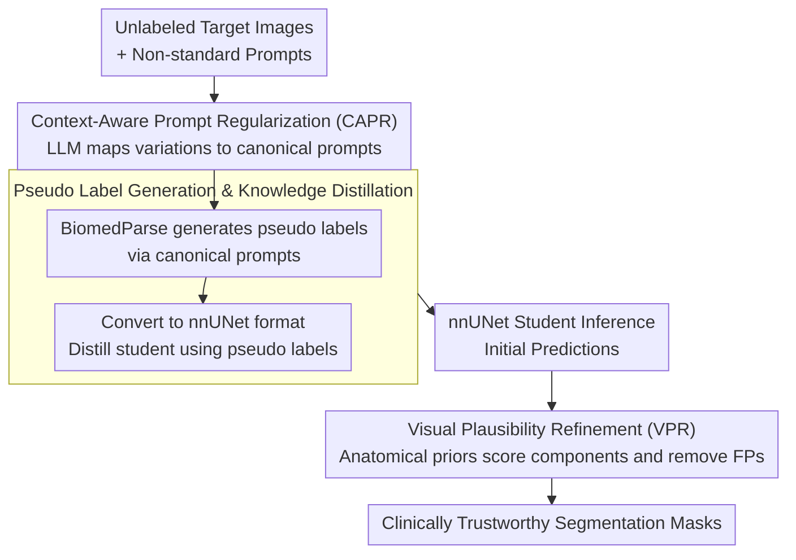

# Tell2Adapt: A Unified Framework for Source Free Unsupervised Domain Adaptation via Vision Foundation Model

**Conference**: CVPR 2026  
**arXiv**: [2603.05012](https://arxiv.org/abs/2603.05012)  
**Authors**: Yulong Shi, Shijie Li, Ziyi Li, Lin Qi
**Code**: [derekshiii/Tell2Adapt](https://github.com/derekshiii/Tell2Adapt)  
**Area**: Medical Imaging  
**Keywords**: source-free domain adaptation, vision foundation model, medical image segmentation, pseudo label, prompt regularization

## TL;DR

Tell2Adapt is a unified framework that leverages the generalized knowledge of a Vision Foundation Model (BiomedParse) to achieve source-free unsupervised domain adaptation for medical image segmentation across 10 domain transfer directions and 22 anatomical targets. It generates high-quality pseudo labels through Context-Aware Prompt Regularization (CAPR) and removes anatomically implausible predictions via Visual Plausibility Refinement (VPR).

## Background & Motivation

Source-Free Unsupervised Domain Adaptation (SFUDA) is critical in medical imaging deployment because source domain data often cannot be shared due to privacy constraints, requiring models to adapt using only unlabeled target domain data.

Existing SFUDA methods face several critical limitations:
- **Scenario Specificity**: Most methods are designed for specific transfer tasks with small domain gaps (e.g., MRI→MRI) and cannot scale to unified multi-modal, multi-target frameworks.
- **Weak Generalization**: Performance drops significantly when facing large domain gaps (e.g., CT→MRI) or multiple anatomical targets.
- **Poor Pseudo Label Quality**: Pseudo labels generated directly from source models are noisy in the target domain, limiting adaptation effectiveness.
- **Lack of Clinical Reliability**: Absence of anatomical plausibility verification for predictions can lead to clinically unacceptable false positives.

Key Insight: Vision Foundation Models (VFMs) like BiomedParse, pre-trained on massive biomedical datasets, possess broad knowledge across modalities and anatomical structures. Effectively transferring this knowledge to lightweight deployment models while ensuring clinical reliability is the core problem addressed in this work.

## Method

### Overall Architecture

Tell2Adapt addresses a realistic dilemma: source data is inaccessible due to privacy, and the target domain only provides unlabeled images. While traditional SFUDA methods focus on specific migrations, they fail when modalities or organs change. This framework utilizes a "generalized external brain" (BiomedParse) to generate pseudo labels on the target domain, which are then distilled into a lightweight, clinically deployable nnUNet student model.

The pipeline consists of three stages: first, CAPR "translates" diverse text prompts into standardized instructions for BiomedParse to generate pseudo labels; then, nnUNet is trained via distillation using these pseudo labels as supervision; finally, VPR utilizes anatomical statistical priors to perform a "sanity check" on the student model's output, filtering out anatomically inconsistent predictions. The three steps ensure correct input, effective learning, and trustworthy output.

### Key Designs

**1. Context-Aware Prompt Regularization (CAPR): Standardizing Clinical Synonyms**

BiomedParse is a prompt-driven segmentation model where variations in prompts can degrade performance. In clinical practice, the same anatomical structure may be referred to by multiple names (e.g., "left ventricle", "LV"). CAPR introduces a translation layer before BiomedParse using a meta-prompt to drive an LLM (e.g., GPT-4) to map non-standard expressions to canonical prompts. This ensures "same concept → same instruction," which significantly influences the upper bound of pseudo label quality, contributing approximately 4.7% DSC in ablation studies.

**2. Pseudo Label Generation & Knowledge Distillation: Transferring VFM Knowledge to Lightweight Students**

BiomedParse is too computationally heavy for direct clinical deployment. Tell2Adapt adopts a "teacher generates, student learns" distillation strategy. BiomedParse's outputs are converted into nnUNet-compatible labels, which serve as the sole supervision for training an nnUNet student. This process satisfies the source-free constraint as no source data is used. The resulting nnUNet model provides fast inference and low memory consumption, compensating for the VFM's efficiency shortcomings.

**3. Visual Plausibility Refinement (VPR): Anatomical "Sanity Check"**

Student models may still produce clinically unacceptable false positives, such as isolated fragments in the liver region. VPR utilizes pre-computed anatomical statistical priors (stored in `Anatomical_Priors.json`) as a judge. For each predicted connected component $p_i$, a plausibility score is calculated in log-space based on low-level visual features and Beta distribution parameters:

$$\log S(p_i) = \sum_{k=1}^{4} \left[ (\alpha_k-1)\log f_{i,k} + (\beta_k-1)\log(1-f_{i,k}) - \log B(\alpha_k, \beta_k) \right]$$

Components scoring below $\mu_S - 2\sigma_S$ are discarded as anatomically outliers. This mechanism quantifies "plausibility" into a computable probability density, adding a layer of clinical reliability without retraining, contributing about 2.3% DSC and significantly reducing HD95.

### Example Walkthrough

Taking an abdominal CT slice as an example: A doctor might input "kidney (right side)". CAPR standardizes this to "right kidney". BiomedParse then segments this region on the CT to create a pseudo label. This label is used to distill an nnUNet student. During inference, if nnUNet predicts a small isolated fragment near the right kidney, VPR calculates its plausibility score. While the true kidney mass aligns with anatomical priors, the fragment's features fall below the threshold ($\mu_S - 2\sigma_S$) and are removed, resulting in an anatomically sound clinical mask.

## Key Experimental Results

### Experimental Settings
- **Evaluation Scale**: 10 domain transfer directions, 22 anatomical targets (one of the largest SFUDA evaluations to date).
- **Anatomical Regions**: Brain (BraTS), Heart (M&Ms MRI), Polyp (Endoscopy), Abdomen (AMOS/CHAOS).
- **VFM Teacher**: BiomedParse.
- **Student Model**: nnUNet.
- **Metrics**: Dice Similarity Coefficient (DSC), Hausdorff Distance 95% (HD95).

### Main Results: Cross-modal Abdominal Organ Segmentation Dice (%)

| Method | Type | Liver | R.Kidney | L.Kidney | Spleen | Avg |
|---|---|---|---|---|---|---|
| Source Only | — | 58.2 | 47.6 | 46.1 | 42.3 | 48.6 |
| TENT | Test-time | 63.4 | 52.1 | 51.8 | 48.7 | 54.0 |
| AdaptSeg | UDA | 71.5 | 63.2 | 62.4 | 59.8 | 64.2 |
| DPL | SFUDA | 69.3 | 58.7 | 57.2 | 55.1 | 60.1 |
| ProSFDA | SFUDA | 74.8 | 65.3 | 64.1 | 62.4 | 66.7 |
| **Ours** | **SFUDA** | **82.6** | **76.8** | **75.4** | **73.1** | **77.0** |

Ours outperforms the second-best (ProSFDA) by ~10% in average Dice, showing stronger advantages in large domain-gap migrations.

### Ablation Study: Cardiac MRI Segmentation

| Configuration | LV | RV | Myo | Avg DSC | Avg HD95 |
|---|---|---|---|---|---|
| Source Only | 72.3 | 65.1 | 58.4 | 65.3 | 14.2 |
| ProSFDA | 81.2 | 74.6 | 69.3 | 75.0 | 8.7 |
| Ours (w/o CAPR) | 83.1 | 77.2 | 71.8 | 77.4 | 7.4 |
| Ours (w/o VPR) | 85.4 | 79.8 | 74.1 | 79.8 | 6.8 |
| **Ours (Full)** | **87.6** | **82.3** | **76.5** | **82.1** | **5.6** |

Ablation analysis indicates:
- **Gain** from CAPR: ~4.7% DSC (Prompt consistency is vital for VFM inference).
- **Gain** from VPR: ~2.3% DSC and significant HD95 reduction (Effective removal of false positives).
- The modules are complementary, achieving optimal performance when combined.

## Highlights & Insights

- **Unified Framework Design**: Establishes a unified SFUDA framework for 10 transfer directions and 22 targets, breaking the "one model per task" limitation.
- **VFM Knowledge Transfer Path**: Proposes the "VFM → Pseudo Label → Knowledge Distillation → Lightweight Model" path, combining large-model generalization with clinical efficiency.
- **Prompt Engineering Regularization**: CAPR solves prompt inconsistency issues in prompt-driven VFMs using LLM-based canonical mapping.
- **Anatomical Prior-Driven Post-processing**: VPR enhances clinical reliability without retraining by using statistical priors and low-level visual features.
- **Broad Modality Coverage**: Anatomical priors cover 14 clinical scenarios including CT, MRI, X-ray, Ultrasound, Endoscopy, Fundus, Dermoscopy, OCT, and Pathology.

## Limitations & Future Work

- **Dependence on VFM Quality**: Performance is capped by BiomedParse; quality may suffer for rare anatomical structures or modalities poorly covered by the VFM.
- **LLM API Requirement**: CAPR requires LLM access (e.g., GPT-4), which may face barriers in offline or restricted environments.
- **Pre-set Priors**: VPR parameters require pre-computation; adding new targets necessitates updating the prior library.
- **Pipeline Complexity**: The three-stage design is more complex than end-to-end approaches, potentially leading to information loss between stages.
- **Computational Cost**: The initial VFM inference and distillation training are computationally intensive, although the final model is lightweight.

## Related Work & Insights

- **SFUDA Methods**: TENT (test-time adaptation), DPL (pseudo-labeling), ProSFDA (progressive adaptation) → Mostly designed for specific gaps, lacking a unified framework.
- **Vision Foundation Models**: SAM (general segmentation), BiomedParse (biomedical segmentation) → Ours uses BiomedParse as the knowledge source.
- **Knowledge Distillation**: A classic paradigm used here to transfer VFM knowledge to nnUNet via pseudo labels.
- **Medical Segmentation DA**: AdaptSeg (adversarial), UAMT (uncertainty-aware) → Often require source data or support specific modalities only.
- **Ours Position**: First unified multi-modal multi-target SFUDA framework by efficiently transferring VFM knowledge through prompt regularization and anatomical refinement.

## Rating

- Novelty: ⭐⭐⭐⭐ — Clear and innovative integration of VFM with CAPR and VPR for SFUDA.
- Experimental Thoroughness: ⭐⭐⭐⭐⭐ — Exceptional scale with 10 transfer directions and 22 targets.
- Writing Quality: ⭐⭐⭐⭐ — Logical structure, though the three-stage description is slightly verbose.
- Value: ⭐⭐⭐⭐ — High practical value for clinical deployment; code is open-sourced.

<!-- RELATED:START -->

## Related Papers

- [\[CVPR 2026\] SHAPE: Structure-aware Hierarchical Unsupervised Domain Adaptation with Plausibility Evaluation for Medical Image Segmentation](shape_structure-aware_hierarchical_unsupervised_domain_adaptation_with_plausibil.md)
- [\[CVPR 2026\] Reclaiming Lost Text Layers for Source-Free Cross-Domain Few-Shot Learning](reclaiming_lost_text_layers_for_source-free_cross-domain_few-shot_learning.md)
- [\[CVPR 2026\] Uni-Hema: Unified Model for Digital Hematopathology](uni-hema_unified_model_for_digital_hematopathology.md)
- [\[CVPR 2026\] GaussianPile: A Unified Sparse Gaussian Splatting Framework for Slice-based Volumetric Reconstruction](gaussianpile_a_unified_sparse_gaussian_splatting_framework_for_slice-based_volum.md)
- [\[CVPR 2026\] CoFiDA-M: Concept-Aware Feature Modulation for Cross-Domain Adaptation with Image-Only Inference](cofida-m_concept-aware_feature_modulation_for_cross-domain_adaptation_with_image.md)

<!-- RELATED:END -->
