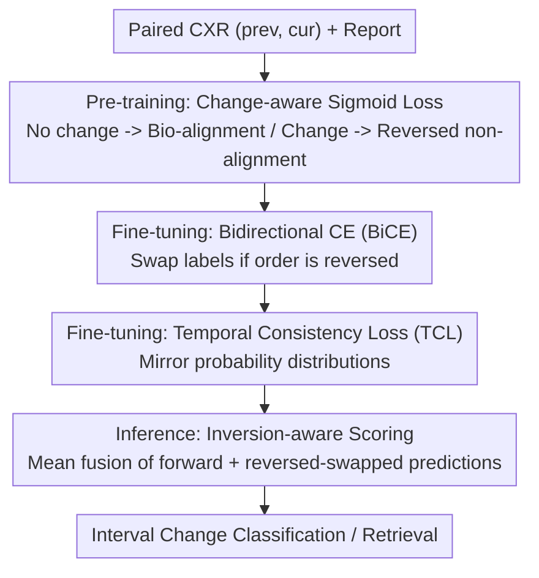

# Temporal Inversion for Learning Interval Change in Chest X-Rays

**Conference**: CVPR 2026  
**Paper**: [CVF Open Access](https://openaccess.thecvf.com/content/CVPR2026/html/Ko_Temporal_Inversion_for_Learning_Interval_Change_in_Chest_X-Rays_CVPR_2026_paper.html)  
**Code**: To be confirmed  
**Area**: Medical Imaging  
**Keywords**: Chest X-ray, Temporal change, Vision-Language Pre-training, Temporal Inversion, Directional Consistency

## TL;DR
TILA utilizes "swapping the order of paired chest X-rays (temporal inversion)" as a supervisory signal. By incorporating inversion-aware objectives during pre-training, fine-tuning, and inference, it enables existing temporal vision-language models to genuinely distinguish whether lesions are "improving or worsening," rather than merely identifying their presence.

## Background & Motivation
**Background**: Vision-Language Pre-training (VLP) such as CLIP/SigLIP has demonstrated strength in retrieval and zero-shot classification. Medical VLP has shifted vision-text alignment to the clinical domain for disease classification and localization. For paired chest X-rays, multi-image encoders like BioViL-T, ALTA, and TempA-VLP attempt to model temporal context.

**Limitations of Prior Work**: The core task for radiologists is to compare the current image with the most recent prior to judge **interval change** (improving / stable / worsening / resolving / new). However, most medical VLPs still analyze single chest X-rays in isolation, ignoring the clinical essence of "comparison." Even with temporal encoders, evaluation remains weak—most studies use a single progression label, which fails to reveal whether the model truly captures the "direction of change."

**Key Challenge**: Progression labels are inherently noisy (consistency in labeling "stable" and borderline cases is low). Consequently, moderate classification scores do not prove temporal understanding—the model might simply be identifying the existence of lesions or guessing. Models may not have learned directional reasoning at all.

**Goal**: (1) Inject direction-sensitive representations into the model; (2) Design an evaluation protocol that truly measures "order sensitivity / inversion consistency" rather than just progression accuracy.

**Key Insight**: Reversing the order of paired images and swapping the corresponding labels tests whether model predictions maintain logical consistency across both temporal directions. Although clinical reversal is not always strictly symmetric (recovery is not necessarily a precise mirror of worsening), many radiographic manifestations (effusion volume, pneumothorax size, consolidation extent) are approximately reversible in density or scope. Thus, temporal inversion serves as an excellent "stress test" for temporal reasoning beyond label priors.

**Core Idea**: Use "temporal inversion" as a supervisory signal throughout training and inference to increase sensitivity to directional changes. TILA does not alter the network architecture but adds lightweight losses and inversion-aware inference, making it compatible with any paired-image VLP backbone.

## Method

### Overall Architecture
TILA (Temporal Inversion-aware Learning and Alignment) keeps the network structure unchanged. For a paired image encoder $f_\theta$ and text encoder $g_\phi$, it adds inversion-aware objectives across three stages: **Pre-training** uses Change-aware Sigmoid Loss (based on SigLIP) to distinguish "reports describing change vs. no change," aligning both original and reversed orders with the report for no-change cases while forcing non-alignment for reversed-order change cases; **Fine-tuning** uses Bidirectional Cross-Entropy (BiCE) to enforce label swapping upon order reversal (improved ↔ worsened, stable remains unchanged) and Temporal Consistency Loss (TCL) to ensure mirrored probability distributions; **Inference** uses inversion-aware scoring to fuse forward predictions with "reversed-then-swapped" predictions to reduce bias and variance. The authors validated these principles on BioViL-T and ALTA backbones.

### Key Designs

**1. Change-aware Sigmoid Loss (Pre-training): Teaching Directionality via "To Align or Not to Align"**

Standard SigLIP only focuses on "aligning matched pairs and repelling unmatched pairs," regardless of temporal direction. The key observation is that text alignment should depend on the underlying temporal relationship. When a report says "no change," both original and reversed image orders should align with it. When a report describes "change," the reversed order should **not** align because the direction is wrong. Formally: for reversed pairs $(x^{cur}, x^{prev})$, $L_{change} = -\frac{1}{|B|}\sum_i\sum_j \log\sigma(z^{swap}_{ij}(\tau^{swap} v^{swap\top}_i t_j - b^{swap}))$, where $z^{swap}_{ij}=+1$ only if $i{=}j$ and $c_i{=}0$ (self-match and no change); all other pairs (including matched pairs describing change) are treated as negative. Binary change labels $c_i$ are automatically generated by a LLM (Gemini 2.0 Flash) from reports.

**2. Bidirectional Cross-Entropy (BiCE, Fine-tuning): Hard Constraints for Label Reversal**

During fine-tuning, each pair is labeled into three categories: improved / stable / worsened. The core constraint is that labels should flip when the order is reversed. Defining the inversion mapping $I(\text{improved}){=}\text{worsened}$, $I(\text{stable}){=}\text{stable}$, $I(\text{worsened}){=}\text{improved}$. BiCE averages loss for both orders: $L_{BiCE} = \frac{1}{2}[\mathrm{CE}(f_\theta(x^{prev},x^{cur}),y) + \mathrm{CE}(f_\theta(x^{cur},x^{prev}),I(y))]$. This treats progression as a directional continuum.

**3. Temporal Consistency Loss (TCL, Fine-tuning): Mirroring Probability Distributions**

While BiCE constrains labels, TCL requires **probability distributions** to transform consistently under inversion. Defining transformation $S$ as swapping the probabilities of improved and worsened while keeping stable fixed, the objective is $L_{TCL} = \frac{1}{|B|}\sum_i \|p^{(i)}_{fwd} - S(p^{(i)}_{bwd})\|^2$. The intuition is: if a case is judged as "highly improved" in forward order, it must symmetrically be "highly worsened" in reverse. Total loss: $L_{total} = L_{BiCE} + \lambda L_{TCL}$ ($\lambda{=}50$).

**4. Inversion-aware Scoring (Inference): Reducing Bias and Variance**

During inference, TILA averages the forward prediction and the "reversed-then-swapped" prediction: $\text{score} = \frac{1}{2}[p(f_\theta(x^{prev},x^{cur})) + S(p(f_\theta(x^{cur},x^{prev})))]$. This fusion cancels out biases toward fixed orders and reduces variance. Training requires a warm-up: starting with inversion objectives immediately results in a collapse into "stable" predictions, so 10-20 epochs of standard loss are performed first.

## Key Experimental Results

### Main Results
3-class classification for interval change (MS-CXR-T, macro-accuracy %):

| Model | Standard | Reversed | Combined | Consistency |
|------|----------|----------|----------|-------------|
| BioViL-T$_\text{SigLIP}$ (baseline) | 61.1 | 53.3 | 59.7 | 39.5 |
| **BioViL-T$_\text{TILA}$** | **64.1** | **63.7** | **63.6** | **57.4** |
| ALTA$_\text{SigLIP}$ (baseline) | 61.7 | 53.0 | 61.2 | 42.9 |
| **ALTA$_\text{TILA}$** | **63.6** | **58.8** | **62.6** | **54.6** |

(Standard is the primary clinical metric; Reversed/Combined/Consistency quantify order sensitivity). TILA improves on Standard, but the **significant gap is in Reversed and Consistency**. BioViL-T's Consistency jumped from 39.5 to 57.4, indicating the model transitioned from "guessing right in one direction" to "being correct in both."

### Key Findings
- **Standard Gains vs. Consistency Gains**: This confirms the motivation—Standard accuracy can be hyper-inflated by lesion detection shortcuts, whereas Consistency (correct in both directions) reveals true temporal understanding.
- **Model Agnostic**: Gains observed across both BioViL-T and ALTA.
- **Warm-up is Essential**: Reversal targets should only be introduced after the model has learned basic features to avoid collapsing to the "stable" category.
- **Transferability**: Temporal representations transfer well to binary "change/no-change" screening tasks for clinical triage.

## Highlights & Insights
- **Temporal Inversion as Signal and Probe**: Inversion serves as both a data/objective augmentation during training and a stress test during evaluation, providing a clean and unified logic.
- **De-biasing Accuracy**: The authors explicitly identify that Standard accuracy can be inflated by entity existence. The multi-protocol evaluation (Reversed/Combined/Consistency) isolates true directional reasoning.
- **Model-Agnostic Utility**: Directional sensitivity is injected via losses and inference fusion without structural changes, making it applicable to any temporal medical task (e.g., follow-up CT/MRI).

## Limitations & Future Work
- **Symmetry Assumption**: Recovery and worsening are not always mirror images. Reversal supervision is an engineering approximation that may be biased for irreversible cases like post-surgery or fibrosis.
- **LLM Dependency**: Pre-training labels depend on LLM extraction from reports, which is influenced by report quality.
- **Hyperparameter Sensitivity**: The weight $\lambda{=}50$ and the warm-up schedule are critical; generalizability across datasets without tuning requires more exploration.

## Related Work & Insights
- **vs. BioViL-T / ALTA**: Prior works model "appearance" temporal context but lack directional sensitivity. TILA provides an orthogonal enhancement.
- **vs. Previous VLP**: Standard contrastive losses do not distinguish temporal direction. TILA’s Change-aware Sigmoid explicitly encodes the temporal prior into the VLP contrastive objective.

## Rating
- Novelty: ⭐⭐⭐⭐ Reversal as a supervisory signal in temporal CXR-VLP is a fresh and consistent perspective.
- Experimental Thoroughness: ⭐⭐⭐⭐⭐ Various backbones, multiple tasks (retrieval/classification/screening), and new evaluation protocols.
- Writing Quality: ⭐⭐⭐⭐⭐ Logical flow from motivation (label noise) to solution (directional probes) is clear and rigorous.
- Value: ⭐⭐⭐⭐ Directly addresses the clinical nature of comparative reading and offers a lightweight, plug-and-play solution.

<!-- RELATED:START -->

## Related Papers

- [\[CVPR 2026\] Instruction-Guided Lesion Segmentation for Chest X-rays with Automatically Generated Large-Scale Dataset](instruction-guided_lesion_segmentation_for_chest_x-rays_with_automatically_gener.md)
- [\[ECCV 2024\] CheX: Interactive Localization and Region Description in Chest X-rays](../../ECCV2024/medical_imaging/chex_interactive_localization_and_region_description_in_chest_x-rays.md)
- [\[NeurIPS 2025\] CXReasonBench: A Benchmark for Evaluating Structured Diagnostic Reasoning in Chest X-rays](../../NeurIPS2025/medical_imaging/cxreasonbench_a_benchmark_for_evaluating_structured_diagnostic_reasoning_in_ches.md)
- [\[CVPR 2026\] InvCoSS: Inversion-driven Continual Self-supervised Learning in Medical Multi-modal Image Pre-training](invcoss_inversion-driven_continual_self-supervised_learning_in_medical_multi-mod.md)
- [\[CVPR 2026\] Active Inference for Micro-Gesture Recognition: EFE-Guided Temporal Sampling and Adaptive Learning](active_inference_for_micro-gesture_recognition_efe-guided_temporal_sampling_and_.md)

<!-- RELATED:END -->
