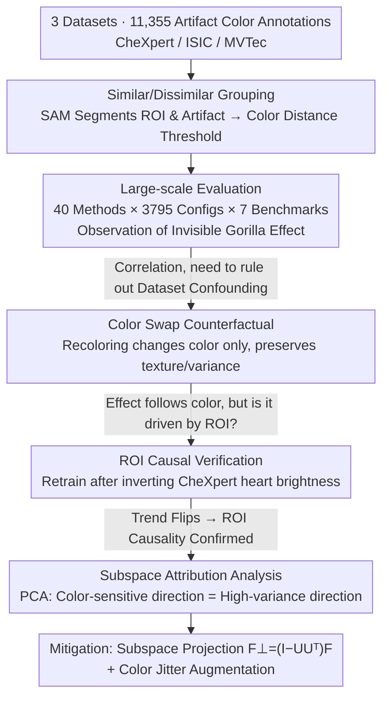

# The Invisible Gorilla Effect in Out-of-distribution Detection

**Conference**: CVPR 2026  
**arXiv**: [2602.20068](https://arxiv.org/abs/2602.20068)  
**Code**: [Available](https://github.com/HarryAnthony/Invisible_Gorilla_Effect)  
**Area**: Medical Imaging  
**Keywords**: OOD Detection, OOD Detection Bias, Visual Similarity, Medical Image Safety, Feature Space Analysis

## TL;DR

Reveals a previously unreported bias in OOD detection—the "Invisible Gorilla Effect": detection performance is significantly better when OOD artifacts are visually similar to the model's region of interest (ROI) and drops drastically when they are dissimilar, particularly affecting feature-based OOD methods.

## Background & Motivation

### 1. Background

DNNs have achieved expert-level accuracy in high-stakes scenarios such as medical imaging and autonomous driving, but their performance degrades severely when encountering out-of-distribution (OOD) data. OOD detection methods aim to identify and reject unreliable predictions, becoming a critical requirement for AI medical regulation (both US FDA and EU AI Act require ML systems to handle OOD inputs).

### 2. Limitations of Prior Work

Existing research has observed that OOD detection performance varies widely across different artifact types, but **why** this discrepancy occurs has not been deeply explored. In real-world deployments, the types of OOD data a model might encounter are unpredictable, necessitating detection methods that generalize across various distribution shifts.

### 3. Key Challenge

Traditional assumptions suggest that OOD detection difficulty is monotonically related to the similarity between samples and the training distribution—more similar samples are harder to detect (near-OOD is hard, far-OOD is easy). However, this study finds that this assumption does not always hold: a counter-intuitive situation exists where OOD samples visually more similar to the ROI are actually **easier** to detect.

### 4. Goal

Systematically identify, quantify, and explain the bias caused by visual similarity in OOD detection, and evaluate potential mitigation strategies.

### 5. Key Insight

Using color similarity as a controlled variable (color artifacts are common and can be varied independently of shape/texture), large-scale experiments were conducted in medical imaging (skin lesion classification, chest X-rays) and industrial inspection (MVTec) scenarios. The authors draw inspiration from the "Invisible Gorilla" experiment in cognitive psychology—subjects focusing on white-shirted players passing a ball often ignore a person in a black gorilla suit, whereas the gorilla is more easily noticed if it wears white.

### 6. Core Idea

**Invisible Gorilla Effect**: OOD detection methods tend to detect artifacts that share visual features with the model's ROI while "ignoring" artifacts dissimilar to the ROI. This occurs because, in feature-based methods, color variations primarily distribute along high-variance directions in the latent space, which are precisely the directions downweighted by methods like Mahalanobis.

## Method

### Overall Architecture

This study is a systematic empirical investigation rather than a proposal for a new OOD detection method. Its method section follows a **progressive chain of evidence**—establishing the phenomenon, ruling out confounders, confirming causality, and finally explaining the mechanism for mitigation:

1.  **Grouping & Observation**: Isolate "color" as the only controllable variable. Use SAM to segment ROIs and artifacts, and group artifacts into "similar / dissimilar to ROI" based on color distance (Design 1). The "Invisible Gorilla Effect" is observed across a large-scale evaluation involving 40 OOD methods × 3795 hyperparameter configurations × 7 benchmarks × 3 architectures (ResNet18 / VGG16 / ViT-B/32) × 25 random seeds.
2.  **Ruling out Dataset Confounders**: Use counterfactual recoloring via color swapping—changing only the color while preserving texture and pixel variance—to verify that the effect follows the color rather than the original samples (Design 2).
3.  **Confirming ROI Causality**: Retrain models after inverting the brightness of the heart region in CheXpert to see if the detection trend flips accordingly, upgrading the correlation to causality (Design 3).
4.  **Mechanistic Attribution & Mitigation**: Use PCA subspace analysis to explain "why feature methods are most affected"—color-sensitive directions coincide with high-variance directions, which are downweighted by methods like Mahalanobis. Mitigation is achieved by projecting out nuisance high-variance directions combined with color jitter augmentation (Design 4).

### Key Designs

**1. Similar/Dissimilar Grouping: Isolating "Color" as the Controlled Variable**

To verify the counter-intuitive hypothesis that "artifacts more similar to the ROI are better detected," the first step is to establish a clean control axis. The paper selects color because it can be controlled independently of shape and texture, and color artifacts (ink marks, color calibration patches) are extremely common in medical imaging. Specifically, SAM is used to segment the ROI and artifact regions separately to calculate their average RGB values. They are then classified into "similar" and "dissimilar" groups based on linear Euclidean distance thresholds—for instance, if the average RGB of an ISIC skin lesion ROI is $(176, 116, 77)$, red ink falls into the "similar" group, while black/green/purple ink falls into the "dissimilar" group. With this color similarity axis, detection performance gaps in subsequent OOD methods can be attributed to this single variable.

**2. Color Swap Counterfactual: Ruling out Dataset Bias**

Grouping by color is insufficient—what if "red ink is easier to detect" simply because samples with red ink happen to be in an easily detectable part of the distribution? To address this dataset bias, the authors perform counterfactual rewriting on ISIC color patch data: recoloring originally "similar" red/orange/yellow patches to black, and recoloring originally "dissimilar" green/blue/black/grey patches to the average color of skin lesions. Recoloring is done via per-channel mean shifts based on segmentation masks, shifting only the color mean while preserving pixel-level variance and texture. If detection performance follows the color rather than the original sample, it indicates the effect stems from "color similarity to the ROI" rather than other confounding factors.

**3. ROI Causal Verification: Changing ROI Appearance to Observe Trend Flipping**

The first two steps prove correlation but not that the "model's learning of the ROI" drives this effect. The authors perform a causal intervention on CheXpert chest X-rays: retraining the model after changing the heart region from high brightness to low brightness, and then testing it with synthetic OOD squares of varying brightness. The logic is straightforward—if the effect is indeed determined by ROI appearance, flipping the ROI from "bright" to "dark" should cause the detection performance trend relative to brightness to flip as well. The experiment confirms this trend reversal, upgrading the "artifact vs. ROI visual similarity" from an observed association to a causal mechanism driven by ROI learning.

**4. Subspace Attribution Analysis: Geometrical Explanation via PCA**

Finally, the study addresses the mechanism: why are feature-based methods (Mahalanobis, KNN, etc.) far more affected by this bias than confidence-based methods? The authors perform PCA on hidden layer features and calculate two metrics for each principal component $k$: its ability to distinguish "similar/dissimilar artifacts" $I_k$, and its own variance $\lambda_k$. A significant positive Spearman correlation between these two is found, meaning the directions most sensitive to color are precisely the highest-variance directions in the latent space. Since methods like Mahalanobis naturally downweight high-variance directions using the covariance matrix, they effectively suppress the signals carrying "dissimilar artifact" information—explaining the "invisible gorilla" geometrically. This attribution directly inspires the subspace projection mitigation strategy: projecting out these nuisance high-variance directions.

### Loss & Training

This paper is primarily analytical and does not propose a new training objective. Key training details:

- Standard cross-entropy for the primary task, using 25 random seeds × 5-fold cross-validation.
- Mitigation via color jitter augmentation (Mild: brightness/contrast/saturation=0.2; Heavy=0.8).
- Subspace projection mitigation: $F_\perp = (I - UU^\top)F$, where $U$ is the subspace spanned by the top $k=5$ most color-sensitive principal components.

## Key Experimental Results

### Main Results

**Table 1: Key Results on ISIC Benchmark (ResNet18, 40 methods, AUROC %)**

| Method Category | Representative Method | Ink-Similar | Ink-Dissimilar | Patch-Similar | Patch-Dissimilar | Avg Δ(pp) |
|:---|:---|:---:|:---:|:---:|:---:|:---:|
| Feature-based | Mahalanobis | 77.0 | 63.6 | 96.7 | 95.4 | 7.3 |
| Feature-based | KNN | 85.7 | 70.1 | 91.3 | 90.6 | 8.2 |
| Feature-based | FeatureNorm | 75.1 | 52.9 | 62.4 | 58.1 | 13.2 |
| Confidence-based | MCP | 69.8 | 68.7 | 57.5 | 55.4 | 1.6 |
| Confidence-based | ODIN | 72.8 | 72.4 | 59.7 | 57.0 | 1.6 |
| External-based | RealNVP | 84.0 | 65.6 | 96.1 | 94.2 | 10.1 |

**Key Figure**: Mahalanobis's AUROC for detecting red ink (similar to ROI) is 31.5% higher than for detecting black ink (dissimilar) on ISIC.

**Table 2: Key Results on MVTec Benchmark (ResNet18, AUROC %)**

| Method | Pill-Similar | Pill-Dissimilar | MetalNut-Similar | MetalNut-Dissimilar | Avg Δ(pp) |
|:---|:---:|:---:|:---:|:---:|:---:|
| KNN | 93.3 | 86.2 | 71.0 | 36.9 | 20.6 |
| Mahalanobis | 71.9 | 68.7 | 69.8 | 58.3 | 7.3 |
| MCP | 78.5 | 78.3 | 58.8 | 45.3 | 6.8 |
| GradNorm | 80.1 | 79.1 | 60.3 | 59.8 | 0.8 |

### Ablation Study

**Comparison of Mitigation Strategies (ISIC Ink Benchmark, ResNet18)**:

| Strategy | Method | Similar AUROC | Dissimilar AUROC | Gap Change |
|:---|:---|:---:|:---:|:---:|
| No Augmentation | Mahalanobis | 77.0 | 63.6 | 13.4pp |
| Subspace Proj. | Mahalanobis+Proj | 77.5 | 75.8 | 1.7pp ↓↓ |
| No Augmentation | FeatureNorm | 75.1 | 52.9 | 22.2pp |
| Subspace Proj. | FeatureNorm+Proj | 75.3 | 74.5 | 0.8pp ↓↓ |
| No Augmentation | NAN | 75.6 | 48.5 | 27.1pp |
| Subspace Proj. | NAN+Proj | 75.3 | 76.8 | -1.5pp ↓↓ |
| Mild Jitter | KNN | 90.1 | 77.3 | 12.8pp |
| Heavy Jitter | KNN | 87.9 | 77.6 | 10.3pp |

### Key Findings

1.  **Feature-based methods are most affected**: Average AUROC drop of $7.1 \pm 1.8$ pp, much higher than $1.5 \pm 1.1$ pp for confidence-based methods.
2.  **CheXpert Causal Experiment**: Reversing ROI appearance flips the detection trend, confirming the effect is ROI-driven.
3.  **PCA Analysis**: Color-sensitive directions are significantly positively correlated with high-variance principal components (Spearman $\rho=0.47$, $p<1.5\times10^{-4}$).
4.  **Subspace Projection Effectiveness**: Almost eliminates the performance gap for three feature methods without hurting detection of similar artifacts.
5.  **Inconsistent Results for Color Jitter**: Effective for some methods (KNN) but harmful for others (DICE), and heavy jitter reduces ID accuracy by 5.5pp.
6.  **DDPM-MSE is the exception**: The only method that did not exhibit this effect across all ISIC benchmarks.

## Highlights & Insights

1.  **Intuitive Naming**: Uses the "Invisible Gorilla" psychological experiment as an analogy for DNN "attention blind spots," making the concept easy to communicate.
2.  **Unprecedented Scale**: 40 methods × 3795 configs × 7 benchmarks × 3 architectures × 25 seeds; every conclusion is backed by statistical significance (Wilcoxon signed-rank, $p<10^{-5}$).
3.  **Closed-loop Causal Verification**: Not only observes the effect but also causally proves the ROI-driven mechanism via the CheXpert heart brightness inversion experiment.
4.  **Clear Mechanistic Explanation**: PCA analysis reveals why feature methods suffer most—color variations distribute along high-variance directions that are typically downweighted.
5.  **Transferable Mitigations**: Nuisance subspaces learned on the ISIC patch benchmark generalize to the ink benchmark, suggesting underlying subspace stability.
6.  **Clinical Significance**: Highlights a silent failure mode for OOD detectors in real deployments—artifacts differing in color from the ROI are precisely those most likely to be missed.

## Limitations & Future Work

1.  **Focus on Color Dimension**: While color is a controlled variable, shape, texture, and spatial location might produce similar effects and should be explored.
2.  **Limited Dataset Scope**: Only 3 datasets (2 medical + 1 industrial); does not cover autonomous driving, remote sensing, or other high-stakes domains.
3.  **Subspace Projection Constraints**: Requires prior knowledge of which principal components are "nuisance," which might be impractical in deployment (requires small OOD labels).
4.  **Exclusion of Foundation Models**: Large-scale pre-trained models like CLIP were excluded to avoid data leakage; whether foundation models exhibit this effect remains to be studied.
5.  **Preliminary Mitigation Strategies**: Color jitter yields inconsistent results, and subspace projection was only validated on feature methods; a universal mitigation is missing.
6.  **Cross-domain Transfer**: Future work could explore learning a nuisance subspace on one dataset and applying it zero-shot to entirely different OOD domains.

## Related Work & Insights

- **Anthony & Kamnitsas (2023, 2025)**: Observed that the optimal feature layer for Mahalanobis Score varies by artifact type; this study reveals a deeper underlying cause.
- **Averly & Chao (2023)**: Counterfactual analysis showed OOD artifacts can produce high-confidence predictions; this work systematizes this via the color dimension.
- **Ren et al.**: Near-OOD vs. far-OOD framework; this paper challenges the monotonic assumption of "more similarity means harder detection."
- **Inspiration for OOD Design**: Future feature-based methods should not blindly downweight high-variance directions but should distinguish between "useful" and "nuisance" variance, possibly learning ROI-aware feature spaces.

## Rating

⭐⭐⭐⭐ An extremely solid empirical analysis that reveals an important and previously overlooked systematic bias in OOD detection at an unprecedented scale. The causal verification and mechanistic explanations are compelling, offering significant warnings for the real-world deployment of OOD detection methods.

<!-- RELATED:START -->

## Related Papers

- [\[NeurIPS 2025\] DIsoN: Decentralized Isolation Networks for Out-of-Distribution Detection in Medical Imaging](../../NeurIPS2025/medical_imaging/dison_decentralized_isolation_networks_for_out-of-distribution_detection_in_medi.md)
- [\[CVPR 2025\] OpenMIBOOD: Open Medical Imaging Benchmarks for Out-Of-Distribution Detection](../../CVPR2025/medical_imaging/openmibood_open_medical_imaging_benchmarks_for_out-of-distribution_detection.md)
- [\[CVPR 2026\] KLIP: localized distribution shift detection via KL-divergence with diffusion priors in Inverse Problems](klip_localized_distribution_shift_detection_via_kl-divergence_with_diffusion_pri.md)
- [\[CVPR 2026\] Breaking the Continuum: Discrete Distribution Learning for Structural MRI Reconstruction](breaking_the_continuum_discrete_distribution_learning_for_structural_mri_reconst.md)
- [\[CVPR 2026\] SemiGDA: Generative Dual-distribution Alignment for Semi-Supervised Medical Image Segmentation](semigda_generative_dual-distribution_alignment_for_semi-supervised_medical_image.md)

<!-- RELATED:END -->
