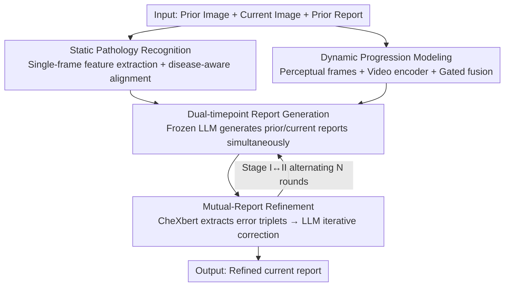

# TIM: Temporal Decoupling with Iterative Mutual-Refinement Model for Longitudinal Radiology Report Generation

**Conference**: CVPR 2026  
**Paper**: [CVF Open Access](https://openaccess.thecvf.com/content/CVPR2026/html/Dong_TIM_Temporal_Decoupling_with_Iterative_Mutual-Refinement_Model_for_Longitudinal_Radiology_CVPR_2026_paper.html)  
**Code**: https://github.com/yihengd/TIM  
**Area**: Medical Imaging / Radiology Report Generation  
**Keywords**: Longitudinal Report Generation, Temporal Decoupling, Dynamic Progression Modeling, Mutual-Refinement, Chest X-ray

## TL;DR
TIM decomposes longitudinal radiology report generation into two decoupled branches: "Static Pathology Recognition" and "Dynamic Progression Modeling." It further employs an iterative refinement stage where previous and current reports perform mutual error correction, setting a new SOTA for both linguistic and clinical metrics on the Longitudinal-MIMIC dataset.

## Background & Motivation
**Background**: Radiology Report Generation (RRG) aims to translate medical images into diagnostic text, reducing the workload of radiologists and standardizing terminology. Recent vision-language models have achieved high performance in report generation for single chest X-ray images.

**Limitations of Prior Work**: In clinical practice, radiologists almost always compare the current film with a patient's previous ones to determine if lesions have enlarged, improved, or if new abnormalities have appeared. However, most RRG methods focus on a single time point. Generated reports often suffer from temporal inconsistencies or fail to match the patient's actual disease course. While recent Longitudinal RRG (LRRG) methods introduce historical images and reports, they typically squeeze images from different time points into the same representation space.

**Key Challenge**: In LRRG tasks, two fundamentally different processes are forcibly bundled together: **pathology recognition**, which focuses on the spatial localization of diseases in a single image (e.g., a specific lung opacity), and **progression modeling**, which focuses on temporal changes across images (e.g., worsening or improvement during the interval). Mixing these in a single representation network causes interference between static lesion cues and temporal evolution features, blurring semantics and limiting temporal reasoning. Furthermore, existing methods treat report generation as a one-pass forward process, ignoring the mutual dependence between previous and current reports. Errors in previous reports could provide cues for correcting the current report, while refining the current report can conversely expose omissions in the previous one—resulting in models repeatedly making the same errors across multiple visits.

**Goal**: (1) Explicitly decouple spatial pathology from temporal progression to learn clean representations for each; (2) Allow reports from two consecutive time points to refer to each other for iterative error correction.

**Key Insight**: The authors observed that approximately 70% of errors in previous reports are reproduced in current reports due to "temporal consistency." Consequently, correcting errors in the previous report can pre-emptively block similar errors in the current one.

**Core Idea**: Use a "divide and conquer" strategy to separate static/dynamic representations, and utilize a bidirectional mutual-correction loop between "prior $\leftrightarrow$ current" reports to suppress temporal error propagation.

## Method

### Overall Architecture
TIM is a two-stage framework. The inputs are a pair of chest X-rays from the same patient at two time points $\{I_p, I_c\}$ and the prior report $R_p$. The goal is to generate an accurate current report $\hat{R}_c$. **Stage I (Temporal Decoupled Representation Learning)** splits visual representations into a static pathology recognition branch and a dynamic progression modeling branch. The former extracts disease-related features from single images, while the latter extracts progression features from image pairs. A frozen LLM then generates both the prior and current reports simultaneously. **Stage II (Mutual-Report Refinement)** first uses CheXbert to compare the generated prior report with its ground truth, extracting diagnostic errors as error triplets to feed back into the LLM for iterative refinement of the current report. During inference, Stage I and Stage II alternate to form a closed loop.

### Key Designs

**1. Static Pathology Recognition Branch: Aligning Visual Features with Disease Semantics**

To address the issue of lesion cues being contaminated by temporal features, this branch focuses solely on disease-related representations from single images. Given an image $I^*$, the image encoder extracts patch embeddings which are linearly projected into pathology features $f^*_i = W_{img}E_{img}(I^*)$. To ensure these features carry clinical semantics, the authors use CheXbert to label reports across 14 disease categories {not mentioned/positive/negative/uncertain}. They then use external medical knowledge (UMLS, PubMed) to expand each mentioned disease into a short clinical description, forming a disease text sequence $T^*_{dis}$, which is encoded into $f^*_{t,dis}$. Contrastive learning is used to pull image features toward corresponding disease text features:

$$L^*_{spr} = -\log \frac{\exp(\mathrm{sim}(f^*_i, f^*_{t,dis})/\tau)}{\sum_j \exp(\mathrm{sim}(f^*_i, f^{*,j}_{t,dis})/\tau)}$$

where $\mathrm{sim}$ is cosine similarity and $\tau$ is the temperature. This anchors pathology features in a "disease-language" space, making them more clinically relevant than pure visual features.

**2. Dynamic Progression Modeling Branch: Capturing Temporal Evolution via Perceptual Frames + Video Encoder**

This branch specifically captures evolution between two examinations using the spatio-temporal modeling capabilities of a video encoder. The authors introduce a set of **learnable, randomly initialized perceptual frames** $\{Q_1, Q_2\}$ (the quantity was determined as 2 via experiments). These have the same resolution as the chest X-rays, are independently parameterized, and are inserted between the prior and current images to form a short video sequence $[I_p; Q_1; Q_2; I_c]$. This sequence is fed into a video encoder $E_{vid}$ to output intermediate frame features $\{H_1, H_2\}$. A gated module adaptively fuses them:

$$H_g = \alpha \odot H_1 + (1-\alpha) \odot H_2, \quad \alpha = \sigma(W_g[H_1; H_2])$$

The fusion result is projected into progression features $f_{pro}$ and aligned via contrastive learning ($L_{dpm}$) with text embeddings $f_{t,pro}$ extracted from "progression-related report sentences." This alignment forces the model to focus on actual pathological evolution rather than irrelevant imaging differences like posture changes.

**3. Dual-timepoint Report Generation: Improving Progression Representations via Bidirectional Reconstruction**

Addressing the weakness that unidirectional generation is suboptimal for learning progression, Stage I predicts both the current and the prior reports using a frozen LLM: $\hat{R}^* = \mathrm{LLM}(f^*_i, f_{pro}, R_{ref}, P^*)$, where $R_{ref}$ is the reference report from the opposite time point (using $R_p$ to generate the current report, and $R_c$ to generate the prior), and $P^*$ is the temporal text prompt. This bidirectional inference—inferring the current from progression and reconstructing the prior from progression—forces the progression representation to encode disease evolution more accurately and consistently over time. The total objective for Stage I is $L_{stage1} = L^c_{gen} + L^p_{gen} + \lambda_1(L^c_{spr} + L^p_{spr}) + \lambda_2 L_{dpm}$.

**4. Mutual-Report Refinement: Using Prior Report Errors as Correction Signals for the Current Report**

Leveraging the observation that ~70% of prior report errors recur in current ones, Stage II compares the generated prior report $\hat{R}^{p,(0)}$ with the ground truth via CheXbert to obtain error triplets $D^{(0)}=\{(d_k, z^p_k, \hat{z}^{p,(0)}_k)\}$ (disease, ground truth label, predicted label). These are encoded into a vector $u^{(0)}$ by a triplet encoder $E_{tri}$. Simultaneously, a semantic aggregator $\Gamma$ compresses the initial current report into a compact descriptor $s^{(0)}$. Both are sent to the LLM along with current pathology features $f^c_i$ and a prompt $P_{rf}$ for the second round of generation $\hat{R}^{c,(1)}$. To ensure refinement yields improvement, a similarity refinement loss is introduced:

$$L_\Delta = -\log \sigma\!\big(\beta[s(\hat{R}^{c,(1)}, R_c) - s(\hat{R}^{c,(0)}, R_c)]\big)$$

This forces the second-round report to be closer to the ground truth than the first. Stage II only trains the semantic aggregator and triplet encoder, while Stage I is frozen. During inference, Stage I (generation) $\leftrightarrow$ Stage II (correction) alternates for $N=3$ rounds, converging as the prior and current reports reference each other.

### Loss & Training
Stage I is trained for 3 epochs with a batch size of 4, using Adam with a learning rate of $1\times10^{-4}$ and coefficients $\lambda_1=0.5, \lambda_2=0.1$. Stage II freezes Stage I and trains the semantic aggregator and triplet encoder for 1 epoch with a learning rate of $5\times10^{-5}$, $\lambda_\Delta=0.1$, and $\beta=5$. The image encoder uses Swin Transformer, the video encoder uses the visual branch of X-CLIP, the text encoder uses the CLIP text branch, and the LLM is a frozen LLaMA2-7B. Progression descriptions are extracted offline from reports using Qwen3-plus.

## Key Experimental Results

### Main Results
The dataset is Longitudinal-MIMIC (derived from MIMIC-CXR, consisting of 26,156 patients / 92,374 training samples, 2,058 test samples; each sample is a quadruplet of {prior image, prior report, current image, current report}). NLG metrics include BLEU-n / METEOR / ROUGE-L, while clinical efficacy (CE) metrics use precision/recall/F1 after mapping to 14 disease categories via CheXbert.

| Input | Method | B-1 | B-4 | MTR | R-L | F1 |
|------|------|-----|-----|-----|-----|-----|
| Single | RADAR (ACL'25) | 0.412 | 0.114 | 0.155 | 0.257 | 0.417 |
| Single | GMoD (MICCAI'24) | 0.378 | 0.107 | 0.162 | 0.276 | 0.460 |
| Longitudinal | MLRG (CVPR'25) | 0.416 | 0.114 | 0.158 | 0.264 | 0.418 |
| Longitudinal | Diff-RRG (MICCAI'25) | 0.405 | 0.120 | 0.164 | 0.276 | 0.474 |
| Longitudinal | **TIM-Stage I** | 0.421 | 0.118 | 0.172 | 0.275 | 0.483 |
| Longitudinal | **TIM-Stage II** | **0.430** | **0.124** | **0.185** | **0.287** | **0.511** |

TIM achieves a new SOTA across all metrics. Compared to the strongest longitudinal baseline Diff-RRG, it improves B-1 by +0.025, R-L by +0.011, and F1 by +0.037. It also significantly outperforms single-image baselines in F1.

### Ablation Study
Incremental addition of Stage I components (F1 perspective):

| Configuration | B-4 | F1 | Description |
|------|-----|-----|------|
| Base | 0.108 | 0.404 | Only current image, only current report |
| + DPM | 0.110 | 0.427 | Adds dynamic progression modeling branch |
| + DRG | 0.114 | 0.446 | Adds dual-timepoint report generation |
| + $L_{spr}$ | 0.117 | 0.460 | Adds static pathology semantic alignment |
| Full (e) | 0.118 | 0.483 | Adds $L_{dpm}$, all modules included |

### Key Findings
- **Decoupled branches are crucial**: Moving from Base to adding the DPM branch increases F1 by 2.3 points (0.404 $\rightarrow$ 0.427), proving that modeling temporal evolution separately is vital for disease course understanding.
- **Dual-timepoint generation significantly boosts performance**: DRG raises B-4/F1 to 0.114/0.446, confirming that bidirectional reconstruction forces more consistent temporal semantics.
- **Stage II provides further gains**: From Stage I to Stage II, F1 increases by another 2.8 points (0.483 $\rightarrow$ 0.511), indicating that the mutual-correction loop effectively suppresses residual diagnostic errors.
- **Hyperparameters**: The number of perceptual frames is optimal at 2, and refinement iterations are optimal at 3.

## Highlights & Insights
- **Natural application of "Divide and Conquer"**: Explicitly splitting the two essential sub-tasks of LRRG (spatial pathology vs. temporal progression) is an intuitive and experimentally validated design that prevents semantic contamination.
- **Perceptual frames + Video encoder for progression**: Inserting learnable frames between two static images to create a "short video" leverages existing spatio-temporally capable video encoders. This is a clever adaptation that handles imaging noise better than simple feature differences.
- **"Prior error correction for current refinement" loop**: By exploiting the statistical fact that 70% of prior errors recur, TIM uses prior errors as preventive correction signals. This logic is transferable to any sequence generation task where historical outputs predict current output errors.

## Limitations & Future Work
- Validation is limited to Longitudinal-MIMIC (chest X-rays); generalization to other modalities/parts (CT, MRI) is unknown.
- Alternating Stage I $\leftrightarrow$ II for 3 rounds during inference with a 7B LLM incurs significant computational overhead, which might limit real-time clinical use.
- Refinement relies on 14 CheXbert disease labels; fine-grained abnormalities outside this system cannot be corrected. Progression description extraction also requires an offline Qwen3-plus step, adding complexity to the pipeline.
- The "dual-timepoint" approach only models two consecutive visits; extending this to longer visit sequences has not been discussed.

## Related Work & Insights
- **vs. HC-LLM / Diff-RRG (Longitudinal RRG)**: While these utilize historical images/reports, they mix static and temporal representations in the same space. TIM's explicit decoupling of the two branches avoids feature interference, leading to a 0.037 F1 lead.
- **vs. Traditional Self-Refinement RRG**: Conventional self-refinement lacks clear, clinically interpretable feedback. TIM uses CheXbert error triplets to provide explicit signals on "which disease was mislabeled," leading to more substantive clinical accuracy improvements.
- **vs. HERGen / MLRG (Longitudinal Inputs)**: While these also process multiple visits, TIM uniquely adds bidirectional report generation and a mutual-correction loop to specifically target temporal error propagation.

## Rating
- Novelty: ⭐⭐⭐⭐ The combination of decoupled dual-branches and a mutual-refinement loop is novel, though individual components (contrastive alignment, video encoding, self-refinement) have established roots.
- Experimental Thoroughness: ⭐⭐⭐⭐ Main experiments are comprehensive and the two-stage ablation is clear, though it is only validated on a single dataset/modality.
- Writing Quality: ⭐⭐⭐⭐ The motivation is progressively argued, and the method/algorithm descriptions are clear.
- Value: ⭐⭐⭐⭐ Longitudinal report generation is a genuine clinical need; the SOTA results and transferable logic are valuable.

<!-- RELATED:START -->

## Related Papers

- [\[CVPR 2026\] Personalized Longitudinal Medical Report Generation via Temporally-Aware Federated Adaptation](personalized_longitudinal_medical_report_generation_via_temporally-aware_federat.md)
- [\[CVPR 2026\] BiOTPrompt: Bidirectional Optimal Transport Guided Prompting for Disease Evolution-aware Radiology Report Generation](biotprompt_bidirectional_optimal_transport_guided_prompting_for_disease_evolutio.md)
- [\[CVPR 2026\] SAT-RRG: LLM-Guided Self-Adaptive Training for Radiology Report Generation with Token-Level Push–Pull Optimization](sat-rrg_llm-guided_self-adaptive_training_for_radiology_report_generation_with_t.md)
- [\[CVPR 2026\] OraPO: Oracle-educated Reinforcement Learning for Data-efficient and Factual Radiology Report Generation](orapo_oracle-educated_reinforcement_learning_for_data-efficient_and_factual_radi.md)
- [\[ICLR 2026\] Rethinking Radiology Report Generation: From Narrative Flow to Topic-Guided Findings](../../ICLR2026/medical_imaging/rethinking_radiology_report_generation_from_narrative_flow_to_topic-guided_findi.md)

<!-- RELATED:END -->
