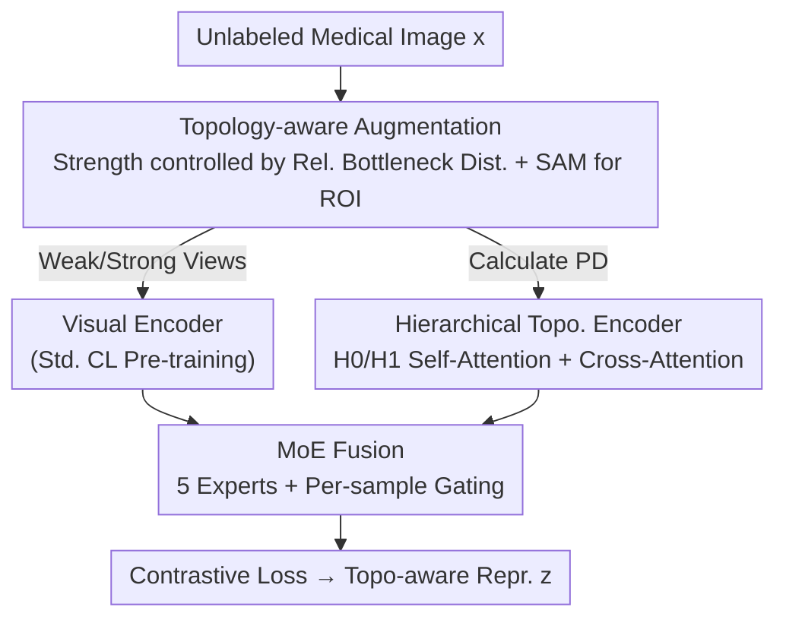

# TopoCL: Topological Contrastive Learning for Medical Imaging

**Conference**: CVPR 2026  
**Paper**: [CVF Open Access](https://openaccess.thecvf.com/content/CVPR2026/html/Meng_TopoCL_Topological_Contrastive_Learning_for_Medical_Imaging_CVPR_2026_paper.html)  
**Code**: https://github.com/gm3g11/TopoCL  
**Area**: Medical Imaging / Self-supervised Representation Learning  
**Keywords**: Contrastive Learning, Persistent Homology, Topology-aware Augmentation, Mixture-of-Experts Fusion, Medical Image Classification

## TL;DR
TopoCL introduces "topology" to standard contrastive learning (CL). It designs controllable topology-aware augmentations using relative bottleneck distance, encodes persistent homology diagrams into features via a hierarchical topological encoder, and adaptively fuses visual and topological representations using a Mixture-of-Experts (MoE) module. It serves as a plug-and-play enhancement for SimCLR/MoCo-v3/BYOL/DINO/Barlow Twins, achieving an average linear probing accuracy gain of 3.26% across five medical datasets.

## Background & Motivation
**Background**: Annotating medical images is expensive and requires expert knowledge. Consequently, self-supervised methods like contrastive learning (CL) are highly favored—learning representations on large unlabeled datasets before fine-tuning on downstream tasks with few labels. Representative methods such as SimCLR, MoCo-v3, BYOL, DINO, and Barlow Twins excel at learning local appearance features like texture, intensity, and color through contrastive losses, momentum encoders, or self-distillation.

**Limitations of Prior Work**: These methods essentially operate on pixel-level semantics without **explicitly encoding topological structures**—such as connectivity, holes, and boundary morphology—which are critical cues for medical diagnosis. Figure 1 of the paper provides an intuitive example: two cases of dermatofibroma (DF) are misclassified by the MoCo-v3 baseline as actinic keratosis and melanocytic nevus due to "appearance similarity." However, their boundary morphology and internal connectivity (topological differences) are distinct, and TopoCL correctly classifies them by capturing these features.

**Key Challenge**: Data augmentations in standard CL (random cropping, color jittering, Gaussian blur) are designed to "preserve appearance," but their impact on topological structure is uncontrolled—potentially destroying diagnostically relevant boundaries or connections. Furthermore, even if one intends to use topology, the Persistence Diagrams (PD) produced by persistent homology are unordered sets of birth-death points, making their encoding and fusion with visual features an open problem.

**Goal**: (1) Design **quantifiable and controllable** topology-perturbing augmentations; (2) Encode PDs into representations compatible with contrastive learning; (3) Adaptively fuse visual and topological features.

**Key Insight**: Persistent Homology (PH) ensures through the stability theorem that "augmentations of bounded intensity lead to bounded changes in the PD." Thus, the bottleneck distance between PDs can be used to measure and control the topological strength of an augmentation.

**Core Idea**: Explicitly augment contrastive learning with topology—topology-aware augmentation protects structures, a hierarchical topological encoder reads PDs, and an MoE adaptively fuses vision and topology on a per-sample basis.

## Method

### Overall Architecture
TopoCL adopts a "pre-train separately, then joint fine-tune" strategy, which can be integrated into any base CL method $M$. Given an unlabeled medical image $x$, topology-aware augmentation first generates weak and strong views $x^w_{topo}, x^s_{topo}$ and calculates their respective persistence diagrams $\mathrm{topo}^w, \mathrm{topo}^s$. A visual encoder processes the images, while a Hierarchical Topological Encoder (H-Topo. Encoder) processes the PDs. Both output features ($f^{w/s}$ and $t^{w/s}$) through projection heads. These are fed into the TopoCL MoE module, where five experts and a gating mechanism fuse them into $h^{w/s}$. Finally, they are mapped to the final representation $z^{w/s}$ via a projection head and optimized using the base CL loss $L_M$. The encoders are initially pre-trained independently with contrastive objectives before joint fine-tuning to align the feature spaces.

### Key Designs

**1. Topology-aware Augmentation: Quantifying "Topological Strength" via Relative Bottleneck Distance**

Standard CL augmentations have an uncontrolled impact on topology. The authors define **Relative Bottleneck Distance** to quantify topological changes:

$$d_B^{\text{rel}}(\mathcal{A}, x) = \frac{d_B(\mathrm{PD}(x), \mathrm{PD}(\mathcal{A}(x)))}{\mathrm{span}(\mathrm{PD}(x))}$$

where $d_B$ is the bottleneck distance between two PDs, and the denominator $\mathrm{span}(\mathrm{PD}(x))=\max |d-b|$ normalizes the value for cross-image comparison ($b, d$ are birth and death timestamps). Three engineering details make this practical: (1) **PD is calculated only on the ROI** using SAM to filter background noise; (2) Augmentations are categorized (homeomorphic like flips/rotations, boundary perturbations, smoothing, intensity, and morphology), and their intensities are scanned to confirm correlation with $d_B^{\text{rel}}$; (3) Optimal intervals are determined via linear probing—**topologically weak augmentation uses $d_B^{\text{rel}}\in[5\%,15\%]$ and strong uses $[15\%,25\%]$**.

**2. Hierarchical Topological Encoder: Encoding Unordered PDs with Geometric Dependencies**

PDs are unordered sets, and PH produces two types of geometric semantics—$H_0$ (connected components) and $H_1$ (holes), which possess geometric dependencies (holes are surrounded by components). A PointNet-like PH Encoder handles permutation invariance by selecting top-$k$ features ($k_{H_0}=48, k_{H_1}=96$). Each birth-death pair $(b_i, d_i)$ is concatenated with a one-hot identifier and encoded into $h_0, h_1$. **Hierarchical Attention** is then applied: first, self-attention within each homology dimension distinguishes feature importance, followed by **bidirectional cross-attention** to model dependencies between $H_0$ (query) and $H_1$ (key/value), capturing relationships like "holes contained within components."

**3. Mixture-of-Experts Fusion: Sample-adaptive Trade-off Between Visual and Topological Signals**

Static fusion strategies (concatenation, gating) assume a single strategy is optimal for all samples. However, medical image heterogeneity means some samples (e.g., pigment patterns in dermoscopy) are appearance-driven, while others (e.g., gland connectivity in pathology) are topology-driven. The authors design **five complementary experts**: $e_1$ visual only, $e_2$ topology only, $e_3$ concatenation, $e_4$ gated mixture, and $e_5$ bidirectional cross-attention. A multi-gating network takes $[f; t]$ to produce normalized weights $\mathrm{gate}=\mathrm{softmax}(\cdot)\in\mathbb{R}^5$, and the fused representation is the weighted sum $h=\sum \mathrm{gate}_i\cdot e_i$.

### Loss & Training
Visual and topological encoders are **independently** pre-trained using the base CL loss $L_M$ (visual with standard augmentation, topology with topology-aware augmentation). Subsequently, the MoE is attached, and all parameters are jointly fine-tuned using $L_M$ to align feature spaces. Pre-processing uses SAM-ViT-H for ROI and GUDHI for PD calculation (top-48 $H_0$, top-96 $H_1$). Training uses 8 H100 GPUs, batch size 256, AdamW ($3\times10^{-4}$), and cosine annealing for 150 epochs with ResNet-50 backbones.

## Key Experimental Results

### Main Results
On five medical classification datasets (PathMNIST, OCTMNIST, OrganSMNIST, ISIC2019, Kvasir), TopoCL was integrated into five CL methods. Performance was evaluated using linear probing (frozen encoder + linear classifier) for ACC and Macro-AUC.

| Base Method | Avg. ACC | +TopoCL ACC | ACC Gain |
|-------------|----------|-------------|----------|
| SimCLR      | 75.89    | 79.03       | +3.14    |
| MoCo-v3     | 82.91    | 85.37       | +2.46    |
| BYOL        | 81.07    | 83.91       | +2.84    |
| DINO        | 71.78    | 76.38       | **+4.60**|
| Barlow Twins| 76.81    | 80.08       | +3.27    |

**All** base methods improved, with an average gain of +3.26% ACC and +0.90% AUC. Statistical significance was strong (86% of dataset-metric comparisons reached $p<0.05$). DINO showed the largest gain (+4.60% ACC).

### Ablation Study
Augmentation configuration ablation (MoCo-v3+TopoCL, ACC%):

| Configuration | OrganS | ISIC | Kvasir |
|---------------|--------|------|--------|
| Weak+Strong (Standard Visual) | 75.51  | 72.92| 84.63  |
| Full Image (PD on full image) | 76.34  | 74.35| 87.41  |
| Topo-weak+Topo-weak           | 78.98  | 76.39| 90.01  |
| Topo-strong+Topo-strong       | 78.02  | 75.99| 89.64  |
| **topo-weak+topo-strong**     | **80.58**| **78.44**| **91.17**|

### Key Findings
- **ROI + Hybrid Augmentation is Critical**: Calculating PD on SAM-cropped ROIs and using "weak+strong" topology-aware augmentation pairs significantly outperformed full-image PD or symmetric pairs, confirming that background artifacts contaminate topological measures.
- **Independent Pre-training is Essential**: Removing pre-training caused performance to collapse (OrganS 78→50.61), proving that pre-training visual and topological encoders separately before fusion is indispensable.
- **Hierarchical Attention Works**: Removing hierarchical or cross-attention resulted in performance drops, indicating that distinguishing importance within $H_0/H_1$ and modeling inter-dimension geometric dependencies are both beneficial.

## Highlights & Insights
- **Turning "Augmentation Intensity" into a Quantifiable Knob**: Using the stability theorem and relative bottleneck distance transforms "how much an augmentation alters topology" from a heuristic into a controllable value (0-25%). This "measure then control" strategy is transferable to other self-supervised tasks.
- **First Vision-Topology MoE Fusion**: By using five complementary experts and per-sample gating, the model decides whether to trust visual or topological signals, better accommodating the heterogeneity of medical images compared to fixed fusion.
- **Topology-respecting Encoder**: Rather than treating PDs as generic point sets, the model explicitly distinguishes between $H_0$ and $H_1$, weaving domain priors like "holes are contained by components" into the network architecture via cross-attention.

## Limitations & Future Work
- Dependency on SAM for ROI and GUDHI for PD calculation introduces additional offline pre-processing, and PD calculation can be expensive for large or 3D volumes.
- Evaluation was limited to 2D medical classification (ResNet-50, 224×224). The transferability to 3D data or dense prediction tasks (segmentation/detection) is unknown.
- A trade-off (ACC↑ but AUC↓) appeared in near-saturated scenarios (e.g., MoCo-v3 on OrganS), suggesting topological features are not a universal gain.
- The optimal intervals for weak/strong augmentations were determined empirically; whether these are dataset-dependent requires more discussion.

## Related Work & Insights
- **vs. Standard CL**: Traditional CL learns local appearance and uses appearance-preserving augmentations; TopoCL explicitly supplements topology as a general augmentation scheme.
- **vs. Traditional TDA (PersLay / PHG-Net)**: Previous works often used topology as an auxiliary loss or in supervised settings; TopoCL integrates PH into self-supervised CL and models $H_0$-$H_1$ relations.
- **vs. Fixed Feature Fusion**: Static strategies assume one rule fits all; TopoCL uses MoE for sample-adaptive fusion, a first for vision-topology integration.

## Rating
- Novelty: ⭐⭐⭐⭐⭐ Systematically integrating PH into CL with controllable augmentation and MoE is highly original.
- Experimental Thoroughness: ⭐⭐⭐⭐ Solid results across 5 methods and 5 datasets, though limited to 2D classification.
- Writing Quality: ⭐⭐⭐⭐ Clear decomposition of the three main challenges and well-presented methodology.
- Value: ⭐⭐⭐⭐ High practical utility in medical self-supervised scenarios as a plug-and-play solution.

<!-- RELATED:START -->

## Related Papers

- [\[CVPR 2026\] Anatomica: Localized Control over Geometric and Topological Properties for Anatomical Diffusion Models](anatomica_localized_control_over_geometric_and_topological_properties_for_anatom.md)
- [\[CVPR 2026\] OmniFM: Toward Modality-Robust and Task-Agnostic Federated Learning for Heterogeneous Medical Imaging](omnifm_toward_modality-robust_and_task-agnostic_federated_learning_for_heterogen.md)
- [\[CVPR 2026\] Contrastive Cross-Bag Augmentation for Multiple Instance Learning-based Whole Slide Image Classification](contrastive_cross-bag_augmentation_for_multiple_instance_learning-based_whole_sl.md)
- [\[CVPR 2026\] DK-DDIL: Adaptive Knowledge Retention for Dynamic Domain-Incremental Learning in Medical Imaging](dk-ddil_adaptive_knowledge_retention_for_dynamic_domain-incremental_learning_in_.md)
- [\[ECCV 2024\] Improving Medical Multi-modal Contrastive Learning with Expert Annotations](../../ECCV2024/medical_imaging/improving_medical_multi-modal_contrastive_learning_with_expert_annotations.md)

<!-- RELATED:END -->
