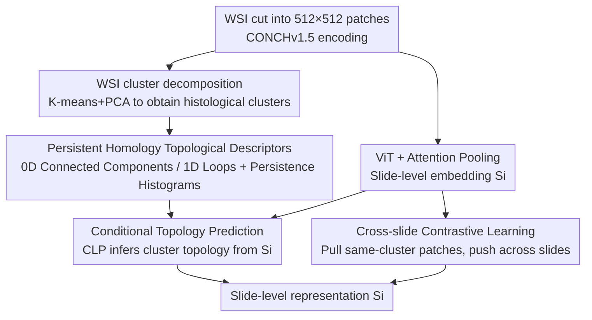

# TopoSlide: Topologically-Informed Histopathology Whole Slide Image Representation Learning

**Conference**: CVPR 2026  
**Paper**: [CVF Open Access](https://openaccess.thecvf.com/content/CVPR2026/html/Abousamra_TopoSlide_Topologically-Informed_Histopathology_Whole_Slide_Image_Representation_Learning_CVPR_2026_paper.html)  
**Code**: https://github.com/plevritis-lab/TopoSlide  
**Area**: Medical Imaging / Self-Supervised Representation Learning  
**Keywords**: Whole Slide Images, Persistent Homology, Topological Data Analysis, Self-supervised, Pathology Foundation Models

## TL;DR
TopoSlide incorporates the diagnostic logic of pathologists—"observing local tissues first, then analyzing global spatial arrangement"—into a self-supervised objective. It first clusters millions of patches into histological clusters, then encodes the spatial arrangement of each cluster into topological descriptors using persistent homology. Finally, a ViT is trained to infer these topologies from slide-level representations under a conditional multi-task objective. Trained on only a few hundred slides, TopoSlide outperforms foundation models trained on hundreds of thousands of slides by up to ~15% in Macro F1 for histological pattern retrieval.

## Background & Motivation
**Background**: Histopathology Whole Slide Images (WSIs) are "gigapixel" images reaching up to 100,000 × 100,000 pixels at 20× magnification. They cannot be fed into networks in their entirety. The mainstream approach is to partition them into thousands of patches, extract features using patch encoders (CONCH / Virchow / CTransPath / GigaPath-Tile), and then aggregate them into slide-level representations. Recent pathology foundation models (GigaPath, CHIEF, PRISM, TITAN) improve aggregation by performing masked reconstruction, vision-language alignment, or distillation on tens to hundreds of thousands of slides.

**Limitations of Prior Work**: Almost all these models focus on characterizing **local** patch features. During the aggregation stage, they use mean/max pooling or long-sequence attention, which **discards global spatial structures**. However, pathologists heavily rely on the "spatial arrangement of different tissue regions" for diagnosis—the spatial relationships between tumor-rich areas, immune infiltration zones, and stroma are directly related to disease progression and prognosis.

**Key Challenge**: There is a fundamental gap between how pathologists interpret tissue structures (identifying histological patterns first, then analyzing their spatial organization) and how current computational methods process them (focusing only on local features while ignoring global topology). Standard aggregation operators cannot encode high-order organizational structures, such as "whether regions are clustered or multifocal" or "whether immune cells are infiltrating the tumor or excluded at the boundary," into representations.

**Goal**: This work aims to explicitly inject **global topological understanding** into self-supervised representation learning, allowing slide-level representations to encode both local histological features and global spatial organization without relying on massive amounts of data.

**Key Insight**: The authors leverage **persistent homology** from Topological Data Analysis (TDA). It quantitatively characterizes the spatial organization of point sets using "connected components (0D)" and "loops/holes (1D)" along with their persistence. Viewing the spatial distribution of each histological cluster's patches as a point cloud corresponds directly to pathological structures: "solid tumor masses vs. multifocal dissipation," "large loops formed by central necrosis/immune barriers," or "small loops formed by glandular structures."

**Core Idea**: Decompose the WSI into histological clusters $\rightarrow$ Encode the spatial arrangement of each cluster into topological descriptors using persistent homology $\rightarrow$ Train a ViT to learn under a conditional multi-task objective of "predicting a cluster's topology given a sampled patch from that cluster." Topology serves as a strong inductive bias to compress global spatial structures into slide representations.

## Method

### Overall Architecture
TopoSlide is a three-stage self-supervised framework. Input is the set of all patch embeddings $P_i=\{p_{ij}\}$ of a WSI; output is a 768-dimensional slide-level representation $S_i=F(P_i)$. The representation is required to preserve local histological features while encoding global topological structures. The overall workflow consists of: clustering patch embeddings across all slides to obtain "histological clusters"; calculating persistent homology for the spatial point map of each cluster to obtain topological descriptors as self-supervised labels; and finally training a ViT to infer these topologies from slide-level embeddings conditioned on sampled patches, supplemented by cross-slide contrastive learning. Three types of losses jointly optimize the same ViT.

### Key Designs

**1. WSI Decomposition into Histological Clusters: Compressing millions of patches into interpretable regions**

Performing persistent homology directly on tens of thousands of patches is neither meaningful nor computationally feasible. The WSI must first be decomposed into "homogeneous regions." The authors use K-means (initialized with PCA) on patch embeddings. Crucially, **clustering is performed across the entire training set collectively**, rather than slide-by-slide. This prevents the emergence of "slide-specific clusters" that only hold for a single image or are too similar to each other. The resulting clusters were validated by a board-certified pathologist on approximately 450 random patches from TCGA-LUAD, confirming that each cluster corresponds to distinct histological patterns (solid tumor, glandular structures, immune-rich areas, stroma, etc.), showing high biological consistency. In the experiments, 7 clusters are fixed. This step transforms "topology over pixels" into "topology over histological semantic regions," forming the basis for subsequent self-supervised signals.

**2. Persistent Homology Topological Descriptors: Translating spatial arrangement into learnable labels**

This is the core of the method. For each cluster, the positions of its patches on the slide are plotted as a binary point map. Persistent homology is then applied: by continuously increasing the radii of circles centered at each point (the filtration process), the birth and death times of topological features are recorded. **Persistence** is defined as the Euclidean distance between birth and death coordinates; higher values indicate more significant or larger-scale structures. 0D topology (connected components) characterizes tumor burden and distribution—a single large component suggests focal growth, whereas multiple small components suggest multifocal/metastatic growth. 1D topology (loops/holes) characterizes tissue organization—large persistent loops often correspond to central necrosis or immune exclusion boundaries, while small loops correspond to ductal/glandular structures. The filtration function uses **distance-to-measure (DTM)**: $\mathrm{DTM}_k(x)=\frac{1}{k}\sum_{y\in N_x}\mathrm{dist}(x,y)$, where $N_x$ is the $k$-nearest neighbors of $x$. This is more robust to noise than traditional distance transforms. 0D topology is processed similarly on the inverse map. Finally, persistence diagrams are vectorized into normalized **persistence histograms** (each bin representing a persistence interval) to serve as multi-scale topological labels.

**3. Conditional Topology Prediction Framework (CLP + LEA): Learning "cluster-wise topology prediction" without explicit cluster labels**

The primary challenge is to enable the model to learn the "spatial organization of a specific tissue type" **without explicit cluster labels**. The authors use conditional prediction: given a patch sampled from a specific cluster, the model must predict that cluster's topology from the slide-level embedding $S_i$. This forces the model to both **identify which cluster is being queried** based on patch features and **predict the spatial organization of that cluster** from the slide embedding, thereby compressing local patterns and global structures into the representation. This is implemented using a specialized **CLP (Conditional Linear Prediction) module**, which includes a linear element-wise attention (LEA): $\mathrm{LEA}(S_i,p_{ij})=\mathrm{MHLP}(W_sS_i\,|\,W_pp_{ij})\odot\mathrm{MHLP}(W_sS_i)$, where $|$ denotes concatenation and $\odot$ denotes the Hadamard product, allowing attention to change dynamically with the conditional patch. The training objectives consist of two branches: Global Conditional Topology Loss $L_{\text{global-cond}}=\lambda_1 H(\hat v-v)+\lambda_2 H(\mathrm{Cumsum}(\hat v)-\mathrm{Cumsum}(v))$, using Huber loss $H$ for stability and a cumulative sum term acting as an "Earth Mover's Distance" across histogram bins; Local Topological Loss $L_{\text{local-topo}}=\lambda_3\sum \mathrm{BCE}(\hat y_{p_{ij}},y_{p_{ij}})+\lambda_4 H(\mathrm{pers}_{p_{ij}},\hat{\mathrm{pers}}_{p_{ij}})$, which requires the model to identify which patches are centers of topological components (death critical points) and regress their persistence.

**4. Cross-slide Contrastive Learning: Enhancing local representations via cluster homogeneity**

The authors observed that patches of the same cluster within a single slide are more homogeneous than those across different slides. To leverage this, a SimCLR-style contrastive loss with hard negative mining is used: $L_{\text{contrast}}(i,k)=-\lambda_5\frac{n}{C}\sum_c\sum_j\log\frac{\sum_m\exp(\hat p_{ij}\cdot\hat p_{im}/\tau)}{\sum_m\exp(\hat p_{ij}\cdot\hat p_{km}/\tau)}$. This pulls same-cluster patches within the same slide closer and pushes same-cluster patches from a negative slide $k$ further apart. Together with the two topological losses, this forms the total objective $L_{\text{TopoSlide}}=L_{\text{global-cond}}+L_{\text{local-topo}}+L_{\text{contrast}}$, ensuring that global topology is predictable while local patch representations remain highly discriminative.

### Loss & Training
All slides are partitioned into 512×512 patches at 20× magnification, with 768-dimensional embeddings extracted using pre-trained CONCHv1.5. Slide representations are of the same dimension (768). Clustering uses 7 clusters (K-means + PCA initialization). The ViT architecture has 8 layers and 12-head attention, trained using AdamW with cosine annealing. Models are self-supervisedly trained separately on TCGA-LUAD / CPTAC-LUAD / TCGA-BRCA / CPTAC-BRCA, supporting intra-slide and cross-cohort evaluations (e.g., train on TCGA-LUAD, test on CPTAC-LUAD). Hyperparameters $\lambda_{1..5}$ follow the original paper.

## Key Experimental Results

### Main Results
Evaluations were conducted on Lung Adenocarcinoma (LUAD: TCGA/CPTAC/DHMC) and Breast Cancer (BRCA: TCGA/CPTAC) cohorts across three types of clinical tasks: histological pattern retrieval, survival prediction, and driver gene mutation classification. The table below shows representative results for histological pattern retrieval on DHMC-LUAD (C=5, Majority Vote MV, Macro F1). Although TopoSlide is self-supervisedly trained only on a single LUAD cohort, it outperforms foundation models trained on 17–31 organs and tens to hundreds of thousands of slides:

| Slide Encoder | Training Data Scale | MV Bal.Acc (K=1) | MV Macro F1 (K=1) | MV Macro F1 (K=5) |
|--------|------|------|------|------|
| TITAN (VLM) | 340K slides, 20 organs | 45.60 | 44.74 | 42.91 |
| CHIEF (VLM) | 60K slides, 19 organs | 31.51 | 31.61 | 42.57 |
| PRISM (VLM) | ~90K slides, 17 organs | 38.00 | 38.37 | 37.49 |
| GigaPath (Vision) | Providence, 31 organs | 25.40 | 25.59 | 21.64 |
| **TopoSlide** (TCGA-LUAD) | Hundreds of slides, LUAD only | **52.49** | **51.39** | **49.62** |

> MV Macro F1 refers to the Macro-averaged F1 after K-Nearest Neighbor majority voting. TopoSlide exceeds the second-best TITAN by approximately 6.6 percentage points at K=1 (Macro F1 44.74→51.39), with a maximum improvement of ~15% in histological pattern retrieval reported in the paper.

The following table shows the reconstruction error (RMSE/MAE↓) for "cluster composition proportions" on DHMC-LUAD, measuring how well the representation preserves the WSI's composition information. TopoSlide achieves the lowest error even with single-cohort training:

| Slide Encoder | Training Scope | RMSE↓ (K=1) | MAE↓ (K=1) | RMSE↓ (K=5) |
|--------|------|------|------|------|
| CONCH (Mean Pool) | N/A | 7.13 | 4.58 | 8.82 |
| TITAN (VLM) | 20 organs | 8.88 | 5.39 | 10.26 |
| TITAN-V (Vision) | C-LUAD | 7.49 | 4.80 | 8.75 |
| **TopoSlide** | T-LUAD | **6.96** | **4.31** | **7.91** |

### Ablation Study
The paper does not provide a refined numerical table for each individual loss term in the main text (more analysis is in the supplementary material). However, qualitative conclusions regarding component utility are provided via design motivation:

| Configuration | Function | Description |
|------|---------|------|
| Full Model (Three Losses) | Complete | Joint topology + contrastive; optimal in both retrieval and reconstruction |
| Global Conditional Topology Loss only | Encodes global structure | Provides self-supervised signal for inferring cluster topology from slide representation |
| Local Topological Loss only | Connects global ↔ local | Identifies topological component centers and regresses persistence |
| Contrastive Loss only | Enhances local discrimination | Leverages intra-slide cluster homogeneity with hard negative mining |

### Key Findings
- **Topological inductive bias is extremely data-efficient**: TopoSlide outperforms foundation models trained on hundreds of thousands of slides using only a few hundred slides, demonstrating that global spatial constraints provided by persistent homology serve as a powerful and data-saving inductive bias.
- **Cross-cancer generalization**: Topological constraints remain effective when extended from LUAD to BRCA, showing strong performance in biomarker prediction and survival analysis. This indicates that "tissue spatial arrangement" is a universal diagnostic signal across cancers.
- **Improved representation completeness**: The lowest composition reconstruction error indicates that topology-aware training not only enhances downstream metrics but also allows the slide representation itself to retain more WSI composition information, unlocking new capabilities like topology-based conditional retrieval.
- On survival and mutation prediction tasks, TopoSlide is "competitive" rather than dominant (e.g., TITAN achieves a higher C-index on CPTAC-LUAD PFI), suggesting that topological signals provide greater gains for morphology-related tasks.

## Highlights & Insights
- **Directly translating diagnostic cognitive processes into self-supervised objectives**: This is not just another pretext task, but an algorithmic implementation of the pathologist's workflow—"first identify histological patterns, then analyze spatial organization"—making it grounded and interpretable.
- **Persistent homology as "free supervision"**: Topological descriptors are calculated entirely from patch spatial distributions without manual labeling, yet they encode high-order spatial structures that mean pooling discards. This represents a reusable paradigm for transforming unlabeled WSIs into structural supervision signals.
- **Conditional prediction bypasses the lack of cluster labels**: The design of "sampling a patch as a condition to infer the corresponding cluster's topology" allows the model to learn cluster-organized representations without explicit cluster ID supervision. The linear attention of CLP/LEA also maintains scalability.
- The pipeline of "Clustering $\rightarrow$ Topological Descriptors $\rightarrow$ Conditional Multi-task Prediction" is transferable to other domains requiring global spatial structures (e.g., spatial omics, remote sensing, tissue/cell atlases), where local units and their global arrangement are both critical.

## Limitations & Future Work
- The number of clusters (7) and PCA initialization are fixed hyperparameters. The optimal number of clusters may vary across different cancer types or staining protocols; adaptive cluster counts are a natural direction for improvement.
- The computational overhead of persistent homology and DTM filtration is significant. Pre-processing time per slide is not quantified in the main text; scalability on larger cohorts needs attention.
- Evaluation focuses primarily on retrieval and a subset of clinical tasks. Performance in survival/mutation prediction is only "competitive," indicating limited gains for molecular tasks not directly linked to morphology.
- Topological labels depend on patch spatial locations and are sensitive to the clustering quality of the patch encoder (CONCH). Whether clusters and topologies remain biologically consistent upon upgrading encoders requires further validation.

## Related Work & Insights
- **vs. Pathology Foundation Models (GigaPath / CHIEF / PRISM / TITAN)**: These models rely on massive slide volumes + masked reconstruction/vision-language alignment/distillation for aggregation but remain focused on local features. TopoSlide explicitly introduces global topological constraints, matching or exceeding them with just hundreds of slides. Its strengths lie in data efficiency and spatial interpretability, while its weaknesses include dependence on clustering quality and lower gains on molecular tasks.
- **vs. Topologically Constrained Deep Learning (Persistent Homology losses in segmentation/diagnosis)**: Previous topological losses were mainly used for modeling and optimization at the **patch level**. This work is the first to elevate topological losses to the **global WSI scale**, characterizing inter-cluster spatial arrangements rather than intra-patch structures.
- **vs. Mean/Max Pooling Aggregation**: Traditional aggregation discards spatial information. TopoSlide uses attention pooling with topological supervision to encode "how regions are arranged" into the slide-level representation.

## Rating
- **Novelty**: ⭐⭐⭐⭐⭐ First to introduce global topological constraints into WSI representation learning, algorithmizing the pathology diagnostic workflow.
- **Experimental Thoroughness**: ⭐⭐⭐⭐ Multi-cohort, multi-cancer, and multi-task; however, the main text lacks a fine-grained loss ablation table, and gains in survival tasks are moderate.
- **Writing Quality**: ⭐⭐⭐⭐ Clear description of motivation and methodology; insightful biological interpretation of persistent homology.
- **Value**: ⭐⭐⭐⭐⭐ Data-efficient, interpretable, and enables topological conditional retrieval, offering direct clinical value for computational pathology.

<!-- RELATED:START -->

## Related Papers

- [\[CVPR 2026\] Turning Pre-Trained Vision Transformers into End-to-End Histopathology Whole Slide Image Models for Survival Prediction](turning_pre-trained_vision_transformers_into_end-to-end_histopathology_whole_sli.md)
- [\[CVPR 2026\] MLLM-HWSI: A Multimodal Large Language Model for Hierarchical Whole Slide Image Understanding](mllm-hwsi_a_multimodal_large_language_model_for_hierarchical_whole_slide_image_u.md)
- [\[CVPR 2026\] Contrastive Cross-Bag Augmentation for Multiple Instance Learning-based Whole Slide Image Classification](contrastive_cross-bag_augmentation_for_multiple_instance_learning-based_whole_sl.md)
- [\[CVPR 2026\] Act Like a Pathologist: Tissue-Aware Whole Slide Image Reasoning](act_like_a_pathologist_tissue-aware_whole_slide_image_reasoning.md)
- [\[CVPR 2026\] Universal-to-Specific: Dynamic Knowledge-Guided Multiple Instance Learning for Few-Shot Whole Slide Image Classification](universal-to-specific_dynamic_knowledge-guided_multiple_instance_learning_for_fe.md)

<!-- RELATED:END -->
