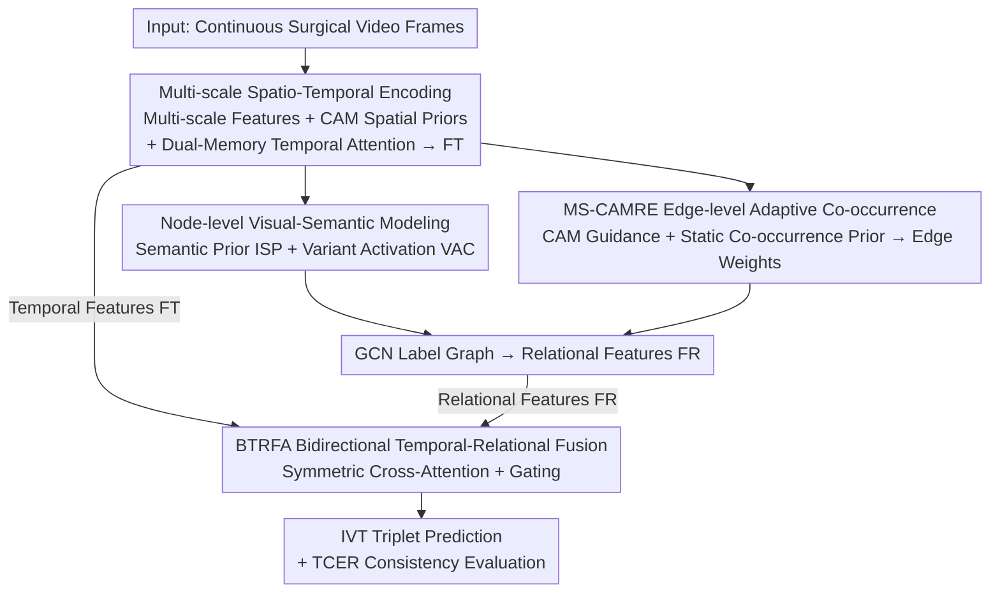

# TRCoRSurg: Temporal-Relational Co-Reasoning for Surgical Video Triplet Recognition

**Conference**: CVPR 2026  
**Paper**: [CVF Open Access](https://openaccess.thecvf.com/content/CVPR2026/html/Li_TRCoRSurg_Temporal-Relational_Co-Reasoning_for_Surgical_Video_Triplet_Recognition_CVPR_2026_paper.html)  
**Code**: https://github.com/Neesky/TRCoRSurg  
**Area**: Medical Imaging / Surgical Video Understanding  
**Keywords**: Surgical Triplet Recognition, Label Correlation, Temporal-Relational Co-Reasoning, Co-occurrence Prior, Consistency Evaluation

## TL;DR
TRCoRSurg decomposes surgical video `<instrument, verb, target>` triplet recognition into two streams: "intra-frame label dependency" and "inter-frame temporal semantics." It constructs a label graph using GCN (where nodes fuse semantic priors with CAM visual evidence, and edges are adaptively learned via MS-CAMRE) and utilizes a Bidirectional Temporal-Relational Fusion Attention (BTRFA) for mutual correction. It achieves APIVT improvements of 5.1%/7.8% on CholecT45/ProstaTD respectively and introduces the TCER metric to specifically measure triplet compositional consistency.

## Background & Motivation

**Background**: Fine-grained action recognition in surgical videos requires identifying "which instrument is performing what action on which tissue." Representing each surgical activity as an `<instrument, verb, target>` (IVT) triplet is currently the finest-grained understanding paradigm, supporting downstream applications such as intra-operative safety alerts, post-operative analysis, and surgical training. Mainstream approaches fall into two categories: attention/CAM-based models (e.g., RDV, Rendezvous), which learn instrument-verb-target association cues from visual features to provide coarse spatial priors; and GCN-based models, which build label dependencies using static word embeddings as nodes and co-occurrence matrices as edges.

**Limitations of Prior Work**: The authors point out two persistent unresolved issues. First, **insufficient intra-frame label dependency modeling**—IVT labels are strongly constrained by anatomical structures and surgical workflows (certain instruments and actions almost always appear together, as evidenced by the highly uneven co-occurrence matrix in Figure 1). However, graph-based methods use static co-occurrence and cannot adjust to semantic changes within a single frame. While CAM methods provide spatial cues, they lack explicit relational reasoning. Second, **temporal and relational reasoning are fragmented**—most works treat inter-frame temporal modeling and intra-frame label dependency learning as two independent modules; simple aggregation via addition or concatenation ignores complementary information and fails to capture fine-grained spatio-temporal dependencies.

**Key Challenge**: In surgical scenes, "correctly identifying an entity" and "correctly pairing entity combinations" are two different matters. A model might recognize grasper, grasp, and gallbladder, but pair them into a clinically illogical combination. Furthermore, temporal information (actions evolving coherently along a timeline) and relational information (labels constraining each other within the same frame) must be utilized simultaneously for mutual correction; either stream alone fails under occlusion or rapid movement.

**Goal**: To use a unified framework to simultaneously model intra-frame label dependencies and inter-frame temporal relations, ensuring they perform true "co-reasoning" rather than independent calculations, while introducing a metric to measure compositional consistency.

**Key Insight**: The authors decompose label correlation into **nodes** and **edges**. At the node level, stable textual semantic priors are fused with frame-varying CAM visual evidence. At the edge level, CAM-guided adaptive co-occurrence strengths are learned (rather than relying on static matrices). Finally, a bidirectional cross-attention gating module couples the temporal and relational streams for mutual modulation.

**Core Idea**: Replace "independent temporal/relational streams + simple fusion" with "Temporal-Relational Co-Reasoning via bidirectional gated fusion," supported by label graph modeling from both node (semantics + vision) and edge (adaptive co-occurrence) perspectives to address intra-frame dependencies.

## Method

### Overall Architecture
The input is continuous surgical video frames, and the output is the IVT triplet prediction for each frame. The pipeline consists of four components following a "spatio-temporal encoding → label relationship graph construction → temporal-relational fusion" workflow: (a) **Multi-scale Encoder** extracts hierarchical visual features, which are global average pooled into spatial descriptors while calculating CAMs for each triplet entity as spatial priors; (b) **Dual-Memory Temporal Attention** uses two circular buffers (semantic memory for the last $N$ spatial descriptors, decision memory for the last $N$ output logits) for cross-frame fusion to produce temporal features $F^T$; (c) **Label Correlation Modeling** constructs a graph via GCN where nodes fuse Intrinsic Semantic Priors (ISP) with Variant Activation Cues (VAC), and edges are adaptively learned via the MS-CAMRE module to produce relational features $F^R$; (d) **BTRFA Temporal-Relational Fusion** utilizes two symmetric cross-attention branches to exchange contexts between $F^T$ and $F^R$, followed by gated weighted fusion for final prediction. Additionally, the TCER metric is proposed to measure the compositional consistency of predicted triplets.

### Key Designs

**1. Multi-scale Spatio-Temporal Encoding + Dual-Memory Temporal Attention: Establishing Spatial Priors for Relational Reasoning and Temporal Coherence for Sequences**

To address the issues of temporal jitter in low-frame-rate surgical videos and the lack of spatial anchors in relational reasoning, this component performs two tasks simultaneously. Spatially: the encoder takes multi-scale feature maps $\{F_k\}$ ($k\in\{1,2,3\}$) from successive backbone stages—low levels capture texture while high levels capture semantics. The highest level $F\triangleq F_3$ is processed via GAP to obtain a compact spatial descriptor $d=\mathrm{GAP}(F)\in\mathbb{R}^D$ for multi-label prediction. Simultaneously, Class Activation Maps $\mathrm{CAM}_c=\sum_{i=1}^{D} w_{c,i}\,F_i$ are calculated for each label $c$, providing interpretable spatial evidence.

Temporally: Inspired by SAM2, a lightweight dual-memory attention is introduced. A **semantic memory** stores the last $N$ spatial descriptors, and a **decision memory** stores the last $N$ output logits. The current descriptor fuses with these memories via cross-attention to produce temporal features $F^T$. Compared to 3D convolutions or pure Transformers, explicitly maintaining "semantic history + decision history" maintains IVT prediction coherence when visual evidence is sparse. $N$ is set to 8.

**2. Node-level Visual-Semantic Modeling: Making Label Nodes both Semantically Stable and Frame-Dynamic**

To address the issue where static GloVe embeddings used in graph models fail to capture contextually changing relationships, each label node is split into two parts. One part is the **Intrinsic Semantic Prior** (ISP) $e_c$: class prompts $\mathrm{Prompt}(c)$ are fed into a pre-trained SigLIP text encoder and linearly projected: $e_c=\mathrm{Norm}(\mathrm{Proj}_e(\mathrm{SigLIP}_{\text{text}}(\mathrm{Prompt}(c))))$. The other part is the **Variant Activation Cue** (VAC) $v_{c,t}$: projecting the $\mathrm{CAM}_{c,t}$ of class $c$ at frame $t$: $v_{c,t}=\mathrm{Norm}(\mathrm{Proj}_v(\mathrm{CAM}_{c,t}))$. The final node $F^{\text{label}}_{c,t}=[e_c, v_{c,t}]$ encodes both label-level semantics and frame-level visual evidence.

**3. MS-CAMRE Edge-level Adaptive Co-occurrence Modeling: Learning Edges via CAM-Guidance Layered with Static Priors**

MS-CAMRE makes edge weights adaptively learnable. Given multi-scale feature maps $F^k$ and class CAMs, 1×1 convolutions align channels across scales. CAMs are used as queries to perform cross-attention over multi-scale features to extract hierarchical relationship information: $z_c^k=\mathrm{Attn}(Q=\mathrm{CAM}_c,\,K=F^k,\,V=F^k)$. Lightweight SE modules fuse cross-scale aggregations, and a **zero-initialized convolution** $z_c=\mathrm{Conv}_{\text{zero}}(\mathrm{SE\text{-}Fuse}(\{z_c^k\}))$ ensures dynamic edge weights are injected progressively and stably. Finally, the static co-occurrence matrix $M$ (Jaccard similarity) is added as a prior: adaptive edge weights $w_{ij}=\sigma(z_{c_i}^\top z_{c_j}+M_{c_i c_j})$. Relational features are then obtained: $F^R=\mathrm{GCN}(F^{\text{label}}, w)$.

**4. BTRFA Bidirectional Temporal-Relational Fusion: Co-evolving Temporal and Relational Streams**

Instead of sequential concatenation, BTRFA uses two **symmetric cross-attention** branches for mutual checking: $\hat{F}^T=\mathrm{Attn}(Q=F^T,K=F^R,V=F^R)$ and $\hat{F}^R=\mathrm{Attn}(Q=F^R,K=F^T,V=F^T)$. A learnable gate balances their contributions: $g=\sigma(\mathrm{FC}([\hat{F}^T,\hat{F}^R]))$, resulting in the fusion $\hat{F}=g\odot\hat{F}^T+(1-g)\odot\hat{F}^R$. This allows the temporal branch to maintain semantic consistency while the relational branch imposes context regularization.

**5. TCER Consistency Evaluation Metric: Exposing "Correct Entities, Incorrect Combination" Failures**

Traditional metrics focus on entity-level or triplet-level accuracy but overlook "compositional inconsistency." The authors propose Triplet Consistency Error Rate (TCER). Within frames where all marginal components are predicted correctly ($N_{\text{marginal}}$), it measures two types of errors: $\mathrm{TCER}_m=N_{\text{mis-match}}/N_{\text{marginal}}$ (entities are correct but mismatched across triplets) and $\mathrm{TCER}_c=N_{\text{mis-class}}/N_{\text{marginal}}$ (triplets containing elements not present in the ground truth entity set).

### Loss & Training
Two-stage training is employed. Phase 1 trains the spatial encoder: $\mathcal{L}_1=\mathcal{L}_S$. Phase 2 jointly trains the remaining modules: $\mathcal{L}_2=\mathcal{L}_T+\mathcal{L}_R+\mathcal{L}_{\text{BTRFA}}$. Each $\mathcal{L}$ consists of a direct classification loss $\mathcal{L}_{\text{entity}}=\sum_{c\in\mathcal{C}}\mathrm{BCE}(\hat{y}_c,y_c)$ and a coupling loss $\mathcal{L}_{\text{couple}}$, where atomic label probabilities are derived from the maximum values of triplets containing them: $\hat{P}_a^k=\max_{c\in\mathcal{C},\,c\ni(k,a)}\hat{y}_c$.

## Key Experimental Results

### Main Results
Evaluated on CholecT45 (45 laparoscopy videos, 1 fps) and ProstaTD (21 robotic prostatectomy videos). Primary metric is APIVT (Higher is better), while TCER is Lower is better.

| Dataset | Method | APIVT↑ | API↑ | APV↑ | APT↑ | TCERm↓ | TCERc↓ |
|--------|------|--------|------|------|------|--------|--------|
| CholecT45 | RDV [15] | 29.9 | 92.0 | 60.7 | 38.3 | 7.20 | 3.10 |
| CholecT45 | MT4MTLKD [6] | 37.1 | 93.1 | 71.8 | 48.8 | 6.50 | 2.46 |
| CholecT45 | TERL [5] | 38.9 | 93.5 | 72.8 | 51.3 | – | – |
| CholecT45 | **Ours** | **40.9** | **95.7** | **73.6** | 51.1 | **4.16** | **2.09** |
| ProstaTD | MT4MTLKD [6] | 35.2 | 84.1 | 65.3 | 60.2 | 17.70 | 4.90 |
| ProstaTD | **Ours** | **37.5** | **88.0** | **65.9** | **61.7** | **13.20** | **4.70** |

On CholecT45, APIVT improved from 38.9 to 40.9 (+5.1% Gain), and TCERm decreased from 6.50 to 4.16 (~36% reduction).

### Ablation Study

| Config | APIVT↑ | TCERm↓ | TCERc↓ | Description |
|------|--------|--------|--------|------|
| LCM Baseline | 38.4 | 6.42 | 2.68 | Static co-occurrence prior only |
| + VAC | 39.2 | 5.70 | 2.25 | Add node variant activation cues |
| + MS-CAMRE | 38.7 | 6.24 | 2.33 | Add edge adaptive co-occurrence |
| **Full (VAC+MS-CAMRE)** | **40.9** | **4.16** | **2.09** | Synergy of both |
| **BTRFA** | **40.9** | **4.16** | **2.09** | Bidirectional gated fusion |

### Key Findings
- **Synergy between VAC and MS-CAMRE**: Neither component provides significant gains individually, but their combination achieves a jump to 40.9, indicating that discriminative nodes and structured edges are both essential.
- **Static priors have low ceilings**: The small gain from LCM Baseline (38.4) over No-LCM (37.9) confirms static matrices cannot adapt to surgical context.
- **Bidirectional gating is superior**: The improvement in TCER via BTRFA suggests that the main benefit of bidirectional coupling is solving "compositional consistency" rather than just entity accuracy.
- **Benefit in occlusion/motion**: Qualitative analysis shows the model infers reasonable triplets when visual evidence is partial by relying on label dependencies.

## Highlights & Insights
- **Quantifying "Correct Entity, Wrong Combo"**: TCER exposes failures hidden by traditional AP, which is vital for clinical safety. 
- **Node = Static Semantics + Dynamic Vision**: Using SigLIP for stable priors and CAM for dynamic evidence provides a versatile template for node feature engineering.
- **Zero-conv for Stability**: MS-CAMRE uses zero-initialized convolutions (similar to ControlNet) to prevent unreliable initial edge weights from disrupting GCN training.

## Limitations & Future Work
- **Structural Complexity**: Four modules plus two-stage training makes the model expensive to tune and difficult for real-time deployment.
- **Dataset Diversity**: While successful on two datasets, generalization across different surgical procedures and institutions requires further verification.
- **Dependency on N**: $N_{\text{marginal}}$ as a denominator means TCER must be analyzed alongside AP to avoid misleading conclusions for models with poor entity recognition.

## Related Work & Insights
- **vs Rendezvous/RDV [15]**: RDV uses attention for instrument-centered cues but lacks explicit relational reasoning; Ours introduces adaptive label graphs and temporal coupling.
- **vs GCN-based (CoLSurgical [26])**: These typically use static embeddings; Ours solves the static graph limitation via VAC and MS-CAMRE.
- **vs Temporal (RIT [19], MT4MTLKD [6])**: These treat temporal/relational components independently; BTRFA allows bidirectional co-evolution.

## Rating
- Novelty: ⭐⭐⭐⭐ Visual-semantic node construction and adaptive GCN coupled with temporal fusion is well-designed.
- Experimental Thoroughness: ⭐⭐⭐⭐ SOTA on two datasets with deep ablation analysis.
- Writing Quality: ⭐⭐⭐⭐ Clear motivation-to-solution link. 
- Value: ⭐⭐⭐⭐ High clinical relevance, particularly the consistency metric.

<!-- RELATED:START -->

## Related Papers

- [\[CVPR 2026\] Clinically-Grounded Counterfactual Reasoning for Medical Video Diagnosis](clinically-grounded_counterfactual_reasoning_for_medical_video_diagnosis.md)
- [\[CVPR 2026\] SurgCoT: Advancing Spatiotemporal Reasoning in Surgical Videos through a Chain-of-Thought Benchmark](surgcot_advancing_spatiotemporal_reasoning_in_surgical_videos_through_a_chain-of.md)
- [\[CVPR 2026\] Hyperbolic Relational Prompts for Intersectional Fairness in Medical VLMs](hyperbolic_relational_prompts_for_intersectional_fairness_in_medical_vlms.md)
- [\[CVPR 2026\] Temporal Inversion for Learning Interval Change in Chest X-Rays](temporal_inversion_for_learning_interval_change_in_chest_x-rays.md)
- [\[AAAI 2026\] Rethinking Surgical Smoke: A Smoke-Type-Aware Laparoscopic Video Desmoking Method and Dataset](../../AAAI2026/medical_imaging/rethinking_surgical_smoke_a_smoke-type-aware_laparoscopic_video_desmoking_method.md)

<!-- RELATED:END -->
