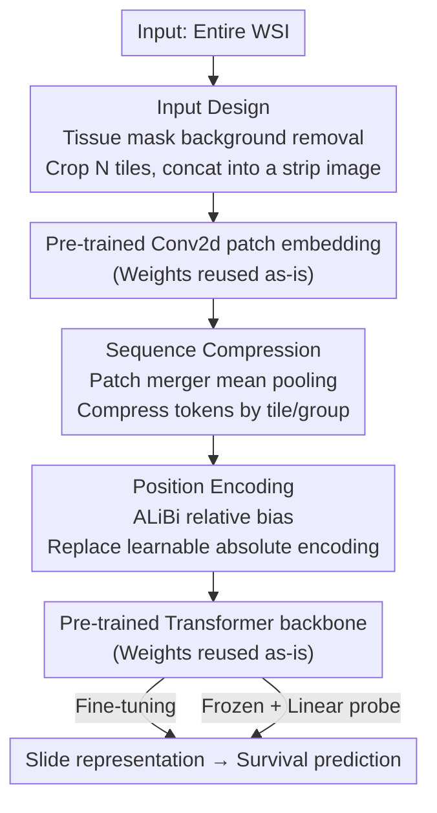

# Turning Pre-Trained Vision Transformers into End-to-End Histopathology Whole Slide Image Models for Survival Prediction

**Conference**: CVPR 2026  
**Paper**: [CVF Open Access](https://openaccess.thecvf.com/content/CVPR2026/html/Li_Turning_Pre-Trained_Vision_Transformers_into_End-to-End_Histopathology_Whole_Slide_Image_CVPR_2026_paper.html)  
**Code**: https://github.com/WonderLandxD/E2E-ViT  
**Area**: Medical Image / Computational Pathology  
**Keywords**: Whole Slide Images, Survival Prediction, ViT, End-to-End, Sequence Extrapolation  

## TL;DR
The authors discovered that the cross-patch interaction priors learned by pre-trained ViTs on pathology images can extrapolate to longer token sequences. Consequently, they proposed E2E-ViT: by only modifying the input arrangement, adding a parameter-free patch merger, and replacing absolute position encodings with ALiBi, **without adding any learnable parameters**, a tile-level ViT is directly transformed into an end-to-end WSI model. It outperforms both two-stage MIL and Slide Foundation Models (SFMs) simultaneously across five survival prediction tasks.

## Background & Motivation

**Background**: Whole Slide Images (WSIs) often contain billions of pixels. Mainstream analysis adopts a "two-stage" pipeline: first using a pre-trained tile encoder (mostly ViTs like UNI, CONCH, Virchow) to perform offline feature extraction on thousands of tiles cropped from the WSI, then using Multiple Instance Learning (MIL, such as ABMIL, TransMIL) to aggregate these tile features into slide-level representations based on slide-level labels. Recent Slide Foundation Models (SFMs, such as CHIEF, GigaPath, TITAN) pre-train a slide encoder on top of tile features to obtain task-agnostic general slide representations.

**Limitations of Prior Work**: The two-stage paradigm faces three unavoidable issues. First, it **heavily relies on frozen tile encoder weights**, which are not updated during downstream tasks, leading to a decoupling from the slide-level context. Second, **offline batch encoding discards the receptive field of the original image**: each tile is fed into the encoder individually, making the model "blind" to spatial continuity and regional interactions between tiles, which are precisely the keys to characterizing histological structures. Third, **generated slide representations are often task-specific**, requiring retraining from scratch for different tasks. Although SFMs produce task-agnostic representations, they also never "see" the original slide images during training and remain built upon well-performing tile encoders.

**Key Challenge**: The ideal solution is an **end-to-end WSI model** that directly consumes the entire slide to optimize global representations within a unified framework. However, training such a model from scratch faces two major hurdles: computational cost—backpropagation at the native WSI resolution far exceeds standard hardware limits—and data scale—public WSI datasets typically contain tens of thousands of slides, whereas large-scale pre-training in the vision community involves millions of images, a difference of several orders of magnitude. Existing end-to-end attempts either downsample the original image (losing effective receptive field) or follow a "one-task-one-weight" approach (producing only task-specific features).

**Key Insight**: The authors' key observation is that **training from scratch is not the only way**. A ViT essentially only requires image height and width to be integer multiples of the kernel size $P$ to be tokenized into $(HW/P^2)$ patch tokens for seamless forward and backward passes. They fed the same pathology region into the same pre-trained ViT at four resolutions (448, 672, 896, 1120) and visualized the attention maps of the last layer's CLS token. They found that attention in overlapping regions remained almost consistent across resolutions and smoothly extended to newly exposed peripheral areas. This indicates that **the cross-patch interaction priors learned by pre-trained ViTs are extrapolatable** and remain effective on longer token sequences.

**Core Idea**: Since priors can extrapolate, there is no need to train from scratch. Instead, existing tile-level ViTs can be "adapted" into high-resolution models capable of consuming an entire WSI—modifying only the input, sequence length, and position encoding without introducing any new parameters.

## Method

### Overall Architecture
E2E-ViT is not a new network but a set of transformation strategies applicable to **any pre-trained ViT**. The input is an entire WSI, and the output is a slide-level representation (which can be used directly for survival prediction or frozen for linear probing). Compared to a vanilla ViT, the workflow changes in only three places: **Input Design** arranges the tissue regions of the entire slide into a long "strip" image; **Sequence Compression** uses a parameter-free patch merger to compress the exploding token sequence back to a computable length while maintaining consistency with the original patch token feature space; **Position Encoding** replaces learnable absolute position encodings, which limit extrapolation, with parameter-independent ALiBi relative position biases. None of the three steps add learnable parameters, so pre-trained weights can be reused as-is—allowing both end-to-end fine-tuning and frozen offline encoding.

### Key Designs

**1. Input Design: Arranging tissue regions of the entire slide into a strip image to remove background while preserving the Receptive Field**

Directly feeding an entire WSI at a fixed magnification into a ViT is infeasible—many biopsies contain large areas of background irrelevant to the task, which wastes computation and dilutes signals. The authors first perform preprocessing: obtaining a tissue mask using OTSU or GrandQC at a selected magnification to remove the background, then using a sliding window to crop $N$ non-overlapping tiles of size $H_{px}\times H_{px}$ (where $H$ is an integer multiple of the ViT kernel size $P$). Finally, these $N$ tiles are concatenated into a single **strip image** of shape $3\times H\times (HN)$. The beauty of this layout is that it excludes task-irrelevant background while exposing the entire tissue content **as a whole** to the model. Unlike the two-stage approach that encodes tiles separately, self-attention can pass information between tiles when the strip image goes through the same backbone, thereby preserving the regional interactions and spatial continuity of the original image.

**2. Sequence Compression: Parameter-free patch merger compresses the exploding token sequence to be calculable without disrupting the pre-trained feature space**

ViT kernel sizes are typically small (8, 14, 16). Feeding the strip image into the patch-embedding layer results in an ultra-long token sequence of length $N\cdot(H/P)^2$, which is impractical for inference and fine-tuning. Drawing from the concept of token merging, the authors introduce a **patch merger**: for each tile's set of patch tokens $T_i=[t_{i,1},\dots,t_{i,(H/P)^2}]\in\mathbb{R}^{(H/P)^2\times C}$, mean pooling is applied to compress them into a single token:

$$I_i = \frac{1}{(H/P)^2}\sum_{k=1}^{(H/P)^2} t_{i,k}.$$

It also supports partitioning the entire token sequence into $G$ groups $\{\hat{T}_i\}_{i=1}^{G}$ and merging within each group $\hat{I}_i = \frac{1}{|\hat{T}_i|}\sum_{k} \hat{t}_{i,k}$, allowing flexible control of sequence length to adapt to different downstream configurations or hardware budgets. This mechanism is simple but critical: it is **parameter-free**, and mean pooling maintains the consistency of the feature space between tile tokens and the original patch tokens—this is the prerequisite for directly reusing pre-trained weights and providing a "plug-and-play" fine-tuning interface for downstream tasks. Ablations also showed that mean pooling consistently outperforms max pooling, while attention pooling is comparable but requires additional training, breaking the plug-and-play property.

**3. Position Encoding: Replacing learnable absolute position encodings with parameter-independent ALiBi relative position encodings for long-sequence extrapolation**

Position encodings make tokens position-aware and break permutation invariance. However, most ViTs use **learnable absolute position encodings**, which can only perform interpolation on additional token positions during sequence extrapolation, thereby weakening extrapolation capability—a pain point E2E-ViT faces as its input sequence is much longer than those used during pre-training. The authors switched to **ALiBi**: a parameter-independent relative position encoding that applies attention biases based on the distance between tokens. It does not rely on interpolation and thus extrapolates better to longer sequences. The ablation in Table 4 confirms this: ALiBi significantly outperforms None and learnable absolute encoding on CONCH and H0-mini (e.g., CONCH improved from 0.69 to 0.74 on HNSC), consistent with the motivation that changing PE is to preserve extrapolation.

### Loss & Training
The task is survival prediction, using the C-index to measure the quality of risk ranking. Optimizer: Adam, learning rate: $10^{-4}$, batch size: 1, 30 epochs, early stopping with patience of 5, single A100 80GB. When compared with two-stage MIL, the converted ViT is evaluated under **full-parameter fine-tuning** because MIL has no initial weights and must be trained. When compared with SFMs, both are evaluated under **linear probing** (frozen backbone, training only the classification head) since SFMs are already pre-trained.

## Key Experimental Results

The datasets include five public cancer survival prediction tasks from CPTAC and MBC: CCRCC (n=218), HNSC (n=243), LUAD (n=313), PDAC (n=227), and MBC (n=96). Five-fold cross-validation was used, reporting Mean ± SD of the C-index. Three backbones cover three pre-training paradigms: ViT-Small (ImageNet), CONCH (Pathology vision-language contrastive), and H0-mini (Pathology image SSL).

### Main Results: vs. Two-stage MIL (Full-parameter fine-tuning, Overall is the average of five tasks)

| Backbone | Best Two-stage MIL | E2E-ViT (Ours) | Gain |
|----------|---------------|----------------|------|
| ViT-Small | 0.6386 (TransMIL) | **0.6667** | +0.0281 |
| CONCH | 0.6902 (2DMamba) | **0.6978** | +0.0076 |
| H0-mini | 0.6810 (2DMamba) | **0.7158** | +0.0348 |

The three backbones transformed by E2E-ViT consistently outperformed the best values of 7 MIL methods (ABMIL/CLAM/DSMIL/TransMIL/WiKG/RRTMIL/2DMamba). Notably, on MBC, E2E H0-mini achieved 0.8176, significantly higher than any MIL method with the same backbone. It is worth noting that the ImageNet pre-trained ViT-Small significantly narrowed the gap with pathology pre-trained backbones after end-to-end fine-tuning, indicating that the gains from "directly seeing the original slide" are substantial.

### Ablation Study vs. SFM (Linear Probing, Overall is the average of five tasks)

| Method | Overall C-index | Type |
|------|----------------|------|
| GigaPath | 0.6229 | vision-only SFM |
| CHIEF | 0.6386 | vision-only SFM |
| MADELEINE | 0.6378 | vision-only SFM |
| FEATHER | 0.6152 | vision-only SFM |
| PRISM | 0.6458 | vision-language SFM |
| TITAN | 0.6582 | vision-language SFM |
| **E2E H0-mini (Ours)** | **0.6685** | Converted ViT |
| **E2E CONCH (Ours)** | **0.6534** | Converted ViT |

In the frozen state, the converted H0-mini was the best overall, surpassing two vision-language SFMs; CONCH consistently outperformed all vision-only SFMs. Even the ImageNet pre-trained E2E ViT-Small (0.5959) outperformed some SFMs on several datasets, highlighting the advantage of end-to-end slide representations.

### Ablation Study

| Dimension | Configuration | Key Finding |
|------|------|---------|
| Patch Merger (Table 3) | Max / Attention / **Mean** | Mean pooling consistently outperforms max; attention is comparable but requires extra training, breaking plug-and-play. |
| Position Encoding (Table 4) | None / Learnable / **ALiBi** | ALiBi relative encoding leads significantly on pathology backbones, improving extrapolation adaptability. |
| Sequence Length (Fig 5) | Length/Tile Ratio 0.5–4.0 | Overall relatively stable, proving strong backbone extrapolation; optimal receptive fields vary by cancer type. |
| Inference Efficiency (Fig 4) | 10,000 tiles | E2E H0-mini produces features in under a second, 2.64× faster than CHIEF and 7.49× faster than FEATHER. |
| Large Models (Fig 6/7) | UNI / Prov-GigaPath / Virchow / PathOrchestra / UNI-2 | Five large ViTs are convertible; they consistently outperformed ABMIL on LUAD (up to +3.87%), and Virchow/PathOrchestra/UNI-2 outperformed TITAN on MBC. |

### Key Findings
- **"Seeing the original image" is the main reason for improvement**: The biggest difference between E2E-ViT and two-stage methods is that the backbone works end-to-end under the original WSI field of view. Visualizations (Fig 8) show its CLS attention focuses on cancerous areas with finer distributions and more boundaries, whereas SFMs tend to produce highly saturated local hotspots—this more uniform global attention is particularly beneficial for survival analysis that relies on global spatial context.
- **Position encoding extrapolation is a hidden bottleneck**: The gain from switching to ALiBi is particularly significant on pathology pre-trained backbones, confirming the diagnosis that "absolute encoding interpolation weakens extrapolation."
- **Trade-offs for large models**: Converting large ViTs is feasible and still advantageous, but computational costs are high, parameters are tightly coupled, and they are sensitive to perturbations, which may lose pre-trained priors, requiring a careful choice between efficiency and performance.

## Highlights & Insights
- **The philosophy of adaptation with zero new parameters**: Instead of inventing new structures or pre-training from scratch, tile ViTs are upgraded into WSI models by simply rearranging input + parameter-free merging + changing PE. This allows existing strong backbones like UNI/CONCH/Virchow to gain end-to-end capabilities for "free"—offering high reusability.
- **The observation that "priors are extrapolatable" is the pivot of the paper**: The four-resolution attention heatmap experiment transformed an intuition (ViT cross-patch interaction priors remain effective on longer sequences) into verifiable evidence. Every step of the method follows from this, creating a clean logical loop.
- **The combination of strip images + patch merger is clever**: The strip image preserves inter-tile interactions, while the merger uses parameter-free mean pooling to compress the sequence back to a computable length without disrupting the feature space—this "plug-and-play" approach could be migrated to other scenarios requiring short-context models to handle long contexts while reusing pre-trained weights.

## Limitations & Future Work
- **Limitations acknowledged by the authors**: Converting large ViTs is computationally expensive, parameters are tightly coupled, and they are sensitive to perturbations, potentially losing pre-trained priors; the patch merger currently uses fixed mean pooling, with learnable merging strategies left for the future.
- **Narrow task/scale scope**: Only survival prediction tasks were validated, and the dataset scales are small (only 96 cases for MBC). The variance under five-fold CV is quite high (SD exceeds 0.1 on some datasets), necessitating validation of generalization on more clinical pathology tasks.
- **Lack of long-sequence post-training**: Currently relies on the extrapolation capability of existing backbones. The authors plan to perform post-training on high-resolution images to strengthen long-sequence extrapolation, introduce multi-scale mechanisms, and develop vision-language multimodal variants.
- **Insufficient comparison with from-scratch end-to-end methods**: Direct quantitative comparisons with end-to-end architectures like ABMILX or Pixel-Mamba are limited; the magnitude of the "reusing priors vs. training from scratch" advantage could be more systematically characterized.

## Related Work & Insights
- **vs. Two-stage MIL (TransMIL/2DMamba, etc.)**: They treat frozen tile features as instances for aggregation; backbones are not updated and cannot see inter-tile interactions. E2E-ViT lets the backbone see the original image end-to-end, thus capturing richer histological morphological information, consistently dominating across five tasks.
- **vs. SFMs (CHIEF/GigaPath/TITAN, etc.)**: SFMs pre-train a slide encoder on top of tile features and still haven't "seen" the original image during training, losing receptive field information. E2E-ViT consumes the original image directly, outperforming vision-only SFMs under linear probing and approaching vision-language SFMs while being faster in inference.
- **vs. From-scratch End-to-End (StreamingCNN/LongViT/Pixel-Mamba)**: They either downsample the original image (losing receptive field), use one weight per task, or lack pathology-domain pre-trained weights. E2E-ViT reuses priors from pathology pre-trained ViTs, preserving the receptive field while obtaining transferable representations.
- **vs. Token Merging (ToMe-like)**: This paper migrates sequence compression from "speeding up image classification" to "making ultra-long WSI sequences computable while preserving feature space consistency," representing a targeted domain adaptation.

## Rating
- Novelty: ⭐⭐⭐⭐ Adapting tile ViTs into WSI models with zero parameters based on the "extrapolatable priors" insight is novel in perspective and clear in execution.
- Experimental Thoroughness: ⭐⭐⭐⭐ Three types of backbones × five tasks, complete with MIL/SFM comparisons, efficiency, and various ablations; however, tasks are limited to survival prediction, and datasets are small.
- Writing Quality: ⭐⭐⭐⭐ Motivation progresses logically, and the three modifications correspond one-to-one with three ablation tables; the text-graphic logic is clear.
- Value: ⭐⭐⭐⭐ Provides a practical paradigm for making existing pathology ViTs end-to-end for "free." It is plug-and-play and fast in inference, making it friendly for the computational pathology community.

<!-- RELATED:START -->

## Related Papers

- [\[CVPR 2026\] TopoSlide: Topologically-Informed Histopathology Whole Slide Image Representation Learning](toposlide_topologically-informed_histopathology_whole_slide_image_representation.md)
- [\[CVPR 2026\] FBTA: Enabling Single-GPU End-to-End Gigapixel WSI Classification with Feature Bridging and Translation Alignment](fbta_enabling_single-gpu_end-to-end_gigapixel_wsi_classification_with_feature_br.md)
- [\[CVPR 2026\] MDCS-MoAME: Multi-directional Composite Scanning with Mixture of Attention and Mamba Experts for Cancer Survival Prediction](mdcs-moame_multi-directional_composite_scanning_with_mixture_of_attention_and_ma.md)
- [\[CVPR 2026\] MLLM-HWSI: A Multimodal Large Language Model for Hierarchical Whole Slide Image Understanding](mllm-hwsi_a_multimodal_large_language_model_for_hierarchical_whole_slide_image_u.md)
- [\[CVPR 2026\] H2-Surv: Hierarchical Hyperbolic Multimodal Representation Learning for Survival Prediction](h2-surv_hierarchical_hyperbolic_multimodal_representation_learning_for_survival_.md)

<!-- RELATED:END -->
