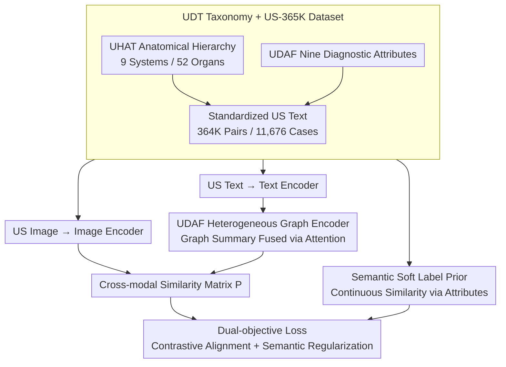

# Ultrasound-CLIP: Semantic-Aware Contrastive Pre-training for Ultrasound Image-Text Understanding

**Conference**: CVPR 2026  
**arXiv**: [2604.01749](https://arxiv.org/abs/2604.01749)  
**Code**: [https://github.com/ZJUDataIntelligence/Ultrasound-CLIP](https://github.com/ZJUDataIntelligence/Ultrasound-CLIP)  
**Area**: Medical Imaging / Ultrasound Multi-modal Understanding  
**Keywords**: Ultrasound image-text pre-training, diagnostic taxonomy, semantic soft labels, heterogeneous graph encoding, cross-modal retrieval

## TL;DR

The core contribution of this paper is not merely creating an "Ultrasound version of CLIP," but redefining the image-text alignment objective around the unique anatomical hierarchy and diagnostic attributes of ultrasound. The authors first construct the Ultrasonographic Diagnostic Taxonomy (UDT) and the large-scale US-365K dataset, then explicitly inject clinical relationships from the text into contrastive learning using semantic soft labels and attribute heterogeneous graphs to obtain more "ultrasound-literate" vision-language representations.

## Background & Motivation

**Background**: Ultrasound is a widely used imaging modality in clinical practice, yet it is significantly underrepresented in current medical vision-language pre-training frameworks. Statistics in the paper show that ultrasound typically accounts for less than 5% of mainstream medical image-text datasets, and is almost negligible in many large-scale datasets. Consequently, existing Medical CLIP models are predominantly dominated by the language distributions of CT, MRI, and pathological images.

**Limitations of Prior Work**: This leads to two direct issues. First, ultrasound images highly depend on the acoustic properties of tissues; the same lesion can present entirely different textures and echo patterns across different organs and scan planes. The standard CLIP approach of "natural image descriptors + binary positive/negative samples" struggles to cover this complex semantics. Second, ultrasound reports contain many modality-specific diagnostic descriptions, such as echogenicity, margins, posterior acoustic phenomena, and vascularity. These attributes possess structural relationships that common text encoders fail to capture automatically.

**Key Challenge**: The paper identifies two root causes:
- **Semantic Ambiguity**: The same lesion can be expressed through different descriptions, and binary contrastive learning introduces noise by treating "similar but not identical" samples as negatives.
- **Missing Structural Priors**: Ultrasound diagnosis is not simple caption matching but a joint judgment of multi-dimensional attributes; the dependencies between attributes should be encoded.

**Goal**: Since existing models lack data, taxonomy, and structure, the authors aim to fill these gaps by constructing the large-scale US-365K dataset, defining the UDT, and explicitly utilizing this knowledge in training objectives rather than relying on the model to infer it from weak text.

## Method

### Overall Architecture

Ultrasound-CLIP addresses the dual shortcomings of generic CLIP in ultrasound: the lack of data and the lack of structure. It maintains a CLIP-style dual-encoder backbone—an image encoder $f_\theta$ and a text encoder $g_\phi$—but moves beyond simple one-hot positive/negative pairing. Instead, it inserts two domain-specific enhancement paths on the text side.

The first path encodes the diagnostic attribute relationships in each case report into a heterogeneous graph, which is then fused back into the text vector to imbue the representation with structural matching (e.g., "lesion type—echo—margin—vascularity"). The second path replaces standard binary labels for non-paired samples in a batch with continuous semantic similarity priors based on attribute overlap. The final objective combines a standard contrastive loss with a semantic alignment loss, $L = L_{\text{CLIP}} + \lambda L_{\text{semantic}}$, ensuring cross-modal retrieval capability while respecting clinically "similar but distinct" cases.

### Key Designs

**1. UDT and US-365K: Defining the Pre-training Targets**
Existing Medical CLIP models are dominated by CT/MRI language distributions and lack concepts such as echogenicity or posterior acoustic phenomena. The authors propose the Ultrasonographic Diagnostic Taxonomy (UDT), consisting of two layers: `UHAT` for anatomical hierarchy (9 body systems, 52 organs) and `UDAF` for nine clinical diagnostic attributes (body system, organ, diagnosis, shape, margins, echogenicity, internal characteristics, posterior acoustic phenomena, vascularity). They used this taxonomy to standardize raw text and build US-365K, containing 364,365 image-text pairs covering 11,676 clinical cases.

**2. UDAF Heterogeneous Graph Encoder: Attributes as a "Clinical Memo"**
Directly averaging word embeddings in a text encoder flattens the structural dependencies between attributes (e.g., specific lesions pairing with certain echoes). This design inserts an enhancement branch after the text encoder: text labels are converted into a heterogeneous graph with "diagnosis" and "attribute" nodes. A lightweight graph network computes node representations, yielding a graph summary vector $g_i$ via attention pooling. The original text vector $t_i$ then queries this graph vector via multi-head attention and a gated residual connection to produce the enhanced representation $\tilde{t}_i$. This allows the model to perceive clinical sets of matching features rather than isolated words.

**3. Semantic Soft Label Prior: Managing "Similar but Different" Cases**
In ultrasound, cases with similar semantics but different phrasings are common. Standard contrastive learning forces the model to push these apart in the representation space, introducing structural noise. The authors incorporate "degrees of similarity" into the supervision: for each attribute task $k$ in UDAF, a label similarity matrix $S^{(k)}$ is maintained. The overall soft similarity $\tilde{s}_{ij}$ between samples $i$ and $j$ is calculated as the mean similarity across the nine tasks. Thus, the target matrix for a batch is a continuous soft prior rather than a binary diagonal matrix.

### Loss & Training

The training objective consists of two terms. The **Contrastive Alignment Loss** is a standard symmetric CLIP loss responsible for pulling corresponding image and text representations together. The **Semantic Loss** constrains the predicted cross-modal similarity matrix to numerically approximate the UDAF soft prior while maintaining distributional consistency via a KL divergence term. These are combined using a weight $\lambda$.

## Key Experimental Results

### Main Results

The model was evaluated on nine diagnostic attribute classification tasks using US-365K, comparing generic CLIP, Medical CLIP, and several variants.

| Method | AvgAcc | AvgRecall | Notes |
|---|---:|---:|---|
| CLIP | 13.29 | 28.75 | Generic CLIP, lacks ultrasound semantics |
| MedCLIP | 25.37 | 31.88 | Medical pre-training, insufficient US coverage |
| BiomedCLIP | 33.81 | 35.11 | Strong medical baseline |
| Ultrasound-CLIP-Ds+g | 50.84 | 52.87 | Combination of semantic loss and graph encoding |
| Ultrasound-CLIP-Ds | 48.62 | 53.12 | Focused on semantic priors only |
| Ultrasound-CLIP-Dg | 49.87 | 55.12 | Focused on graph structural enhancement only |
| **Ultrasound-CLIP** | **59.61** | **61.08** | Best performance with both modules |

The full model outperforms the strongest baseline, BiomedCLIP, by over 25 points in AvgAcc, suggesting a fundamental shift in modality understanding.

### Ablation Study (Retrieval)

Recall@K was also evaluated on the US-365K test set to observe how graph structures and semantic priors complement each other.

| Method | I2T R@5 | I2T R@10 | I2T R@50 | T2I R@5 | T2I R@10 | T2I R@50 |
|---|---:|---:|---:|---:|---:|---:|
| CLIP | 0.1420 | 0.2451 | 0.6306 | 0.1662 | 0.2783 | 0.6767 |
| PMC-CLIP | 0.1808 | 0.3011 | 0.7215 | 0.1814 | 0.3038 | 0.7312 |
| BiomedCLIP | 0.1788 | 0.2979 | 0.7029 | 0.1864 | 0.3089 | 0.7206 |
| Ultrasound-CLIP-Ds | 0.1568 | 0.2683 | 0.6692 | 0.1550 | 0.2659 | 0.6707 |
| Ultrasound-CLIP-Dg | 0.2147 | 0.3444 | 0.7638 | 0.2147 | 0.3520 | 0.7774 |
| **Ultrasound-CLIP** | **23.59** | **0.3745** | **0.7909** | **0.2383** | **0.3781** | **0.8022** |

### Key Findings

- Compared to generic and standard medical CLIP, the gains primarily stem from the data and taxonomy rather than just the loss function.
- Both `Dg` and `Ds` are effective independently, but the full model is significantly better, indicating that structural priors and semantic soft supervision address different layers of errors.
- Pre-trained representations transfer well to downstream tasks: achieving 75.40% in linear probing, 84.23% in full fine-tuning, and 92.13% on a specific Breast dataset.
- Patient-level data splitting is critical; otherwise, high visual similarity in ultrasound can lead to overestimated performance.

## Highlights & Insights

- **Novelty**: The primary highlight is the redefinition of the ultrasound semantic coordinate system. The UDT's value extends beyond this paper, providing a hierarchical label system for future ultrasound multi-modal research.
- **Value**: Semantic soft labels are exceptionally well-suited for medical scenarios where synonyms and partial overlaps are frequent.
- **Mechanism**: The heterogeneous graph encoder acts as a "clinical memo" for text vectors, which is more practical than designing a massive medical LLM from scratch.
- **Quality**: The dataset construction process, driven by UDT for label extraction and standardization, ensures US-365K serves effectively for both pre-training and evaluation.

## Limitations & Future Work

- **Background**: While US-365K is large, it relies on public case sites and educational resources; noise distributions and reporting styles in real hospital workflows may be more complex.
- **Function**: UDAF covers nine attribute classes but does not exhaust all sub-specialties like echocardiography or interventional ultrasound, which involve more dynamic data.
- **Mechanism**: The model focuses on static image-text pairs; it does not yet utilize video frames, probe movement, or multi-plane joint assessments common in ultrasound.
- **Novelty**: The reliance on rule-based or manual similarity for the semantic prior matrix, while providing controllability, may limit the expression of more implicit clinical similarities.

## Related Work & Insights

- **vs Gen CLIP**: Addresses the domain gap at the ontology level, not just the data level.
- **vs Med CLIP**: While many medical CLIPs offer "broad but shallow" radiology pre-training, this method provides "narrow but deep" ultrasound expertise.
- **vs Specialist Models**: Offers a unified pre-training foundation across anatomical regions rather than being limited to specific organs like the breast or fetus.
- **Key Insight**: In specialized medical imaging, building "knowledge structures" (taxonomy, graph priors, soft labels) is often more effective than blindly scaling model parameters.

## Rating

- Novelty: ⭐⭐⭐⭐⭐ 
- Experimental Thoroughness: ⭐⭐⭐⭐ 
- Writing Quality: ⭐⭐⭐⭐ 
- Value: ⭐⭐⭐⭐⭐ 

<!-- RELATED:START -->

## Related Papers

- [\[CVPR 2026\] A Semi-Supervised Framework for Breast Ultrasound Segmentation with Training-Free Pseudo-Label Generation and Label Refinement](a_semi-supervised_framework_for_breast_ultrasound_segmentation_with_training-fre.md)
- [\[CVPR 2026\] CHIPS: Efficient CLIP Adaptation via Curvature-aware Hybrid Influence-based Data Selection](chips_efficient_clip_adaptation_via_curvature-aware_hybrid_influence-based_data_.md)
- [\[AAAI 2026\] SEMC: Structure-Enhanced Mixture-of-Experts Contrastive Learning for Ultrasound Standard Plane Recognition](../../AAAI2026/medical_imaging/semc_structure-enhanced_mixture-of-experts_contrastive_learning_for_ultrasound_s.md)
- [\[CVPR 2026\] F$^2$-Assist: Multi-Phase Fetal Growth Forecast and Report Generation from Ultrasound Examination](f2-assist_multi-phase_fetal_growth_forecast_and_report_generation_from_ultrasoun.md)
- [\[ICML 2026\] MEG-XL: Data-Efficient Brain-to-Text via Long-Context Pre-Training](../../ICML2026/medical_imaging/meg-xl_data-efficient_brain-to-text_via_long-context_pre-training.md)

<!-- RELATED:END -->
