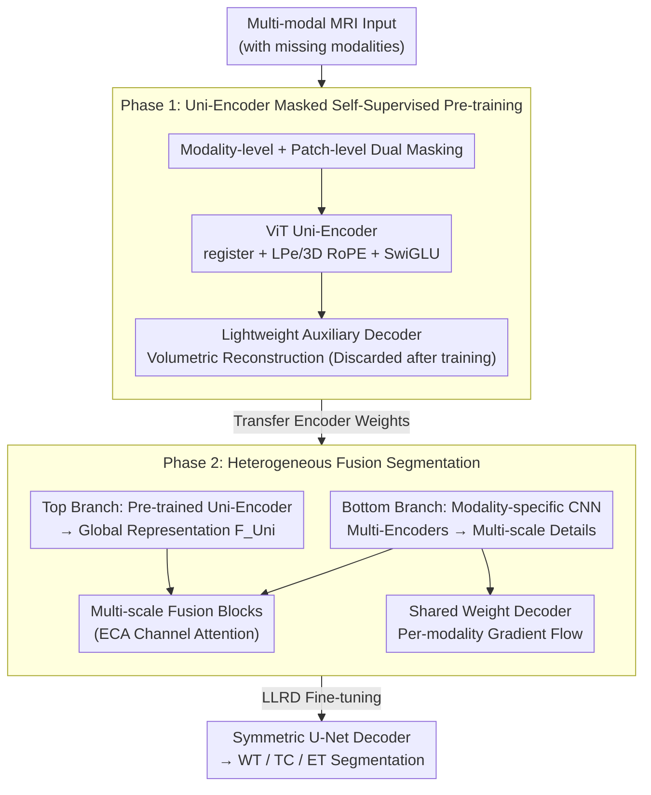

# Uni-Encoder Meets Multi-Encoders: Representation Before Fusion for Brain Tumor Segmentation with Missing Modalities

**Conference**: CVPR 2026  
**arXiv**: [2604.22177](https://arxiv.org/abs/2604.22177)  
**Code**: https://github.com/Hooorace-S/UniME (Available)  
**Area**: Medical Imaging  
**Keywords**: Brain Tumor Segmentation, Missing Modality, Masked Self-Supervision, ViT-CNN Heterogeneity, Representation Before Fusion

## TL;DR
UniME addresses brain tumor segmentation with missing modalities using a two-stage heterogeneous "representation before fusion" design. Phase 1 employs a single ViT Uni-Encoder for masked self-supervised pre-training to learn robust unified representations against missing data. Phase 2 integrates multiple modality-specific CNN Multi-Encoders in parallel to recover high-resolution details. On BraTS 2023/2024, the average DSC across various missing modality combinations outperforms the Prev. SOTA (with an ET gain of 2.4%~2.9%).

## Background & Motivation
**Background**: Multi-modal MRI (FLAIR / T1ce / T1 / T2) provides complementary information for brain tumor segmentation, but clinical scans often lack one or two modalities (e.g., T2 is frequently unavailable due to artifacts). Existing missing-modality segmentation follow two main paradigms: maximizing cross-modal complementarity through synthesis or knowledge distillation, or redesigning architectures to utilize available modalities, typically using the HeMIS paradigm—four independent CNN encoders extracting features for downstream fusion.

**Limitations of Prior Work**: Synthesis methods often fail to recover fine structures, and distillation pipelines are complex and hard to scale. The HeMIS paradigm is limited by the local receptive fields of CNN encoders; even if Transformers are used for downstream global fusion, upstream CNNs "lock" cross-modal semantics into local regions, creating a performance ceiling. Another approach involves pure ViT self-supervision, which captures global semantics and cross-modal relationships but lacks convolutional inductive bias, failing to capture fine anatomical structures at pixel-level precision. Furthermore, a single encoder cannot fully exploit modality-specific information.

**Key Challenge**: An ideal method for missing-modality segmentation must achieve three things simultaneously: capture fine-grained structures, model cross-modal complementarity, and fully utilize existing modalities. Existing methods often trade off between these objectives. The root cause is the coupling of "representation learning" and "segmentation" within the same encoder: choosing CNNs for detail (sacrificing global semantics) or ViTs for global context (sacrificing pixel precision).

**Goal**: To decouple "representation learning" from "segmentation," allowing a global semantic module to focus on modeling cross-modal complementarity while several local detail modules recover modality-specific high-resolution features.

**Core Idea**: Representation before fusion—first use a ViT Uni-Encoder under masked self-supervision to learn a unified global representation robust to missing modalities, then parallelize CNN Multi-Encoders to integrate multi-scale details, achieving all three goals through a heterogeneous two-stage design.

## Method

### Overall Architecture
The input to UniME is multi-modal MRI volume data $\mathbf{X}\in\mathbb{R}^{K\times D\times H\times W}$ with missing modalities, and the output consists of segmentations for three nested sub-regions (WT: Whole Tumor / TC: Tumor Core / ET: Enhancing Tumor). The method follows the core theme of "learning representations first, then performing fusion-based segmentation," split into two stages:

**Phase 1 (Uni-Encoder Pre-training)**: Only the ViT Uni-Encoder is trained. Dual random masking (modality-level + patch-level) is applied to the input, requiring the encoder to reconstruct the full volume from incomplete data. This forces the encoder to infer missing modalities from the remaining ones, embedding "cross-modal complementarity modeling" into a unified representation. A lightweight auxiliary decoder calculates reconstruction loss during pre-training and is discarded afterward, ensuring representation learning is "encoder-centric."

**Phase 2 (Network Fine-tuning)**: A heterogeneous segmentation network is built with two parallel branches. The top branch feeds the (similarly randomly masked) input into the pre-trained Uni-Encoder to obtain global semantic representations $\mathbf{F}_{\mathrm{Uni}}$. The bottom branch equips each modality with a U-Net-style CNN encoder to extract modality-specific high-resolution multi-scale features. Features from both branches are fused stage-by-stage via fusion blocks (including ECA channel attention), and a symmetric U-Net decoder outputs the segmentation. Fine-tuning uses Layer-wise Learning Rate Decay (LLRD) to preserve the semantic knowledge learned during pre-training.

The two-stage data flow from input to segmentation is illustrated below:

### Key Designs

**1. Heterogeneous Two-Stage Design: Decoupling "Learning Semantics" and "Segmentation"**

This is the central principle of UniME, directly addressing the conflict between the three objectives. Previous methods coupled representation and segmentation within a homogeneous encoder, forcing a choice between "global semantics" and "pixel-level detail." UniME splits the process into two stages and uses heterogeneous backbones: the ViT Uni-Encoder excels at global context and cross-modal relationships, focusing on learning a robust unified representation; the CNN Multi-Encoders excel at local high-resolution structures, focusing on recovering modality-specific details. Ablations confirm this decoupling is necessary—using only the pre-trained Uni-Encoder yields an average DSC of 82.45, only Multi-Encoders yield 78.90, and only the combination with pre-training reaches 83.49.

**2. Uni-Encoder Masked Self-Supervised Pre-training: Forcing Complementarity via Reconstruction**

To model cross-modal complementarity and robustness, Phase 1 adopts the dual masking of M3AE: modality-level masking via $\delta_m\sim\text{Bernoulli}(1-p_m)$ ($p_m=0.5$) and patch-level masking via $\eta_{m,i}\sim\text{Bernoulli}(1-q_m)$. The joint mask is $\gamma_{m,i}=\delta_m\cdot\eta_{m,i}$, ensuring $\sum_m\delta_m\ge 1$ so at least one modality remains. Masked positions are replaced with learnable mask tokens, and the input is sectioned by a patch tokenizer (3D convolution, kernel/stride $P=8$; small patches capture fine medical structures; modalities are concatenated along the channel axis to control sequence length).

Crucially, the reconstruction loss is calculated over the **entire volume**, not just the masked regions:

$$\mathcal{L}_{\text{rec}}=\|\mathbf{X}-\widehat{\mathbf{X}}\|_2^2+\gamma\|\texttt{Mask}\|_2,\quad \gamma=0.005$$

Because modality-level loss hides entire channels and high patch masking rates often leave no position with a complete set of modalities, reconstructing the full volume forces the model to use surviving modalities to complete missing ones, thereby learning richer cross-modal representations—different from the MAE approach of calculating loss only on masked areas.

**3. ViT Refinement for Small-Scale Medical Data: Register + Double Positional Encoding + SwiGLU**

Standard ViTs suffer when applied to limited 3D medical datasets. This design introduces three modifications. First, register tokens ($N_{\text{reg}}=4$) are added to enhance pre-training robustness and discarded after $L$ layers. Second, because spatial priors are critical for global sequence models on small data, both learnable positional encoding (LPe, for flexible offsets) and 3D RoPE (for relative spatial relationships in every multi-head attention layer) are used. Third, the FFN uses SwiGLU, with LayerNorm added before and after the FFN (following EVA-02) for stable convergence. The layer update is: $\widehat{\mathbf{S}}^{(l)}=\mathbf{S}^{(l-1)}+\text{MHSA}_{\text{3D RoPE}}(\text{LN}(\mathbf{S}^{(l-1)}))$ followed by a SwiGLU residual block ($L=16$, $d_{\text{embed}}=864$, 12 heads, "Base" scale).

**4. Heterogeneous Fusion Network + Shared Weight Decoder: Integrating Semantics and Details**

In Phase 2, the top-branch Uni-Encoder provides $\mathbf{F}_{\mathrm{Uni}}$, and the bottom branch uses four-stage U-Net-style CNN encoders for each modality (each stage has three convolutional blocks, widths 16/32/64/128, intra-stage residuals). In the first three stages, features of missing modalities are masked before fusion, then concatenated and fed into fusion blocks—each consisting of two 3D convolutions and an ECA channel attention. Interestingly, **the deepest modality-specific features are excluded from fusion**, as the Uni-Encoder already provides high-quality multi-modal semantic representations; stacking deep CNN details here would be redundant. $\mathbf{F}_{\mathrm{Uni}}$ is down-projected to $\mathbf{F}_{\mathrm{main}}$ and decoded into the main output $\mathbf{O}_{\mathrm{main}}$.

To stabilize the modality encoders under random masking, a **shared weight decoder** is added. It shares weights across all modalities and processes multi-scale features (including the deepest level) from each modality encoder to generate auxiliary outputs, providing independent gradient flows for each modality.

### Loss & Training
The total fine-tuning loss is the sum of three terms:

$$\mathcal{L}_{\text{total}}=\mathcal{L}_{\text{main}}+\mathcal{L}_{\text{aux}}+\mathcal{L}_{\text{deep}}$$

Each term combines Dice loss and weighted cross-entropy to handle class imbalance. Fine-tuning uses **LLRD (Layer-wise Learning Rate Decay)**: $\texttt{lr}_l=\texttt{lr}\cdot\omega^{L-l}$. Small steps in shallow layers preserve general features, while larger steps in deep layers adapt to the task. Training details: 96³ random cropping, AdamW (weight decay $10^{-4}$), learning rate linearly warmed up to $3\times10^{-4}$ then cosine decayed to $10^{-6}$, 600 epochs of pre-training and fine-tuning, batch size 4.

## Key Experimental Results

### Main Results
On BraTS 2023 (1251 cases) and BraTS 2024 (1350 cases), representing pre- and post-operative stages, using a 70/10/20 split and averaging DSC across all 15 missing-modality combinations:

| Dataset | Region | UniME | Prev. SOTA (M3AE/M2SegMamba) | Gain |
|--------|------|-------|------|------|
| BraTS 2023 | WT | 90.38 | 88.98 | +1.40% |
| BraTS 2023 | TC | 84.51 | 82.98 | +1.53% |
| BraTS 2023 | ET | 75.59 | 73.23 | +2.36% |
| BraTS 2024 | WT | 88.02 | 86.18 | +1.84% |
| BraTS 2024 | TC | 77.49 | 75.53 | +1.96% |
| BraTS 2024 | ET | 75.12 | 72.19 | +2.93% |

The gain is largest for the hardest ET (Enhancing Tumor) region and becomes more pronounced in extreme missing-modality cases (e.g., T1 only on BraTS 2023 yields DSC 84.52, while the second best is ~80).

### Ablation Study
Deconstruction of the two-stage heterogeneous design (BraTS 2023, Mean DSC):

| Configuration | WT | TC | ET | Mean | Description |
|------|----|----|----|------|------|
| Multi-Encoders only (No pre-train) | 88.25 | 79.62 | 68.83 | 78.90 | Local detail only, no global semantics |
| Uni-Encoder only (Random init) | 87.86 | 77.43 | 66.46 | 77.25 | Pure ViT without pre-training is worst |
| Uni-E (Random) + Multi-E | 88.95 | 82.09 | 72.61 | 81.22 | Heterogeneous but no pre-training |
| Uni-Encoder only (Pre-trained) | 90.29 | 83.39 | 73.67 | 82.45 | Masked SSL significantly improves ET |
| **Full (Pre-trained Uni-E + Multi-E)** | **90.38** | **84.51** | **75.59** | **83.49** | Pre-training + Heterogeneity is optimal |

Key Hyperparameters: Uni-Encoder scale Base (83.49) is better than Small/Large. The patch mask rate $q_m$ peaks at 75%. Register tokens peak at 4.

### Key Findings
- **Pre-training is the primary driver**: A single Uni-Encoder with pre-training (82.45) already surpasses the "heterogeneous but not pre-trained" version (81.22), indicating that robust cross-modal representations from masked self-supervision are the main source of performance. Multi-Encoders contribute an additional ~1.0 mean DSC detail gain.
- **ET benefits most**: The enhancing tumor region relies heavily on cross-modal complementarity and fine structure; combining pre-training and heterogeneity lifts ET DSC from 68.83 to 75.59.
- **Optimal scale and mask rate**: Neither larger models nor higher masking rates are universally better—medium scale, 75% masking, and 4 registers are optimal, reflecting the "moderate" principle in small medical datasets.

## Highlights & Insights
- **"Representation before fusion" as a transferable framework**: Decoupling the backbone used for semantic learning from the one used for dense prediction allows ViT and CNN to perform their respective strengths, avoiding the compromise between global context and pixel precision.
- **Whole-volume reconstruction over masked-region reconstruction**: In missing modality scenarios where entire channels are hidden, calculating loss only on masked patches fails. Whole-volume reconstruction forces cross-modal completion, a precise loss design for the specific task.
- **Intentional exclusion of deep modality features**: Acknowledging that Uni-Encoder deep semantics are superior avoids redundancy with CNN features, a counter-intuitive but effective design choice.
- **Stabilizing gradients with a shared weight decoder**: This provides stable, independent gradient flows for each modality branch despite random masking, a reusable trick for multi-branch training.

## Limitations & Future Work
- **High training cost**: Two stages (600 epochs each) with ~23.8 GiB VRAM usage make training more expensive than single-stage HeMIS methods.
- **Validation limited to BraTS**: The generalizability to other multi-modal medical tasks (e.g., abdominal/cardiac segmentation) or heterogeneous modalities (MRI+CT) remains unverified.
- **Primary focus on DSC**: Metrics like HD95 are not detailed in the main text, making it difficult to judge the benefit to boundary accuracy.
- **Future directions**: Exploring the distillation of two stages into one for cost reduction or adaptive masking/dropout rates.

## Related Work & Insights
- **vs. HeMIS Paradigms (RFNet, mmFormer, etc.)**: These rely on multiple CNN encoders whose local receptive fields limit cross-modal semantics. UniME bypasses this ceiling by establishing global cross-modal representations in the upstream stage.
- **vs. M3AE**: M3AE uses a symmetric U-Net for pre-training, which weakens the encoder's representation power through skip connections. UniME uses an encoder-centric, discardable auxiliary decoder and heterogeneous Multi-Encoders, gaining 2.4%~2.9% on ET.
- **vs. M2SegMamba**: M2SegMamba utilizes semantic-level masking but retains multiple CNN encoders, limiting cross-modal feature alignment. UniME achieves cleaner alignment through a unified ViT representation.

## Rating
- Novelty: ⭐⭐⭐⭐ The two-stage heterogeneous "representation before fusion" design and whole-volume loss specifically target missing modality traits with clear justification.
- Experimental Thoroughness: ⭐⭐⭐⭐⭐ Comprehensive comparisons across two datasets, 15 modality combinations, 9 SOTA methods, and ablation studies on structure/scale/masking/registers.
- Writing Quality: ⭐⭐⭐⭐ Clearly articulated motivations regarding the trade-offs and well-structured method descriptions.
- Value: ⭐⭐⭐⭐ Addresses a real clinical pain point, sets a new SOTA, and provides a framework view relevant to other dense prediction tasks.

<!-- RELATED:START -->

## Related Papers

- [\[CVPR 2026\] Virtual Nodes Guided Dynamic Graph Neural Network for Brain Tumor Segmentation with Missing Modalities](virtual_nodes_guided_dynamic_graph_neural_network_for_brain_tumor_segmentation_w.md)
- [\[CVPR 2026\] CLoE: Expert Consistency Learning for Missing Modality Segmentation](cloe_expert_consistency_learning_for_missing_modality_segmentation.md)
- [\[CVPR 2026\] PGR-Net: Prior-Guided ROI Reasoning Network for Brain Tumor MRI Segmentation](pgr-net_prior-guided_roi_reasoning_network_for_brain_tumor_mri_segmentation.md)
- [\[CVPR 2026\] MUST: Modality-Specific Representation-Aware Transformer for Diffusion-Enhanced Survival Prediction with Missing Modality](must_modality-specific_representation-aware_transformer_for_diffusion-enhanced_s.md)
- [\[CVPR 2025\] Federated Modality-specific Encoders and Partially Personalized Fusion Decoder for Multimodal Brain Tumor Segmentation](../../CVPR2025/medical_imaging/federated_modality-specific_encoders_and_partially_personalized_fusion_decoder_f.md)

<!-- RELATED:END -->
