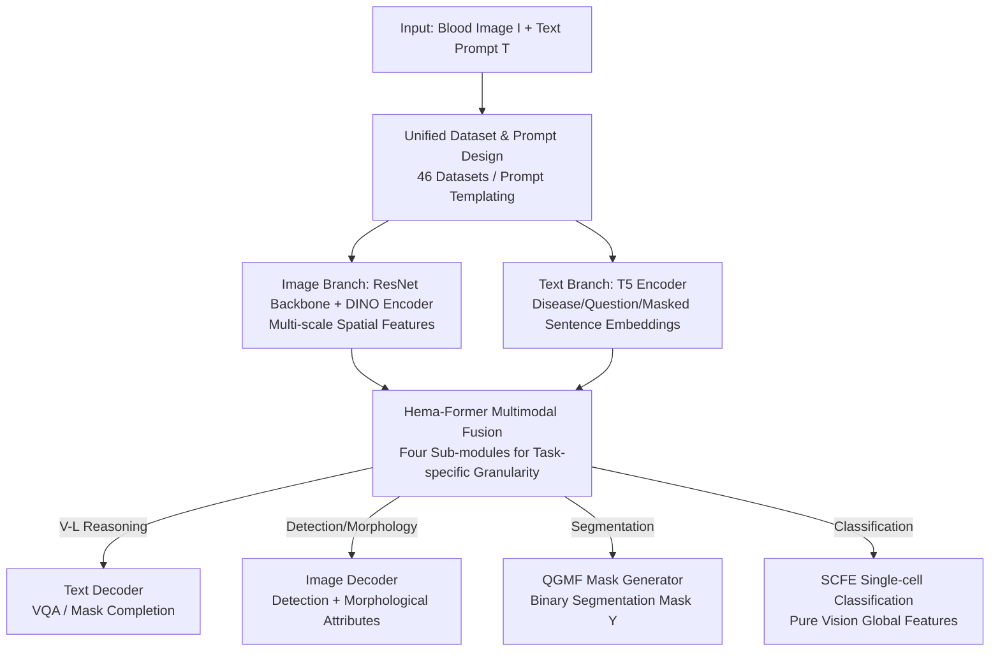

# Uni-Hema: Unified Model for Digital Hematopathology

**Conference**: CVPR 2026  
**Paper**: [CVF Open Access](https://openaccess.thecvf.com/content/CVPR2026/html/Rehman_Uni-Hema_Unified_Model_for_Digital_Hematopathology_CVPR_2026_paper.html)  
**Code**: https://github.com/intelligentMachines-ITU/UniHema  
**Area**: Medical Imaging  
**Keywords**: Digital Hematopathology, Unified Multi-task Model, Vision-Language, Single-cell Analysis, Hema-Former

## TL;DR
Uni-Hema utilizes a unified architecture (comprising a CNN+Transformer visual branch, a T5 text branch, and a multimodal fusion module named Hema-Former) trained in a single pass. It simultaneously performs six categories of tasks in hematopathology—detection, classification, segmentation, morphological prediction, visual question answering (VQA), and masked language modeling (MLM)—across six diseases including leukemia, malaria, anemia, and sickle cell disease. Its performance is comparable to or better than task-specific SOTA models trained on individual datasets.

## Background & Motivation
**Background**: Digital hematopathology (DHP) relies on peripheral blood films (PBF) for cell-level diagnosis, covering leukemia, malaria, anemia, sickle cell disease, and thalassemia. Existing methods are categorized into four types: single-task/single-disease models, vision-language models (VLM), pathology foundation models optimized for whole slide imaging (WSI), and single-cell hematology foundation models.

**Limitations of Prior Work**: Each of these four categories has significant drawbacks. Single-task models require separate dataset construction and training for every diagnostic purpose, hindering scalability. Pathology foundation models are mostly designed for low-magnification (5×, 40×) solid tissue WSIs, whereas blood diagnosis requires fine-grained cell-level information at 40× and 100×. Single-cell hematology models (e.g., DinoBloom, RedDino) only perform single-cell tasks and struggle with overlapping or clumped multi-cell scenarios in field-of-view (FoV) images, and are restricted to fixed cell types. General medical VLMs excel at image-text tasks but fail at vision-centric tasks like detection and segmentation.

**Key Challenge**: The real clinical demand is for "a single model capable of detection, classification, segmentation, morphological reasoning, and VQA across multiple diseases." However, achieving this is difficult due to the lack of a unified benchmark covering all target tasks. Public hematopathology datasets are mostly fragmented by disease or task. Furthermore, vision-language alignment requires precise cell-level clinical descriptions, which are extremely difficult to construct in hematology.

**Goal**: To build a truly unified multi-task, multimodal (image+text), multi-disease model that consolidates existing datasets for comprehensive cell-level interpretation across leukemia, malaria, and anemia.

**Key Insight**: Different tasks actually require features of different "levels/granularities" (classification requires global features, detection/segmentation requires local objectness, and V-L reasoning requires aligned multimodal features). Therefore, rather than stacking specialized models, one should design a fusion module capable of extracting and conditioning features across multiple levels based on the task, allowing information exchange between parallel visual and textual networks.

**Core Idea**: Use a "Hema-Former" information-mixing module to perform attention-based fusion of image and text encoder features at different levels. This generates task-specific granularities for different heads, enabling joint training across six task types and six diseases.

## Method

### Overall Architecture
Uni-Hema (denoted as $\mathcal{U}$) is an integrated vision-language framework. It takes a blood image $I$ and a text prompt $T$ as input, producing outputs based on the task (bounding boxes, classification labels, segmentation masks, morphological attributes, VQA sentences, or completed sentences). It consists of six modules: an image backbone $B$ (ResNet-50 for multi-scale spatial features), an image encoder $E^I$ (six layers of DINO-style self-attention refining context visual embeddings $\mathcal{E}^I_E$), a text encoder $E^T$ (T5-base encoding disease types, morphological questions, or masked sentences into $\mathcal{E}^T_E$), an image decoder $D^I$ (extended from DINO-DETR to produce disease-aware object embeddings $\mathcal{E}^I_D$), a text decoder $D^T$ (for autoregressive answer generation), and the core Hema-Former fusion module $\mathcal{H}$.

While the visual and textual branches appear parallel, Hema-Former facilitates the information flow. it pulls features from different encoder levels to generate fused embeddings of specific granularity—aligning vision and language for VQA/MLM, focusing on token-level objectness attention for detection/segmentation, and combining text embeddings with fine-grained backbone features for pixel-level segmentation.

### Key Designs

**1. Unified Dataset & Prompt Construction: Merging 46 fragmented datasets into a multi-task corpus**

The biggest obstacle for a unified model is the lack of a benchmark. The authors merged 46 public hematology datasets (11 segmentation ≈ 222K, 17/18 detection ≈ 84K, 16/17 classification ≈ 380K, totaling ~700,000 images) while retaining original labels. They generated unified text prompt templates for detection/segmentation, such as `"This image is for the detection of <disease_type> of cells."`. VQA prompts start with `Q:`, MLM with `mask:`, and single-cell classification uses visual features only. Crucially, they utilized BioMistral-7B to semi-synthesize single-cell VQA pairs (WBCAtt-VQA, ~22K QA) and Gemini 1.5 to generate masked and full descriptive sentences combining morphological labels on FoV images (LeukemiaAttri-MLM, ~7K samples). This bypasses the labeling bottleneck of cell-level V-L pairs and unifies six types of supervisory signals.

**2. Hema-Former Sub-modules: Generating multi-granularity fused features by task**

To address the contradiction where different tasks require different feature granularities, four learnable sub-modules fuse multi-level encoder features as needed.

- **(a) Cross-Modal Fusion (CMF)**: Serves VQA/MLM. It uses a learnable query $Q_1$ for cross-attention over projected text embeddings, then fuses this with projected visual features $P(\mathcal{E}^I_B)$, yielding aligned multimodal embeddings $\mathcal{E}^T_W$:
$$\mathcal{E}^T_W = \mathrm{Norm}\big(J + \mathrm{CrossAttn}(J,\,P(\mathcal{E}^I_B),\,P(\mathcal{E}^I_B))\big)$$
Where $J$ is the intermediate result of the text-side cross-attention.

- **(b) Text-Guided Visual Refinement (TGVR)**: Serves detection/segmentation. It extracts Top-K queries $k$ from $\mathcal{E}^I_E$ based on objectness, then uses projected text embeddings $\mathcal{E}^T_E{}'$ as keys/values and $k$ as queries to inject disease semantics into the decoder queries:
$$\mathcal{E}^I_X = P\big([\,k \,\|\, \mathrm{CrossAttn}(k, \mathcal{E}^T_E{}', \mathcal{E}^T_E{}')\,]\big)$$

- **(c) Single-Cell Feature Extraction (SCFE)**: Serves classification independently of text. It concatenates a learnable query with the mean of image embeddings to produce a global image-level feature $\mathcal{E}_Z \in \mathbb{R}^{1\times M}$.

- **(d) Query-Guided Mask Finder (QGMF)**: Serves pixel-level segmentation following the Mask DINO approach. It fuses backbone features $F_1$ and image embeddings $\mathcal{E}^I_E$ to get $G_{\text{proj}}$. This interacts with disease-aware object embeddings $\mathcal{E}^I_D$ via an Einstein summation $\mathcal{S}$:
$$Y = \mathcal{S}(\mathcal{E}^I_D{}',\, G_{\text{proj}})$$

**3. Six-Stage Progressive Training: Pre-training branches then task-wise unfreezing**

To avoid gradient conflict in a multi-task setting, a curriculum strategy is used: Step 1 pre-trains the image backbone+encoder on single-cell classification; Step 2 pre-trains the text branch on MLM/QA; Step 3 jointly trains visual modules (TGVR, SCFE, QGMF) for classification+segmentation+detection; Step 4 fine-tunes the image decoder for detection/morphology; Step 5 fine-tunes QGMF on full segmentation sets; Step 6 trains the CMF and text decoder on VQA+MLM. This total process takes ~8 days on a single RTX 4090.

### Loss & Training
The framework adopts detection losses from DINO-DETR, binary mask supervision for segmentation, single-cell labels for classification, and autoregressive generation targets for VQA/MLM. Instead of end-to-end joint training, the modules are optimized via the aforementioned six-stage strategy.

## Key Experimental Results

### Main Results (Table 1: Unified Model vs. Task-specific SOTA)
Each baseline was trained specifically on its dataset, while Uni-Hema was trained once and tested across all tasks without task-specific fine-tuning.

| Task | Metric | Dataset | Best Baseline | Uni-Hema |
|------|------|-----------|--------------|----------|
| Detection | mAP50 | L 100x C2 (Leukemia) | 38.2 (DINO) | **45.6** |
| Detection | mAP50 | H 1000x (Malaria) | 79.8 (DINO) | **83.1** |
| Detection | mAP50 Mean | 12 Sets | 60.4 (DINO) | 61.1 |
| Classification | F1 | BMC (21 types) | 85.0 (DinoBloom-S) | **86.2** |
| Segmentation | Dice | Elsafty (Anemia) | 99.5 (TransNetR) | **99.9** |
| Morphology (FoV) | F1 Mean | LeukemiaAttri | 62.6 (AttriDet) | **77.2** |
| Cell VQA | BLEU-4 | WBCAtt-VQA | — | 56.4 |

Uni-Hema matched or outperformed dedicated models in detection, classification, and morphology. Morphology (FoV) saw a massive gain (+14.6 F1). Segmentation mean Dice was slightly lower than TransNetR (91.7 vs 93.7), attributed to a simplified decoder.

### Ablation Study
- **Backbone Feature Fusion**: Integrating backbone features with SCFE improved classification F1 on difficult datasets (C-NMC) by 4.0%, proving context/global feature complementarity.
- **Upsampler Impact**: Replacing simple interpolation with a small learnable upsampler in QGMF improved Dice by ~1.5.

### Key Findings
- **Multi-task synergy**: Joint training provides a net gain in most tasks, suggesting that representations for different tasks benefit each other.
- **Small-sample dilution**: Tasks with very few samples (e.g., Sickle cell detection) suffered from being diluted in the large corpus (67.0 vs DINO 73.6).
- **Segmentation bottleneck**: The use of a simplified upsampling decoder due to resource constraints limited segmentation performance compared to SOTA specialized decoders.

## Highlights & Insights
- **Task-specific Granularity**: Hema-Former's sub-modules (CMF/TGVR/SCFE/QGMF) prove that different tasks require specific fusion granularities, providing a reusable design paradigm for multi-task models.
- **Synthetic V-L Data**: Leveraging LLMs to "translate" existing morphological labels into QA/MLM data effectively bypasses clinical data scarcity.
- **Pragmatic Engineering**: Achieving a unified model on a single RTX 4090 via six-stage progressive training proves that such models do not always require massive compute clusters.

## Limitations & Future Work
- **Segmentation Precision**: The edges in segmentation are less sharp due to simplified upsampling.
- **Long-tail Data**: Performance on extremely small sets (Sickle Cell) dropped, requiring better re-weighting or sampling strategies.
- **Synthetic Data Validity**: The VQA/MLM data is semi-synthetic and not yet validated for clinical deployment.
- **Complex Training Schedule**: The six-stage curriculum is manually designed and may be difficult to automate for new domains.

## Related Work & Insights
- Uni-Hema transcends single-task models by training across 46 datasets simultaneously.
- Compared to Pathology Foundation Models (UNI, CONCH), Uni-Hema handles fine-grained 40x/100x cell-level information and native vision tasks like detection/segmentation.
- It outperforms single-cell models like DinoBloom by providing multi-cell FoV context and multimodal reasoning capabilities.

## Rating
- Novelty: ⭐⭐⭐⭐ (First unified V-L model for hematopath, task-specific granularity fusion is a strong design).
- Experimental Thoroughness: ⭐⭐⭐⭐ (Extensive multi-task coverage, though lacks direct end-to-end comparison).
- Writing Quality: ⭐⭐⭐ (Clear logic, though some acronym inconsistencies and formula typesetting issues exist).
- Value: ⭐⭐⭐⭐ (Consolidates fragmented DHP data into a unified baseline; highly practical for resource-constrained medical AI).

<!-- RELATED:START -->

## Related Papers

- [\[CVPR 2026\] Tell2Adapt: A Unified Framework for Source Free Unsupervised Domain Adaptation via Vision Foundation Model](tell2adapt_a_unified_framework_for_source_free_unsupervised_domain_adaptation_vi.md)
- [\[ICLR 2026\] Spike-based Digital Brain: A Novel Fundamental Model for Brain Activity Analysis](../../ICLR2026/medical_imaging/spike-based_digital_brain_a_novel_fundamental_model_for_brain_activity_analysis.md)
- [\[ICML 2026\] Marrying Generative Model of Healthcare Events with Digital Twin of Social Determinants of Health for Disease Reasoning](../../ICML2026/medical_imaging/marrying_generative_model_of_healthcare_events_with_digital_twin_of_social_deter.md)
- [\[CVPR 2026\] Uni-Encoder Meets Multi-Encoders: Representation Before Fusion for Brain Tumor Segmentation with Missing Modalities](uni-encoder_meets_multi-encoders_representation_before_fusion_for_brain_tumor_se.md)
- [\[CVPR 2026\] NeuroFlow: Toward Unified Visual Encoding and Decoding from Neural Activity](neuroflow_toward_unified_visual_encoding_and_decoding_from_neural_activity.md)

<!-- RELATED:END -->
