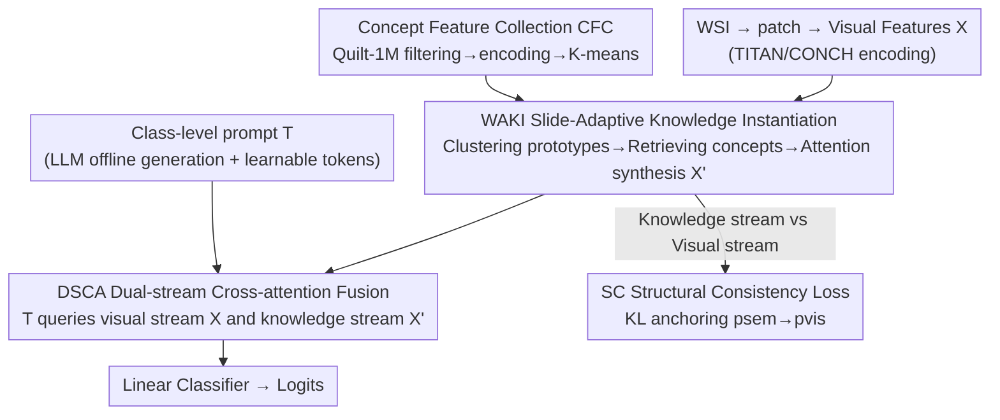

# Universal-to-Specific: Dynamic Knowledge-Guided Multiple Instance Learning for Few-Shot Whole Slide Image Classification

**Conference**: CVPR 2026  
**Paper**: [CVF Open Access](https://openaccess.thecvf.com/content/CVPR2026/html/Li_Universal-to-Specific_Dynamic_Knowledge-Guided_Multiple_Instance_Learning_for_Few-Shot_Whole_Slide_CVPR_2026_paper.html)  
**Code**: https://github.com/junjianli106/DyKo  
**Area**: Medical Imaging  
**Keywords**: Whole Slide Image Classification, Multiple Instance Learning, Few-Shot Learning, Pathological Vision-Language Model, Dynamic Knowledge Injection

## TL;DR
DyKo replaces the "static universal text descriptions" used in pathological Vision-Language Models (VLMs) with "dynamically instantiated knowledge for each slide." By first clustering slide-specific visual prototypes and then using these prototypes to retrieve and synthesize knowledge features for each patch from a concept bank, DyKo anchors the synthesized knowledge back to visual evidence using a structural consistency loss. It consistently outperforms existing MIL and prompt-based methods in 4/8/16-shot settings across four real-world cancer datasets.

## Background & Motivation
**Background**: Whole Slide Images (WSIs) are gigapixel-level images that only provide slide-level labels. Consequently, Multiple Instance Learning (MIL) has become the mainstream approach—treating a slide as a "bag" of thousands of patches and training only with bag-level labels. A recent trend involves integrating pathological VLMs (e.g., CONCH, TITAN, QuiltNet) to inject semantic priors into visual features using class-level text descriptions or pre-defined concept pools, as seen in methods like TOP, ViLa-MIL, ConcepPath, and FOCUS.

**Limitations of Prior Work**: The linguistic knowledge provided by these prompt/concept pool methods is **static and globally universal**. Whether it is a coarse-grained class description or a carefully selected fine-grained concept, the set is fixed for a given diagnostic task and **applied indiscriminately to all WSIs**.

**Key Challenge**: There is significant morphological heterogeneity between WSIs. Two slides of the same cancer type can vary greatly in histological presentation. A "one-size-fits-all" universal description fails to fit the specific visual evidence of an individual slide. This lack of dynamic adaptation to the unique patterns of each slide is a critical bottleneck limiting precise pathological diagnosis.

**Goal**: To transition semantic guidance from "static prompts" to "slide-adaptive knowledge instantiation"—customizing conceptual knowledge for each WSI and even each patch. However, dynamically synthesizing semantics introduces a new risk: the synthesized knowledge features might gradually decouple from their visual sources, creating histologically groundless "pseudo-concepts" (semantic drift).

**Core Idea**: Use "visual prototype-driven concept retrieval + attention synthesis" to instantiate universal knowledge at the patch level (universal-to-specific), while utilizing a structural consistency loss to pull the synthesized knowledge back into the visual space to prevent semantic drift.

## Method

### Overall Architecture
DyKo takes a WSI as input (divided into $N$ patches, with features $X \in \mathbb{R}^{N \times d}$ extracted using the TITAN visual encoder CONCH v1.5) and outputs a slide-level diagnostic category. The process involves two offline preparations and three online modules: Offline, a compact **Concept Feature Collection** ($C$, CFC) is built using the Quilt-1M corpus, and class-level text descriptions are generated by an LLM as prior prompts. Online, WAKI "instantiates" universal knowledge into patch-specific knowledge features $X'$. DSCA uses class prompts as queries to fuse the visual stream $X$ and knowledge stream $X'$. Finally, a linear classifier outputs logits, and a structural consistency loss $L_{SC}$ constrains the alignment of the two spaces.

### Key Designs

**1. Concept Feature Collection (CFC): Distilling pathological terms into a compact, discriminative concept set**

Prompt methods either rely on manually crafted concept pools or face noisy, redundant terms irrelevant to diagnosis. DyKo constructs this set automatically offline: using the Quilt-1M corpus (million-scale image-text pairs), candidate pathological concepts are filtered by expert-validated domain keywords. TITAN's text encoder encodes each concept into a $d$-dimensional vector, which are then clustered into $N_C$ groups using K-means. **Only the concept closest to each cluster center is retained** as a representative, resulting in the final concept set $C \in \mathbb{R}^{N_C \times d}$. This provides a clean knowledge base covering a broad range of pathological semantics. Ablations show that the optimal $N_C$ varies with data volume: $N_C=1000$ is best for 4-shot, while larger values are better for 8/16-shot.

**2. WAKI Slide-Adaptive Knowledge Instantiation: Three-stage knowledge landing (universal-to-specific)**

This is the core of DyKo, addressing the issue where static descriptions fail to align with individual slides. It instantiates universal concepts at the patch level in three stages. First, on-the-fly K-means is applied to the instance features $X$ of the current slide to form $M$ clusters. Each cluster center serves as a slide-specific **visual prototype** $u_j$:

$$u_j = \frac{1}{|S_j|} \sum_{x_i \in S_j} x_i$$

where $S_j$ is the set of instances assigned to cluster $j$. Every patch $x_i$ is uniquely bound to its corresponding prototype $u_j$. Second, these **slide-specific prototypes serve as queries** to retrieve the Top-K concepts from the bank $C$ based on cosine similarity, yielding a prototype-specific concept set $C_{u_j}^K = \{c_m \mid m \in \mathcal{I}_j\}$. Because prototypes are derived from the current slide, even slides of the same category will retrieve different concept sets. Third, for each patch, attention scores are calculated over its prototype's concept set:

$$\alpha_{i,c} = \frac{\exp(\text{sim}(x_i, c)/\tau)}{\sum_{c' \in C_{u_j}^K} \exp(\text{sim}(x_i, c')/\tau)}$$

The **knowledge-instantiated feature** $x'_i = \sum_{c \in C_{u_j}^K} \alpha_{i,c} \cdot c$ is then aggregated via weighted attention. Compared to the old paradigm of "fixed concepts shared across the entire dataset," WAKI allows knowledge to be "selected by slide and weighted by patch," converging universal knowledge onto specific visual evidence.

**3. DSCA Dual-stream Cross-attention Fusion: Querying visual and knowledge streams with class prompts**

After synthesizing $X'$, it must be integrated with the original visual features $X$ for diagnosis. DSCA uses class-level prompts $T$ (static descriptions $T_{static}$ from an LLM concatenated with learnable tokens $T_{learn}$, encoded by TITAN) as queries. It queries two streams in parallel: the visual stream $F_{vis} = \text{CrossAttn}(T, X, X)$ focuses on morphological regions related to high-level descriptions; the knowledge stream $F_{con} = \text{CrossAttn}(T, X', X')$ extracts slide-specific concepts aligned with class descriptions. Slide-level representations are obtained via element-wise addition $F_{fused} = F_{vis} + F_{con}$, and a linear classifier produces predictions for $L_{CE}$ end-to-end training.

**4. SC Structural Consistency Loss: Anchoring dynamic semantics to visual evidence**

Dynamic synthesis in WAKI has two risks: features may lack explicit constraints and drift away from their morphological basis, and concept generation may not be task-relevant. DyKo assumes that patch groups clustered by pathological concepts should maintain topological consistency with their visual pattern distribution. Two parallel clustering heads (FC-ReLU-FC-Softmax) generate probability distributions $p_{vis}$ and $p_{sem}$ from visual and knowledge-enhanced features, respectively. The visual distribution serves as the target for the semantic distribution to match via KL divergence:

$$L_{SC} = D_{KL}(p_{sem} \,\|\, p_{vis})$$

The overall objective is $L = L_{CE} + \lambda L_{SC}$ ($\lambda=1.0$). This term regularizes the visual space to retain concept relevance while firmly anchoring semantic knowledge to visual evidence.

### Loss & Training
The model is optimized end-to-end using $L = L_{CE} + \lambda L_{SC}$ with $\lambda=1.0$. Key hyperparameters: 10 visual prototypes per slide, 10 concepts per prototype, 16 learnable prompt tokens, and temperature $\tau=0.1$. WSIs are tiled into $448 \times 448$ patches at 20× magnification, with features extracted by TITAN. K-means is accelerated on GPU via Faiss. All prompt-based baselines use the same TITAN text encoder and class-level descriptions for fairness.

## Key Experimental Results

### Main Results
On four real-world cancer datasets (CAMELYON16, NSCLC, UBC-OCEAN, TCGA-RCC) under 4/8/16-shot settings with 4-fold cross-validation, DyKo was compared against 9 SOTAs (5 classic MIL + MiCo + 4 prompt methods). Table showing AUC/F1 results for DyKo vs. the strongest baseline FOCUS (selected):

| Dataset / Setting | Metric | FOCUS (Prev. SOTA) | DyKo | Gain |
|--------------|------|------|------|------|
| CAMELYON16 / 4-shot | AUC | 0.831 | **0.871** | +4.0% |
| CAMELYON16 / 8-shot | AUC | 0.918 | **0.956** | +3.8% |
| CAMELYON16 / 16-shot | AUC | 0.934 | **0.961** | +2.7% |
| NSCLC / 4-shot | AUC | 0.908 | **0.932** | +2.4% |
| UBC (5 classes) / 16-shot | F1 | 0.732 | **0.806** | +3.1% (vs SOTA) |
| RCC (3 classes) / 16-shot | AUC | 0.959 | **0.979** | +2.0% |

DyKo achieves SOTA across all datasets and shots. The advantage is most pronounced in data-scarce scenarios (4.0% lead over FOCUS on 4-shot CAMELYON16).

### Ablation Study (CAMELYON16, 4-shot AUC)
| Configuration | AUC | Delta from Full | Description |
|------|-----|-----------|------|
| DyKo (Full) | 0.871 | — | Full model |
| w/o SC | 0.750 | −0.121 | Largest drop without structural consistency loss |
| w/o DSCA | 0.756 | −0.115 | Replacing dual-stream attention with independent averaging |
| w/o WAKI | 0.773 | −0.098 | Visual stream only, reverting to static |

### Key Findings
- **SC loss is the primary contributor**: Removing it causes a drop of 12.1 points in 4-shot AUC. t-SNE shows that without it, knowledge features decouple from visual features entirely.
- **WAKI drives performance**: Removing it reduces the model to a visual-only stream, confirming the effectiveness of dynamic slide-specific knowledge.
- **Hyperparameter Sweet Spot**: $M=10$ prototypes and $K=10$ concepts per prototype are generally optimal.
- **Interpretability**: Attention maps accurately locate tumor regions. WAKI clusters show that high-attention tumor modules retrieve concepts like "malignant" and "adenocarcinoma," corroborated by pathologists.

## Highlights & Insights
- **Clean "universal-to-specific" paradigm**: By using slide prototype retrieval and patch attention synthesis, DyKo upgrades the "global prompt" to "patch-specific knowledge," a structural advancement over simply modifying prompt wording.
- **SC loss as a masterstroke**: It prevents the "unbounded creativity" of dynamic semantics by anchoring them to visual evidence. This anchoring strategy is transferable to other knowledge-enhanced vision tasks.
- **Interpretability loop**: Concepts retrieved can be verified by pathologists for each cluster, transforming black-box attention into a reviewable mapping between visual clusters and clinical terms.

## Limitations & Future Work
- **Overhead and stability of online K-means**: Inference requires on-the-fly clustering, which adds computational cost for large patch counts and may be sensitive to initialization and the choice of $M=10$.
- **Dependency on foundation models**: Performance relies heavily on the TITAN encoder and Quilt-1M knowledge base; its performance on rare diseases or organs without specialized foundation models remains an open question.
- **Static class prompts**: While concepts are dynamic, class-level descriptions remain fixed LLM-generated priors.

## Related Work & Insights
- **vs ConcepPath / TQx**: Unlike these which use fixed dataset-level pools, DyKo uses slide-specific prototypes for conditional retrieval, addressing morphological heterogeneity directly.
- **vs ViLa-MIL / TOP / FOCUS**: While these rely on global class-level prompts, DyKo sinks the guidance to the patch level with structural constraints, leading to a 4.0% AUC gain in 4-shot settings over FOCUS.
- **vs Classic MIL (ABMIL/TransMIL)**: Traditional MIL lacks semantic understanding; DyKo injects and anchors pathological semantics, showing significant advantages in few-shot scenarios.

## Rating
- Novelty: ⭐⭐⭐⭐ The shift from static to dynamic instantiation with structural anchoring is a substantial upgrade.
- Experimental Thoroughness: ⭐⭐⭐⭐ Comprehensive across four datasets and multiple shots, including ablation of LLMs, encoders, and hyperparameters.
- Writing Quality: ⭐⭐⭐⭐ Motivation and method are clearly structured and logically sound.
- Value: ⭐⭐⭐⭐ High potential for clinical diagnostic scenarios where data is scarce and interpretability is crucial.

<!-- RELATED:START -->

## Related Papers

- [\[CVPR 2026\] Contrastive Cross-Bag Augmentation for Multiple Instance Learning-based Whole Slide Image Classification](contrastive_cross-bag_augmentation_for_multiple_instance_learning-based_whole_sl.md)
- [\[CVPR 2026\] MUSE: Harnessing Precise and Diverse Semantics for Few-Shot Whole Slide Image Classification](muse_harnessing_precise_and_diverse_semantics_for_few-shot_whole_slide_image_cla.md)
- [\[ECCV 2024\] Pathology-knowledge Enhanced Multi-instance Prompt Learning for Few-shot Whole Slide Image Classification](../../ECCV2024/medical_imaging/pathology-knowledge_enhanced_multi-instance_prompt_learning_for_few-shot_whole_s.md)
- [\[CVPR 2026\] Dual-Level Hypergraph Generation for Addressing Feature Scarcity in Whole-Slide Image Classification](dual-level_hypergraph_generation_for_addressing_feature_scarcity_in_whole-slide_.md)
- [\[CVPR 2026\] TopoSlide: Topologically-Informed Histopathology Whole Slide Image Representation Learning](toposlide_topologically-informed_histopathology_whole_slide_image_representation.md)

<!-- RELATED:END -->
