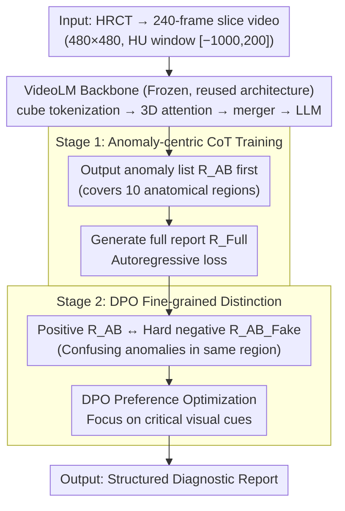

# Unleashing Video Language Models for Fine-grained HRCT Report Generation

**Conference**: CVPR 2026  
**arXiv**: [2603.12469](https://arxiv.org/abs/2603.12469)  
**Code**: [GitHub](https://anonymous.4open.science/r/hrct-report-generation-video-vlm-728C/)  
**Area**: Medical Imaging  
**Keywords**: CT report generation, Video-Language Models, Chain-of-Thought, DPO, Anomaly Detection

## TL;DR

This paper proposes AbSteering, a two-stage framework that utilizes anomaly-centric CoT reasoning and DPO hard-negative contrastive learning to efficiently adapt general-purpose VideoLMs for HRCT report generation, significantly surpassing specialized CT foundation models in clinical efficacy.

## Background & Motivation

**Clinical Demand**: High-resolution computed tomography (HRCT) is a critical modality for the diagnosis and longitudinal monitoring of chest and cardiopulmonary diseases. AI-driven report generation can reduce clinical workload, standardize diagnostic narratives, and mitigate inter-observer variability. However, compared to 2D X-rays, 3D HRCT report generation faces greater challenges: each study contains hundreds of slices, entailing massive computational and memory overhead; meanwhile, clinically critical anomalies are often subtle, spatially localized, and diverse, sparsely distributed within volumes and frequently obscured by dominant normal anatomical structures.

**Limitations of Prior Work**: Early methods compressed CT volumes into low-dimensional representations and reused X-ray report generators, leading to severe information loss. Subsequent works like Dia-LLaMA designed CT-specific vision encoders interfaced with LLM decoders. Recent modality-specific foundation models (RadFM, CT-CHAT, M3D) further improved performance but still rely on training from scratch or extensive fine-tuning of modality-specific encoders, which is data and computationally expensive and still struggles with fine-grained recognition of long-tail anomalies.

**Key Insight**: HRCT volumes can naturally be viewed as "video-like slice sequences." The architecture of VideoLMs (spatio-temporal tokenization + 3D attention + token pooling + LLM decoding) is essentially similar to CT foundation models; the difference lies not in the architecture but in the training domain and supervision signals. This leads to three key questions: (1) Can VideoLM encoders capture clinically relevant 3D features? (2) How can general VideoLMs be efficiently adapted to domain-specific medical report generation? (3) How does this transfer perform compared to modality-specific CT foundation models?

## Method

### Overall Architecture

The starting point of AbSteering is counter-intuitive: rather than training a modality-specific foundation model for CT from scratch, it treats a **general-purpose VideoLM directly as the backbone**. Since HRCT is essentially a sequence of slices, its structure is nearly isomorphic to the "spatio-temporal token + 3D attention + token merging + LLM decoding" pipeline of VideoLMs. The effort is focused on language-side "steering": the **vision encoder is kept frozen**, and two training stages "steer" the general model into the HRCT report domain. Stage 1 uses anomaly-centric Chain-of-Thought training to force the model to identify all anomalies before writing the report; Stage 2 uses DPO with clinically confusing hard negatives to force the model to distinguish subtle anomalies. One improves recall, the other improves precision. The input is a 240-frame CT slice video, and the output is a structured diagnostic report.

### Key Designs

**1. VideoLM Backbone: Direct reuse of spatio-temporal reasoning without architectural changes**

This is the prerequisite for the method. The input video $X \in \mathbb{R}^{T \times H \times W \times C}$ is segmented into visual tokens via spatio-temporal cube tokenization, passed through a Transformer with factorized 3D positional embeddings, and then compressed by a merger into language-aligned representations for LLM decoding. The general VideoLM is used because its architecture nearly maps one-to-one with CT foundation models; since spatio-temporal reasoning is already pre-trained on large-scale videos, there is no need to re-train the encoder for CT. This is validated on Qwen2.5-VL-7B and InternVL3-8B.

**2. Anomaly-centric Chain-of-Thought Training (Stage 1): Decomposing "reporting" into "detection then description"**

The difficulty of HRCT lies in subtle anomalies being overwhelmed by normal anatomy. Direct vision-to-text often leads to models following a "mostly normal" prior, resulting in hallucinations. The CoT approach explicitly extracts the reasoning chain: first, standardize raw CT-RATE reports into a `(region: abnormality)` template covering 10 anatomical regions (Lung, Trachea and Bronchi, Mediastinum, Heart, Esophagus, Pleura, Bone, Thyroid, Breast, Abdomen). GPT-4o is used to categorize report sentences into corresponding regions, followed by manual verification to obtain the CT-RATE-AB dataset. During training, the target sequence is concatenated as $Y = [R_{AB}; R_{Full}]$.

$$\mathcal{L}_{gen} = -\sum_{t=1}^{T} \log P(y_t \mid x, y_{<t})$$

This is effective because the "list anomalies" step prioritizes diagnostic reasoning before report generation, forcing the model to enumerate diseases across regions and suppressing hallucinations dominated by normal tissues.

**3. DPO-based Fine-grained Anomaly Distinction (Stage 2): Forcing focus on details via clinical hard negatives**

CoT improves recall, but not necessarily precision. CT anomalies often look similar visually and require domain-specific knowledge to distinguish. Stage 2 uses DPO to address this: the ground truth $R_{AB}$ serves as the positive sample, and GPT-4o constructs hard negatives $R_{AB\_Fake}$ by replacing the target anomaly with a **clinically confusing** alternative in the same region, keeping the template and location identical. The model $\pi_\theta$ is optimized relative to the frozen Stage 1 reference model $\pi_{ref}$:

$$\mathcal{L}_{DPO} = \log \sigma\!\left(\beta \log \frac{\pi_\theta(y_w \mid x,v)}{\pi_{ref}(y_w \mid x,v)} - \beta \log \frac{\pi_\theta(y_l \mid x,v)}{\pi_{ref}(y_l \mid x,v)}\right)$$

Where $y_w = R_{AB}$ is the correct report and $y_l = R_{AB\_Fake}$ is the tampered one. This forces the model to attend to subtle visual cues that determine the correct diagnosis rather than relying on language priors.

### Loss & Training

- **Stage 1**: Standard autoregressive cross-entropy loss with the target sequence as the concatenated anomaly list and full report $[R_{AB}; R_{Full}]$.
- **Stage 2**: DPO loss with hyperparameter $\beta$ controlling the deviation from the reference model.
- **Data Preprocessing**: Each HRCT is converted to a 240-frame, 480×480 pixel video, HU window [-1000, 200], saved as MP4 at 18fps.
- **Training Setup**: 2 × 80GB A100 GPUs, total batch size 4; vision encoder frozen, no LoRA fine-tuning.
- **Dataset**: CT-RATE training set (46,717 scans, 20,000 patients), verification set (3,039 scans, 1,314 patients).

## Key Experimental Results

### Main Results

Comprehensive comparison on the CT-RATE benchmark evaluating Natural Language Generation (NLG) and Clinical Efficacy (CE) metrics:

| Method | BL-1 | BL-4 | RG-L | BERT | CE Micro P | CE Micro R | CE Micro F1 | CE Macro F1 | CE Wtd F1 | CE Samp F1 |
|------|------|------|------|------|-----------|-----------|------------|------------|----------|----------|
| CT2Rep | 47.91 | 28.04 | 45.43 | 88.10 | 26.39 | 10.50 | 14.10 | 10.65 | 11.35 | 10.86 |
| RadFM | 50.20 | 17.02 | 30.46 | 86.17 | 36.10 | 13.48 | 19.63 | 13.05 | 17.74 | 12.14 |
| Reg2RG | 44.89 | 21.08 | 24.41 | 86.18 | 28.47 | 11.06 | 15.93 | 10.48 | 14.51 | 12.19 |
| CT-CHAT | 42.81 | 17.63 | 32.50 | 86.35 | 25.13 | 37.48 | 30.08 | 21.66 | 28.35 | 25.31 |
| M3D-8B | 44.95 | 22.98 | 37.76 | 87.52 | 47.60 | 28.54 | 35.69 | 26.74 | 33.13 | 25.21 |
| Qwen2.5-VL-7B | 43.67 | 21.25 | 36.71 | 87.30 | 48.06 | 25.88 | 33.64 | 25.57 | 32.19 | 24.95 |
| InternVL3-8B | 45.57 | 22.05 | 38.49 | 87.40 | 53.57 | 37.99 | 44.45 | 38.91 | 43.28 | 32.14 |
| M3D-AbSteer | 45.22 | 23.09 | 38.58 | 87.83 | 44.95 | 41.66 | 43.24 | 36.18 | 41.89 | 36.54 |
| Qwen2.5-VL-AbSteer | 45.64 | 21.40 | 37.99 | 87.13 | 49.15 | 43.22 | 45.99 | 37.90 | 44.05 | 37.39 |
| **InternVL3-AbSteer** | **48.32** | **23.58** | **40.49** | 87.59 | **57.88** | **51.58** | **54.55** | **47.66** | **52.80** | **44.80** |

### Ablation Study

**Ablation of AbSteering strategy** (based on InternVL3-8B):

| Configuration | CE Micro P | CE Micro R | CE Micro F1 |
|------|-----------|-----------|------------|
| Baseline (No steering) | 53.57 | 37.99 | 44.45 |
| + CoT (Stage 1) | — | ↑↑ | ↑ |
| + CoT + DPO (Full AbSteering) | 57.88 | 51.58 | 54.55 |

CoT significantly improves recall, while DPO further improves precision and suppresses hallucinations, together achieving an F1 gain from 44.45 to 54.55 (+22.7%).

**Ablation of Vision Encoder** (based on Qwen2.5-VL + Stage 1 CoT):
- **Training from scratch**: Sharp performance drop.
- **Frozen pre-trained encoder**: Optimal.
- **LoRA fine-tuning**: No additional gain.

**Ablation of LLM Scale**:
- 7B models perform well, but 32B models show a performance drop, suggesting the bottleneck is in vision-text alignment rather than LLM capacity.

### Key Findings

- **General VideoLMs demonstrate strong transferability**: InternVL3-8B without steering achieves a CE Micro-F1 of 44.45, already surpassing the specialized M3D-8B (35.69).
- **AbSteering yields massive gains**: InternVL3 with AbSteering improves CE Micro-F1 from 44.45 to 54.55 (+22.7%).
- **Video pre-training is crucial**: Training from scratch leads to failure; freezing the pre-trained encoder is sufficient, meaning spatio-temporal features from general videos are robust enough for CT.
- **LLM capacity is not the current bottleneck**: Scaling to 32B did not help, pointing to alignment as the critical link.
- **VideoLMs achieve the highest recall without increasing hallucinations**.

## Highlights & Insights

1. **Successful validation of cross-modal transfer**: Proves that spatio-temporal reasoning from general video pre-training can efficiently transfer to 3D medical imaging, offering a data-efficient and computationally friendly alternative to training modality-specific foundation models.
2. **Two-stage design addresses root causes**: CoT solves the "missed anomalies" (recall) problem via explicit reasoning, and DPO solves "distinction" (precision) via clinical hard-negative comparison.
3. **Frozen encoder implication**: The lack of benefit from LoRA suggests that general VideoLM features are already generalized; domain adaptation is effectively handled at the language steering level.
4. **Contribution of structured CoT dataset**: CT-RATE-AB provides a region-abnormality mapping that facilitates further research in structured reporting.

## Limitations & Future Work

- **Single dataset validation**: Only evaluated on CT-RATE (chest CT); generalization to other regions (abdomen, head) remains to be seen.
- **GPT-4o dependency**: Report structuring and hard negative construction rely on GPT-4o, introducing potential bias and costs.
- **HU information loss**: Mapping CT values to MP4 format inevitably loses some radiological density precision.
- **Clinical Deployment**: Evaluation relies on automated metrics (RadBERT); further human evaluation by radiologists is required.

## Related Work & Insights

- **CT Report Generation**: CT2Rep set the benchmark; M3D and CT-CHAT explored specialized 3D medical foundation models. This work proves that general VideoLMs with proper steering can outperform these specialized models.
- **VideoLM in Medicine**: One of the first systematic studies on transferring VideoLMs to 3D medical imaging, opening new paths for reusing general spatio-temporal pre-training knowledge.

## Rating

| Dimension | Rating |
|------|------|
| Novelty | ⭐⭐⭐⭐ |
| Experimental Thoroughness | ⭐⭐⭐⭐ |
| Writing Quality | ⭐⭐⭐⭐ |
| Value | ⭐⭐⭐⭐ |

<!-- RELATED:START -->

## Related Papers

- [\[CVPR 2026\] MorphSeek: Fine-grained Latent Representation-Level Policy Optimization for Deformable Image Registration](morphseek_fine-grained_latent_representation-level_policy_optimization_for_defor.md)
- [\[CVPR 2026\] Phrase-grounded APO for Improving Chest X-ray Report Generation](phrase-grounded_apo_for_improving_chest_x-ray_report_generation.md)
- [\[CVPR 2026\] Personalized Longitudinal Medical Report Generation via Temporally-Aware Federated Adaptation](personalized_longitudinal_medical_report_generation_via_temporally-aware_federat.md)
- [\[CVPR 2026\] EchoVDiff: Cardiac-Cycle Echocardiography Video Generation from Arbitrary Single Frame](echovdiff_cardiac-cycle_echocardiography_video_generation_from_arbitrary_single_.md)
- [\[CVPR 2026\] F$^2$-Assist: Multi-Phase Fetal Growth Forecast and Report Generation from Ultrasound Examination](f2-assist_multi-phase_fetal_growth_forecast_and_report_generation_from_ultrasoun.md)

<!-- RELATED:END -->
