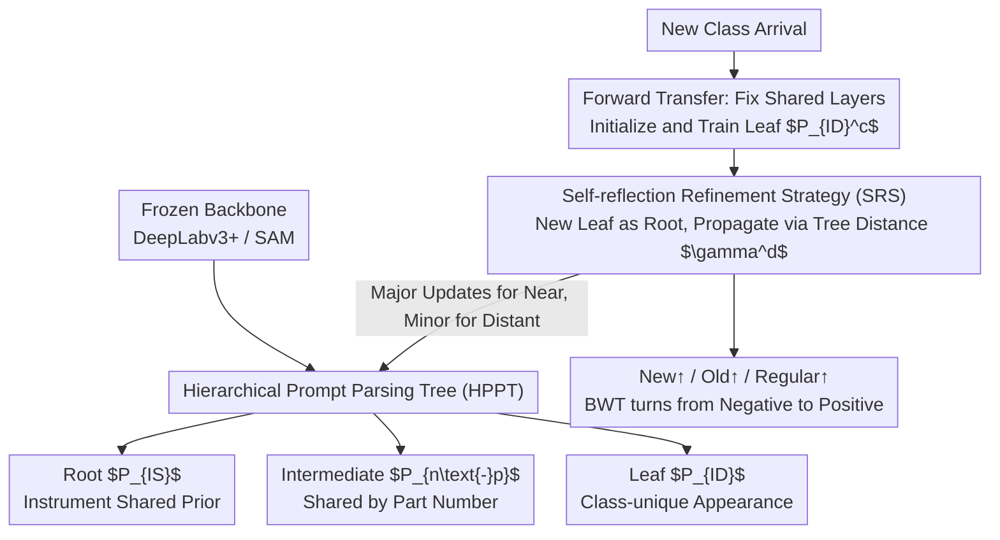

# Unlocking Positive Transfer in Incrementally Learning Surgical Instruments: A Self-reflection Hierarchical Prompt Framework

**Conference**: CVPR 2026  
**arXiv**: [2604.02877](https://arxiv.org/abs/2604.02877)  
**Code**: No public code available  
**Area**: Medical Imaging / Surgical Video Analysis  
**Keywords**: Class-incremental Segmentation, Surgical Instruments, Hierarchical Prompts, Positive Transfer, Backward Transfer

## TL;DR

This paper transforms the prompt parameters of each instrument class from "isolated independent prompts" into a "tree structure where shared knowledge is decomposed layer by layer." This enables new instruments to inherit existing knowledge for rapid learning while allowing new knowledge to conversely and gently refine old knowledge. Consequently, it simultaneously enhances performance across new, common, and old categories in incremental surgical instrument segmentation.

## Background & Motivation

Surgical video segmentation differs from general semantic segmentation scenarios because instrument categories expand continuously, and data typically arrives in batches. Many surgical instruments appear only in a few surgeries, while others appear in almost every surgery. Thus, a real-world system acts more like "continuously collecting new instrument data to augment model capabilities" rather than training statically on a complete dataset.

Existing class-incremental segmentation methods primarily focus on "preventing forgetting." While important, they often harbor a conservative assumption: old knowledge only needs preservation and should remain untouched. The issue is that surgical instruments are highly structured objects; different instruments often share intermediate semantics such as shaft shapes, the number of components at the gripping end, and outer contours. If each class's prompt is trained and frozen independently, the model cannot explicitly reuse "instrument-shared knowledge" or "shared knowledge between instruments with the same number of components."

The authors dismantle the problem into two directions. First, **Forward Knowledge Transfer**: whether knowledge of old instruments can help new instruments converge faster. Second, **Backward Knowledge Transfer**: whether features learned from new instruments can refine old knowledge representations rather than just archiving them. Many continual learning works only control forgetting without systematically utilizing these two types of positive transfer.

The observation in this paper is direct and persuasive. For new instruments, what truly needs to be learned from scratch is usually only the "specificity that distinguishes that instrument," rather than the entire set of visual knowledge from edges to components to contours. For old instruments, the introduction of new ones changes the definition of "what counts as specificity." For instance, if a grip shape was previously unique but later discovered across multiple instruments, the old knowledge should be reclassified into a shared layer instead of remaining as an overly exclusive memory.

Therefore, the core goal of this paper is not merely to reduce forgetting but to turn class-incremental segmentation into a process of "continuously reorganizing the knowledge structure as categories expand." Accordingly, the authors propose a Hierarchical Prompt Parsing Tree and a Self-reflection Refinement Strategy to allow knowledge to be both inherited and back-propagated.

## Method

### Overall Architecture

The overall framework is built on frozen large-model backbones, with the paper highlighting two backends: the traditional DeepLabv3+ and the more powerful SAM. The authors do not retrain the entire backbone; instead, they incrementally append instrument-aware prompts and class-specific segmentation heads on top of the pre-trained model.

In each incremental episode, the current data includes three types of instruments:

- **Regular classes**: Common instruments appearing in both historical and current episodes.
- **Old classes**: Instruments learned in history that no longer appear in the current episode.
- **New classes**: Totaly unknown instruments appearing for the first time in the current round.

The overall strategy can be summarized in one sentence: incremental learning is no longer about "adding an independent parameter block for a new class" but "attaching new leaves to a knowledge tree and allowing local rearrangement of the tree." Specifically, the encoder backbone remains frozen, with only the adapters and decoders trained in the initial stage. Each instrument class corresponds to a set of hierarchical prompts rather than a flat prompt. When a new class arrives, the model does not relearn the full prompt but only adds the most specific layer for that class. After learning the new class, a "self-reflection" round is triggered to refine existing nodes. The following three key designs define the structure, growth, and back-flow rules of this tree.

### Key Designs

**1. Hierarchical Prompt Parsing Tree (HPPT): Changing "One Prompt Per Class" to Layered Shared Knowledge**

Instruments naturally share intermediate semantics like shaft morphology, part counts, and silhouettes, but flat prompts lock these features individually, preventing reuse. HPPT splits each class's prompt into three layers: the root node is the instrument shared partition $P_{IS}$, carrying common visual priors like "it is a surgical instrument"; intermediate nodes $P_{n\text{-}p}$ are organized by component count, allowing instruments with $n$ parts to share mid-level semantics; leaf nodes $P_{ID}^c$ characterize the unique appearance of each class. Once this tree is established, a new class with $k$ parts does not need to relearn from the root; it simply attaches its leaf to the corresponding $k$-part intermediate node, inheriting the root and intermediate nodes directly. Its value lies in explicitly separating "reusable knowledge" from "must-relearn knowledge" in the parameter structure—compared to independent prompt training, it reduces learning difficulty and utilizes hierarchical similarity as an inductive bias.

**2. Forward Transfer-driven New Class Learning: Learning Differences instead of Commonalities**

With this tree, the learning burden for new classes is minimized. In the initial stage $t=1$, the model learns $P_{IS}$, various $P_{n\text{-}p}$ groups, and individual $P_{ID}$ leaves for all initial classes. When new classes $c$ appear at $t\ge 2$, the authors freeze the already-trained shared components and only create and optimize the leaf $P_{ID}^c$ and its corresponding segmentation head. The three-layer prompts are inserted into the decoder at different depths via cross-attention, refining semantics from shallow to deep: shallow layers align with "being an instrument," mid-layers align with "structural segments," and deep layers target unique details. Since the shared layers have already clarified the first two aspects, the new class only needs to supplement difference information like distal tips, edge morphology, and handle details. Forward transfer thus significantly reduces the sample size required to learn new classes.

**3. Self-reflection Refinement Strategy (SRS): Feeding Back New Knowledge to Old Nodes**

The introduction of new classes can change the definition of "specificity"—a handle shape that was once unique might be common once multiple instruments share it. SRS handles this backward transfer: for every new class added, it converts the current tree into a directed weighted graph rooted at the new leaf. Edges diffuse outward from the new node, with weights decaying exponentially with tree distance $\gamma^d$, meaning nodes closer to the new knowledge are updated more, while distant nodes remain stable. Subsequently, propagation is performed using a directed graph network, with a teleport term added to ensure the transition matrix is solvable. This step is the key source of backward transfer: rather than crudely fine-tuning all historical prompts, the authors make the update magnitude strictly dependent on tree distance. This allows merging "no-longer-unique old features" and correcting shared representations while suppressing forgetting.

### A Complete Example: Attaching a New Instrument and Refining the Tree

Suppose an initial episode has learned a tree: under the root $P_{IS}$ sit a "2-part" node $P_{2\text{-}p}$ and a "3-part" node $P_{3\text{-}p}$, each with its old instrument leaves (e.g., bipolar forceps under $P_{2\text{-}p}$). Now, a new 3-part instrument $c$ arrives in a new episode.

The first step is Forward Transfer: the model keeps the root and $P_{3\text{-}p}$ fixed, using them to tell the new leaf "you are an instrument and have 3 structural segments." Only the leaf $P_{ID}^c$ and its head are trained to learn the distal morphology distinguishing it from other 3-part instruments—compressing the learning volume to a single "leaf layer."

The second step triggers SRS Backward Transfer: a directed graph is built with new leaf $c$ as the root. Old leaves sharing the same $P_{3\text{-}p}$ parent have the smallest distance ($d$ is small, $\gamma^d$ is large) and receive the most updates. 2-part instruments separated by intermediate nodes are further away, and their knowledge is only slightly touched after $\gamma^d$ decay. The root, being furthest, remains almost untouched. After propagation, if the "specificity" of an old leaf overlaps with the new instrument, that knowledge is shifted up and merged into the shared layer. The final effect is the trend seen in the tables: while the new class is learned, the IoU of old and regular classes also increases, and BWT flips from negative to positive.

### Loss & Training

The training objective remains category-wise segmentation cross-entropy, but the parameter scope changes across stages.

- **Initial Episode**: Train adapters, decoders, all segmentation heads, and all three prompt layers.
- **Subsequent Episodes**: Keep segmentation heads of old classes frozen; for new classes, only train the `P_ID^c` and the corresponding head.
- **Self-reflection Stage**: Fix the main network and update tree node representations via the directed graph propagation module.

The authors validate this on both DeepLabv3+ and SAM backbones, demonstrating that the method is not just effective for foundation models but is a general strategy for prompt organization and updates.

## Key Experimental Results

### Main Results

The authors experimented on two continuous data streams. The first is Nephrectomy instrument segmentation (EndoVis 2017→2018); the second is Cholecystectomy instrument segmentation (CholecSeg8k→M2CAI-Seg). The paper reports final episode IoU, along with BWT/FWT across episodes.

| Data Stream / Method | Old Classes | Regular Classes | New Classes | All | BWT | FWT |
|---|---:|---:|---:|---:|---:|---:|
| Nephrectomy Seq-F | 43.95 | 64.50 | 35.09 | 35.09 | -0.88 | 5.62 |
| Nephrectomy Ours (DeepLabv3+) | 54.81 | 63.98 | 40.92 | 40.92 | 6.22 | 6.96 |
| Nephrectomy Ours (SAM) | 73.48 | 65.67 | 59.44 | 59.44 | 1.55 | 1.22 |
| Nephrectomy Joint-T (Upper Bound) | 79.79 | 71.45 | 63.16 | 63.16 | - | - |

| Data Stream / Method | Old Classes | Regular Classes | New Classes | All | BWT | FWT |
|---|---:|---:|---:|---:|---:|---:|
| Cholecystectomy Seq-F | 39.07 | 53.67 | 46.82 | 46.82 | -12.52 | -1.00 |
| Cholecystectomy CAT-SD | 55.14 | 62.39 | 51.74 | 51.74 | -0.13 | 0.92 |
| Cholecystectomy Ours (DeepLabv3+) | 58.08 | 66.18 | 56.12 | 56.12 | 3.24 | 5.70 |
| Cholecystectomy Ours (SAM) | 74.90 | 80.85 | 62.58 | 62.58 | 2.80 | 0.69 |

The most noteworthy aspect of these tables is the trend: the proposed method not only scores higher on new classes but also improves old/regular classes, indicating that both forward and backward transfer are effectively at play.

### Ablation Study

The authors split the method into two key components: `HPPT` (Hierarchical Prompt Tree) and `SRS` (Self-reflection Strategy).

| Backbone / Config | Old Classes | Regular Classes | New Classes | All |
|---|---:|---:|---:|---:|
| SAM Baseline | 21.42 | 69.11 | 22.24 | 48.15 |
| SAM + HPPT | 65.29 | 69.23 | 22.16 | 57.89 |
| SAM + HPPT + SRS | 68.52 | 70.67 | 22.30 | 59.44 |
| DeepLabv3+ Baseline | 3.93 | 45.99 | 5.37 | 27.62 |
| DeepLabv3+ + HPPT + SRS | 22.46 | 59.79 | 12.19 | 40.92 |

### Key Findings

- Adding HPPT alone leads to substantial improvements, especially for old/regular classes, proving that "hierarchical inheritance" effectively structures knowledge reuse.
- Adding SRS on top of HPPT continues to improve results, showing that backward transfer is not just a gimmick; reorganizing the old tree after learning new classes is genuinely valuable.
- The SAM version is consistently higher than DeepLabv3+, but both benefit from the same framework, indicating the method is well-decoupled from the backbone.
- Compared to Seq-F and various continual learning baselines, the BWT of this method often flips from negative to positive, demonstrating actual backward improvement rather than just "less forgetting."

## Highlights & Insights

- The biggest highlight is transforming prompts from "class-exclusive parameter slots" into a "parsable knowledge structure." Once the structure is explicitly modeled, forward and backward transfer have concrete anchors rather than remaining abstract slogans.
- By splitting into "Instrument Shared → Part Shared → Class Specific" layers, the authors incorporate inductive biases for highly structured objects into continual segmentation. This design is more inherent to the problem than the memory replay commonly seen in general continual learning.
- The directed weighted propagation of SRS is clever. Many methods risk large-scale fine-tuning of historical parameters when attempting backward transfer, but this work limits updates to relevant localities via tree distance decay, achieving a reasonable balance between "updating" and "preserving."
- Validating the approach on both CNN and foundation model solutions suggests this is a contribution at the "knowledge organization layer" rather than a trick dependent on a specific architecture.

## Limitations & Future Work

- The current tree structure relies on "part count," which is a manually defined mid-level semantic. This works for instruments but might not be suitable for more complex or continuous visual concepts; future work could consider automatic discovery of intermediate nodes.
- SRS uses graph propagation with fixed decay, meaning update intensity is governed by a handcrafted distance function. If the true relationship between categories deviates from tree distance, it might lead to suboptimal updates.
- Experiments cover two surgical data streams with a limited number of episodes. Further validation is needed to see if the hierarchical tree becomes too deep or sparse as the number of categories expands to dozens.
- The method inherently requires priors like "how many parts comprise the new instrument." A more practical system might need to predict these structural attributes simultaneously to achieve true automation.
- A promising future direction is extending this hierarchical prompt idea to vision-language surgical assistants, allowing detection, segmentation, and VQA to share a cross-task knowledge tree.

## Related Work & Insights

- **vs. Independent Prompt Bank Methods**: Traditional approaches store class prompts independently, which is stable but lacks reuse; this work organizes prompts hierarchically, significantly enhancing reusability.
- **vs. Typical Continual Segmentation Methods**: SI, LwF, MiB, and PLOP focus on distillation, regularization, and preserving old knowledge; this work additionally addresses how old knowledge helps new classes and how new classes refine old knowledge.
- **vs. Foundation Model Adaptation**: Many works merely use SAM as a frozen backbone and tune it; this paper explores how to perform sustainable class expansion on top of SAM, which is particularly meaningful for medical scenarios.
- **Personal Insight**: Incremental learning does not strictly have to revolve around replay buffers. For category systems with clear structures, decomposing knowledge and defining transfer paths can be more effective than simple memory replay.

## Rating

- **Novelty**: ⭐⭐⭐⭐⭐ Integrating both forward and backward transfer into incremental surgical segmentation via a hierarchical prompt tree is a very complete concept.
- **Experimental Thoroughness**: ⭐⭐⭐⭐ Solid evidence with dual data streams, dual backbones, upper bounds, and multiple baselines, though longer episode sequences could be explored.
- **Writing Quality**: ⭐⭐⭐⭐ Clear motivation, well-structured method diagrams, and easy-to-follow mapping between formulas and the architecture.
- **Value**: ⭐⭐⭐⭐⭐ Highly relevant for continuous incremental updates in clinical settings, serving as a foundational scheme for the continuous adaptation of medical foundation models.

<!-- RELATED:START -->

## Related Papers

- [\[CVPR 2026\] Focus-to-Perceive Representation Learning: A Cognition-Inspired Hierarchical Framework for Endoscopic Video Analysis](focus-to-perceive_representation_learning_a_cognition-inspired_hierarchical_fram.md)
- [\[CVPR 2026\] Bridging Brain and Semantics: A Hierarchical Framework for Semantically Enhanced fMRI-to-Video Reconstruction](bridging_brain_and_semantics_a_hierarchical_framework_for_semantically_enhanced_.md)
- [\[CVPR 2026\] H2-Surv: Hierarchical Hyperbolic Multimodal Representation Learning for Survival Prediction](h2-surv_hierarchical_hyperbolic_multimodal_representation_learning_for_survival_.md)
- [\[CVPR 2026\] Learning Generalizable 3D Medical Image Representations from Mask-Guided Self-Supervision](learning_generalizable_3d_medical_image_representations_from_mask-guided_self-su.md)
- [\[CVPR 2026\] Benchmarking Endoscopic Surgical Image Restoration and Beyond](benchmarking_endoscopic_surgical_image_restoration_and_beyond.md)

<!-- RELATED:END -->
