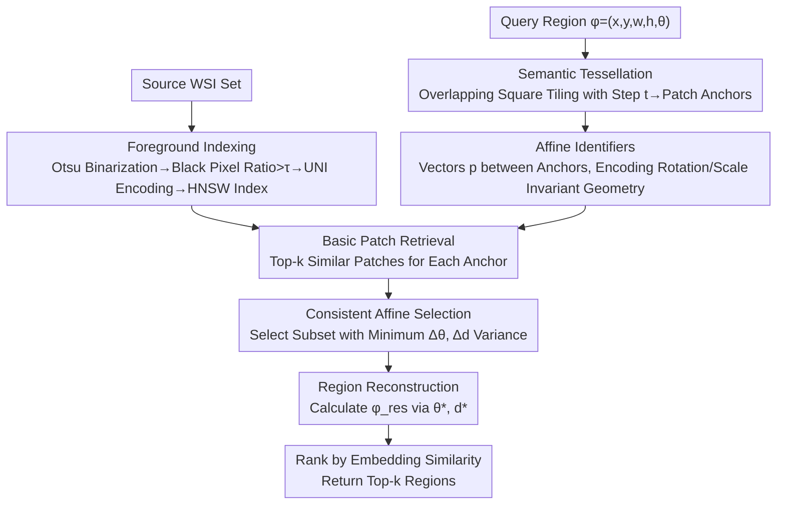

# URICA: A Uniformity Region Affine Identifier Capture Algorithm for Arbitrary Region Retrieval in Pathology Images

**Conference**: CVPR 2026  
**Paper**: [CVF Open Access](https://openaccess.thecvf.com/content/CVPR2026/html/Su_URICA_A_Uniformity_Region_Affine_Identifier_Capture_Algorithm_for_Arbitrary_CVPR_2026_paper.html)  
**Code**: https://github.com/HKUSTMDI/URICA-CVPR26  
**Area**: Medical Image  
**Keywords**: Whole Slide Image Retrieval, Pathology Images, Arbitrary Region Retrieval, Affine Invariance, Tessellation Representation

## TL;DR
URICA redefines region retrieval in Whole Slide Images (WSI) as a "semantic optimal matching problem under arbitrary spatial transformations." By using semantic tessellation to organize patch features from foundation models into geometrically aware region descriptors and applying rotation/scale-invariant "affine identifiers" for consistency matching, it achieves a 98.38% slide-level retrieval accuracy on 24,811 TCGA WSIs and supports retrieval of regions with arbitrary orientations and sizes for the first time.

## Background & Motivation
**Background**: Whole Slide Images (WSIs) are gigapixel-level tissue scans and form the foundation of digital pathology. Current WSI retrieval (finding the most similar tissue) mainly follows two paths: methods based on fixed-size patches (Yottixel, DRA-Net) and methods based on global representations of the entire slide (SISH, RetCCL, HSHR).

**Limitations of Prior Work**: Both paths are detached from actual clinical workflows. Pathologists examine regions of arbitrary orientation and size (e.g., a diagonal region at the boundary between normal tissue and a tumor) rather than pre-defined square patches or entire slides. Patch methods focus on isolated blocks and lose the spatial context required to reconstruct a complete region; slide-level methods compress fine-grained morphology into a global vector, failing to retrieve region-specific patterns such as mucinous carcinoma or ductal carcinoma in situ.

**Key Challenge**: There are no "pre-defined objects" in WSIs—region boundaries, orientations, and scales vary freely, making it difficult to construct a representation that maintains region-level semantics under various transformations. This breaks down into two sub-problems: (1) How to represent arbitrary regions? While pixel-level masks are ideal, enumerating and storing region representations for all scales and rotations is infeasible. Self-supervised foundation models (UNI, PathDino) provide patch-level semantics but lack an explicit mechanism to combine these patches into a consistent representation for arbitrary regions. (2) How to maintain spatial and semantic consistency? Existing systems fail to match regions when they are rotated or scaled. Rotation-aware detection methods for discrete objects (ReDet, AO2-DETR) fail in pathology because tissue regions are continuous and dense without clear object boundaries.

**Goal**: To formalize WSI region retrieval as a "semantic optimal matching problem under arbitrary spatial transformations (rotation + scaling)" and to create a region-level representation that expresses arbitrary regions while remaining stable under transformation.

**Key Insight**: Replace "pixel masks / global vectors" with "tessellation + affine identifiers." First, patch features from foundation models are organized into geometrically consistent region descriptors via regular tessellation. Then, a rotation/scale-invariant geometric signature (affine identifier) is constructed between descriptors. This reduces region matching to "finding a set of identifiers with uniform angle and scale differences" and theoretically proves that this sparse tessellation can approximate ideal pixel-level mask similarity.

## Method

### Overall Architecture
The input to URICA is a query region (a rectangle with orientation and size $\phi=(x,y,w,h,\theta)$), and the output consists of the most similar candidate regions in the database. The pipeline is divided into three stages: (a) **Offline Indexing**—Source WSIs are tiled into foreground patches, encoded by a foundation model, and stored in a vector index; (b) **Query Region Processing**—The query region is tessellated into a set of patch anchors with spatial locations, and affine identifiers are constructed between them; (c) **Online Retrieval**—For each query anchor, top-k similar patches are retrieved, the rotation difference $\Delta\theta$ and scale difference $\Delta d$ are estimated for every anchor pair, and the subset with the highest consistency (minimum variance) is selected to locate and reconstruct the target region, finally returning the top-k results ranked by embedding similarity.

The essence of the method is converting the question of "how a region transforms" into "whether the angle and scale differences of a set of geometric identifiers are uniform." If a subset exists where $\Delta\theta$ and $\Delta d$ converge to the same value for all identifiers, it indicates a true correspondence rather than a false positive with similar semantics but displaced structure.

### Key Designs

**1. Semantic Tessellation: Assembling patch features into geometric descriptors for arbitrary regions**

Foundation models only provide reliable patch semantics at a "minimum semantic granularity $s^*$" (e.g., UNI encoding $224\times224$ patches at $5\times$ magnification). To represent a region larger than a single patch or one placed diagonally, URICA applies **overlapping square tiling** with a fixed step $t$ within the region $r_\phi$. Each tiling unit is a semantic anchor $m_{\phi_g}$, and anchor centers are sampled via rotation based on the region orientation $\theta$: $(x_g,y_g)=(x+x'\cos\theta-y'\sin\theta,\,x+x'\sin\theta+y'\cos\theta)$. Adjacency is recorded as $\mathrm{Adj}(m_{\phi_u},m_{\phi_v})=\{|x_u-x_v|=t\}\oplus\{|y_u-y_v|=t\}$. Thus, a region is transformed into $T^t_\phi=\{V_\phi,R_\phi\}$ (anchor set + adjacency relations).

**2. Affine Identifier: Converting rotation and scaling into directly readable geometric quantities**

URICA defines an **affine identifier** $p(\cdot)=(x-x_0,\,y-y_0)$ as a vector pointing from a starting anchor to another anchor. The core property (Property 1) proves that for two regions $r_\phi$ and $r_{\phi'}$ differing only by an affine transformation ($\phi'=(x',y',w\cdot\Delta d,h\cdot\Delta d,\theta+\Delta\theta)$), any pair of corresponding identifiers satisfies:

$$\frac{\sqrt{x_{e'}^2+y_{e'}^2}}{\sqrt{x_e^2+y_e^2}}=\Delta d,\qquad \arccos\!\frac{x_{e'}}{\sqrt{x_{e'}^2+y_{e'}^2}}-\arccos\!\frac{x_e}{\sqrt{x_e^2+y_e^2}}=\Delta\theta.$$

This means the **global rotation angle and scaling ratio of the region are equal to the angle difference and length ratio of any affine identifier**.

**3. Consistent Affine Selection + Region Reconstruction: Filtering false positives and back-calculating target regions**

Individual pairs might produce inaccurate $\Delta\theta$ and $\Delta d$ due to patch retrieval noise. URICA's key criterion is that **a true match will result in a large group of affine identifiers providing uniform $\Delta\theta$ and $\Delta d$**. It selects the consistent subset with the smallest variance (Eq.(2)(3)) and averages them to obtain robust estimates $\theta^*$ and $d^*$ (Eq.(4)). With the shared starting anchor-point $(x^*,y^*)$ and validated $\theta^*, d^*$, the target region descriptor is reconstructed: $w_{\mathrm{res}}=w\cdot d^*$, $h_{\mathrm{res}}=h\cdot d^*$, $\theta_{\mathrm{res}}=\theta^*$.

**4. Tessellation Approximation Theory + Efficiency Optimization**

On the theoretical side, Hyp.1 introduces "coincidence degree" $\delta$ to bound the similarity of unobserved pixels. This quantifies how well the tessellation task approximates the ideal mask task using the integral $\iint_S L(\mathrm{sim}(x,y))\,ds$. When this integral is $<1+\xi$, Eq.(7) relates granularity $s^*$, step $t$, error $\xi$, and parameter $\alpha$. On the efficiency side, complexity is reduced via (i) **Anchor Selection** (using K-Means to find $k_a$ representative anchors) and (ii) **Bag of Shifting (BoS)** (bucketing angles and scales to find the optimal subset in $O(k_a \cdot k^2)$ instead of exponential time).

### Loss & Training
URICA is a **retrieval algorithm** rather than an end-to-end trained network. It reuses the pre-trained UNI encoder without fine-tuning. The core process—tessellation, affine identifiers, and consistent selection—is defined by geometric and retrieval logic without custom training losses.

## Key Experimental Results

### Main Results
Evaluations were performed on 24,811 TCGA WSIs (13.481 TB) across 29 cancer subtypes. WSIs were tiled at $5\times$ magnification, encoded by UNI, and indexed using HNSW. Slide-level metrics use mMV@k, while region-level metrics use mSim@k (similarity) and mIoU@k (spatial overlap).

Slide-level Retrieval (mMV@5):

| Area | Slides | Yottixel | SISH | RetCCL | HSHR | URICA |
|------|-------|----------|------|--------|------|-------|
| Pulmonary | 3395 | 70.73 | 68.36 | 84.27 | 78.45 | **99.26** |
| Glioma | 3565 | 66.97 | 57.04 | 54.57 | 69.22 | **97.90** |
| Brain | 3625 | 93.38 | 91.60 | 85.98 | 93.74 | **99.81** |
| **Overall** | 24811 | 87.73±9.6 | 84.96±12.0 | 87.00±13.0 | 90.87±10.3 | **98.38±1.2** |

Region-level Retrieval (top-5, mSim/mIoU):
URICA achieves the best mIoU@5 across all anatomical sites, typically >0.6, while the strongest baseline (Sample method) only reaches ~0.3. This demonstrates that URICA excels in maintaining **spatial overlap and region structure**.

### Ablation Study
K-Means anchor selection provides the best precision-efficiency trade-off. BoS reduces latency for spectral clustering (43.15 → 22.99) but at a noticeable precision cost.

### Key Findings
- **K-Means anchor selection is optimal**: It achieves high accuracy (0.951/0.657 in lung) while remaining efficient (21.50).
- **Anchor ratio of 0.6 is the "sweet spot"**: Efficiency is gained with only a 4.2% loss in accuracy compared to a full ratio of 1.0.
- **Tessellation step $t=60$ is optimal**: Verified by theoretically derived parameters, balancing coverage and storage efficiency.

## Highlights & Insights
- **Geometric Retrieval**: Reducing affine estimation to directly reading angle/length differences is a powerful insight. This "geometric consistency voting" could be transferred to other domain-specific point-set matching tasks.
- **Theoretical Bounds**: Using sparse anchors to approximate dense masks with a calculated error bound (Eq.7) provides a rigorous basis for parameter selection.
- **Foundation Model Reuse**: Achieving SOTA by organizing frozen patches geometrically rather than retraining models is a cost-effective paradigm for pathology where labels are scarce.

## Limitations & Future Work
- **Limitations**: (1) Unreliable for extremely small or irregular regions where descriptors are sparse; (2) Performance depends on the encoder quality (e.g., sensitivity to staining artifacts); (3) Requires large-scale indexed data to show its full advantage.
- **Future Work**: Extending identifiers to non-rigid deformations (e.g., thin-plate splines); introducing contour-level descriptors; and validating on multi-center data under different staining protocols.

## Related Work & Insights
- **vs. Patch-level Methods**: These lack the spatial context to reconstruct regions; URICA uses tessellation to explicitly preserve relative spatial relationships.
- **vs. Slide-level Methods**: These compress morphology into global vectors; URICA operates at the region level to preserve local clinical patterns.
- **vs. Rotation-aware Detection**: These are designed for discrete objects; URICA uses geometric invariance suited for continuous, dense tissue.
- **vs. Segmentation Masks**: Masks are ideal but computationally expensive; URICA provides a feasible sparse approximation with theoretical guarantees.

## Rating
- Novelty: ⭐⭐⭐⭐⭐
- Experimental Thoroughness: ⭐⭐⭐⭐
- Writing Quality: ⭐⭐⭐⭐
- Value: ⭐⭐⭐⭐⭐

<!-- RELATED:START -->

## Related Papers

- [\[CVPR 2026\] Synergistic Bleeding Region and Point Detection in Laparoscopic Surgical Videos](synergistic_bleeding_region_and_point_detection_in_laparoscopic_surgical_videos.md)
- [\[ICLR 2026\] Learning Self-Critiquing Mechanisms for Region-Guided Chest X-Ray Report Generation](../../ICLR2026/medical_imaging/learning_self-critiquing_mechanisms_for_region-guided_chest_x-ray_report_generat.md)
- [\[ECCV 2024\] CheX: Interactive Localization and Region Description in Chest X-rays](../../ECCV2024/medical_imaging/chex_interactive_localization_and_region_description_in_chest_x-rays.md)
- [\[CVPR 2026\] EchoVDiff: Cardiac-Cycle Echocardiography Video Generation from Arbitrary Single Frame](echovdiff_cardiac-cycle_echocardiography_video_generation_from_arbitrary_single_.md)
- [\[CVPR 2026\] Adaptive Anisotropic Gaussian Splatting for Multi-contrast MRI Arbitrary-Scale Super-Resolution with Anatomy Guidance](adaptive_anisotropic_gaussian_splatting_for_multi-contrast_mri_arbitrary-scale_s.md)

<!-- RELATED:END -->
