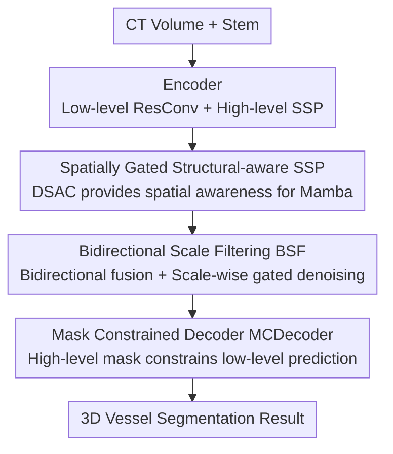

# VesMamba: 3D Pulmonary Vessel Segmentation from CT images via Mamba with Structural Perception and Scale-aware Filtering

**Conference**: CVPR 2026  
**Paper**: [CVF Open Access](https://openaccess.thecvf.com/content/CVPR2026/html/Liu_VesMamba_3D_Pulmonary_Vessel_Segmentation_from_CT_images_via_Mamba_CVPR_2026_paper.html)  
**Code**: https://github.com/Lzpbright/VesMamba  
**Area**: Medical Image  
**Keywords**: 3D pulmonary vessel segmentation, Mamba, State Space Models, Multi-scale filtering, Deep supervision

## TL;DR
VesMamba adapts Mamba into a segmentation backbone capable of perceiving 3D vascular spatial anisotropy. By utilizing dynamic directional convolutions to compensate for Mamba's lack of spatial awareness, bidirectional scale filtering to suppress noise across encoder layers, and high-level mask constraints for low-level decoders, it outperforms various CNN/Transformer/Mamba SOTAs on Parse22 and an in-house Lung79 dataset with approximately 1/4 of the computational cost.

## Background & Motivation

**Background**: Pulmonary vascular diseases represent significant health threats. While CT is the primary imaging modality, manual vessel delineation is time-consuming and relies heavily on expertise. Automatic 3D pulmonary vessel segmentation has evolved from early intensity/threshold/morphological methods to CNNs and CNN-Transformer hybrids. Recently, State Space Models (SSM), specifically Mamba, have been introduced into 3D medical segmentation (e.g., UMamba, SegMamba).

**Limitations of Prior Work**: Pulmonary vessels are complex tree-like structures with immense scale variation (thick trunks vs. thin extremities). Small vessels exhibit low contrast and are often obscured by motion artifacts. Furthermore, arteries and veins are highly similar and overlap. CNNs struggle to capture long-range structural dependencies; Transformers incur high memory overhead, making them impractical for limited clinical computing resources. Standard Mamba destroys spatial locality when flattening 3D volumes into sequences, lacking spatial perception to track the anisotropic topology of vessels. Existing multi-orientation scanning approaches (like SegMamba’s tri-directional scanning) significantly increase computational cost and still fail to extract small vessels effectively.

**Key Challenge**: Vessel segmentation requires both "long-range topological modeling" and "fine-grained spatial anisotropy perception." Flattening 3D data into 1D sequences naturally causes Mamba to lose the latter. Simply stacking multi-orientation scans to compensate sacrifices Mamba's efficiency advantages—the trade-off between accuracy and resource consumption remains unresolved.

**Goal**: To maintain the efficiency of Mamba's long-range modeling while (1) introducing spatial perception of 3D vascular anisotropic structures, (2) robustly highlighting vessels of varying scales in noisy backgrounds, and (3) improving prediction consistency across adjacent scales.

**Key Insight**: The authors observe that 3D vessels exhibit "spatial anisotropy"—elongated in parallel directions and elliptical in vertical directions—whereas traditional convolutions treat all directions equally. Instead of stacking redundant scans, a directional-aware dynamic convolution can feed spatial priors into Mamba as a "spatial gate."

**Core Idea**: Integrate Dynamic Spatial Attention Convolution (DSAC) for spatial gating, Bidirectional Scale Filtering (BSF) to purify encoder features, and Mask Constrained Decoder (MCDecoder) for high-to-low scale constraints, forming VesMamba.

## Method

### Overall Architecture

VesMamba is a 5-layer U-shaped encoder-decoder network. An input CT volume $I\in\mathbb{R}^{1\times H\times W\times D}$ first passes through a stem to extract initial features $F_0\in\mathbb{R}^{32\times H\times W\times D}$. The encoder downsamples layer-by-layer to obtain multi-scale features $F_i\in\mathbb{R}^{(32\cdot 2^i)\times \frac{H}{2^i}\times \frac{W}{2^i}\times \frac{D}{2^i}}$. The first three layers use residual convolutions for low-level details, while the last two utilize Structural-perceived SSP modules for high-level structural features. The bottleneck also contains an SSP (where self-attention is replaced by Multi-scale Spatial Attention Gating, MSAG). Features from each encoder layer are sent to BSF modules for bidirectional fusion and scale-wise denoising, resulting in enhanced features $F'_i$. Finally, $F'_i$ and bottleneck features enter the MCDecoder, where contour and positional information from high-level masks directly constrain adjacent low-level predictions to output the final segmentation.

### Key Designs

**1. Spatially Gated Structural-aware SSP: Compensating Mamba with 3D Spatial Awareness**

Design Motivation: Flattening 3D volumes into sequences for Mamba scatters spatial locality, preventing the model from perceiving anisotropic vascular morphology. The SSP employs a Spatially Gated Mamba (SGM) and a self-attention block. SGM utilizes bidirectional Scanning SSM for long-range dependencies combined with convolutions for local features, producing $s_1=\text{Concat}(\text{Flip}(\text{SSM}_b(x'_{1b}))+\text{SSM}(x'_1),\,x'_2)$.

The key is DSAC (Dynamic Spatial Attention Convolution): It uses three directional-separated convolutions (kernels $1\times1\times3$, $1\times3\times1$, $3\times1\times1$) to extract anisotropic features $x,y,z$. These are pooled and processed to generate directional weights $w_x,w_y,w_z$ via Softmax, followed by weighted fusion:

$$w_x, w_y, w_z = \sigma(\text{Conv}_4(\text{Pool}(\text{Concat}(x,y,z)))),\quad s_2 = w_x\cdot x + w_y\cdot y + w_z\cdot z$$

The output of DSAC is applied as a Sigmoid gate to $s_1$: $s_3 = s_1\odot\varepsilon(s_2)$, injecting the "vessel extension direction" spatial prior dynamically into Mamba. Finally, a self-attention $s_4=\text{Attn}(s_3)$ is applied. This approach allows Mamba to retain linear complexity while gaining spatial perception, outperforming standard multi-directional scanning.

**2. Bidirectional Scale Filtering BSF: Denoising Encoder Features Across Scales**

Design Motivation: Traditional pyramid fusions like FPN/PAN often cause distributional interference when adding low- and high-level features directly. For vessels, global information might disturb low-level details, and vice versa. BSF treats the bidirectional fusion result as a **filter rather than an output**.

It performs bidirectional layer-wise transmission (high-to-low $\mathcal{F}^{HL}$ and low-to-high $\mathcal{F}^{LH}$) using concatenation to reduce interference and Depth-shifted Convolutions (ShiftConv) to extract 3D features at a 2D computational cost. The resulting fusion feature $M'_i$ acts as a gate to purify the original encoder features:

$$F'_i = \varepsilon(M'_i)\odot F_i$$

This scale-wise gating suppresses background noise and highlights vessels, avoiding scale interference.

**3. Mask Constrained Decoder MCDecoder: Enhancing Consistency with High-level Masks**

Design Motivation: Independent masks in standard deep supervision can lead to scale inconsistency and broken vessel continuity. MCDecoder leverages the fact that differences between masks of adjacent scales should be minimal. High-level masks contain contour and position info, which are fed into low-level decoders to provide constraints:

$$T_i=\text{ResConv}(\text{Concat}(F'_i,\text{Up}(T'_{i+1}))),\quad Mask_i=\text{Conv}(\text{Concat}(Mask_{i+1},T_i)),\quad T'_i=T_i\odot Mask_i$$

The final $Mask_1$ is the output. This ensures that positional priors "infect" lower levels, aligning predictions across scales and improving the branch continuity.

### Loss & Training
Under deep supervision, BCE + Dice losses are calculated for four stages and aggregated:

$$\mathcal{L}=\sum_{i=1}^{4} k_i\cdot(\mathcal{L}_{BCE}+\mathcal{L}_{Dice})$$

where $k_i$ is normalized based on the ratio of mask size to input size. Implemented on the UMamba framework using a single A100 GPU, SGD optimizer (initial lr 1e-2), PolyLR scheduler, 200 epochs, and batch size 2.

## Key Experimental Results

### Main Results
Testing on Parse22 (pulmonary artery, 100 cases) and Lung79 (artery/vein/airway, 79 cases). Metrics: Dice, clDice (centerline Dice), HD95, NSD. Compared against 9 SOTAs.

Parse22 Main Results:

| Method | Dice↑ | clDice↑ | HD95↓ | NSD↑ |
|------|-------|---------|-------|------|
| nnUNet | 84.20 | 80.85 | 6.21 | 89.11 |
| UNETR++ | 85.27 | 84.02 | 4.61 | 91.36 |
| UMamba (baseline) | 85.94 | 86.64 | 3.69 | 92.74 |
| LKM-UNet | 86.21 | 87.14 | 3.31 | 92.95 |
| **VesMamba (Ours)** | **86.65** | **87.46** | **2.98** | **93.21** |

Compared to the UMamba baseline, Dice/clDice increased by +0.71/+0.82. VesMamba achieved significantly better HD95 and NSD, learning better overall distribution while maintaining vessel continuity.

### Ablation Study
Module-level ablation (Dice, baseline=UMamba):

| SSP | BSF | MCDecoder | Parse22 | Lung79 |
|-----|-----|-----------|---------|--------|
| | | | 85.94 | 84.49 |
| ✓ | | | 86.42 | 84.95 |
| | ✓ | | 86.35 | 84.87 |
| ✓ | ✓ | | 86.55 | 85.06 |
| ✓ | ✓ | ✓ | **86.65** | **85.19** |

### Key Findings
- **SSP provides the largest single-module gain**: Adding SSP yielded the most significant improvement, focusing the model on large-scale vessels while suppressing non-vascular interference.
- **Gating in BSF is non-negotiable**: Removing the gate (w/o gate) dropped Dice from 86.35 to 85.84, while replacing it with sum+conv dropped it to 84.32, proving the "fusion as filter" strategy is superior.
- **Efficiency Advantage**: VesMamba achieves performance comparable to LKM-UNet but with only ~1/4 of the computational cost.
- **Failure Scenarios**: Targets with excessive branching or highly irregular shapes still pose challenges.

## Highlights & Insights
- **Dynamic Orientation Gating for Mamba**: Using directional-separated convolutions and Softmax weights to handle 3D anisotropy is a clever alternative to expensive multi-directional scanning.
- **Fusion-as-Filter Paradigm**: BSF's approach of using fused features as scale-wise gates instead of direct outputs avoids scale interference—a transferable concept for other multi-scale tasks.
- **Efficient 3D interaction**: ShiftConv allows for depth-wise interaction with 2D-level overhead, an effective trick for memory-intensive 3D segmentation.
- **Topology-driven Decoder Constraints**: Utilizing high-level masks as priors for lower levels is a lightweight way to enforce continuity in vascular structures.

## Limitations & Future Work
- The model still struggles with extreme branching or highly irregular vessel shapes.
- Lung79 is a small, non-public dataset; further validation on large-scale artery/vein separation is needed.
- While efficiency is claimed, explicit FLOPs/parameter count tables were absent (only charts provided), making precise reproducibility of efficiency metrics difficult.
- DSAC utilizes fixed axial kernels; exploring kernels that adapt to oblique vessel paths could be beneficial.

## Related Work & Insights
- **vs. DSCNet**: DSCNet uses adaptive kernels and topological loss but is susceptible to background noise; VesMamba's dynamic gating + Mamba modeling is more robust.
- **vs. SegMamba**: SegMamba's tri-directional scanning is computationally heavy; VesMamba's DSAC gating is more efficient and captures small branches better.
- **vs. FPN/PAN**: Traditional pyramids suffer from scale interference; BSF uses "fusion-to-gate" to filter original features, balancing robustness and efficiency.

## Rating
- Novelty: ⭐⭐⭐⭐
- Experimental Thoroughness: ⭐⭐⭐⭐
- Writing Quality: ⭐⭐⭐⭐
- Value: ⭐⭐⭐⭐ 

<!-- RELATED:START -->

## Related Papers

- [\[NeurIPS 2025\] Mamba Goes HoME: Hierarchical Soft Mixture-of-Experts for 3D Medical Image Segmentation](../../NeurIPS2025/medical_imaging/mamba_goes_home_hierarchical_soft_mixture-of-experts_for_3d_medical_image_segmen.md)
- [\[CVPR 2025\] Decoding Matters: Efficient Mamba-Based Decoder with Distribution-Aware Deep Supervision for Medical Image Segmentation](../../CVPR2025/medical_imaging/decoding_matters_efficient_mamba-based_decoder_with_distribution-aware_deep_supe.md)
- [\[CVPR 2026\] Efficient Unrolled Networks for Large-Scale 3D Inverse Problems](efficient_unrolled_networks_for_large-scale_3d_inverse_problems.md)
- [\[CVPR 2026\] Decoding 3D Perception via BrainSSD: Synergistic Fusion of EEG Representations from Static and Dynamic Visual Streams](decoding_3d_perception_via_brainssd_synergistic_fusion_of_eeg_representations_fr.md)
- [\[CVPR 2025\] vesselFM: A Foundation Model for Universal 3D Blood Vessel Segmentation](../../CVPR2025/medical_imaging/vesselfm_a_foundation_model_for_universal_3d_blood_vessel_segmentation.md)

<!-- RELATED:END -->
